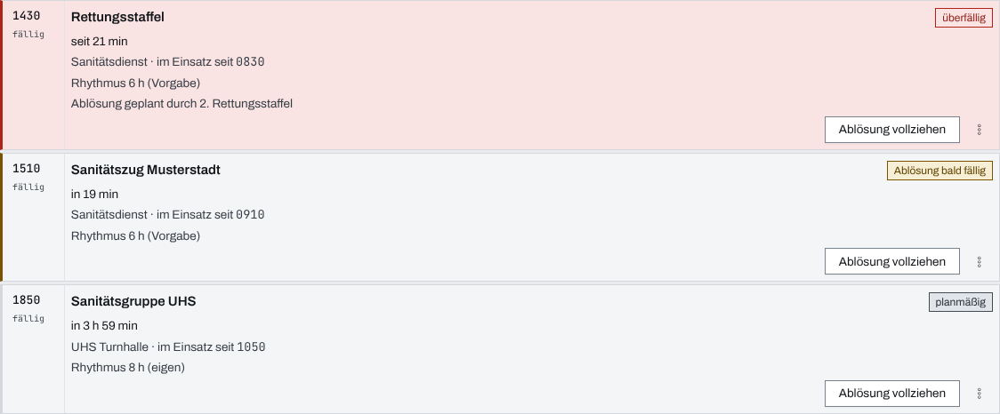
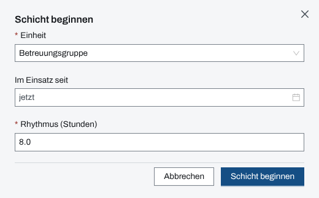
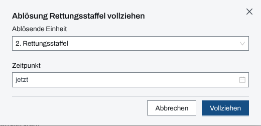
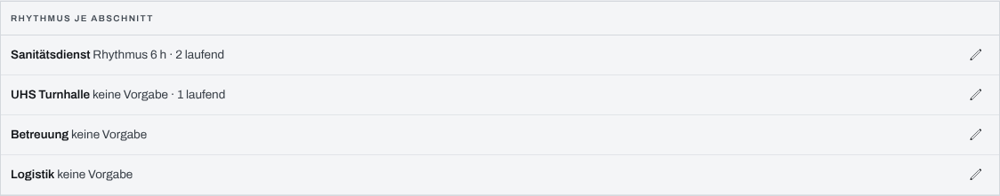

## Überblick

Das Modul **Ablösung** führt je Einheit eine **Schicht**: seit wann sie im Einsatz ist, in welchem
Rhythmus sie abgelöst werden soll und wann die Ablösung damit fällig ist. Die Seite zeigt die
laufenden Schichten nach Fälligkeit, warnt 30 Minuten vorher und meldet, wenn eine Ablösung
überfällig ist.

Die Führung plant hier, welche Einheit welche ablöst, und hält den Vollzug fest. Schichten beginnen,
ändern und vollziehen dürfen Einsatzleitung und Führungspersonal.

## Abläufe

### Fällige Ablösungen im Blick behalten

1. Unter „Kräfte & Mittel“ „Ablösung“ öffnen. Unter „Laufend“ stehen die Schichten, die nächste
   Fälligkeit oben.
2. Je Karte links die Uhrzeit der Fälligkeit lesen, rechts die Einstufung: „planmäßig“, „Ablösung
   bald fällig“ (30 Minuten vorher) oder „überfällig“. Darunter stehen „in …“ bzw. „seit …“,
   Abschnitt, „im Einsatz seit“, der Rhythmus mit seiner Quelle („Vorgabe“ oder „eigen“) und eine
   geplante ablösende Einheit.

   

3. Unter „Abgelöst“ die vollzogenen Ablösungen nachlesen.

### Eine Schicht beginnen

Für Einsatzleitung und Führungspersonal:

1. „Schicht beginnen“ wählen.
2. Unter „Einheit“ eine Einheit ohne laufende Schicht wählen.
3. „Im Einsatz seit“ leer lassen oder einen Zeitpunkt wählen. Leer gilt das Eintreffen aus der
   Kräfte-Zeitachse, sonst jetzt; das Feld zeigt, was gilt.
4. Unter „Rhythmus (Stunden)“ den Rhythmus eintragen. Hat der Abschnitt der Einheit eine Vorgabe,
   steht sie im Feld und das Feld darf leer bleiben.

   

5. „Schicht beginnen“ wählen.

### Eine Ablösung vollziehen

Für Einsatzleitung und Führungspersonal:

1. Auf der Karte „Ablösung vollziehen“ wählen.
2. Unter „Ablösende Einheit“ die Einheit wählen, die übernimmt; eine geplante steht schon dort. Ohne
   ablösende Einheit bleibt das Feld leer.
3. „Zeitpunkt“ leer lassen für jetzt oder den Zeitpunkt der Übergabe wählen.

   

4. „Vollziehen“ wählen. Die abgelöste Schicht wandert nach „Abgelöst“; die ablösende Einheit beginnt
   eine Folgeschicht mit demselben Rhythmus.
5. War es die falsche Karte, in der Meldung „Rückgängig“ wählen. Später geht das unter „Abgelöst“
   mit „Vollzug zurücknehmen“, solange die Folgeschicht unberührt ist.

### Ablösende Einheit planen und Rhythmus ändern

Für Einsatzleitung und Führungspersonal:

1. Auf der Karte das Menü „Aktionen zu …“ (drei Punkte) öffnen.
2. „Ablösende Einheit planen“ wählen, die Einheit wählen und „Speichern“ wählen.
3. Für einen anderen Rhythmus „Rhythmus ändern“ wählen, den Wert in Stunden eintragen und
   „Speichern“ wählen. Hat der Abschnitt eine Vorgabe, lässt ein leeres Feld die Schicht wieder ihr
   folgen.

### Den Rhythmus je Abschnitt vorgeben

Für Einsatzleitung und Führungspersonal:

1. Im Paneel „Rhythmus je Abschnitt“ beim Abschnitt den Stift wählen.

   

2. Den Rhythmus in Stunden eintragen, leer für keine Vorgabe.
3. „Speichern“ wählen. Alle laufenden Schichten des Abschnitts, die der Vorgabe folgen, bekommen den
   neuen Rhythmus und eine neue Fälligkeit; Schichten mit eigenem Rhythmus bleiben.

## Hintergrund

### Fälligkeit und Hinweise

Fällig ist eine Schicht bei Beginn plus Rhythmus. Der Rhythmus liegt zwischen einer halben Stunde
und 168 Stunden. 30 Minuten vor der Fälligkeit erscheint der Hinweis „Ablösung in 30 min“, bei
Fälligkeit „Ablösung fällig“, jeweils mit der Einheit und einem Sprung zur Seite Ablösung. Die Zahl
am Modul in der Seitenleiste zählt die Schichten, die bald fällig oder überfällig sind; der
Überblick führt die Fälligkeiten als Marken.

### Eine Schicht je Einheit

Je Einheit läuft höchstens eine Schicht. „Schicht beginnen“ bietet deshalb nur Einheiten ohne
laufende Schicht an. Hat die ablösende Einheit schon eine laufende Schicht, scheitert der Vollzug,
und nichts ändert sich.

### Zusammenhang mit der Kräfte-Zeitachse

Der Vollzug schreibt an der abgelösten Einheit das Ereignis „Ablösung“ in die Kräfte-Zeitachse, mit
dem ihr Einsatzabschnitt endet; die Rücknahme streicht es wieder. Dieses Ereignis lässt sich nicht
von Hand streichen (Kapitel [Meldebild und Kräfte-Zeitachse](meldebild.md)).

### Einsatztagebuch

Das Einsatztagebuch hält den Beginn einer Schicht, Änderungen an Rhythmus und Planung, jeden Vollzug
mit Einheit, ablösender Einheit und Zeitpunkt und jede Rücknahme fest. Eine Änderung der Vorgabe
eines Abschnitts steht dort als Entscheidung.

### Rechte und ohne Netz

Lesen darf, wer das Modul Ablösung sieht. Schichten beginnen, ändern, vollziehen und zurücknehmen
und Vorgaben setzen dürfen Einsatzleitung und Führungspersonal, solange der Einsatz läuft (Kapitel
[Rechte im Einsatz](rechte-im-einsatz.md)). Ohne Schreibrecht ist „Schicht beginnen“ gesperrt, und
die Karten zeigen keine Aktionen. Die Ablösung gehört nicht zu dem, was die App für die Arbeit ohne
Netz vorhält (Kapitel [Ohne Netz](ohne-netz.md)).
