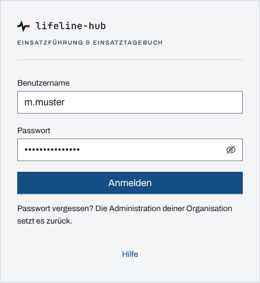
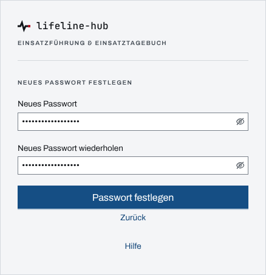
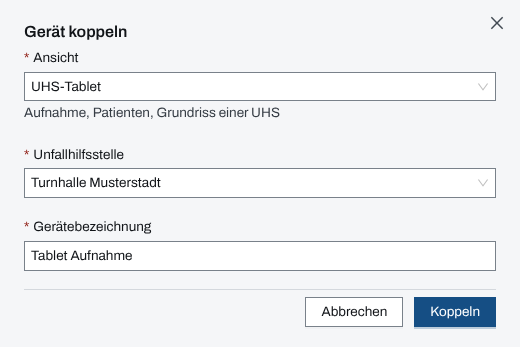

## Überblick

Lifeline Hub arbeitet mit persönlichen Konten: Jeder Eintrag trägt den Namen der Person, die
angemeldet ist. Welche Wege die Anmeldeseite anbietet, legt der Betrieb der Instanz fest:
Benutzername und Passwort, Passkey oder die Anmeldung über die eigene Organisation (SSO).

Tablets und Monitore an einer Stelle (Unfallhilfsstelle, Betreuungsstelle, Bereitstellungsraum,
Einsatzabschnitt, Lagemonitor) arbeiten ohne persönliches Konto. Sie werden mit dem Einsatz
**gekoppelt**. Einen Kopplungscode stellt nur die Einsatzleitung eines laufenden Einsatzes aus.

## Abläufe

### Mit Passwort anmelden

1. Auf der Anmeldeseite „Benutzername“ und „Passwort“ eingeben.

   

2. „Anmelden“ wählen.
3. Ist ein zweiter Faktor eingerichtet, den Code aus der Authenticator-App eingeben; mit der
   sechsten Ziffer meldet die Seite selbst an. Ohne das Telefon führt „Wiederherstellungscode
   verwenden“ zur Eingabe eines Wiederherstellungscodes.

Danach zeigt die App die Einsatzliste.

### Ein eigenes Passwort festlegen

Bei der ersten Anmeldung mit einem neuen Konto und nach einem Einmalpasswort der Administration
folgt auf „Anmelden“ (und gegebenenfalls den Code) noch ein Schritt:

1. Unter „Neues Passwort festlegen“ ein eigenes Passwort in „Neues Passwort“ und „Neues Passwort
   wiederholen“ eingeben, mindestens acht Zeichen, anders als das bisherige.

   

2. „Passwort festlegen“ wählen. Erst jetzt ist die Person angemeldet, die App zeigt die
   Einsatzliste.

### Mit Passkey oder über die Organisation anmelden

1. Auf der Anmeldeseite „Mit Passkey anmelden“ oder „Mit … anmelden“ (Name der Organisation)
   wählen.
2. Den Passkey am Gerät bestätigen oder sich bei der Organisation anmelden.

### In der Mac-App anmelden

1. In der Mac-App „Im Browser anmelden (Passkey, SSO)“ wählen. Der Browser des Systems öffnet
   sich.
2. Im Browser auf einem der angebotenen Wege anmelden.
3. Die Seite „In der Mac-App anmelden als …“ nennt die Person und ihr Konto. Stimmt beides, „In
   der App anmelden“ wählen, sonst „Mit anderem Konto“.

### Abmelden

1. Oben rechts das „Benutzermenü“ (Kachel mit den Initialen) öffnen.

   

2. „Abmelden“ wählen. Die App kehrt zur Anmeldeseite zurück.

„Abmelden“ steht auch in der Sprungpalette.

### Ein Gerät koppeln

Die Einsatzleitung am eigenen Gerät:

1. In den Einstellungen des Einsatzes „Geräte“ öffnen.
2. „Gerät koppeln“ wählen.
3. Unter „Ansicht“ wählen, was das Gerät zeigen soll (etwa „UHS-Tablet“), dazu die Stelle und
   eine „Gerätebezeichnung“.

   

4. „Koppeln“ wählen. Der Code erscheint als Text und als QR-Code.

Am Gerät, das gekoppelt wird:

5. Den QR-Code scannen oder die Seite „Gerät koppeln“ öffnen und den „Kopplungscode“ eingeben.
   Ist dort noch eine Person angemeldet, zuerst „Abmelden zum Koppeln“ wählen.
6. „Gerät koppeln“ wählen. Das Gerät zeigt danach nur seine Ansicht.

## Hintergrund

### Erste Anmeldung und vergessenes Passwort

Wer sich zum ersten Mal über SSO anmeldet, bekommt ein Konto mit den geringsten Rechten; weitere
Rechte vergibt die Administration.

Ein Konto, das die Administration anlegt, startet mit dem Passwort aus der Anlage. Es gilt nur für
die erste Anmeldung: Danach legt die Person ein eigenes fest.

Ein vergessenes Passwort lässt sich nicht selbst zurücksetzen. Die Administration vergibt dann
ein **Einmalpasswort** (siehe [Benutzer](benutzer.md)). Damit meldet sich die Person an und legt
sofort ein eigenes Passwort fest. Bis dahin gibt es keine Anmeldung, auch nicht für andere
Fenster oder die Arbeit ohne Netz. Das Einmalpasswort gilt, bis die Person ein eigenes Passwort
festlegt; ein zweites ersetzt das erste. Wer sich mit Passkey oder über die Organisation anmeldet, braucht das
Passwort nicht und wird nicht nach einem neuen gefragt; ein Wechsel im Profil ersetzt das
Einmalpasswort ebenfalls.

### Zweiter Faktor

Ein **zweiter Faktor** (Code aus einer Authenticator-App) ist freiwillig und schützt die
Anmeldung mit Passwort. Eingerichtet wird er im Profil unter „Sicherheit“, mit dem aktuellen
Passwort als Bestätigung. Die Wiederherstellungscodes gehören an einen sicheren Ort außerhalb des
Geräts: Sie sind der einzige eigene Weg hinein, wenn das Telefon mit der App fehlt. Abschalten
kann den zweiten Faktor nur die Administration.

### Wie lange eine Anmeldung gilt

Eine Anmeldung gilt **sieben Tage ab dem Anmelden**, auch über Neustarts des Geräts hinweg. Sie
verlängert sich nicht durch Benutzung; nach Ablauf geht es zurück zur Anmeldeseite.

Eine Anmeldung endet außerdem, wenn

- die Administration die Person deaktiviert: sofort, auf allen Geräten;
- die Administration ein Einmalpasswort vergibt: sofort, auf allen Geräten;
- die Person ihr Passwort ändert: alle **anderen** Anmeldungen dieses Kontos enden, das Gerät,
  an dem geändert wurde, bleibt angemeldet.

### Was das Abmelden löscht

Beim Abmelden löscht das Gerät, was der Server wieder liefern kann oder was nur dieser Person
gehört:

- das vorgehaltene Lagebild für die Arbeit ohne Netz,
- zwischengespeicherte Orte und Erfassungshilfen,
- ungesendete Entwürfe im Einsatztagebuch.

**Es bleiben** die vorgemerkten Einträge, die noch nicht beim Server angekommen sind (siehe
[Arbeiten ohne Netz](ohne-netz.md)). Sie gehören der Person, die sie erfasst hat, und gehen erst
hinaus, wenn sie sich auf diesem Gerät wieder anmeldet. Wer abmeldet, während die Betriebszeile
noch „ausstehend“ zeigt, lässt diese Einträge also auf dem Gerät liegen. Besser: erst mit Netz
warten, bis nichts mehr aussteht, dann abmelden.

Ebenfalls bleiben die Einstellungen des Geräts: Darstellung, Bediendichte, Helligkeit.

### Gemeinsam genutzte Geräte

An einem Gerät, das mehrere Personen nutzen (Einsatzleitwagen, Stelle mit Schichtbetrieb), gilt:
**nach jeder Schicht abmelden.** Wer an einem Gerät mit fremder, laufender Anmeldung
weiterarbeitet, schreibt unter fremdem Namen; jeder Eintrag trägt den Namen der angemeldeten
Person.

Meldet sich in einem zweiten Fenster desselben Browsers eine andere Person an, zeigt das erste
Fenster „Anderer Benutzer angemeldet“. Es speichert dann nichts mehr unter dem bisherigen Namen.
Vorgemerkte Einträge der bisherigen Person bleiben für sie liegen, ungesicherte Eingaben in diesem
Fenster gehen verloren.

### Gekoppelte Geräte

- Ein Kopplungscode gilt **10 Minuten und nur einmal** und ist nur beim Ausstellen sichtbar.
- Eine Kopplung gilt **24 Stunden**. Die Einsatzleitung kann sie verlängern, höchstens bis
  72 Stunden ab dem Zeitpunkt der Verlängerung.
- Ein gekoppeltes Gerät zeigt nur seine Ansicht in diesem einen Einsatz.

Die Kopplung endet mit dem Widerruf durch die Einsatzleitung, mit ihrem Ablauf und mit dem
Abschluss des Einsatzes; das Gerät zeigt dann „Kopplung beendet“. „Gerät abmelden …“ im
Gerätemenü nimmt das Gerät ebenfalls aus dem Einsatz. Zurück kommt es in jedem Fall nur mit einem
neuen Code.
