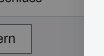
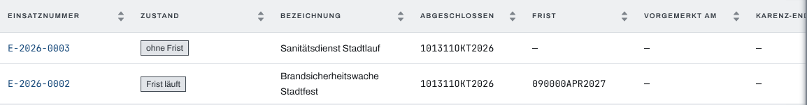
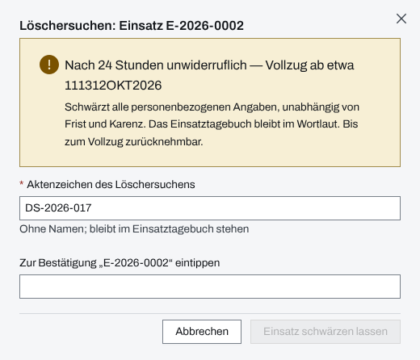

## Überblick

Ein abgeschlossener Einsatz enthält Personendaten: Namen, Kontakte, Zustand von Patienten,
Fotos. Die Aufbewahrung legt fest, wie lange sie gelesen werden können und wann sie geschwärzt
werden. Dafür trägt jeder Einsatz eine **Aufbewahrungsfrist**, auf Wunsch dazu eigene Fristen je
Datenkategorie. Nach Ablauf schwärzt der Server die Personendaten; übrig bleibt ein pseudonymes
Gerüst, das Skelett, mit dem Einsatztagebuch im Wortlaut.

Die Frist eines Einsatzes setzt die Einsatzleitung oder ein System-Admin. Vorgaben, Übersicht,
Archivakte und Löschersuchen sind Sache der System-Admins.

## Abläufe

### Die Aufbewahrungsfrist eines Einsatzes setzen

Für die Einsatzleitung und System-Admins der Organisation des Einsatzes:

1. Im Einsatz „Einstellungen“ öffnen und den Reiter „Aufbewahrung“ wählen.
2. Im Paneel „Aufbewahrungsfrist“ „Frist ändern“ wählen.
3. Unter „Neue Aufbewahrungsfrist“ einen Zeitpunkt wählen, oder „Unbegrenzt aufbewahren“
   einschalten.

   

4. „Frist setzen“ wählen, bei unbegrenzter Aufbewahrung „Frist aufheben“.
5. Wird die Frist kürzer, auch beim ersten Setzen, die Rückfrage „Aufbewahrungsfrist
   verkürzen?“ mit „Verkürzen“ bestätigen.

Ist der Einsatz abgeschlossen, stehen unter der Frist die Datenkategorien „Behandlung“,
„Personenauskunft“ und „Anhänge“, jede mit eigenem „Frist ändern“. Die erste Frist einer
Kategorie verlangt eine „Rechtsgrundlage“.

### Vorgaben der Organisation festlegen

Für System-Admins:

1. Oben „Verwaltung“ öffnen und unter „Einstellungen“ „Einsatz-Vorgaben“ wählen.
2. Im Paneel „Aufbewahrung“ die „Aufbewahrungs-Dauer (Tage)“ eintragen und bei Bedarf „Skelett
   endgültig löschen nach (Tage ab Abschluss)“.
3. Im Paneel „Aufbewahrung je Datenkategorie“ je Kategorie eine Dauer und die Rechtsgrundlage
   eintragen.
4. „Speichern“ wählen.
5. Wird die Skelett-Frist zum ersten Mal gesetzt oder verkürzt, die Rückfrage „Skelett-Frist
   bestätigen?“ mit „Skelette löschen lassen“ bestätigen.

### Abgeschlossene Einsätze überblicken

Für System-Admins:

1. In der Verwaltung „Aufbewahrung“ öffnen.
2. Unter „Zustand“ einen Zustand wählen, etwa „Frist läuft“ oder „fällig“.

   

3. Eine Zeile wählen, um die Archivakte des Einsatzes zu öffnen.

Die Archivakte zeigt Aufbewahrung, Datenkategorien, Löschersuchen, Register und das
Einsatztagebuch, alles pseudonym: „ohne Namen, Kontakte, Orte und Sachverhalt“. Oben steht je
nach Zustand „Frist ändern“ oder „Wiederherstellen“.

### Einem Löschersuchen nachkommen

Für System-Admins, wenn eine Person die Löschung ihrer Daten verlangt:

1. In der Verwaltung „Aufbewahrung“ öffnen und die Archivakte des Einsatzes wählen.
2. Im Paneel „Löschersuchen (Art. 17)“ „Person suchen und schwärzen“ wählen, unter „Name oder
   Rufnummer“ den ganzen Namen oder die Rufnummer eintragen, „Suchen“ wählen und beim Treffer
   „Antrag stellen“. Soll der ganze Einsatz geschwärzt werden, stattdessen „Einsatz sofort
   schwärzen“ wählen.
3. Das „Aktenzeichen des Löschersuchens“ eintragen, ohne Namen.
4. Zur Bestätigung die angezeigte Kennung eintippen.

   

5. „Einsatz schwärzen lassen“ bzw. „Person schwärzen lassen“ wählen. Die App meldet
   „Löschersuchen erfasst — Vollzug in 24 Stunden“.

Bis zum Vollzug lässt sich der Antrag in der Liste des Paneels zurücknehmen.

## Hintergrund

### Der Weg eines Einsatzes

1. **Laufender Einsatz:** Eine Frist sperrt nie einen laufenden Einsatz; sie greift erst ab dem
   Abschluss.
2. **Abschluss:** Ohne gesetzte Frist setzt der Abschluss sie aus der Aufbewahrungs-Dauer des
   Einsatzes oder der Organisation. Ohne Dauer bleibt der Einsatz ohne Frist.
3. **Frist abgelaufen:** Ab dann ist der Einsatz für alle gesperrt, auch für die Einsatzleitung
   und System-Admins; es bleibt nur die pseudonyme Archivakte. Der Server prüft alle zehn
   Minuten und merkt ihn zur Löschung vor.
4. **Karenz:** 30 Tage lang lässt er sich noch wiederherstellen: in der Archivakte
   „Wiederherstellen“ wählen und eine neue Frist in der Zukunft oder „Unbegrenzt aufbewahren“
   angeben.
5. **Schwärzung:** Danach entfernt der Server die Personendaten, Anhänge und Bilder der
   Lagekarte unwiderruflich. Das Skelett bleibt mit Einsatzdaten, Zählern und dem
   Einsatztagebuch im Wortlaut.
6. **Endgültige Löschung:** Hat die Organisation eine Skelett-Frist, löscht der Server das
   Skelett danach samt Einsatztagebuch. Übrig bleibt eine Zeile im Löschprotokoll der
   Organisation.

Vormerkung, Schwärzung und jede Änderung einer Frist stehen im Einsatztagebuch.

### Fristen je Datenkategorie

- **Behandlung**: Zustand der Personen, Notizen zu Sichtung, Verlauf und UHS-Belegung.
- **Personenauskunft**: Herkunftsadresse und Melderkontakt der Personen.
- **Anhänge**: Datei-Anhänge und die Bilder der Lagekarte.

Ohne eigene Frist „folgt der Frist des Einsatzes“. Eine Kategorie-Frist wirkt nur, wenn sie
früher abläuft als die des Einsatzes. Danach wird die Kategorie vorgemerkt und nach 30 Tagen
Karenz geschwärzt; der Einsatz selbst bleibt lesbar. Name, Geburtsdatum, Antreffort und Verbleib
einer Person bleiben, bis alle Zwecke der Person abgelaufen sind.

### Löschersuchen

- Ein Löschersuchen wartet nicht auf Frist und Karenz. Es wird 24 Stunden nach dem Erfassen
  vollzogen; bis dahin lässt es sich zurücknehmen.
- **Person:** Entfernt werden Name, Kontakt, Adresse und Notizen der Person, bei Betroffenen
  auch ihre Fotos und Dateien. Erwähnungen in Freitexten (Einsatztagebuch, Chat,
  Führungsmodule) bleiben stehen.
- **Einsatz:** Alle personenbezogenen Angaben des Einsatzes werden geschwärzt; das
  Einsatztagebuch bleibt im Wortlaut.
- Das Aktenzeichen bleibt im Einsatztagebuch stehen und darf deshalb keinen Namen enthalten.
- Möglich ist ein Löschersuchen nur an einem abgeschlossenen, noch nicht geschwärzten Einsatz.

### Wer was darf

- **Frist eines Einsatzes und der Kategorien:** Einsatzleitung und System-Admins der
  Organisation des Einsatzes, auch nach dem Abschluss.
- **Aufbewahrungs-Dauer im Einsatz:** zusätzlich das Führungspersonal, solange der Einsatz läuft.
- **Vorgaben, Übersicht, Archivakte, Löschersuchen und Wiederherstellen:** nur System-Admins,
  und nur für Einsätze der eigenen Organisation.

## Grundlagen und Quellen

- **Art. 17 DSGVO** (Recht auf Löschung): Grundlage des Löschersuchens.
- Vorschläge für die Dauer je Datenkategorie, die die App beim Eintragen nennt:
  - Behandlung 3650 Tage, nach § 630f Abs. 3 BGB entsprechend und der Empfehlung des DRK-LV
    Saarland zur patientenbezogenen Datenerfassung im Sanitätsdienst.
  - Personenauskunft 0 Tage, nach § 46 Abs. 5 BHKG NRW (Auskunftsstelle: höchstens ein Monat).
  - Anhänge 30 Tage, nach § 32b Abs. 3 NKatSG (Drohnenbilder: höchstens zwei Monate).

  Die Vorschläge sind keine Vorgaben; welche Frist gilt, entscheidet die Organisation.
