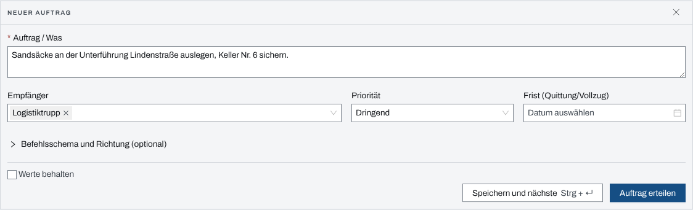
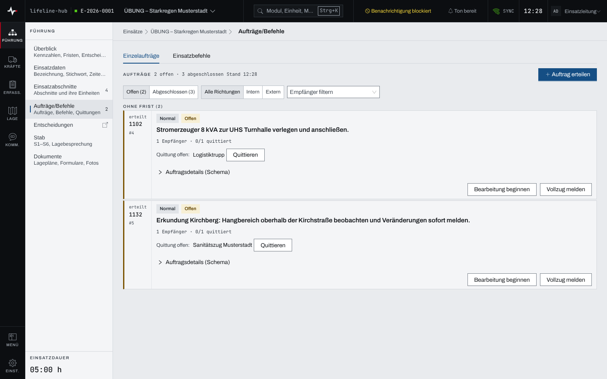
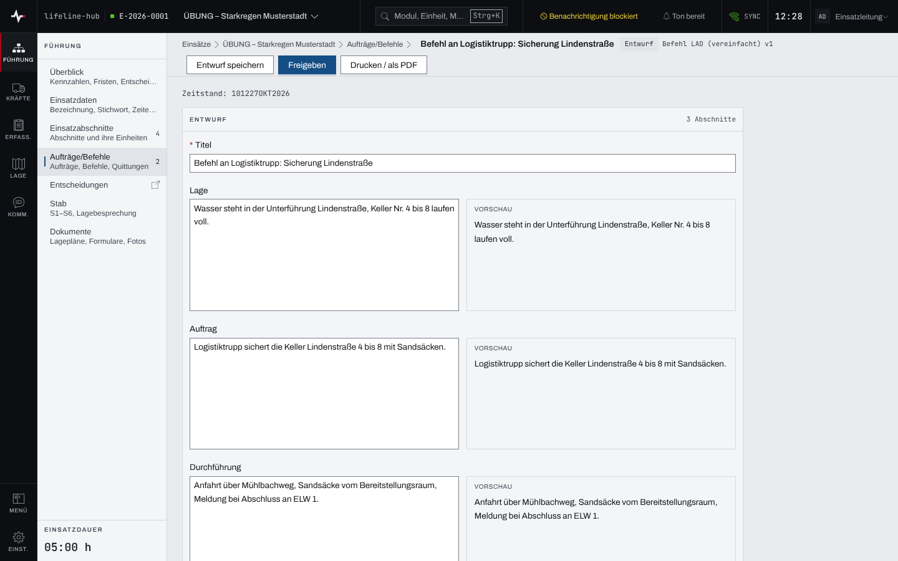

## Überblick

Das Modul „Aufträge/Befehle“ hat zwei Reiter:

- **Einzelaufträge** gehen an einen oder mehrere Empfänger. Jeder Empfänger quittiert den
  Empfang; ist die Arbeit getan, wird der Vollzug gemeldet und der Auftrag abgenommen.
- **Einsatzbefehle** sind Dokumente nach einem Befehlsschema. Sie entstehen als Entwurf, werden
  freigegeben und lassen sich danach nur noch in einer neuen Fassung fortschreiben.

Lesen dürfen alle mit Zugang zum Einsatz. Erteilen, Quittieren, Entwerfen und Freigeben dürfen
Einsatzleitung und Führungspersonal, solange der Einsatz läuft (siehe
[Rechte im Einsatz](rechte-im-einsatz.md)).

## Abläufe

### Einen Auftrag erteilen

Für Einsatzleitung und Führungspersonal:

1. Im Einsatz „Aufträge/Befehle“ öffnen, Reiter „Einzelaufträge“, und „Auftrag erteilen“ wählen.
2. Unter „Auftrag / Was“ den Auftrag formulieren.

   

3. Unter „Empfänger“ einen Abschnitt, eine Einheit oder eine Funktion (zum Beispiel S3) wählen
   oder eintippen. Ein Komma trennt mehrere Empfänger.
4. „Priorität“ und bei Bedarf „Frist (Quittung/Vollzug)“ setzen.
5. Bei Bedarf „Befehlsschema und Richtung (optional)“ aufklappen: „Richtung“ (Intern oder
   Extern), „Erteilt am (optional)“, bei extern „Externe Stelle“ und „Bezeichnung der Stelle“,
   dazu die Felder „Absicht / Ziel“, „Lage“, „Ort / Wo“, „Zeit / Wann“, „Mittel / Womit“,
   „Verbindung / Meldewege“ und „Sicherheit / Besonderes“.
6. „Auftrag erteilen“ wählen.

„Speichern und nächste“ (Strg+Enter, am Mac ⌘+Enter) erteilt den Auftrag und leert das Formular
für den nächsten. Mit dem Häkchen „Werte behalten“ bleiben Empfänger, Priorität und Richtung
stehen.

### Aufträge verfolgen und quittieren

1. Im Reiter „Einzelaufträge“ die Ansicht „Offen“ oder „Abgeschlossen“ wählen, bei Bedarf eine
   Richtung und „Empfänger filtern“.

   

2. Neben „Quittung offen:“ steht jeder Empfänger, der noch nicht quittiert hat. „Quittieren“
   wählen und die Rückfrage „Empfang/Kenntnis quittieren?“ mit „Empfang quittieren“ bestätigen.
3. Hat ein Empfänger mit der Arbeit begonnen, „Bearbeitung beginnen“ wählen. Ein Hinweis bietet
   sechs Sekunden lang „Rückgängig“.

Offene Aufträge stehen in den Gruppen „Überfällig“, „Heute fällig“, „Später“ und „Ohne Frist“.
„Auftragsdetails (Schema)“ an der Karte klappt die Felder des Befehlsschemas auf.

### Den Vollzug melden und den Auftrag abnehmen

Für Einsatzleitung und Führungspersonal:

1. An der Karte „Vollzug melden“ wählen.
2. Im Dialog „Vollzug melden“ die „Rückmeldung zur Erledigung“ eintragen und „Vollzug melden“
   wählen. Der Auftrag wechselt in die Ansicht „Abgeschlossen“.
3. Zur Kontrolle in „Abgeschlossen“ an der Karte „Abnehmen“ wählen und die Rückfrage „Auftrag
   abnehmen?“ mit „Auftrag abnehmen“ bestätigen.

Die Abnahme lässt sich nicht zurücknehmen.

### Einen Einsatzbefehl entwerfen

Für Einsatzleitung und Führungspersonal:

1. Im Reiter „Einsatzbefehle“ „Befehl entwerfen“ wählen.
2. Im Dialog „Neuer Befehlsentwurf“ ein „Schema“ wählen und einen „Titel“ eintragen, dann
   „Entwurf anlegen“. Die App öffnet den Entwurf.
3. Die Abschnitte des Schemas ausfüllen. Neben jedem Feld zeigt die „Vorschau“ den gesetzten
   Text.

   

4. „Entwurf speichern“ wählen oder einfach weiterarbeiten: Der Entwurf speichert sich alle 30
   Sekunden und beim Verlassen eines Feldes selbst; neben den Knöpfen steht „zuletzt gespeichert
   …“.
5. Bei Bedarf „Fernmeldeskizze anfügen“ wählen. Die App nimmt die aktuelle Fernmeldeskizze als
   Bild auf und hängt sie unter „Anlagen“ an. Das geht nur mit Verbindung und nur, wenn der Stab
   im Einsatz freigegeben ist (Kapitel „Funkplan, Fernmeldeskizze, Kommunikationsplan“).

### Einen Einsatzbefehl freigeben und fortschreiben

Für Einsatzleitung und Führungspersonal:

1. Im Entwurf „Freigeben“ wählen.
2. Die Rückfrage „Befehl freigeben?“ warnt: „Endgültig: geht ins ETB, Korrektur nur per
   Fortschreibung.“ Mit „Freigeben“ bestätigen.
3. Ist später etwas zu ändern, am freigegebenen Befehl „Fortschreiben“ wählen. Es entsteht eine
   neue Fassung als Entwurf, die wieder freigegeben wird.

Ein Befehl ohne jeden Text lässt sich nicht freigeben; die Rückfrage meldet dann „Der Befehl ist
leer und kann nicht freigegeben werden“. Ein freigegebener Befehl führt im Kopf mit
„Zum ETB-Eintrag“ ins Tagebuch; „Drucken / als PDF“ gibt ihn auf Papier aus (siehe
[Drucken und Export](drucken-export.md)).

## Hintergrund

### Fristen und Alarm

Eine Frist am Auftrag gilt für Quittung und Vollzug. Bleibt das Feld leer, setzt die App die
Vorgabe aus den Einstellungen des Einsatzes unter „Verhalten & Automatik“, Feld „Quittierfrist
Aufträge (Minuten)“; ohne Vorgabe hat der Auftrag keine Frist.

Mit einer Frist legt die App die automatische Erinnerung „Auftrag #… Quittierfrist“ an. Läuft
die Frist ab, bevor alle Empfänger quittiert haben, meldet sich der Hinweis „Auftrag überfällig“
mit „Quittierfrist überschritten“ und „Öffnen“; die Karte steht unter „Überfällig“. Quittieren
alle Empfänger, schließt die Erinnerung.

### Aufträge im Einsatztagebuch

Ein erteilter Auftrag schreibt eine „Anordnung“ ins ETB, solange „Automatische ETB-Einträge“
nicht ausgeschaltet ist. Der gemeldete Vollzug schreibt immer eine „Meldung“ mit der Rückmeldung.

Aufträge lassen sich auch direkt aus einem ETB-Eintrag oder einer Meldung erteilen (siehe
[Einsatztagebuch](einsatztagebuch.md) und [Meldungen](meldungen.md)). Ein Auftrag aus einem
ETB-Eintrag führt an seiner Karte mit „↗ ETB-Eintrag“ zu diesem Eintrag zurück.

### Befehle im Einsatztagebuch

Mit der Freigabe schreibt der Befehl seinen vollständigen Text als „Anordnung“ ins ETB. Danach
ist die Fassung eingefroren, auch ihre Anlagen. Eine Fortschreibung ist eine neue Fassung mit
eigener Freigabe.

## Grundlagen und Quellen

Die Befehlsschemata der App sind „Befehl LAD (vereinfacht)“ mit Lage, Auftrag und Durchführung,
„Befehl LADEF (erweitert, SKK)“ mit zusätzlich Einsatzunterstützung sowie Führung und
Kommunikation, „Befehl SCHNEE“ mit Schadenlage, Nachbarn, Entschluss / Absicht, Einzelauftrag
und eigenem Standort und „Einzelauftrag (EA/ZMW)“ mit Einheit, Auftrag / Ziel, Mittel und Weg.
