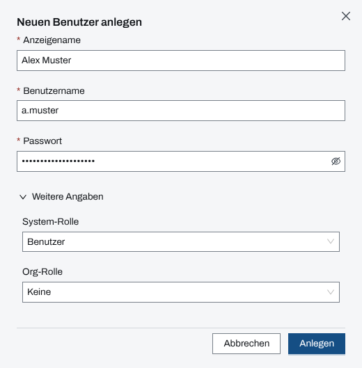
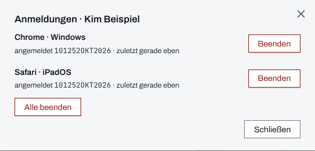
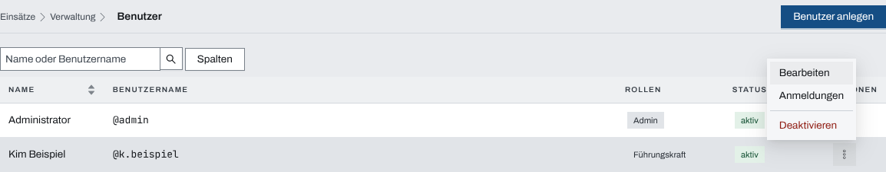

## Überblick

Unter „Benutzer“ in der Verwaltung legen System-Admins die Konten der Personen an, die mit
Lifeline Hub arbeiten, vergeben ihre Rollen in System und Organisation, sehen ihre laufenden
Anmeldungen, setzen einen verlorenen zweiten Faktor zurück und deaktivieren Konten, die nicht
mehr gebraucht werden. Was eine Person in einem einzelnen Einsatz darf, regelt dagegen die
Einsatzleitung, siehe [Rechte im Einsatz](rechte-im-einsatz.md).

## Abläufe

### Einen Benutzer anlegen

Für System-Admins:

1. Oben „Verwaltung“ öffnen und „Benutzer“ wählen.
2. „Benutzer anlegen“ wählen.
3. „Anzeigename“, „Benutzername“ und ein „Passwort“ mit mindestens acht Zeichen eintragen.
4. Unter „Weitere Angaben“ bei Bedarf die „System-Rolle“ und die „Org-Rolle“ wählen.

   

5. „Anlegen“ wählen und der Person Benutzername und Passwort auf sicherem Weg mitteilen.

### Rollen eines Benutzers ändern

1. Unter „Benutzer“ im Aktionsmenü der Zeile der Person „Bearbeiten“ wählen.
2. Im Dialog „Benutzer bearbeiten“ „Anzeigename“, „System-Rolle“ oder „Org-Rolle“ ändern.
3. „Speichern“ wählen.

Benutzername und Passwort lassen sich hier nicht ändern.

### Anmeldungen einer Person beenden

1. Unter „Benutzer“ im Aktionsmenü der Zeile der Person „Anmeldungen“ wählen.
2. Bei einem Gerät „Beenden“ wählen, oder „Alle beenden“, um die Person überall abzumelden.

   

3. „Schließen“ wählen.

### Einen Benutzer deaktivieren

1. Unter „Benutzer“ im Aktionsmenü der Zeile der Person „Deaktivieren“ wählen.

   

2. Soll die Person wieder arbeiten, im selben Menü „Reaktivieren“ wählen.

### Den zweiten Faktor zurücksetzen

1. Unter „Benutzer“ im Aktionsmenü der Zeile der Person „Zweiten Faktor zurücksetzen …“ wählen.
   Der Eintrag steht nur, wenn die Person einen zweiten Faktor eingerichtet hat.
2. Die Rückfrage mit „Zweiten Faktor zurücksetzen“ bestätigen.

Wann das nötig ist und was danach zu tun ist, beschreibt [Gerät verloren](geraet-verloren.md).

## Hintergrund

### Rollen

- **System-Rolle „Admin“**: verwaltet Stammdaten, Einstellungen, Karten, Benutzer und
  Aufbewahrung, liest jeden Einsatz und ändert an Einsätzen der eigenen Organisation die
  Verwaltungsangaben.
- **Org-Rolle „Führungskraft (darf Einsätze anlegen)“**: legt Einsätze an, liest jeden Einsatz
  der eigenen Organisation und sieht die Verwaltung zum Nachschlagen. In Modulen, die eine
  „Führungskraft“ verlangen, ist sie zugelassen.
- **System-Rolle „Benutzer“ und Org-Rolle „Keine“** (die Vorgabe): arbeitet nur in Einsätzen,
  in die die Einsatzleitung die Person aufgenommen hat.

Ein neues Konto gehört zur Organisation des System-Admins, der es anlegt. Die Liste zeigt nur
die Konten der eigenen Organisation; Konten anderer Organisationen kann ein System-Admin weder
sehen noch ändern.

### Anmeldungen beenden

- „Beenden“ fragt nicht nach: wer abgemeldet wurde, meldet sich einfach neu an. Konto, Passwort
  und zweiter Faktor bleiben unberührt.
- Am betroffenen Gerät enden offene Verbindungen sofort, und es räumt das vorgehaltene Lagebild.
- Die Liste nennt das Gerät grob (Browser und System), wann es sich angemeldet hat und wann es
  zuletzt zu sehen war. „Zuletzt“ schreibt der Server nur alle fünf Minuten fort; darunter steht
  „gerade eben“.
- In der eigenen Liste steht das eigene Gerät als „dieses Gerät“ ohne Knopf; es endet nur über
  Abmelden. Statt „Alle beenden“ steht dort „Alle anderen beenden“.
- „Alle beenden“ erscheint erst ab zwei beendbaren Anmeldungen.
- Gekoppelte Geräte stehen nicht in der Liste und enden hier nicht; sie trennt die Einsatzleitung
  in den Einstellungen des Einsatzes.

### Deaktivieren

„Deaktivieren“ fragt nicht nach und beendet sofort jede Anmeldung der Person. Das Konto bleibt
mit allen Einträgen erhalten; „Reaktivieren“ lässt Passwort und zweiten Faktor unverändert. Wie
das bei einem verlorenen Gerät hilft, beschreibt [Gerät verloren](geraet-verloren.md).

Nicht deaktivieren lassen sich:

- der letzte aktive System-Admin der Organisation („Deaktivieren gesperrt: letzter aktiver
  Admin“), damit ihre Verwaltung nie ohne Admin bleibt,
- das eigene Konto („Deaktivieren gesperrt: eigenes Konto“).

Für ein deaktiviertes Konto gibt es keine „Anmeldungen“. Konten gekoppelter Geräte erscheinen
nicht in der Liste.

### Passwort und zweiter Faktor

Die Anmeldeseite sagt „Passwort vergessen? Die Administration deiner Organisation setzt es
zurück.“ In der Oberfläche der Verwaltung gibt es dafür derzeit keinen Weg: das Passwort setzt
nur die Person selbst in ihrem Profil. Einen eingerichteten zweiten Faktor dagegen setzt die
Verwaltung zurück (oben). Dabei enden alle Anmeldungen der Person, auch die eigene, wenn ein
System-Admin das eigene Konto zurücksetzt, und alle Wiederherstellungscodes verfallen. Bis zur
neuen Einrichtung im Profil genügt das Passwort.

### Nachvollziehbarkeit

Anlegen, Rollenwechsel, Deaktivieren, Reaktivieren, das Zurücksetzen des zweiten Faktors und
jedes Beenden einer Anmeldung hält der Server in der Admin-Spur fest; System-Admins lesen sie im „Zugangsprotokoll“ der Verwaltung.

Die Seite „Benutzer“ erreichen nur System-Admins.
