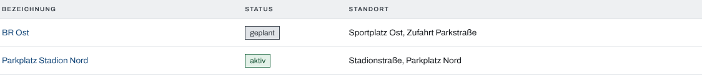
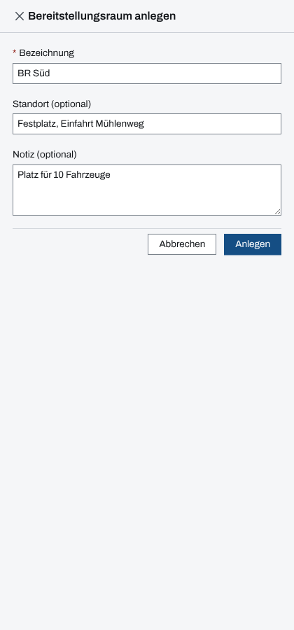
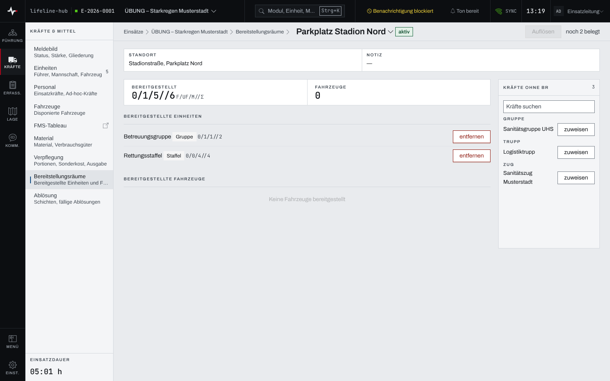

## Überblick

Ein **Bereitstellungsraum** (BR) ist der Ort, an dem Einheiten und Fahrzeuge auf ihren Einsatz
warten. Das Modul zeigt je Raum, wer dort bereitsteht und mit welcher Stärke, und welche Kräfte noch
keinem Raum zugewiesen sind.

Dieses Kapitel beschreibt die Sicht der Einsatzleitung. Einsatzleitung und Führungspersonal legen
Räume an, nehmen sie in Betrieb, weisen Kräfte zu und lösen Räume wieder auf. Die Bedienung am
gekoppelten Tablet eines Bereitstellungsraums beschreibt das Kapitel „Bereitstellungsraum“ unter den
gekoppelten Geräten.

## Abläufe

### Einen Bereitstellungsraum öffnen

1. Unter „Kräfte & Mittel“ „Bereitstellungsräume“ wählen. Die App öffnet den zuletzt gewählten Raum,
   sonst einen aktiven. Gibt es noch keinen, bietet sie „Ersten BR anlegen“ an.
2. Über den Namen des Raums im Seitenkopf in einen anderen Raum wechseln.
3. Für die Übersicht aller Räume in der Brotkrumenleiste „Bereitstellungsräume“ wählen. Die Liste
   zeigt Bezeichnung, Status und Standort.

   

### Einen Bereitstellungsraum anlegen und in Betrieb nehmen

Für Einsatzleitung und Führungspersonal:

1. In der Übersicht „Neu“ wählen, oder im Seitenkopf eines Raums den Namen öffnen und „+ Neuer BR“
   wählen.
2. „Bezeichnung“ eingeben, bei Bedarf „Standort (optional)“ und „Notiz (optional)“.

   

3. „Anlegen“ wählen. Die App öffnet den neuen Raum; er steht auf „geplant“.
4. Ist der Raum eingerichtet, „In Betrieb nehmen“ wählen. Er steht dann auf „aktiv“.

### Kräfte zuweisen und entfernen

Für Einsatzleitung und Führungspersonal, solange der Raum aktiv ist:

1. Den Raum öffnen. Rechts steht „Kräfte ohne BR“, nach Typ gruppiert.
2. Bei Bedarf in „Kräfte suchen“ einen Namen eingeben.
3. Bei einer Einheit oder einem Fahrzeug „zuweisen“ wählen. Sie erscheint unter „Bereitgestellte
   Einheiten“ oder „Bereitgestellte Fahrzeuge“; „Bereitgestellt“ zählt die Stärke, „Fahrzeuge“ die
   einzeln bereitgestellten Fahrzeuge.

   

4. Rückt eine Kraft aus, bei ihr „entfernen“ wählen. Sie steht wieder unter „Kräfte ohne BR“.

### Einen Bereitstellungsraum auflösen oder stornieren

Für Einsatzleitung und Führungspersonal:

1. Einen aktiven Raum erst leeren: alle Kräfte „entfernen“. Solange noch Kräfte dort stehen, ist
   „Auflösen“ gesperrt, daneben steht „noch … belegt“.
2. „Auflösen“ wählen und die Rückfrage „BR auflösen?“ mit „BR auflösen“ bestätigen. Der Raum steht
   dann auf „aufgelöst“.
3. Ein Raum, der nie in Betrieb war, wird stattdessen mit „Stornieren“ verworfen; die Rückfrage „BR
   stornieren?“ mit „BR stornieren“ bestätigen. Er verschwindet aus Übersicht und Umschalter.

## Hintergrund

### Status eines Raums

Ein Raum durchläuft „geplant“, „aktiv“ und „aufgelöst“. Kräfte lassen sich nur einem aktiven Raum
zuweisen; ein geplanter oder aufgelöster Raum ist nur zu lesen.

### Wer zugewiesen werden kann

„Kräfte ohne BR“ bietet Einheiten an und Fahrzeuge ohne Einheit, sofern sie in keinem Raum stehen.
Fahrzeuge einer Einheit werden nicht einzeln zugewiesen, sondern über ihre Einheit. Eine Kraft steht
höchstens in einem Raum; soll sie in einen anderen, wird sie zuerst im alten entfernt. Die Stärke
rechnet unterstellte Einheiten mit ein und zählt keine doppelt.

### Einsatztagebuch

Das Einsatztagebuch hält fest, wenn ein Raum in Betrieb genommen oder aufgelöst wird und wenn eine
Kraft in einen Raum eintritt oder ihn verlässt, jeweils mit Namen. Das Anlegen und das Stornieren
eines Raums stehen nicht darin.

### Rechte und ohne Netz

Lesen darf, wer das Modul Bereitstellungsräume sieht. Anlegen, in Betrieb nehmen, zuweisen,
entfernen, auflösen und stornieren dürfen Einsatzleitung und Führungspersonal, solange der Einsatz
läuft (Kapitel [Rechte im Einsatz](rechte-im-einsatz.md)). Die Bereitstellungsräume gehören nicht zu
dem, was die App für die Arbeit ohne Netz vorhält (Kapitel [Ohne Netz](ohne-netz.md)).
