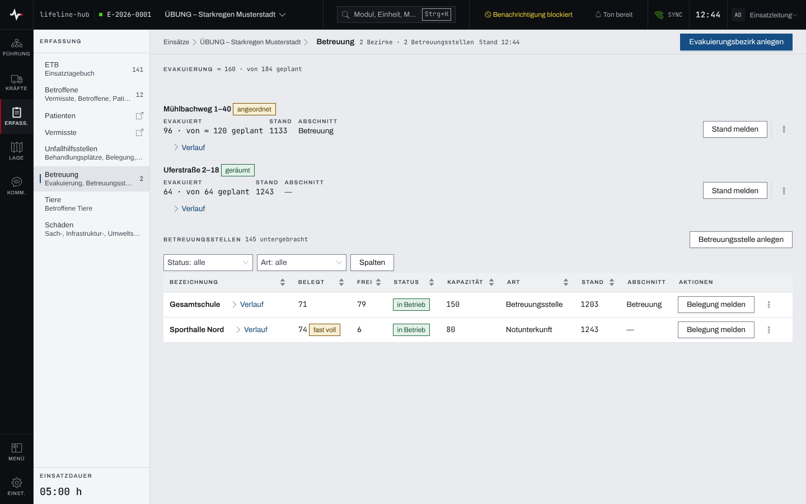
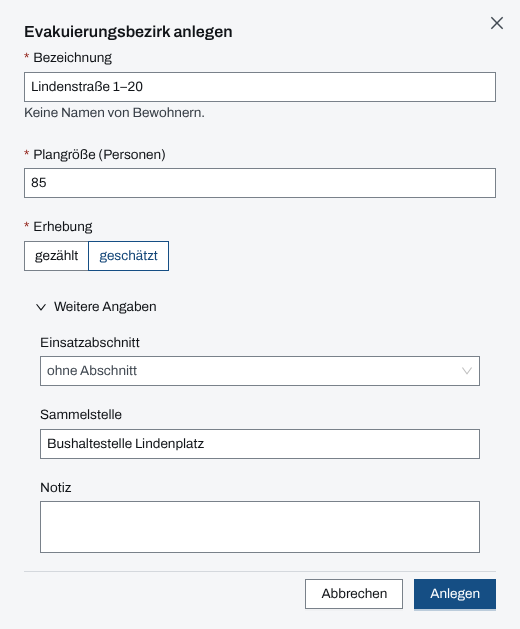
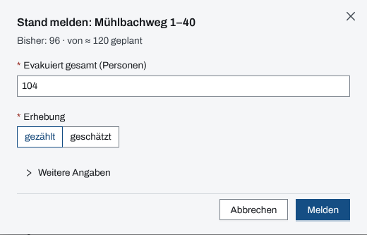
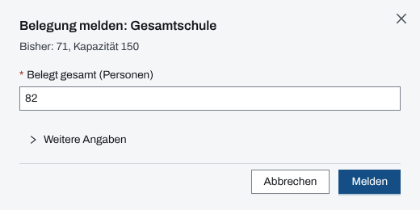

## Überblick

Das Modul „Betreuung“ führt zwei Dinge: die **Evakuierungsbezirke** (wie viele Personen ein Gebiet
verlassen sollen und wie viele es schon verlassen haben) und die **Betreuungsstellen** (wie viele
Personen dort untergebracht sind und wie viel Platz noch frei ist). Gezählt wird ohne Namen:
Meldungen nennen nur Zahlen.

Der Kopf der Seite zählt Bezirke und Betreuungsstellen und nennt volle Stellen. Über dem Block
„Evakuierung“ steht die Summe: evakuiert von geplant.

## Abläufe

### Evakuierung und Unterbringung ablesen

1. Im Modulpanel „Betreuung“ öffnen.

   

2. Unter „Evakuierung“ steht je Bezirk der Räumungszustand („angeordnet“, „läuft“, „geräumt“,
   „aufgehoben“), evakuiert von geplant, die Zeit des letzten Stands und der Einsatzabschnitt.
   „≈“ kennzeichnet eine geschätzte Zahl.
3. Unter „Betreuungsstellen“ steht je Stelle die Belegung, die freien Plätze, der Status
   („vorbereitet“, „in Betrieb“, „geschlossen“), die Kapazität, die Art und die Zeit der letzten
   Meldung. Die Filter „Status“ und „Art“ engen die Tabelle ein.
4. „Verlauf“ an einem Bezirk oder einer Stelle klappt alle Meldungen dazu auf.

### Einen Evakuierungsbezirk anlegen

1. „Evakuierungsbezirk anlegen“ wählen.
2. Unter „Bezeichnung“ das Gebiet nennen, etwa Straße und Hausnummern, ohne Namen von Bewohnern.
3. Die „Plangröße (Personen)“ eintragen und unter „Erhebung“ angeben, ob sie „gezählt“ oder
   „geschätzt“ ist.
4. Unter „Weitere Angaben“ bei Bedarf „Einsatzabschnitt“, „Sammelstelle“ und „Notiz“ ergänzen.

   

5. „Anlegen“ wählen. Der Bezirk steht auf „angeordnet“.

### Den Stand eines Bezirks melden

1. Am Bezirk „Stand melden“ wählen. Der Dialog nennt den bisherigen Stand.
2. Unter „Evakuiert gesamt (Personen)“ die Gesamtzahl eintragen, nicht den Zuwachs, und die
   „Erhebung“ angeben (vorgewählt „gezählt“).

   

3. Liegt die Meldung zurück, unter „Weitere Angaben“ den „Zeitpunkt“ eintragen; leer gilt jetzt.
4. „Melden“ wählen. Direkt danach bietet die Bestätigung „Rückgängig“ an.
5. Ändert sich die Lage, im Menü des Bezirks „Räumung setzen“ wählen und den
   „Räumungszustand“ setzen. „Plangröße fortschreiben“ ändert die Plangröße.

### Eine Betreuungsstelle anlegen und ihre Belegung melden

1. „Betreuungsstelle anlegen“ wählen, „Bezeichnung“ und „Art“ angeben („Anlaufstelle“,
   „Betreuungsstelle“, „Betreuungsplatz“, „Notunterkunft“), dazu „Kapazität (Personen)“ und
   unter „Weitere Angaben“ „Standort“ und „Notiz“. „Anlegen“ wählen. Die Stelle steht auf
   „vorbereitet“.
2. Öffnet die Stelle, im Menü der Stelle „Bearbeiten (Status, Kapazität)“ wählen und den Status
   „in Betrieb“ setzen.
3. An der Stelle „Belegung melden“ wählen.
4. Unter „Belegt gesamt (Personen)“ die Gesamtzahl der Untergebrachten eintragen.

   

5. „Melden“ wählen.

Eine Stelle ohne Koordinate lässt sich über „Auf Karte verorten“ im Menü auf der Lagekarte
setzen.

### Eine Meldung zurücknehmen

1. Am Bezirk oder an der Stelle „Verlauf“ aufklappen.
2. An der falschen Meldung „Zurücknehmen“ wählen und die Rückfrage „Meldung zurücknehmen?“
   bestätigen.

Die Meldung bleibt im Verlauf stehen, gekennzeichnet als zurückgenommen; es gilt wieder die
Meldung davor. Das lässt sich nicht umkehren.

## Hintergrund

### Wie gezählt wird

- Gemeldet wird immer die **Gesamtzahl**. Sie darf die Plangröße oder die Kapazität übersteigen;
  eine Stelle ist dann „überbelegt“.
- Ab 90 % der Kapazität steht eine Stelle auf „fast voll“, bei genau 100 % auf „voll“. Ohne
  Kapazität zeigt sie keine freien Plätze.
- Ein Bezirk ohne Meldung zählt nicht als null: er steht auf „keine Meldung“.
- Stornierte und aufgehobene Bezirke zählen nicht in die Summe „evakuiert von geplant“.
- Ein Zeitpunkt in der Zukunft wird abgelehnt. Eine Meldung mit einem älteren Zeitpunkt als die
  aktuelle wird als nachgetragen geführt („nachgetragen um …“), die aktuelle bleibt stehen.
- „davon namentlich“ an einer Stelle zählt die Betroffenen, deren Verbleib „Notunterkunft“ auf
  diese Stelle zeigt ([Betroffene und Sichtung](betroffene.md)). Die Zahl ist ein Hinweis und
  kein Teil der Belegung.

### Schließen und Stornieren

Eine Stelle wird über „Bearbeiten (Status, Kapazität)“ geschlossen. Ist sie noch belegt, verlangt
der Dialog zuerst die Leermeldung („Alle haben die Stelle verlassen — Belegung 0 melden“). An einer
geschlossenen Stelle lassen sich keine Meldungen mehr zurücknehmen.

„Stornieren“ ist nur für Fehlanlagen gedacht und nicht umkehrbar. Der Dialog bietet stattdessen
„Räumung setzen“ (Bezirk) oder „Status setzen“ (Stelle) an. Der Nachweis im Einsatztagebuch bleibt.

### Einsatztagebuch

Jede Anlage, jede Meldung und jeder Wechsel steht im Einsatztagebuch: das Anlegen eines Bezirks,
eine neue Plangröße sowie „angeordnet“ und „aufgehoben“ als Entscheidung, „läuft“, „geräumt“,
Stand- und Belegungsmeldungen als Meldung, eine Rücknahme als Berichtigung.

### Verpflegung

Die Belegung der Betreuungsstellen ergibt die Zahl „in Betreuung“, mit der das Modul
„Verpflegung“ den Bedarf der Betreuten rechnet (Kapitel „Verpflegung“). Unterkünfte für
Einsatzkräfte gehören deshalb nicht als Betreuungsstelle hierher.

### Rechte

Anlegen und melden dürfen Einsatzleitung und Führungspersonal eines laufenden Einsatzes
([Rechte im Einsatz](rechte-im-einsatz.md)); ohne dieses Recht steht ein Hinweis über der Seite,
und die Knöpfe sind gesperrt. Die Bedienung am gekoppelten Gerät einer Betreuungsstelle beschreibt
das Kapitel zu den gekoppelten Geräten.

### Ohne Netz

Die Betreuung bleibt ohne Netz lesbar. Stand- und Belegungsmeldungen lassen sich vormerken; sie
tragen den Zeitpunkt der Erfassung und gehen hinaus, sobald Netz da ist. Anlegen, Räumung und
Status gehen nur mit Netz. Mehr in [Arbeiten ohne Netz](ohne-netz.md).
