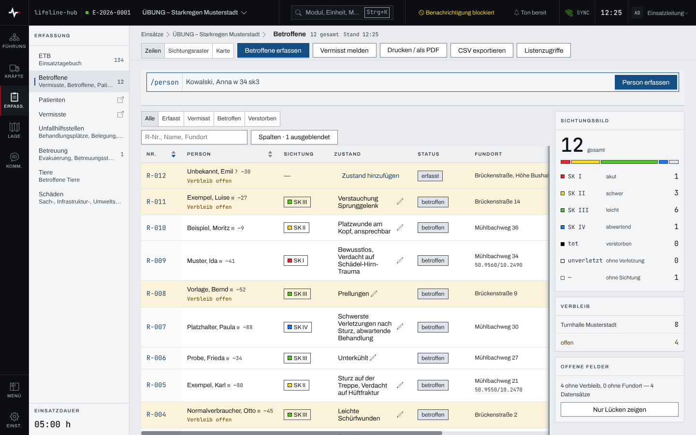
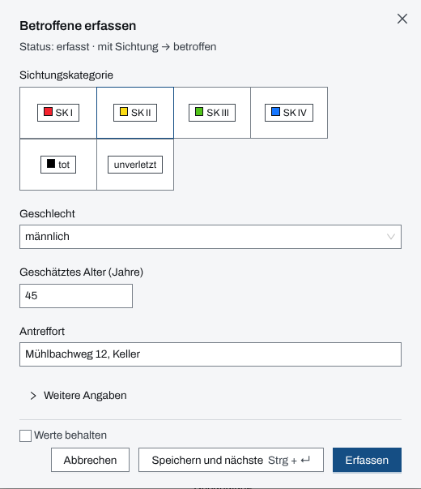
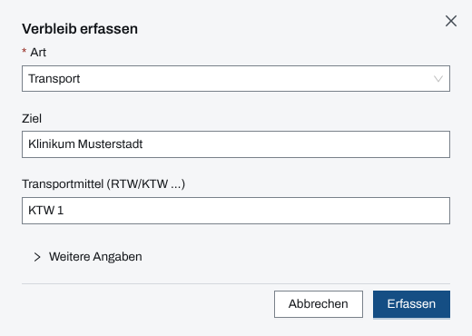

## Überblick

Das Modul „Betroffene“ führt jede Person, um die sich der Einsatz kümmert: Verletzte, Unverletzte,
Verstorbene und Vermisste. Jede Person bekommt eine Registriernummer (R-001, R-002 …), eine
Sichtungskategorie und, sobald sie die Einsatzstelle verlässt, einen Verbleib. Pflichtfelder gibt
es nicht; Name und Alter dürfen fehlen.

Die Liste zeigt neben den Personen das Sichtungsbild, den Verbleib und die offenen Felder. Im
Modulpanel führen „Patienten“ direkt ins Sichtungsraster und „Vermisste“ in die Liste der
Vermissten.

## Abläufe

### Die Lage der Betroffenen ablesen

1. Im Modulpanel „Betroffene“ öffnen. Die Liste zeigt je Person Registriernummer, Name, Sichtung,
   Zustand, Status, Fundort, Verbleib und Zeit.

   

2. Rechts zählt das „Sichtungsbild“ die Personen je Sichtungskategorie, „Verbleib“ zählt sie je
   Verbleib und Unfallhilfsstelle, „Offene Felder“ nennt, wem Verbleib oder Fundort fehlt.
3. Mit „Nur Lücken zeigen“ bleiben nur die Personen mit offenen Feldern in der Liste.
4. Über die Leiste oben wechselt die Ansicht zwischen „Zeilen“, „Sichtungsraster“ (nach
   Kategorien gruppiert, die älteste Sichtung zuerst) und „Karte“ (Fundorte mit Koordinate).
5. Der Statusfilter („Alle“, „Erfasst“, „Vermisst“, „Betroffen“, „Verstorben“) und die Suche
   nach R-Nr., Name oder Fundort engen die Liste ein.

### Eine Person mit der Maske erfassen

1. „Betroffene erfassen“ wählen.
2. Unter „Sichtungskategorie“ die Kategorie antippen, dazu „Geschlecht“, „Geschätztes Alter
   (Jahre)“ und „Antreffort“, soweit bekannt.

   

3. Name, Vorname, Zustand, Koordinate und Notiz stehen unter „Weitere Angaben“.
4. „Erfassen“ wählen. Die Quittung nennt die neue Registriernummer („Erfasst als R-…“).

Kommen mehrere Personen nacheinander, speichert „Speichern und nächste“ (Strg + Enter) und hält
die Maske offen. Mit „Werte behalten“ bleibt der Antreffort für die nächste Person stehen; die
Sichtung wird nie übernommen.

### Eine Person mit der Kurzeingabe erfassen

1. In der Liste in das Feld „Kurzeingabe Person“ (Zeile „/person“) schreiben, etwa
   „Kowalski, Anna w 34 sk3 @Turnhalle“.

   

2. Unter dem Feld steht, was erkannt wurde („erkannt: …“). Was sich nicht deuten lässt, nennt
   die Zeile unter „Nicht erfasst: …“; dann wird nichts angelegt.
3. Enter speichert. Das Feld leert sich, rechts steht „Zuletzt: …“ mit der Registriernummer.
   Escape leert das Feld, ohne zu speichern.

Die Kürzel: „Nachname, Vorname“; „m“, „w“ oder „d“ mit dem Alter (geschätzt als „~50“); „sk1“
bis „sk4“, „skt“ für tot und „sku“ für unverletzt; „#Breite/Länge“ für die Koordinate des
Fundorts; „@Name“ für die Unfallhilfsstelle, in die die Person aufgenommen wird.

### Sichten und den Verbleib erfassen

1. In der Liste die Person öffnen. Die Seite „Person R-…“ zeigt Status, Sichtung und den
   medizinischen Verlauf.
2. Ohne Sichtung „Sichten“ wählen, sonst im Aktionsmenü der Seite „Re-Sichten“. Im Dialog
   „Sichtung erfassen“ die „Kategorie“ wählen, bei Bedarf eine „Kurzbegründung (optional)“, und
   „Übernehmen“ wählen.
3. Verlässt die Person die Einsatzstelle, „Verbleib erfassen“ wählen und die „Art“ wählen:
   „Transport“, „Notunterkunft“, „Entlassung vor Ort“, „verbleibt vor Ort“ oder „Verbleib des
   Leichnams“. Dazu das „Ziel“ und beim Transport das „Transportmittel (RTW/KTW …)“.

   

4. „Erfassen“ wählen.

Bei „Notunterkunft“ bietet der Dialog die Betreuungsstellen des Einsatzes an; die gewählte Stelle
wird zum Ziel.

### Eine vermisste Person melden und abgleichen

1. „Vermisst melden“ wählen. Unter „Weitere Angaben“ stehen statt Zustand und Koordinate
   „vermisst seit“ und „Melder / Kontakt“; ohne Angabe gilt „vermisst seit“ ab der Meldung.
2. „Erfassen“ wählen. Die Person steht mit dem Status „vermisst“ in der Liste.
3. Wird jemand gefunden, der die vermisste Person sein könnte: den Statusfilter „Vermisst“
   wählen und in der Spalte „Abgleich vorschlagen“ die gefundene Person wählen.
4. Die Einsatzleitung öffnet die vermisste Person und entscheidet unter „Vermisstenabgleich“ mit
   „Bestätigen“ oder „Verwerfen“.

Nach dem Bestätigen steht die Vermisstmeldung auf „abgemeldet“, und das Einsatztagebuch vermerkt
„Vermisstmeldung R-… aufgeklärt — identisch mit R-…“.

## Hintergrund

### Status und Sichtung

Status und Sichtung sind zwei getrennte Angaben. Der Status sagt, wo die Person im Einsatz steht:

- **erfasst**: angelegt, noch nicht gesichtet,
- **betroffen**: gesichtet; die erste Sichtung hebt „erfasst“ von selbst auf „betroffen“,
- **vermisst**: gemeldet, aber nicht angetroffen,
- **verstorben** und **abgemeldet**.

Den Status ändert das Aktionsmenü der Seite mit „Auf „…“ setzen“; „verstorben“ fragt vorher nach.
Eine Sichtung „tot“ ändert den Status nicht. Die Seite der Person weist dann auf den Widerspruch
hin und bietet „Auf „verstorben“ setzen“ an. Vermisste und abgemeldete Personen lassen sich nicht
sichten.

Die Sichtungskategorien und ihre Farben: SK I akut (rot), SK II schwer (gelb), SK III leicht
(grün), SK IV abwartend (blau), tot (schwarz), unverletzt (ohne Farbe).

„Stornieren“ nimmt eine Fehlerfassung aus den Arbeitssichten; der Datensatz bleibt erhalten.

### Offene Felder

Als Lücke zählt nur, wer angetroffen wurde (erfasst, betroffen, verstorben). Ohne Verbleib heißt:
weder ein Verbleib noch eine Unfallhilfsstelle. Ohne Fundort heißt: weder Antreffort noch
Koordinate. Solche Zeilen sind in der Liste markiert.

### Unfallhilfsstelle und Verbleib

Wer mit „@…“ oder über „Patient aufnehmen“ einer Unfallhilfsstelle zugeordnet wird, steht dort im
Wartebereich ([Unfallhilfsstellen](unfallhilfsstellen.md)). Ein Verbleib „Transport“,
„Notunterkunft“ oder „Entlassung vor Ort“ beendet den Aufenthalt in der Unfallhilfsstelle, ebenso
der Status „verstorben“ oder „abgemeldet“ und das Stornieren.

Eine Person mit Verbleib „Notunterkunft“ in einer Betreuungsstelle zählt dort unter „davon
namentlich“ ([Betreuung und Evakuierung](betreuung.md)). Tiere und Schäden lassen sich einer
Person auf ihrer Seite zuordnen („Tier zuweisen“, „Schaden zuweisen“).

### Einsatztagebuch und Zugriffsprotokoll

Das Einsatztagebuch führt Betroffene nur mit Registriernummer, ohne Namen: „Person R-… erfasst“,
„Person R-…: Sichtung SK …“, Statuswechsel und Stornierungen. Die „Verlaufsnotiz“ auf der Seite
der Person ist nicht änderbar und erscheint nicht im Einsatztagebuch.

Jedes Öffnen der Seite einer Person wird protokolliert, ebenso der CSV-Export und der Druck der
Liste. Die Einsatzleitung sieht das Protokoll unter „Listenzugriffe“ im Kopf der Liste und unter
„Zugriffs-Audit“ auf der Seite der Person.

### Rechte

Erfassen und ändern dürfen Einsatzleitung und Führungspersonal eines laufenden Einsatzes
([Rechte im Einsatz](rechte-im-einsatz.md)). Einen Vermisstenabgleich bestätigen oder verwerfen
darf nur die Einsatzleitung.

### Ohne Netz

Personen lassen sich ohne Netz erfassen, über die Maske, die Kurzeingabe und die Aufnahme; bis
zur Verbindung tragen sie „R-…“ statt der Nummer. Lesbar bleiben Sichtung, Verbleib und
Unfallhilfsstelle. Adresse, Melder, Notiz, Zustand und Fundort liegen nicht auf dem Gerät und
erscheinen als „nicht geladen“. Mehr in [Arbeiten ohne Netz](ohne-netz.md).

## Grundlagen und Quellen

Die Sichtungskategorien SK I bis SK IV und ihre Farben folgen der Einteilung des Bundesamts für
Bevölkerungsschutz und Katastrophenhilfe (BBK).
