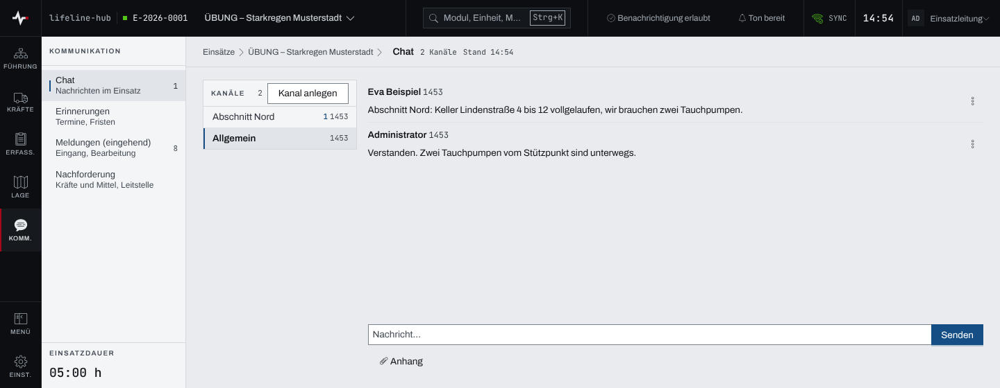
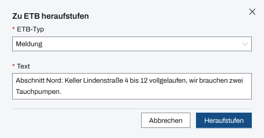

## Überblick

Der **Chat** ist die schnelle, formlose Absprache im Einsatz: kurze Nachrichten in Kanälen, auf
Wunsch mit Anhang. Er steht im Einsatz unter „Kommunikation“. Was festgehalten werden muss,
übernimmt der Chat als Eintrag ins Einsatztagebuch (ETB) oder als Auftrag; die Nachricht selbst
ist kein Tagebuch.

Lesen kann jedes Mitglied des Einsatzes. Schreiben, Kanäle anlegen und Nachrichten übernehmen
können Einsatzleitung und Führungspersonal, solange der Einsatz läuft.

## Abläufe

### Eine Nachricht schreiben

1. Im Einsatz unter „Kommunikation“ den „Chat“ öffnen. Links stehen die Kanäle, rechts die
   Nachrichten des gewählten Kanals, ganz unten das Eingabefeld.
2. Links den Kanal wählen. Beim ersten Öffnen ist „Allgemein“ gewählt.
3. In „Nachricht…“ den Text schreiben. Eine Datei hängt „Anhang“ an.
4. Mit Enter oder „Senden“ abschicken.

   

### Einen Kanal anlegen

Für Einsatzleitung und Führungspersonal:

1. Über der Kanalliste „Kanal anlegen“ wählen. Auf schmalen Bildschirmen steht dafür „+ Kanal“
   neben der Kanalleiste.
2. Im Dialog „Neuer Kanal“ den „Name“ eingeben, etwa „Abschnitt Nord“, und bei Bedarf eine
   „Beschreibung (optional)“.
3. „Anlegen“ wählen. Der Kanal erscheint in der Liste.

### Eine Nachricht ins ETB übernehmen

Für Einsatzleitung und Führungspersonal:

1. Rechts an der Nachricht das Aktionsmenü öffnen und „Zu ETB“ wählen.
2. Im Dialog „Zu ETB heraufstufen“ den „ETB-Typ“ wählen: „Meldung“ (vorgewählt), „Anordnung“,
   „Lage“ oder „Entscheidung“.
3. Den „Text“ prüfen. Er ist mit der Nachricht vorbelegt und lässt sich für das Tagebuch
   umformulieren.

   

4. Trägt die Nachricht Anhänge, unter „Anhänge übernehmen“ die wählen, die ins ETB sollen.
5. „Heraufstufen“ wählen. Die Nachricht trägt danach „heraufgestuft zu ETB“.

### Eine Nachricht als Auftrag übernehmen

Für Einsatzleitung und Führungspersonal:

1. Im Aktionsmenü der Nachricht „Zu Auftrag“ wählen.
2. Im Dialog „Zu Auftrag heraufstufen“ steht die Nachricht als Zitat über dem Auftragsformular;
   der Auftragstext ist mit ihr vorbelegt. Das Formular wie bei jedem neuen Auftrag ausfüllen und
   anlegen.

Die Nachricht trägt danach „heraufgestuft zu Auftrag“.

### Einen Bezug setzen

Ein Bezug verknüpft eine Nachricht mit einem Objekt des Einsatzes, etwa einer UHS oder einer
Person.

1. Im Aktionsmenü der Nachricht „Bezug“ wählen.
2. Im Dialog „Bezug setzen“ den „Typ“ wählen: Schaden, UHS, Person, Lagebericht, Meldung oder
   Auftrag.
3. Unter „Objekt“ das Objekt wählen und „Speichern“ wählen.

Der Bezug steht als Marke in der Kopfzeile der Nachricht; ein Klick darauf zeigt eine Kurzinfo
zum Objekt, das Kreuz an der Marke entfernt ihn. Ein vorhandener Bezug lässt sich über „Bezug
ändern“ ersetzen.

### Eine eigene Nachricht bearbeiten oder löschen

1. Im Aktionsmenü der eigenen Nachricht „Bearbeiten“ wählen, im Dialog „Nachricht bearbeiten“
   den Text ändern und „Speichern“ wählen. Die Nachricht trägt danach „bearbeitet“.
2. Zum Löschen „Löschen“ wählen und die Frage „Nachricht wirklich löschen?“ mit „Ja, löschen“
   bestätigen. Im Verlauf steht danach „Nachricht gelöscht“.

## Hintergrund

### Wer was darf

- **Lesen** kann jedes Mitglied des Einsatzes, auch als Beobachter. Statt des Eingabefelds steht
  dann „Nur Ansicht“ mit dem Grund „nur Einsatzleitung und Führungspersonal“.
- **Schreiben, Kanäle anlegen, Bezüge setzen und Übernehmen** können Einsatzleitung und
  Führungspersonal. Nach dem Abschluss des Einsatzes ist der Chat nur noch lesbar („Einsatz
  abgeschlossen“).
- **Bearbeiten und Löschen** kann nur, wer die Nachricht geschrieben hat. Nachrichten anderer
  zeigen im Aktionsmenü diese beiden Punkte nicht.
- **„Zu ETB“** braucht zusätzlich die Freigabe des Moduls ETB, **„Zu Auftrag“** die des Moduls
  Aufträge. Fehlt sie, steht der Punkt mit „Keine Berechtigung“ gesperrt im Menü.

### Übernehmen ins ETB und in Aufträge

- Jede Nachricht lässt sich **einmal** ins ETB und **einmal** als Auftrag übernehmen; danach
  fehlt der jeweilige Punkt im Menü.
- Der ETB-Eintrag trägt als Zeitpunkt den der Nachricht, nicht den des Übernehmens.
- Ein ETB-Eintrag ist unveränderlich. Übernommene Anhänge sind eine Kopie im ETB; höchstens so
  viele, wie ein ETB-Eintrag tragen darf, sind vorgewählt.
- Ein Auftrag aus dem Chat legt wie jeder Auftrag seine Anordnung im ETB an.

### Kanäle und Ungelesenes

- Jeder Einsatz hat den Kanal **„Allgemein“**; weitere Kanäle legen Einsatzleitung und
  Führungspersonal an.
- Kanäle mit ungelesenen Nachrichten stehen oben und tragen ihre Zahl; danach ordnet die jüngste
  Nachricht. Wer einen Kanal öffnet, hat ihn gelesen. Gelesen wird je Person, nicht je Gerät.
- Die Summe der ungelesenen Nachrichten steht als Zähler am Modul „Chat“.
- Neue Nachrichten erscheinen ohne Neuladen. Wer gerade weiter oben liest, bleibt dort; unten
  erscheint „1 neue Nachricht“ oder „n neue Nachrichten“ und führt ans Ende.
- Lange Verläufe lädt „Ältere laden“ am oberen Ende nach.

### Länge, Anhänge, ohne Netz

- Eine Nachricht darf so lang sein wie ein ETB-Eintrag (20 000 Zeichen); darüber sperrt „Senden“,
  und der Zähler unter dem Feld nennt die Überlänge.
- Gelöschte Nachrichten bleiben als „Nachricht gelöscht“ im Verlauf stehen, ohne Inhalt.
- Ohne Netz wartet das Senden, der Text bleibt im Feld. Kommt die Verbindung zurück, während die
  Seite offen ist, geht die Nachricht hinaus. Der Chat gehört nicht zu dem, was die App ohne Netz
  vormerkt (siehe [Arbeiten ohne Netz](ohne-netz.md)): Ein Neuladen ohne Netz verwirft die noch
  nicht gesendete Nachricht.
