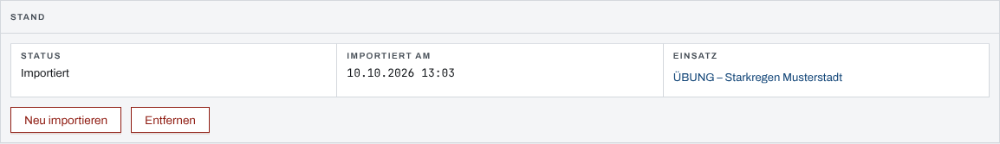
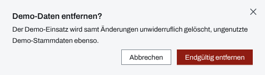

## Überblick

Demo-Daten sind eine fertig befüllte Übungslage: ein Einsatz „ÜBUNG – Starkregen Musterstadt“
mit Abschnitten, Einheiten, Fahrzeugen, Betroffenen, Betreuung, Meldungen, Aufträgen,
Lagebericht und Einsatztagebuch, dazu die Fahrzeuge, das Personal und das Material, die er
braucht. Sie eignen sich zum Kennenlernen, für Schulungen und für Vorführungen. Ein System-Admin
spielt sie ein, entfernt sie wieder oder setzt sie auf den Anfangsstand zurück.

Die Seite „Demo-Daten“ gibt es nur, wenn der Server mit eingeschalteten Demo-Daten gestartet
wurde, und nur für System-Admins.

## Abläufe

### Demo-Daten importieren

1. Oben „Verwaltung“ öffnen und „Demo-Daten“ wählen. Ohne Import zeigt auch die Einsatzliste
   den Hinweis „Demo-Daten nicht importiert“ mit „Zu den Demo-Daten“.
2. „Importieren“ wählen. Die App meldet „Demo-Daten importiert“.
3. Unter „Stand“ den Demo-Einsatz wählen, um ihn zu öffnen.

   

### Die Übungslage zurücksetzen

1. Unter „Demo-Daten“ „Neu importieren“ wählen.
2. Die Rückfrage „Demo-Daten neu importieren?“ mit „Ersetzen“ bestätigen.

Der Demo-Einsatz steht danach wieder auf dem Anfangsstand; alles, was in ihm geändert wurde,
ist weg.

### Demo-Daten entfernen

1. Unter „Demo-Daten“ „Entfernen“ wählen.
2. Die Rückfrage „Demo-Daten entfernen?“ mit „Endgültig entfernen“ bestätigen.

   

Das Paneel „Letzter Vorgang“ zählt danach je Fahrzeuge, Personal und Material, was entfernt und
was behalten wurde.

## Hintergrund

### Was der Import anlegt

- Genau einen Einsatz der Einsatzart Übung, mit fiktivem Ort und erkennbar erfundenen Namen. Der
  importierende System-Admin ist seine Einsatzleitung; sonst ist niemand Mitglied.
- Alle Zeiten liegen kurz vor dem Import: der Einsatz läuft seit einigen Stunden, der jüngste
  Eintrag ist wenige Minuten alt. Beim Import entsteht kein Alarm.
- Fahrzeuge, Personal und Material. Gibt es in der Organisation schon einen Datensatz im Dienst
  mit derselben Kennung (Funkrufname, Personalnummer, Bestandsnummer), benutzt der Import ihn
  mit und lässt ihn unverändert. „Letzter Vorgang“ zählt das als „mitbenutzt“.
- **Keine** Benutzerkonten. Kataloge wie Status, Einheitstypen und Qualifikationen benutzt der
  Import nur mit; fehlt ein benötigter Eintrag, bricht er mit einer Meldung ab.

Der Import läuft ganz oder gar nicht: scheitert ein Schritt, bleibt alles wie vorher.

### Marke „Demo“

Was der Import angelegt hat, trägt die Marke „Demo“, in den Stammdaten und in den Tabellen des
Einsatzes. So bleibt erkennbar, was zur Übungslage gehört.

### Was „Entfernen“ und „Neu importieren“ löschen

- **Entfernen** löscht den Demo-Einsatz mit allem, was an ihm hängt, unwiderruflich, und danach
  die Demo-Stammdaten. Ein Demo-Datensatz, den inzwischen etwas anderes nutzt, etwa ein
  echter Einsatz, bleibt stehen und verliert seine Marke („behalten“). Mitbenutzte Datensätze
  rührt das Entfernen nicht an.
- **Neu importieren** entfernt und importiert in einem Zug. Scheitert der Import, bleibt der
  bisherige Demo-Stand erhalten.
- Die Adresse eines entfernten Demo-Einsatzes führt nie zu einem anderen Einsatz: seine
  interne Kennung vergibt das System nicht wieder.

Echte Einsätze und Stammdaten ohne Marke berühren beide Vorgänge nicht.

### Einschalten

Die Demo-Daten schaltet der Betreiber des Servers frei, mit dem Startschalter `--demo-daten` oder
der Umgebungsvariable `LIFELINE_DEMO_DATEN=true`. Ohne Freischaltung fehlt die Seite ganz.
