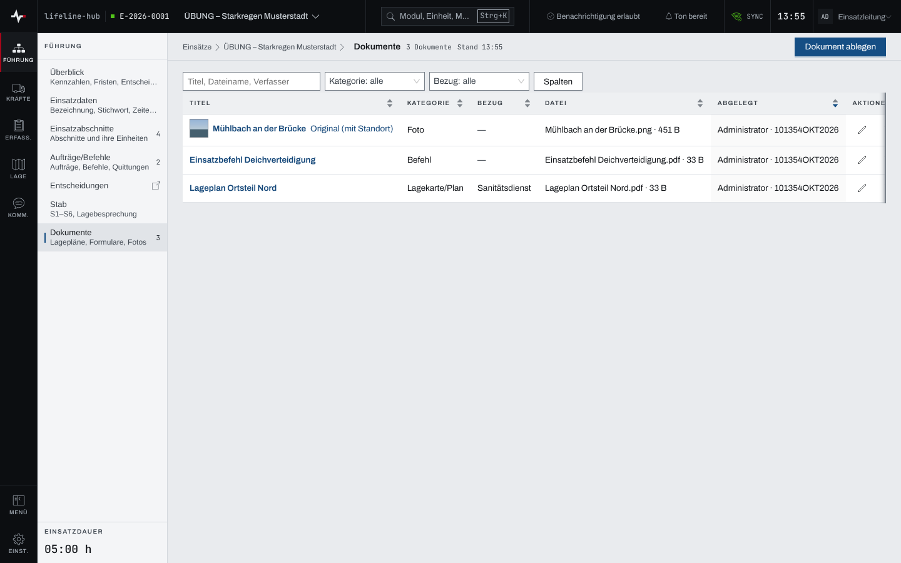
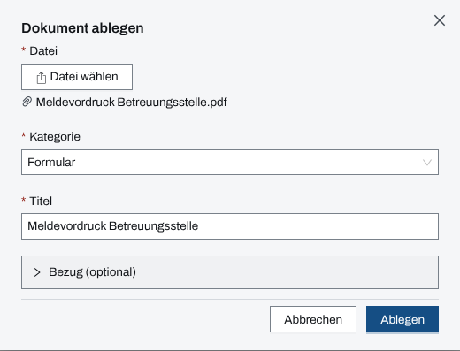

## Überblick

„Dokumente“ ist die Ablage des Einsatzes für Lagepläne, Befehle, Formulare, Fotos und andere
Dateien. Jedes Dokument hat einen Titel, eine Kategorie und auf Wunsch einen Bezug auf einen
Abschnitt, eine Einheit oder einen Eintrag im Einsatztagebuch. Lesen und herunterladen können alle
Mitglieder des Einsatzes, ablegen, ändern und entfernen dürfen Einsatzleitung und
Führungspersonal.

## Abläufe

### Ein Dokument finden und öffnen

1. „Dokumente“ öffnen. Die Liste zeigt Titel, Kategorie, Bezug, Datei und wer es wann abgelegt
   hat; Bilder mit einem Vorschaubild.

   

2. Mit dem Suchfeld (Titel, Dateiname, Verfasser), „Kategorie“ und „Bezug“ die Liste eingrenzen.
3. Den Titel wählen, um die Datei herunterzuladen.

### Ein Dokument ablegen

1. In „Dokumente“ „Dokument ablegen“ wählen.
2. „Datei wählen“ und die Datei aussuchen. Der „Titel“ wird aus dem Dateinamen vorbelegt.
3. Die „Kategorie“ wählen: Lagekarte/Plan, Befehl, Formular, Foto oder Sonstiges. Den Titel bei
   Bedarf ändern.

   

4. Soll das Dokument zu einem Abschnitt, einer Einheit oder einem Eintrag im Einsatztagebuch
   gehören, unter „Bezug (optional)“ den „Bezug“ wählen.
5. „Ablegen“ wählen. Die App zeigt den Fortschritt der Übertragung, danach „Datei wird geprüft“.

### Ein Dokument ändern oder entfernen

1. In der Liste beim Dokument den Stift wählen.
2. Im Dialog „Dokument bearbeiten“ „Titel“, „Kategorie“ oder „Bezug“ ändern und „Speichern“
   wählen. Die Datei selbst bleibt.
3. Zum Entfernen beim Dokument den Papierkorb wählen und die Rückfrage „Dokument entfernen?“
   mit „Entfernen“ bestätigen.

## Hintergrund

### Wer was darf

Ablegen, Ändern und Entfernen dürfen Einsatzleitung und Führungspersonal, solange der Einsatz
läuft. Bei Bildern bietet die Liste der Einsatzleitung und der Administration zusätzlich
„Original (mit Standort)“ an; die übliche Fassung ist um Standort- und Gerätedaten bereinigt. Jeder
Abruf eines Originals wird im Einsatztagebuch vermerkt. Einzelheiten stehen in
[Rechte im Einsatz](rechte-im-einsatz.md).

### Was ins Einsatztagebuch geht

- Ablegen: „Dokument abgelegt (Kategorie)“. Der Titel steht bewusst nicht darin.
- Ändern: „Dokument geändert: Ablage ETB … (Kategorie)“ mit dem, was sich geändert hat; ein
  geänderter Titel nur als „Titel geändert“.
- Entfernen: „Dokument entfernt: Ablage ETB … (Kategorie)“. Das Dokument verschwindet aus der
  Liste, der Nachweis im Einsatztagebuch bleibt.

### Dateien

- Erlaubt sind PDF, Bilder (JPG, PNG, GIF, WebP, HEIC, TIFF), Text und CSV sowie Word-, Excel-
  und PowerPoint-Dateien.
- Eine Datei darf höchstens 25 MB groß sein und nicht leer.
- Ist am Server eine Virenprüfung eingerichtet, prüft sie jede Datei vor der Ablage; eine Datei
  mit Fund legt die App nicht ab.

### Ohne Netz

Ohne Netz lässt sich kein Dokument ablegen; die App merkt nichts vor. Der Dialog bleibt mit Datei
und Angaben stehen, „Ablegen“ versucht es erneut. Die Liste der Dokumente wird ohne Netz nicht
vorgehalten (siehe [Arbeiten ohne Netz](ohne-netz.md)).
