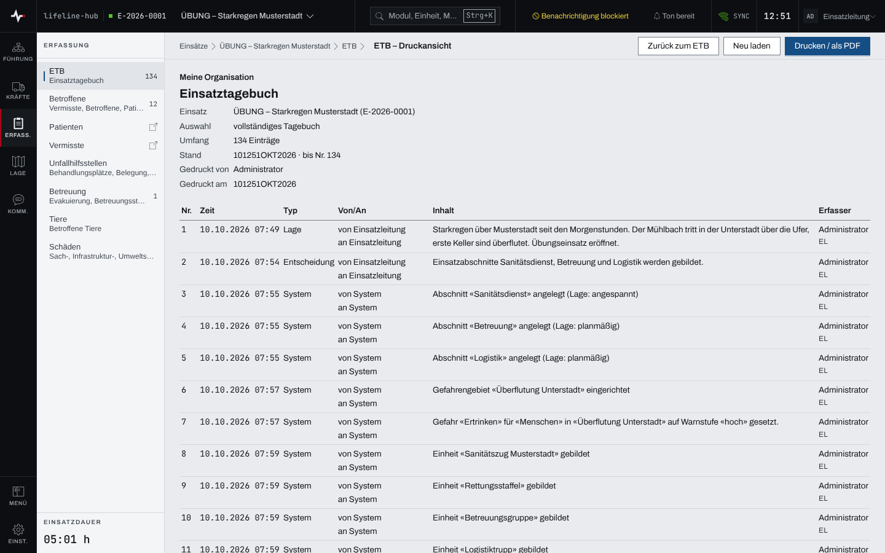
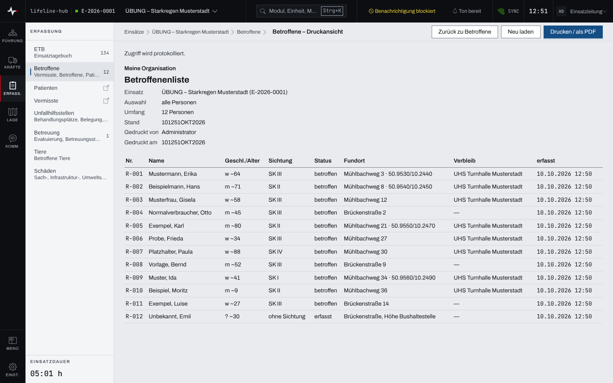

## Überblick

Lifeline Hub druckt über den Browser. Jeder Druckknopf heißt „Drucken / als PDF“ und öffnet den
Druckdialog des Browsers; dort lässt sich auf Papier drucken oder als PDF speichern. Jedes
gedruckte Blatt trägt oben den **Druckkopf** mit Organisation, Dokumentart, Einsatz und Stand.

Gedruckt werden können unter anderem:

- das Einsatztagebuch, als eigene Druckansicht,
- die Listen der Betroffenen, Tiere und Schäden, ebenfalls als Druckansicht,
- Einsatzbefehle, Lageberichte und Pressemitteilungen,
- Meldebild, Funkplan, Kommunikationsplan und das Organigramm der Einsatzabschnitte,
- der Einsatzbericht („Einsatzbericht drucken“ in den Einsatzdaten),
- die Hilfe.

Als Datei exportieren lassen sich die Listen der Betroffenen und der Tiere mit „CSV
exportieren“.

## Abläufe

### Das Einsatztagebuch drucken

1. Im Modul „ETB“ bei Bedarf einen Filter setzen (siehe [Einsatztagebuch](einsatztagebuch.md)).
2. Im Kopf der Seite „Drucken / als PDF“ wählen. Die „ETB – Druckansicht“ öffnet sich mit
   demselben Filter.

   

3. Warten, bis die Tabelle steht. Bis alle Einträge geladen sind, ist „Drucken / als PDF“
   gesperrt.
4. „Drucken / als PDF“ wählen und im Druckdialog des Browsers drucken oder als PDF speichern.

Die Druckansicht ist ein fester Stand: Neue Einträge holt „Neu laden“. „Zurück zum ETB“ führt zur
Zeitachse zurück.

### Eine Liste drucken

1. In „Betroffene“, „Tiere“ oder „Schäden“ bei Bedarf die Liste filtern.
2. Im Kopf der Seite „Drucken / als PDF“ wählen; auf schmalen Bildschirmen steht der Punkt unter
   „Weitere“. Die Druckansicht übernimmt den Filter.

   

3. „Drucken / als PDF“ wählen.

Die Druckansicht der Betroffenen zeigt „Zugriff wird protokolliert.“: Jeder Abruf steht im
Zugriffsprotokoll der Betroffenen.

### Eine Liste als CSV exportieren

1. In „Betroffene“ oder „Tiere“ im Kopf der Seite „CSV exportieren“ wählen; auf schmalen
   Bildschirmen unter „Weitere“.
2. Die Datei wird heruntergeladen.

Auch jeder CSV-Export der Betroffenen steht im Zugriffsprotokoll. Ohne Verbindung scheitert der
Export sofort und meldet das an der Seite.

### Ein Dokument oder einen Plan drucken

1. Den Einsatzbefehl, Lagebericht, die Pressemitteilung oder den Plan öffnen.
2. „Drucken / als PDF“ wählen. Bei Dokumenten steht der Punkt im Kopf der Seite, bei Meldebild,
   Funkplan, Kommunikationsplan und Organigramm an der Ansicht selbst.
3. Im Druckdialog des Browsers drucken oder als PDF speichern.

Meldebild, Funkplan und Organigramm klappen zum Drucken alle Zweige auf.

### Den Organisationskopf einrichten

Für System-Admins:

1. In der „Verwaltung“ unter „Stammdaten“ den Bereich „Organisation“ öffnen.
2. Unter „Name der Organisation“ den Namen eintragen und „Speichern“ wählen.
3. Mit „Logo hochladen“ (oder „Logo ersetzen“) ein Logo als PNG oder JPEG mit höchstens 1 MiB
   wählen. Das Logo wird sofort hochgeladen; „Logo entfernen“ nimmt es wieder heraus.

Name und Logo stehen ab dem nächsten Druck im Druckkopf (Kapitel „Stammdaten“).

## Hintergrund

### Was der Druckkopf zeigt

Der Druckkopf trägt Name und Logo der Organisation, die Dokumentart (etwa „Einsatztagebuch“ oder
„Betroffenenliste“), den Einsatz mit Nummer und je nach Druckstück Auswahl, Umfang und Stand,
dazu „Gedruckt von“ und „Gedruckt am“. Die Fußzeile „Seite … von …“ druckt nur ein
Chromium-Browser (Chrome, Edge).

Gedruckt wird erst, wenn die Organisation geladen ist. Gelingt das nicht, steht am Knopf
„Organisation nicht geladen“ mit „Erneut laden“. Ein Logo, das nicht lädt, fällt im Druck weg.
Nur die Hilfe druckt ohne Organisation.

### Die ETB-Druckansicht

Die Tabelle zeigt die Einträge in der Reihenfolge ihrer Nummer mit Nr., Zeit, Typ, Von/An, Inhalt
und Erfasser. Berichtigungen und Nachträge sind wie in der Zeitachse gekennzeichnet.

### Rechte

Drucken und Exportieren ist Lesen: Wer eine Liste sehen darf, darf sie auch drucken und
exportieren, ohne Schreibrecht. Das Zugriffsprotokoll der Betroffenen sieht nur die
Einsatzleitung, unter „Listenzugriffe“ (Kapitel „Betroffene und Sichtung“).
