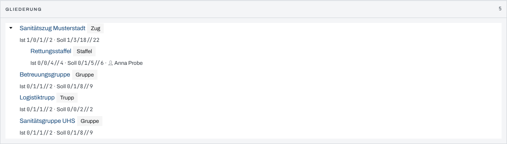
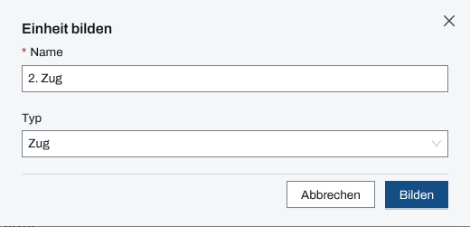
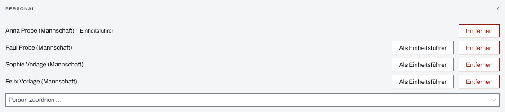

## Überblick

Eine **Einheit** fasst Personal, Fahrzeuge und Material unter einem Namen zusammen, etwa einen Zug,
eine Staffel oder einen Trupp. Einheiten lassen sich einander unterstellen und einem
Einsatzabschnitt zuordnen. Ihre Ist-Stärke ergibt sich aus dem zugeordneten Personal, die
Soll-Stärke trägt die Führung ein.

Das Modul zeigt die Gliederung aller Einheiten; jede Einheit hat eine eigene Seite mit Kopfdaten,
Zeitachse und den Paneelen „Personal“, „Fahrzeuge“ und „Material“. Bilden, ändern und zuordnen
dürfen Einsatzleitung und Führungspersonal.

## Abläufe

### Die Gliederung lesen

1. Unter „Kräfte & Mittel“ „Einheiten“ öffnen.
2. Im Paneel „Gliederung“ jede Einheit mit Typ lesen, darunter „Ist“, „Soll“ und den Einheitsführer.
   Unterstellte Einheiten stehen eingerückt unter ihrer Über-Einheit.

   

3. Den Namen einer Einheit wählen, um ihre Seite zu öffnen.

### Eine Einheit bilden

Für Einsatzleitung und Führungspersonal:

1. In „Einheiten“ „Einheit bilden“ wählen.
2. Einen „Name“ eingeben und bei Bedarf einen „Typ“ wählen.

   

3. „Bilden“ wählen. Die App öffnet die Seite der neuen Einheit.

### Die Kopfdaten einer Einheit pflegen

Für Einsatzleitung und Führungspersonal:

1. Die Einheit öffnen.
2. Im Paneel „Kopfdaten“ „Name“, „Typ“, „Abschnitt“ und „Über-Einheit“ setzen.
3. Unter „Soll-Stärke (F/UF/M)“ Führer, Unterführer und Mannschaft eintragen. Daneben stehen die
   Ist-Stärke und die kumulierte Ist-Stärke samt unterstellter Einheiten.
4. Unter „Funk / Kommunikation“ bei Bedarf „Funkrufname“, „Sprechgruppen“, „Kommunikationsmittel“,
   „Erreichbarkeit / Nummer“ und „Bemerkung“ eintragen.
5. „Speichern“ wählen.

### Personal, Fahrzeuge und Material zuordnen

Für Einsatzleitung und Führungspersonal:

1. Die Einheit öffnen.
2. Im Paneel „Personal“ unter „Person zuordnen …“ eine Person wählen. Sie steht sofort in der Liste;
   zu speichern ist nichts.

   

3. Mit „Als Einheitsführer“ eine Person der Einheit als Einheitsführer setzen.
4. Ebenso in „Fahrzeuge“ unter „Fahrzeug zuordnen …“ und in „Material“ unter „Material zuordnen …“
   wählen.
5. Mit „Entfernen“ eine Person, ein Fahrzeug oder Material wieder aus der Einheit lösen. Es bleibt
   im Einsatz, nur ohne Einheit.

### Eine Einheit auflösen

Für Einsatzleitung und Führungspersonal:

1. Die Einheit öffnen.
2. Im Paneel „Kopfdaten“ „Auflösen“ wählen.
3. Die Rückfrage „Einheit auflösen?“ mit „Einheit auflösen“ bestätigen. Die Mitglieder werden frei,
   unterstellte Einheiten rücken eine Ebene hoch.

## Hintergrund

### Wer zu einer Einheit gehört

Eine Person, ein Fahrzeug oder ein Materialposten gehört höchstens einer Einheit an. Die
Auswahlfelder bieten nur an, was noch keiner Einheit zugeordnet ist; wer in eine andere Einheit
wechseln soll, wird dort zuerst entfernt. Disponiert, also in den Einsatz geholt, werden Kräfte in
den Modulen [Personal](personal.md), [Fahrzeuge und FMS](fahrzeuge.md) und [Material](material.md).

### Stärke

Die Ist-Stärke zählt das zugeordnete Personal nach seiner Stärke-Position (Führer, Unterführer,
Mannschaft), die im Modul Personal gesetzt wird. Einheitsführer ist ein eigenes Merkmal: eine Person
mit der Position „Führer“ ist dadurch noch nicht Einheitsführer, die Seite weist darauf hin. Je
Einheit gibt es einen Einheitsführer. Die kumulierte Ist-Stärke rechnet alle unterstellten Einheiten
mit ein.

### Status und Zeitachse

Der Status einer Einheit folgt ihren Fahrzeugen; ohne Fahrzeug wird er im Meldebild von Hand
gesetzt. Das Paneel „Zeitachse“ zeigt Einsatzdauer und Ereignisse der Einheit (Kapitel [Meldebild
und Kräfte-Zeitachse](meldebild.md)).

### Einsatztagebuch

Ins Einsatztagebuch schreibt die App selbst: das Bilden und Auflösen einer Einheit, eine neue
Abschnittszuordnung, einen Wechsel des Einheitsführers und jedes Zuordnen und Lösen von Personal,
Fahrzeugen und Material. Änderungen an Name, Typ, Unterstellung, Soll-Stärke und Funkangaben stehen
nicht im Einsatztagebuch.

### Rechte und ohne Netz

Lesen darf, wer das Modul Einheiten sieht. Bilden, ändern, zuordnen und auflösen dürfen
Einsatzleitung und Führungspersonal, solange der Einsatz läuft (Kapitel [Rechte im
Einsatz](rechte-im-einsatz.md)). Ohne Netz bleiben Gliederung und Einheiten mit dem zuletzt
geladenen Stand lesbar; ändern lässt sich nichts (Kapitel [Ohne Netz](ohne-netz.md)).
