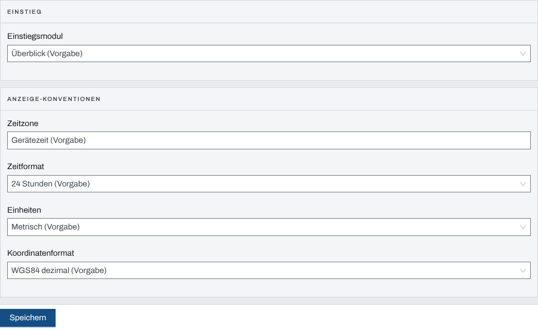
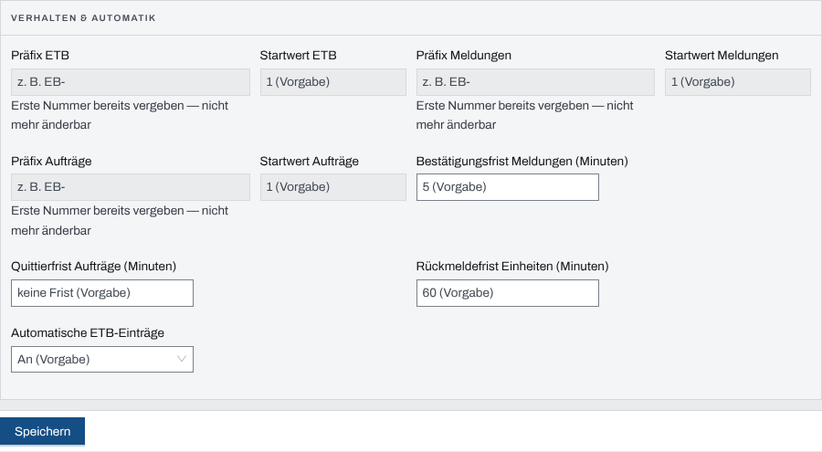
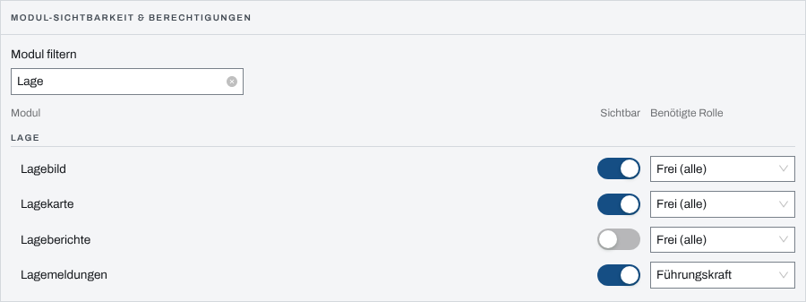

## Überblick

Das Modul „Einstellungen“ eines Einsatzes legt fest, wie dieser eine Einsatz arbeitet: mit
welchem Modul er sich öffnet, wie Zeiten und Koordinaten erscheinen, wie Einträge nummeriert
werden, welche Fristen gelten und wer welche Module sieht. Jede Einstellung gilt nur für diesen
Einsatz. Was hier leer bleibt, übernimmt die Vorgabe der Organisation aus der Verwaltung, und
fehlt auch die, die Vorgabe des Systems.

Bedient wird das Modul von der Einsatzleitung und dem Führungspersonal, der Reiter „Module“ nur
von der Einsatzleitung. Den Reiter „Aufbewahrung“ beschreibt das Kapitel
[Aufbewahrung](aufbewahrung.md), die Reiter „Pegel“ und „Geräte“ die Kapitel zu Wetter und
Pegeln und zu gekoppelten Geräten.

## Abläufe

### Einstiegsmodul und Anzeige festlegen

1. Im Einsatz „Einstellungen“ öffnen; der Reiter „Allgemein“ ist gewählt.
2. Unter „Einstiegsmodul“ das Modul wählen, mit dem sich der Einsatz öffnet.
3. Unter „Anzeige-Konventionen“ „Zeitzone“, „Zeitformat“, „Einheiten“ und „Koordinatenformat“
   wählen.

   

4. „Speichern“ wählen. Die App meldet „Einstellungen gespeichert“.

Ein Feld mit dem Zusatz „(Vorgabe)“ ist nicht gesetzt und folgt der Organisation. Wer ein Feld
leert, stellt es auf die Vorgabe zurück.

### Nummern, Fristen und automatische ETB-Einträge einstellen

1. Den Reiter „Verhalten & Automatik“ öffnen.
2. Für ETB, Meldungen und Aufträge je „Präfix …“ (höchstens acht Zeichen) und „Startwert …“
   eintragen.
3. „Bestätigungsfrist Meldungen (Minuten)“, „Quittierfrist Aufträge (Minuten)“ und
   „Rückmeldefrist Einheiten (Minuten)“ eintragen.
4. Unter „Automatische ETB-Einträge“ „An“ oder „Aus“ wählen.

   

5. „Speichern“ wählen.

### Module ausblenden oder auf eine Rolle beschränken

Für die Einsatzleitung:

1. Den Reiter „Module“ öffnen.
2. Unter „Modul filtern“ einen Teil des Modulnamens eintippen.
3. In der Zeile des Moduls „Sichtbar“ ausschalten, um es auszublenden, oder unter „Benötigte
   Rolle“ „Führungskraft“ oder „Admin“ wählen.

   

Jede Änderung gilt sofort, ohne „Speichern“. Die App meldet „Modul-Einstellung gespeichert“.

## Hintergrund

### Woher ein Wert kommt

Jede Einstellung gilt in der Reihenfolge Einsatz, Organisation, System. Steht unter einem Feld
„Vorgabe der Organisation: …“, hat die Verwaltung dafür einen eigenen Wert gesetzt; das Kapitel
[Verwaltung](verwaltung.md) beschreibt diese Vorgaben. Ohne beide gelten: Einstiegsmodul
„Überblick“, Gerätezeit, 24 Stunden, metrisch, WGS84 dezimal, Bestätigungsfrist 5 Minuten, keine
Quittierfrist, Rückmeldefrist 60 Minuten, automatische ETB-Einträge an. Als Einstiegsmodul
stehen nur fertige Module zur Wahl. Die Fristen nehmen 1 bis 10080 Minuten (sieben Tage).

Wer ein Formular mit ungespeicherten Eingaben verlassen will, bekommt die Rückfrage
„Ungespeicherte Änderungen“.

### Nummern

Präfix und Startwert eines Nummernkreises lassen sich nur ändern, solange darin noch keine
Nummer vergeben ist. Danach sind beide Felder gesperrt: „Erste Nummer bereits vergeben — nicht
mehr änderbar“. So bleiben die Nummern eines Einsatzes eindeutig.

### Automatische ETB-Einträge

Steht die Einstellung auf „An“, schreibt jede neue Meldung einen ETB-Eintrag vom Typ „Meldung“
und jeder neue Auftrag einen vom Typ „Anordnung“. Auf „Aus“ entstehen diese Einträge nicht;
was ins Einsatztagebuch gehört, trägt dann jemand selbst ein.

### Was „Sichtbar“ und „Benötigte Rolle“ bewirken

- **Ausgeblendet** fehlt ein Modul in der Navigation aller Personen und ist für sie gesperrt.
  Nur System-Admins erreichen es noch über seine Adresse; in ihrer Navigation fehlt es ebenso.
- **„Führungskraft“** lässt nur Führungskräfte der Organisation und System-Admins in das Modul.
  Gemeint ist die Rolle in der Organisation, nicht die im Einsatz: Einsatzleitung und
  Führungspersonal ohne diese Organisationsrolle bleiben draußen.
- **„Admin“** lässt nur System-Admins in das Modul.
- **„Frei (alle)“** schränkt nichts ein; es gelten die Rollen im Einsatz.

Eine Rolle ohne eigenen Wert im Einsatz folgt der „Rollen-Vorgabe je Modul“ der Organisation.
„Einsatzdaten“ und „Einstellungen“ sind „immer sichtbar, nicht ausblendbar“, damit sich niemand
selbst aussperrt.

### Wer was darf

- „Allgemein“, „Verhalten & Automatik“ und die Aufbewahrungs-Dauer ändern die Einsatzleitung,
  das Führungspersonal und System-Admins der Organisation des Einsatzes.
- „Module“ ändern nur die Einsatzleitung und System-Admins der Organisation des Einsatzes.
- Alle anderen sehen die Einstellungen als „Nur Ansicht“.

Nach dem Abschluss ist der Einsatz eingefroren; nur die Aufbewahrungsfrist lässt sich noch
ändern, siehe [Einsatz abschließen und Einsatzbericht](einsatzabschluss.md). Die Rollen im
Einsatz beschreibt [Rechte im Einsatz](rechte-im-einsatz.md).
