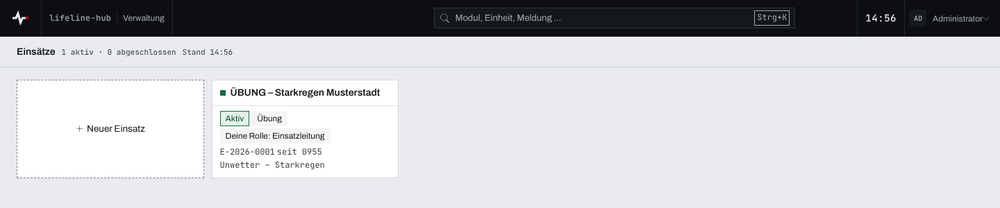
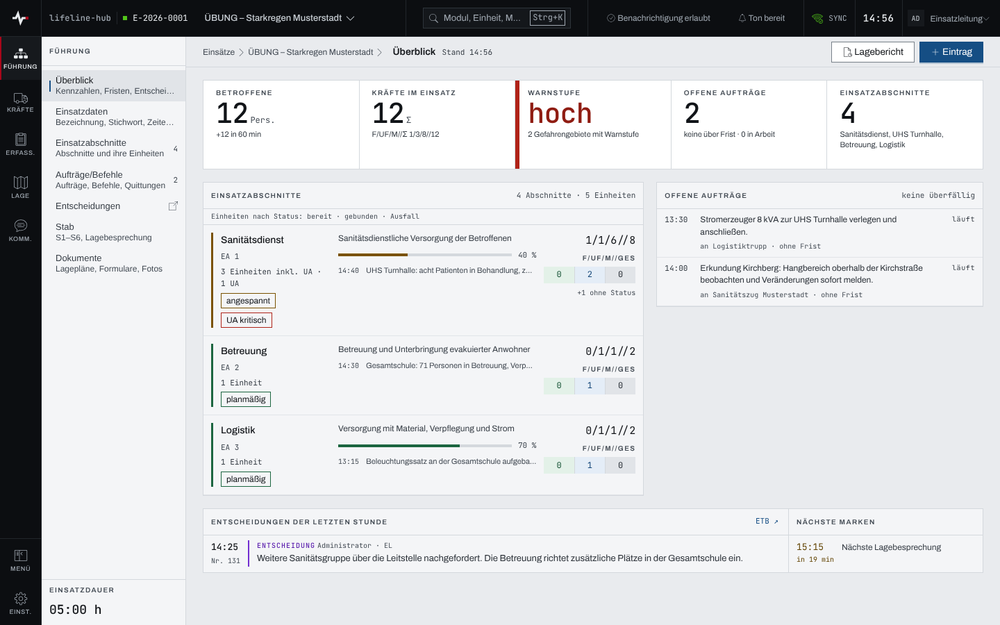
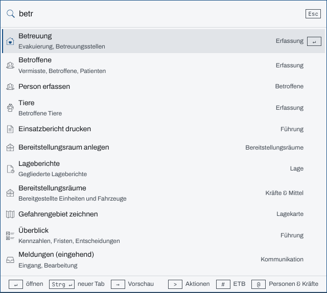
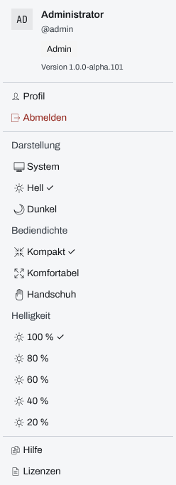

## Überblick

Nach der Anmeldung zeigt Lifeline Hub die **Einsatzliste**. Von dort öffnet jede Person die
Einsätze, in denen sie mitarbeitet. Im Einsatz gliedert sich die Oberfläche in die
**Kopfzeile** oben, die **Kategorien** am linken Rand, die **Module** der gewählten Kategorie
daneben und die Seite des Moduls. Die **Sprungpalette** erreicht jedes Modul, jeden Einsatz und
viele Datensätze über die Tastatur.

Wie die App aussieht, stellt jedes Gerät selbst ein: Darstellung (hell oder dunkel),
Bediendichte (kompakt, komfortabel, Handschuh) und Helligkeit. Das Kapitel richtet sich an alle,
die Lifeline Hub bedienen.

## Abläufe

### Einen Einsatz öffnen

1. Die Einsatzliste öffnen: Sie erscheint nach der Anmeldung, sonst führt „lifeline-hub“ links
   oben in der Kopfzeile dorthin.
2. Die Kachel des Einsatzes wählen. Sie nennt Status, Einsatzart, die eigene Rolle („Deine
   Rolle: …“) und, soweit erfasst, Ort, Einsatznummer, Beginn („seit …“) und Stichwort.

   

Ab acht laufenden Einsätzen steht über den Kacheln das Suchfeld „Einsätze durchsuchen“; es
sucht in Bezeichnung, Ort und Stichwort. Abgeschlossene Einsätze stehen kleiner darunter unter
„Abgeschlossen“.

### Einen Einsatz anlegen

Für System-Admins und Führungskräfte der Organisation:

1. In der Einsatzliste „Neuer Einsatz“ wählen.
2. Im Dialog „Neuen Einsatz anlegen“ die „Bezeichnung“ eintragen, dazu „Stichwort“,
   „Einsatzart“ und „Alarmzeit“. Die Alarmzeit ist mit dem jetzigen Zeitpunkt vorbelegt.
3. „Anlegen“ wählen. Die App öffnet den neuen Einsatz.

### Zwischen Einsätzen wechseln

1. In der Kopfzeile auf den Namen des Einsatzes tippen. Das Menü listet die laufenden Einsätze
   mit Einsatznummer und Ort.
2. Einen anderen Einsatz wählen, oder „Alle Einsätze …“ für die Einsatzliste.

### Ein Modul öffnen

1. Links eine Kategorie wählen: „Führung“, „Kräfte“, „Erfass.“ (Erfassung), „Lage“, „Komm.“
   (Kommunikation) oder unten „Einst.“ (Einstellungen). Die App springt in das erste Modul der
   Kategorie und zeigt daneben ihre Module.

   

2. In der Modulliste das Modul wählen. Die Zahl neben einem Modul zählt dessen Inhalt, etwa
   Einträge im Einsatztagebuch, offene Aufträge oder ungelesene Nachrichten im Chat.
3. Die Modulliste einklappen: unten in der Kategorienleiste „Menü“ wählen, oder ein zweites
   Mal auf die offene Kategorie tippen. „Menü“ klappt sie wieder aus.

Auf schmalen Schirmen (Tablet hochkant, Telefon) stehen Kategorien und Module hinter
„Navigation öffnen“ links oben.

### Mit der Sprungpalette springen

1. **Strg+K** drücken (am Mac **⌘K**) oder in der Kopfzeile „Suchen“ wählen.
2. Einige Buchstaben tippen, etwa den Namen eines Moduls, eines Fahrzeugs oder einer Person.

   

3. Mit den Pfeiltasten einen Treffer wählen und mit **↵** öffnen; **Strg+↵** (am Mac **⌘↵**)
   öffnet ihn in einem neuen Tab. **→** am Ende der Eingabe zeigt eine Vorschau, **Esc**
   schließt die Palette.

Ein Zeichen am Anfang der Eingabe grenzt die Suche ein: **>** nur Aktionen, **#** nur das
Einsatztagebuch (`#42` findet Eintrag 42), **@** nur Personen und Kräfte. Auf einem Gerät mit
Touch stehen diese Filter als Knöpfe am unteren Rand der Palette.

### Darstellung, Bediendichte und Helligkeit einstellen

1. Oben rechts das „Benutzermenü“ öffnen.
2. Unter „Darstellung“ „System“, „Hell“ oder „Dunkel“ wählen.
3. Unter „Bediendichte“ „Kompakt“, „Komfortabel“ oder „Handschuh“ wählen.
4. Unter „Helligkeit“ eine Stufe von „100 %“ bis „20 %“ wählen.

   

Die gewählte Stufe trägt ein Häkchen. Dieselben Einstellungen stehen in der Sprungpalette
(„Darstellung: …“, „Dichte: …“, „Helligkeit: …“).

## Hintergrund

### Die Kopfzeile

Von links nach rechts:

- **Statuspunkt, Einsatznummer und Name** des offenen Einsatzes; über den Namen geht der Wechsel
  in einen anderen Einsatz.
- **Suchen** öffnet die Sprungpalette.
- **Alarmzentrale**: „Benachrichtigung …“ zeigt, ob der Browser Benachrichtigungen zeigen darf,
  „Ton …“, ob Alarmtöne zu hören sind. „Ton stumm“ und „Ton blockiert“ stehen auffällig da: Eine
  Sofortmeldung oder eine fällige Erinnerung bliebe dann ohne Ton. Stummschalten gilt für alle
  Alarmtöne auf diesem Gerät, in jedem Einsatz.
- **Verbindung**: „SYNC“ heißt, die Live-Verbindung steht. „VERBINDE“, „GETRENNT“, „OFFLINE“,
  „WARTET“ (vorgemerkte Einträge) und „PRÜFEN“ (abgelehnte Einträge) melden eine Störung; was
  dann gilt, steht in [Arbeiten ohne Netz](ohne-netz.md).
- **Uhr**: die Uhrzeit des Geräts.
- **Benutzermenü** mit Name, Funktion im Einsatz, Profil, Abmelden, den Einstellungen des Geräts
  und der Hilfe.

Auf schmalen Schirmen zeigt die Kopfzeile Ruhezustände nur als Zeichen; jede Störung behält ihr
Wort. Außerhalb eines Einsatzes führt „Verwaltung“ in die Verwaltung der Organisation. Wer dort
keine Rechte hat, sieht den Eintrag mit Schloss und „Keine Berechtigung“.

Über der Kopfzeile erscheint bei Bedarf die **Betriebszeile**: bei Störungen der Verbindung, bei
vorgemerkten oder abgelehnten Einträgen und mit „Neue Version verfügbar.“, wenn eine neue
Fassung der App bereitliegt. „Jetzt neu laden“ lädt sie.

### Was ein Einsatz zeigt

Ein Einsatz öffnet mit dem „Überblick“, es sei denn, die Einsatzleitung hat in den Einstellungen
des Einsatzes ein anderes „Einstiegsmodul“ festgelegt. Welche Module erscheinen, legt der
Einsatz fest: Ein ausgeblendetes Modul fehlt in der Liste, ein gesperrtes steht mit „Keine
Berechtigung“ da. Was die eigene Rolle im Einsatz erlaubt, steht in
[Rechte im Einsatz](rechte-im-einsatz.md).

Unten in der Modulliste läuft die **Einsatzdauer** seit Beginn des Einsatzes.

Einige Einträge der Modulliste sind **Sprungmarken** in ein anderes Modul: „Entscheidungen“
(Einsatztagebuch, nur Entscheidungen), „Patienten“ und „Vermisste“ (Betroffene) sowie
„FMS-Tableau“ (Fahrzeuge).

Wer aus einem Einsatz ins Profil oder in die Verwaltung wechselt, findet dort „Zurück zu …“: Es
führt an die zuletzt geöffnete Stelle des Einsatzes zurück, solange er läuft.

### Was die Sprungpalette kennt

Ohne Eingabe stehen oben die zuletzt ausgeführten Befehle und die zuletzt geöffneten Module.
Mit Eingabe sucht die Palette in Modulen, Schnellaktionen („Person erfassen“, „ETB-Eintrag
schreiben“ …), laufenden Einsätzen, Einstellungen und, ab zwei Zeichen, in den Datensätzen des
Einsatzes: Personen, Fahrzeuge, Personal, Einheiten, Einträge des Einsatztagebuchs und weitere.
Module, die der Einsatz nicht freigibt, fehlen; Schnellaktionen stehen nur dort, wo die eigene
Rolle schreiben darf.

„Koordinaten: …“ in der Palette stellt das Koordinatenformat für dieses Gerät ein. Es gilt vor
der Vorgabe des Einsatzes und der Organisation, bis eine andere Wahl getroffen wird.

### Einstellungen des Geräts

Darstellung, Bediendichte und Helligkeit gehören zum **Gerät**, nicht zur Person: Sie bleiben
nach dem Abmelden stehen und gelten für jede Person, die sich an diesem Gerät anmeldet.

- **Darstellung**: Vorgabe ist „Dunkel“ für den Nachtbetrieb. „System“ folgt der Einstellung des
  Betriebssystems. Kopfzeile und Kategorienleiste bleiben in jeder Darstellung dunkel.
- **Bediendichte**: „Kompakt“ ist für Maus und Tastatur am Laptop gedacht, „Komfortabel“ für die
  Bedienung mit dem Finger, „Handschuh“ für Handschuhe. Ohne eigene Wahl beginnt ein Gerät mit
  Touch als Hauptbedienung mit „Komfortabel“, jedes andere mit „Kompakt“. „Handschuh“ gibt es nur
  auf Wahl.
- **Helligkeit** dunkelt die ganze Anzeige ab, für den abgedunkelten Führungsraum bei Nacht. Den
  Bildschirm selbst macht sie nicht heller als 100 %.

### Helligkeit bei einer Warnung

Solange im offenen Einsatz eine Warnung aktiv ist, wirkt die Helligkeit mit **mindestens
80 %**, damit Warnungen lesbar bleiben. Das Menü zeigt dann „Helligkeit · mind. 80 % (Warnung
aktiv)“; die dunkleren Stufen sind gesperrt. Als Warnung zählen:

- ein Gefahrengebiet mit der Warnstufe „hoch“ oder „akut“,
- eine Meldung, deren Bestätigung überfällig ist,
- eine jetzt geltende Unwetterwarnung des Deutschen Wetterdienstes für den Einsatzort
  („Unwetterwarnung“ oder „Extremes Unwetter“).

Die eigene Wahl bleibt dabei erhalten: Endet die Warnung oder verlässt man den Einsatz, gilt sie
wieder.
