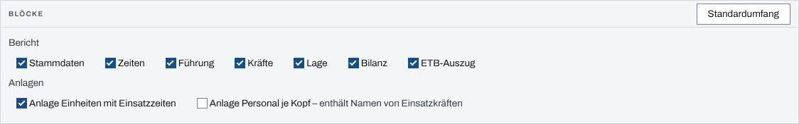
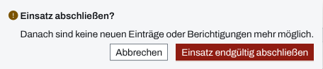

## Überblick

Ist ein Einsatz vorbei, schließt die Einsatzleitung ihn in den Einsatzdaten ab. Danach ist er
schreibgeschützt: niemand legt mehr Einträge an oder berichtigt sie. Der Einsatzbericht fasst
den Einsatz zum Drucken oder als PDF zusammen, aus Stammdaten, Zeiten, Führung, Kräften, Lage,
Bilanz und einem Auszug des Einsatztagebuchs. Er lässt sich jederzeit erzeugen, auch während der
Einsatz noch läuft.

## Abläufe

### Einsatzbericht drucken

1. Im Einsatz „Einsatzdaten“ öffnen und oben „Einsatzbericht drucken“ wählen. Die Seite
   „Einsatzbericht – Druckansicht“ öffnet sich.
2. Unter „Blöcke“ abwählen, was nicht in den Bericht soll, und bei Bedarf eine der Anlagen
   dazunehmen.

   

3. „Drucken / als PDF“ wählen und im Druckdialog des Browsers drucken oder als PDF speichern.

„Standardumfang“ stellt die Auswahl auf alle Blöcke des Berichts ohne Anlagen zurück. „Neu laden“
holt den aktuellen Stand, „Zurück zu den Einsatzdaten“ verlässt die Druckansicht.

### Einsatz abschließen

Für die Einsatzleitung:

1. Im Einsatz „Einsatzdaten“ öffnen.
2. Ganz unten im Paneel „Einsatzabschluss“ „Einsatz abschließen“ wählen.
3. Die Rückfrage „Einsatz abschließen?“ mit „Einsatz endgültig abschließen“ bestätigen.

   

Die App meldet „Einsatz abgeschlossen“. Am besten den Einsatzbericht vor dem Abschluss einmal
durchsehen: was danach fehlt, lässt sich nicht mehr nachtragen.

## Hintergrund

### Was der Abschluss bewirkt

- Der Einsatz ist eingefroren, auch für Einsatzleitung und System-Admins. Es gibt in der App
  keinen Weg zurück in einen laufenden Einsatz.
- Alle gekoppelten Geräte verlieren ihre Kopplung.
- Hat der Einsatz oder die Organisation eine Aufbewahrungs-Dauer und noch keine
  Aufbewahrungsfrist, setzt der Abschluss die Frist auf Abschluss plus Dauer. Das
  Einsatztagebuch hält das fest. Eine schon gesetzte Frist bleibt unverändert.
- Hat die Organisation Vorgaben je Datenkategorie, entstehen daraus die Fristen für
  Behandlung, Personenauskunft und Anhänge dieses Einsatzes.

Nur die Aufbewahrungsfrist lässt sich danach noch ändern; das Kapitel
[Aufbewahrung](aufbewahrung.md) beschreibt den Weg und die Folgen.

### Wer einen abgeschlossenen Einsatz noch liest

Mitglieder des Einsatzes lesen ihn noch 24 Stunden nach dem Abschluss. Danach lesen ihn nur noch
die Einsatzleitung, Führungskräfte der Organisation und System-Admins, bis die
Aufbewahrungsfrist abläuft. Danach liest ihn niemand mehr, auch den Einsatzbericht nicht: die
Druckansicht zeigt dann „Einsatzbericht nicht verfügbar“ mit „Kein Zugriff oder
Aufbewahrungsfrist abgelaufen“.

### Wer abschließen und drucken darf

- **Abschließen** darf nur die Einsatzleitung eines laufenden Einsatzes. Ein System-Admin ohne
  diese Rolle sieht das Paneel nicht.
- **Drucken** darf jeder, der die Einsatzdaten liest, auch ein Beobachter. Jeder Block holt
  seine Daten mit den Rechten der Person, die druckt. Sperrt der Einsatz ein Modul für sie, steht
  am Block „– kein Zugriff: …“ mit dem Modul, und die Druckansicht zeigt „Einsatzbericht nicht
  verfügbar“, bis der Block abgewählt ist.
- Ein im Einsatz ausgeblendetes Modul erscheint im Bericht als „In diesem Einsatz nicht genutzt“.

### Stand, Anlagen und Adresse

- Ein Bericht zu einem laufenden Einsatz trägt im Kopf „Vorläufig – Einsatz läuft“.
- Der Bericht ist ein Schnappschuss: Er zeigt den Stand beim Öffnen und ändert sich erst mit
  „Neu laden“.
- Die „Anlage Personal je Kopf“ „enthält Namen von Einsatzkräften“; vor der Weitergabe
  bedenken, wer den Ausdruck bekommt.
- Mindestens ein Block bleibt immer gewählt; der letzte lässt sich nicht abwählen.
- Die Auswahl steht in der Adresse der Seite. Ein Lesezeichen oder ein geteilter Link öffnet
  den Bericht mit denselben Blöcken.
