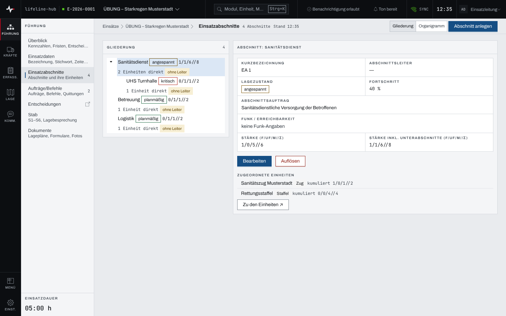
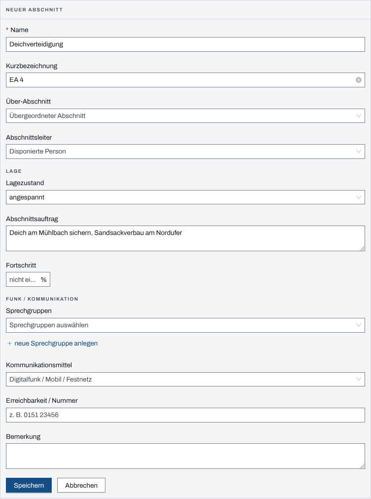
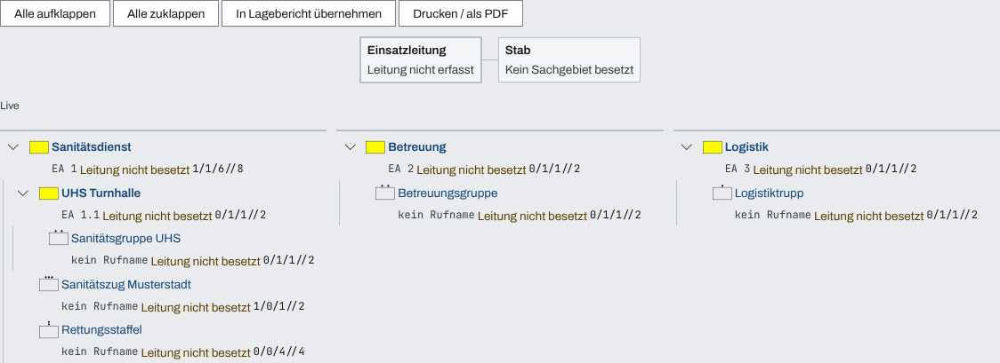

## Überblick

„Einsatzabschnitte“ gliedert den Einsatz räumlich oder nach Aufgaben. Jeder Abschnitt trägt
Leitung, Lage, Auftrag, Funkangaben und die Einheiten, die ihm zugeordnet sind; Abschnitte lassen
sich unterteilen. Die Seite hat zwei Ansichten: die „Gliederung“ zum Pflegen und das
„Organigramm“, das die Führungsorganisation des Einsatzes zeigt, druckt und in einen Lagebericht
übernimmt. Lesen können alle Mitglieder des Einsatzes, pflegen dürfen Einsatzleitung und
Führungspersonal.

## Abläufe

### Einen Abschnitt nachsehen

1. „Einsatzabschnitte“ öffnen. Die „Gliederung“ zeigt den Baum der Abschnitte mit Lage, Stärke,
   Zahl der direkt zugeordneten Einheiten und dem Hinweis „ohne Leiter“.
2. Einen Abschnitt wählen. Rechts stehen seine Angaben und die „Zugeordneten Einheiten“.

   

3. „Zu den Einheiten ↗“ führt zur Seite der Einheiten.

### Einen Abschnitt anlegen

1. Im Seitenkopf „Abschnitt anlegen“ wählen.
2. „Name“ eintragen, bei Bedarf „Kurzbezeichnung“ und den „Über-Abschnitt“ für einen
   Unterabschnitt.
3. Unter „Lage“ „Lagezustand“, „Abschnittsauftrag“ und „Fortschritt“ eintragen, unter „Funk /
   Kommunikation“ die Sprechgruppen, das Kommunikationsmittel und die „Erreichbarkeit / Nummer“.

   

4. „Speichern“ wählen.

Fehlt eine Sprechgruppe in der Liste, legt „neue Sprechgruppe anlegen“ sie für diesen Einsatz an
(„Neue Bezeichnung“, „Neue Betriebsart“, dann „Anlegen“). Sie trägt danach den Zusatz „(lokal)“.

### Einen Abschnitt ändern oder auflösen

1. In der Gliederung den Abschnitt wählen und „Bearbeiten“ wählen.
2. Die Angaben ändern und „Speichern“ wählen.
3. Zum Auflösen „Auflösen“ wählen und die Rückfrage „Abschnitt auflösen?“ mit „Abschnitt
   auflösen“ bestätigen.

Einheiten werden nicht hier zugeordnet, sondern an der Einheit selbst im Feld „Abschnitt“.

### Das Organigramm ansehen, drucken oder übernehmen

1. In der Leiste „Ansicht“ „Organigramm“ wählen.

   

2. Mit „Alle aufklappen“ und „Alle zuklappen“ die Tiefe wählen; ein Name führt zu seinem
   Datensatz.
3. „Drucken / als PDF“ druckt das Organigramm. „In Lagebericht übernehmen“ legt einen
   Lagebericht „Führungsorganisation …“ mit dem heutigen Stand an und öffnet ihn.

## Hintergrund

### Wer was darf

Abschnitte anlegen, ändern und auflösen dürfen Einsatzleitung und Führungspersonal, solange der
Einsatz läuft. „In Lagebericht übernehmen“ erscheint nur für sie und nur, wenn das Modul
Lageberichte freigegeben ist. Den Stab zeigt das Organigramm nur, wenn das Modul Stab freigegeben
ist. Einzelheiten stehen in [Rechte im Einsatz](rechte-im-einsatz.md).

### Was ins Einsatztagebuch geht

- Anlegen: „Abschnitt «…» angelegt“, mit Lagezustand, wenn einer gesetzt ist.
- Ein geänderter Lagezustand: „Lage Abschnitt «…»: alt → neu“.
- Auflösen: „Abschnitt «…» aufgelöst“. Ein Gerät, das an den Abschnitt gekoppelt war, verliert
  dabei seinen Zugriff; auch das steht im Einsatztagebuch.
- Andere Korrekturen und die Zuordnung von Sprechgruppen schreiben keinen Eintrag.

### Regeln der Gliederung

- Die „Kurzbezeichnung“ ist höchstens 20 Zeichen lang und je Einsatz eindeutig, ohne Rücksicht auf
  Groß- und Kleinschreibung; eine doppelte meldet „Schon vergeben (…)“.
- Beim Auflösen rücken Unterabschnitte eine Ebene hoch, zugeordnete Einheiten stehen danach
  „nicht zugeordnet“.
- Die „Stärke“ eines Abschnitts ergibt sich aus seinen Einheiten; „Stärke inkl.
  Unterabschnitte“ nimmt die der Unterabschnitte hinzu.

### Das Organigramm

Das Organigramm wird nicht gepflegt, es entsteht aus Abschnitten, Einheiten und der Besetzung des
Stabs. Den Kasten der Einsatzleitung beschriftet es mit „Leitung nicht erfasst“, weil die App die
Person der Einsatzleitung nicht als Angabe führt. An der Wurzel steht keine Stärke; die
Gesamtstärke zeigt das Meldebild.

### Führungsfunktionen

Wo die App eine Führungsfunktion anbietet (etwa als Führungsstelle eines Mitglieds, als Empfänger
eines Auftrags oder im Feld „An“ des Einsatztagebuchs), kommt sie aus einem festen Katalog:
Einsatzleitung, S1 bis S7, Führungshilfspersonal und Fachberater. Die Bezeichnungen und ob es S7
gibt, legt die Organisation fest. Ein Freitext wie „S3“ wird nie als Funktion gedeutet. Gespeichert
wird die Funktion, nicht die Person; wer sie besetzt, zeigt die App erst beim Lesen.

### Ohne Netz

Abschnitte und Einheiten bleiben ohne Netz lesbar (siehe [Arbeiten ohne Netz](ohne-netz.md)).
Anlegen, Ändern und Auflösen brauchen Netz.

## Grundlagen und Quellen

- FwDV 100: Führungsorganisation, dargestellt als Organigramm.
