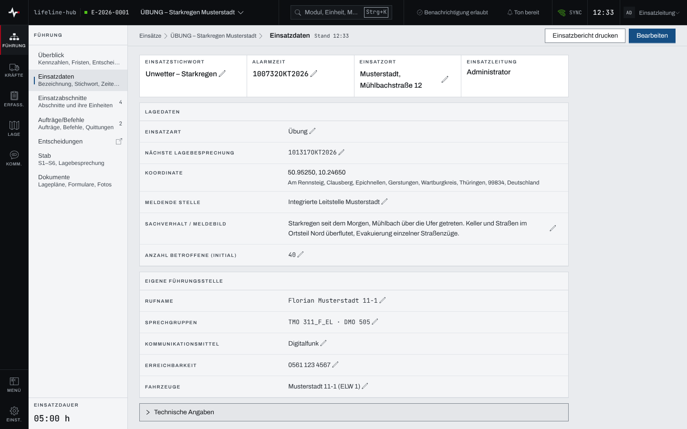
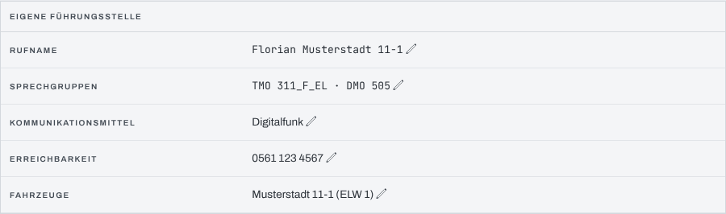

## Überblick

Die Seite „Einsatzdaten“ hält die Stammangaben des Einsatzes: die Kopfleiste mit Stichwort,
Alarmzeit, Einsatzort und Einsatzleitung, darunter die „Lagedaten“, die „Eigene Führungsstelle“
und den „Zugriff“ auf den Einsatz. Lesen können alle Mitglieder des Einsatzes. Ändern dürfen
Einsatzleitung und Führungspersonal sowie die Administration der Organisation, der der Einsatz
gehört. Den Zugriff verwaltet nur die Einsatzleitung.

## Abläufe

### Eine Angabe ändern

1. „Einsatzdaten“ öffnen.

   

2. Den Wert der Zeile wählen (Stift daneben) oder, wenn die Zeile leer ist, „… eintragen“.
3. Den neuen Wert eingeben.
4. Mit Enter oder „Speichern“ übernehmen. Escape oder „Abbrechen“ verwirft die Eingabe. Die App
   meldet „… gespeichert“.

So lassen sich Einsatzstichwort, Alarmzeit, Einsatzort, Einsatzart, Nächste Lagebesprechung,
Meldende Stelle, Sachverhalt / Meldebild und Anzahl Betroffene (initial) ändern.

### Alle Angaben auf einmal bearbeiten

1. Im Seitenkopf „Bearbeiten“ wählen. Es öffnet sich „Einsatzdaten bearbeiten“.
2. Die Felder ändern. Nur hier lassen sich auch „Bezeichnung“ und „Koordinate“ ändern. Die
   Koordinate nimmt mehrere Formate an („Koordinatenformat“).
3. „Speichern“ wählen.

### Die eigene Führungsstelle erfassen

1. In „Einsatzdaten“ zum Paneel „Eigene Führungsstelle“ gehen.

   

2. „Rufname“, „Sprechgruppen“, „Kommunikationsmittel“, „Erreichbarkeit“ und „Fahrzeuge“ Zeile
   für Zeile eintragen und speichern wie jede andere Angabe.

### Ein Mitglied hinzufügen

Für die Einsatzleitung:

1. Im Paneel „Zugriff“ unter „Benutzer …“ die Person wählen.
2. Daneben die Rolle wählen (Vorgabe „Führungspersonal“).
3. „Hinzufügen“ wählen.

Die Rolle eines Mitglieds lässt sich in der Tabelle direkt ändern. „Entfernen“ fragt mit
„Mitglied entfernen?“ nach.

### Die Führungsstelle eines Mitglieds festlegen

Für die Einsatzleitung:

1. Im Paneel „Zugriff“ in der Spalte „Führungsstelle“ „Führungsstelle festlegen“ oder den
   bisherigen Wert wählen.
2. Im Dialog eine Funktion aus der Liste wählen oder einen Freitext eingeben.

   

3. „Speichern“ wählen.

## Hintergrund

### Wer was darf

- **Angaben und eigene Führungsstelle** ändern Einsatzleitung und Führungspersonal sowie die
  Administration der Organisation des Einsatzes, solange der Einsatz läuft. Wer das nicht darf,
  sieht den Hinweis „nur Einsatzleitung, Führungspersonal oder Org-Admin“.
- **Zugriff** (Mitglieder, Rollen, Führungsstelle je Mitglied) verwaltet nur die
  Einsatzleitung. Die letzte Einsatzleitung lässt sich weder herabstufen noch entfernen
  („Gesperrt: letzte Einsatzleitung“).
- Was die Rollen im Einzelnen bedeuten, steht in [Rechte im Einsatz](rechte-im-einsatz.md).

### Die Auswahl „Benutzer …“

Die Liste der Personen füllt sich nur für die Administration des Systems. Für alle anderen bleibt
sie leer und zeigt „Benutzerliste nur für Admins“. Eine Einsatzleitung ohne dieses Recht kann
deshalb zurzeit keine Mitglieder hinzufügen und bittet die Administration darum.

### Was eine Änderung bewirkt

- Jede Zeile speichert nur ihren eigenen Wert, das Formular „Bearbeiten“ nur die geänderten
  Felder. Wer eine Zeile verlässt, ohne zu speichern, behält den alten Wert.
- Änderungen an Angaben und eigener Führungsstelle erscheinen sofort an allen anderen Geräten. Sie
  schreiben keinen Eintrag ins Einsatztagebuch.
- Die „Einsatznummer“ unter „Technische Angaben“ vergibt das System; sie lässt sich nicht ändern.
- Die **eigene Führungsstelle** speist Funkplan, Fernmeldeskizze und Kommunikationsplan (siehe
  [Funkplan, Fernmeldeskizze und Kommunikationsplan](funkplan.md)); dort wird sie nicht
  bearbeitet. „Fahrzeuge“ bietet nur disponierte Fahrzeuge an und nur, wenn das Modul Fahrzeuge
  freigegeben ist.
- Die **Führungsstelle eines Mitglieds** ist der erste Vorschlag, wenn das Einsatztagebuch die
  Person nach ihrem Rufnamen fragt, noch vor ihrem eigenen Sachgebiet im Stab.

### Ohne Netz

Die Angaben des Einsatzkopfs bleiben ohne Netz lesbar, Zugriff und eigene Führungsstelle nicht
(siehe [Arbeiten ohne Netz](ohne-netz.md)).
