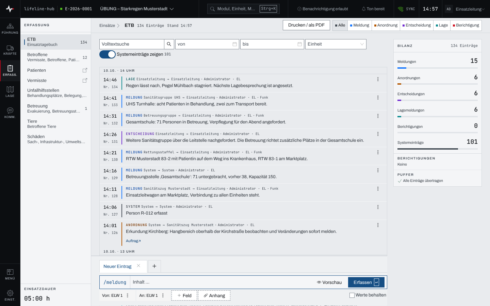
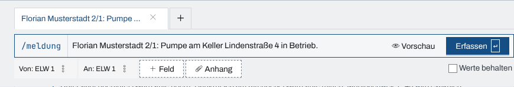
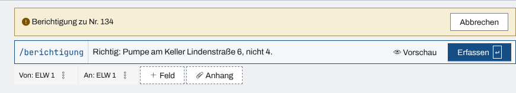
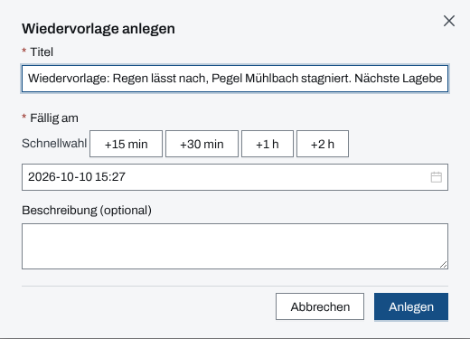

## Überblick

Das Einsatztagebuch (ETB) ist die fortlaufende Niederschrift des Einsatzes. Jeder Eintrag trägt
eine laufende Nummer, die Ereigniszeit, einen Typ („Meldung“, „Anordnung“, „Lage“ oder
„Entscheidung“), „Von“ und „An“ sowie den Inhalt. Die Zeitachse zeigt den neuesten Eintrag oben.

Ein erfasster Eintrag lässt sich weder ändern noch löschen. Ein Fehler wird mit einer
**Berichtigung** korrigiert: einem neuen Eintrag, der auf den alten verweist. Viele Einträge
entstehen von selbst, etwa aus Meldungen, Aufträgen, Befehlen und Nachforderungen oder als
Systemeintrag (Typ „System“), wenn sich Abschnitte, Einheiten oder Gefahren ändern.

Lesen dürfen alle mit Zugang zum Einsatz. Erfassen, Berichtigen und Wiedervorlagen anlegen dürfen
Einsatzleitung und Führungspersonal, solange der Einsatz läuft (siehe
[Rechte im Einsatz](rechte-im-einsatz.md)).

## Abläufe

### Das Tagebuch lesen

1. Im Einsatz das Modul „ETB“ öffnen.

   

2. Die Zeitachse von oben nach unten lesen; „Ältere laden“ am Ende holt frühere Einträge.
3. Sind seit dem letzten Besuch Einträge hinzugekommen, steht darüber ein Hinweis wie „14 neue
   Einträge seit Ihrer letzten Sichtung um 13:04“. „alle als gesichtet markieren“ setzt die
   Lesemarke auf den neuesten Eintrag.

Die Seitenleiste „Bilanz“ zählt die Einträge nach Typ und nennt die jüngsten Berichtigungen; ist
ein Filter gesetzt, heißt sie „Bilanz im Filter“.

### Einen Eintrag erfassen

Für Einsatzleitung und Führungspersonal:

1. In der Erfassungsleiste am Fuß der Seite den Text in das Feld „Inhalt …“ schreiben.

   

2. Den Typ prüfen: Der Knopf links (zum Beispiel „/meldung“) wechselt ihn. Schneller geht es
   mit einem Schrägstrich am Zeilenanfang, etwa „/anordnung“ oder „/lage“.
3. „Von“ und „An“ prüfen. Beide sind mit dem persönlichen Standard-Rufnamen vorbelegt. Das Menü
   eines Chips bietet „Nur für diesen Eintrag ändern“ und „Standard-Rufname ändern“; ein „@“ im
   Text setzt ebenfalls einen Rufnamen ein.
4. „Erfassen“ wählen oder Enter drücken. Auf einem Touch-Gerät erfasst erst Strg+Enter (⌘+Enter
   am Mac); Enter allein beginnt dort eine neue Zeile.

Inhalt, „Von“ und „An“ sind Pflicht. Ist noch kein Standard-Rufname gesetzt, fragt die
Erfassungsleiste zuerst danach. „Vorschau“ zeigt den Eintrag so, wie er in der Zeitachse
erscheinen wird.

### Felder, Bausteine und Werte setzen

1. In der Erfassungsleiste „+ Feld“ wählen oder einen Schrägstrich mitten im Text tippen.
2. Ein Feld wählen: „Ereigniszeit“ (für einen Nachtrag), „Von“, „An“, „Meldeweg“ (Funk, Telefon,
   Persönlich, Sonstige) oder „Veranlassung“. Darunter stehen die Textbausteine der Organisation.
3. Den Wert eintragen und den Eintrag wie gewohnt erfassen.
4. Wer mehrere Einträge vom selben Absender hintereinander erfasst, setzt das Häkchen „Werte
   behalten“: „Von“, „An“ und „Meldeweg“ bleiben dann nach dem Erfassen stehen.

Die Chips „Von“ und „An“ bieten eine Buchstabierhilfe mit den Tafeln „Deutsch“ und „NATO“. Bei
Typ „Lage“ führt der Verweis „Als strukturierten Lagebericht erfassen →“ zu den Lageberichten
([Lageberichte](lageberichte.md)).

### Eine Datei anhängen

Für Einsatzleitung und Führungspersonal, nur mit Verbindung:

1. In der Erfassungsleiste „Anhang“ wählen und eine oder mehrere Dateien aussuchen.
2. Den Inhalt schreiben; ein Eintrag nur aus Dateien geht nicht.
3. „Erfassen“ wählen. Erst jetzt werden die Dateien hochgeladen und mit dem Eintrag verbunden.

Ein Eintrag trägt höchstens zehn Dateien zu je höchstens 25 MiB. Ohne Netz steht neben „Anhang“
„offline“. Scheitert das Hochladen einer Datei, wird der Eintrag nicht erfasst, und die Leiste
nennt den Grund.

### Mit mehreren Entwürfen arbeiten

1. Über der Erfassungsleiste „+“ („Weiteren Entwurf anlegen“) wählen. Neben „Neuer Eintrag“
   entsteht ein zweiter Reiter.
2. Zwischen den Reitern wechseln; jeder behält Text, Felder und Anhänge.
3. Einen Entwurf mit dem ✕ am Reiter verwerfen. Ein leerer Entwurf verschwindet sofort. Hat er
   Inhalt, warnt die Rückfrage „Entwurf verwerfen?“: „Text, Felder und Anhänge gehen verloren.“
   „Verwerfen“ bestätigt, „Behalten“ bricht ab.

### Einträge suchen und filtern

1. Oben über der Zeitachse einen Typ wählen: „Alle“, „Meldung“, „Anordnung“, „Entscheidung“,
   „Lage“ oder „Berichtigung“.
2. Bei Bedarf in die „Volltextsuche“ tippen, einen Zeitraum mit „von“ und „bis“ setzen oder eine
   Einheit wählen.
3. Mit dem Schalter „Systemeinträge zeigen“ die automatischen Systemeinträge aus- und einblenden;
   die Zahl daneben nennt, wie viele es sind.
4. Passt nichts, führt „Filter zurücksetzen“ zur vollen Liste zurück.

Die Volltextsuche findet Wortanfänge in Inhalt, „Von“, „An“ und „Veranlassung“, ohne auf Groß-
und Kleinschreibung zu achten; bei mehreren Wörtern müssen alle vorkommen. Der Filter steht in der
Adresse der Seite und lässt sich als Link weitergeben. Auf schmalen Bildschirmen liegen die Filter
hinter dem Knopf „Filter“, der die Zahl gesetzter Filter trägt.

### Einen Eintrag berichtigen

Für Einsatzleitung und Führungspersonal:

1. An dem Eintrag das Menü „Aktionen zu Eintrag …“ öffnen und „Berichtigen“ wählen.
2. Die Erfassungsleiste zeigt „Berichtigung zu Nr. …“. Den richtigen Wortlaut schreiben.

   

3. „Erfassen“ wählen. „Abbrechen“ verlässt den Modus ohne Eintrag.

Der alte Eintrag zeigt danach „berichtigt durch Nr. …“, die Berichtigung „berichtigt Nr. …“ mit
dem Verweis „Grundeintrag anzeigen ↗“.

### Eine Wiedervorlage anlegen

Für Einsatzleitung und Führungspersonal:

1. An dem Eintrag das Menü „Aktionen zu Eintrag …“ öffnen und „Wiedervorlage“ wählen.

   

2. Den vorbelegten „Titel“ prüfen.
3. „Fällig am“ setzen; die „Schnellwahl“ bietet +15 min, +30 min, +1 h und +2 h und, wenn
   geplant, die nächste Lagebesprechung.
4. Bei Bedarf eine „Beschreibung (optional)“ schreiben und „Anlegen“ wählen.

Die Wiedervorlage erscheint als Erinnerung (Kapitel [Erinnerungen](erinnerungen.md)) mit einem
Verweis zurück auf den Eintrag.

### Aus einem Eintrag einen Auftrag erteilen

Für Einsatzleitung und Führungspersonal:

1. An dem Eintrag das Menü „Aktionen zu Eintrag …“ öffnen und „Auftrag erteilen“ wählen.
2. Im Dialog „Aus ETB-Eintrag Auftrag erteilen“ den vorbelegten Text prüfen, den Empfänger
   eintragen und den Auftrag erteilen.

Ist das Modul Aufträge im Einsatz nicht freigegeben, steht der Menüpunkt gesperrt als „Auftrag
erteilen (keine Berechtigung)“ da. Wie Aufträge weiterlaufen, beschreibt das Kapitel
[Aufträge und Befehle](auftraege-befehle.md).

## Hintergrund

### Warum nichts geändert werden kann

Das ETB ist ein Beleg. Ein Eintrag bleibt so, wie er erfasst wurde; die Korrektur steht als
eigener, verknüpfter Eintrag daneben. Weicht die Ereigniszeit um mindestens eine Minute vom
Eingang ab, zeigt der Eintrag „⧖ nachgetragen um …“.

### Automatische Einträge

Weitere Module schreiben selbst ins ETB:

- eine Meldung als „Meldung“ mit Absender und Empfänger,
- ein erteilter Auftrag als „Anordnung“, sein Vollzug immer als „Meldung“,
- ein freigegebener Befehl als „Anordnung“ mit dem Befehlstext,
- eine Nachforderung immer als „Meldung“.

Ob Meldungen und erteilte Aufträge einen Eintrag erzeugen, legt in den Einstellungen des
Einsatzes unter „Verhalten & Automatik“ das Feld „Automatische ETB-Einträge“ fest; ohne Angabe gilt die Vorgabe
der Organisation, sonst „An“ ([Einstellungen des Einsatzes und Module](einsatz-einstellungen.md)). Ein
automatischer Eintrag zeigt einen Verweis auf seinen Ursprung, etwa „Auftrag ↗“ oder „Befehl ↗“.

### Entwürfe auf dem Gerät

Entwürfe liegen nur auf dem Gerät, auf dem sie entstanden sind, und gehören der angemeldeten
Person. Beim Abmelden werden sie gelöscht. Ein leerer Entwurf verschwindet nach 24 Stunden ohne
Änderung.

### Ohne Netz

Ohne Verbindung nimmt das ETB Einträge weiter an und merkt sie als „offline vorgemerkt“ vor. Sie
gehen raus, sobald das Netz zurück ist. Lehnt der Server einen vorgemerkten Eintrag ab, steht er
mit „Erneut senden“ und „Verwerfen“ in der Zeitachse. Anhänge gehen nur mit Verbindung. Mehr dazu im
Kapitel [Arbeiten ohne Netz](ohne-netz.md).

### Abgeschlossener Einsatz

Nach dem Abschluss des Einsatzes ist das ETB nur noch lesbar. Abgeschlossen wird in den
Einsatzdaten ([Einsatz abschließen und Einsatzbericht](einsatzabschluss.md)). Drucken lässt sich das ETB
jederzeit, siehe [Drucken und Export](drucken-export.md).

## Grundlagen und Quellen

Die Buchstabierhilfe folgt in der Tafel „Deutsch“ der klassischen deutschen Buchstabiertafel nach
DIN 5009 (Anton, Berta, …) und in der Tafel „NATO“ dem internationalen Funkalphabet (Alfa,
Bravo, …).
