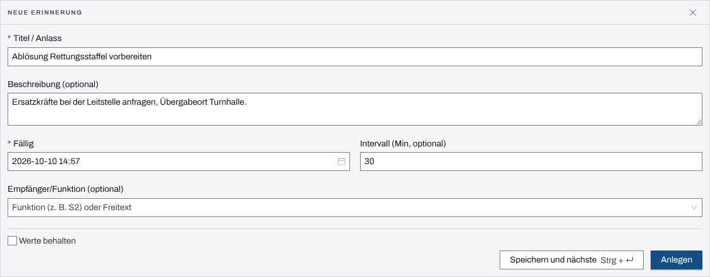
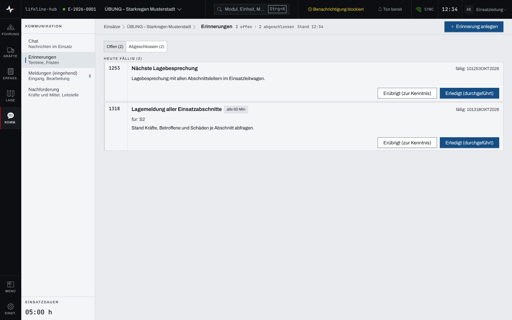

## Überblick

Erinnerungen halten Termine und Fristen im Einsatz fest: die nächste Lagemeldung, eine Ablösung,
eine Rückfrage bei der Leitstelle. Zur fälligen Zeit meldet sich die App. Eine Erinnerung kann
sich in einem festen Abstand wiederholen.

Neben den von Hand angelegten Erinnerungen entstehen automatische: aus Wiedervorlagen im
Einsatztagebuch, aus Sofortmeldungen, aus Fristen an Aufträgen und aus Ablösungen.

Lesen dürfen alle mit Zugang zum Einsatz. Anlegen und Abschließen dürfen Einsatzleitung und
Führungspersonal, solange der Einsatz läuft (siehe [Rechte im Einsatz](rechte-im-einsatz.md)).

## Abläufe

### Eine Erinnerung anlegen

Für Einsatzleitung und Führungspersonal:

1. Im Einsatz „Erinnerungen“ öffnen und „Erinnerung anlegen“ wählen.
2. Im Formular „Neue Erinnerung“ den „Titel / Anlass“ eintragen, bei Bedarf eine „Beschreibung
   (optional)“.

   

3. Unter „Fällig“ den Zeitpunkt setzen; vorbelegt ist jetzt.
4. Für eine wiederkehrende Erinnerung unter „Intervall (Min, optional)“ den Abstand in Minuten
   eintragen, höchstens 10 080 (sieben Tage).
5. Bei Bedarf unter „Empfänger/Funktion (optional)“ eine Funktion wählen (zum Beispiel S2) oder
   einen Namen eintippen.
6. „Anlegen“ wählen.

„Speichern und nächste“ (Strg+Enter, am Mac ⌘+Enter) legt an und leert das Formular. Mit dem
Häkchen „Werte behalten“ bleiben Empfänger und Intervall stehen.

### Erinnerungen abarbeiten

1. In den Erinnerungen die Ansicht „Offen“ wählen. Die Erinnerungen stehen in den Gruppen
   „Überfällig“, „Heute fällig“ und „Später“.

   

2. Ist die Sache getan, „Erledigt (durchgeführt)“ wählen.
3. Hat sie sich auf anderem Weg erledigt, „Erübrigt (zur Kenntnis)“ wählen.

Beide Knöpfe wirken mit einem Klick; ein Hinweis bietet sechs Sekunden lang „Rückgängig“. Die
Ansicht „Abgeschlossen“ zeigt, wann eine Erinnerung erledigt oder erübrigt wurde.

### Auf eine fällige Erinnerung reagieren

1. Zur fälligen Zeit erscheint der Hinweis „Erinnerung fällig“, dazu eine Mitteilung des
   Betriebssystems, sofern der Browser sie erlaubt.
2. „Öffnen“ führt zu den Erinnerungen; die fällige Karte trägt „fällig“.
3. Die Erinnerung wie oben erledigen oder erübrigen.

## Hintergrund

### Wiederkehrende Erinnerungen

Eine Erinnerung mit Intervall trägt an der Karte „alle … Min“. Ist sie fällig, meldet sie sich
und rückt auf den nächsten Termin vor; sie bleibt offen, bis jemand sie erledigt oder erübrigt.
Verpasste Termine, etwa weil der Server aus war, holt die App nicht einzeln nach, sondern springt
auf den nächsten Termin nach jetzt.

### Automatische Erinnerungen

Einige Erinnerungen legt die App selbst an; sie tragen „automatisch“ und einen Verweis auf ihren
Anlass, etwa „↗ Auftrag #…“, „↗ Meldung #…“ oder „↗ Ablösung #…“:

- „Sofortmeldung #… unbestätigt“ zu einer Sofortmeldung (Kapitel [Meldungen](meldungen.md)),
- „Auftrag #… Quittierfrist“ zu einem Auftrag mit Frist (Kapitel
  [Aufträge und Befehle](auftraege-befehle.md)),
- Hinweise zu fälligen Ablösungen ([Ablösung](abloesung.md)).

Sie schließen sich selbst, wenn ihr Anlass erledigt ist, etwa wenn die Sofortmeldung bestätigt
ist oder alle Empfänger den Auftrag quittiert haben.

Eine Wiedervorlage aus dem Einsatztagebuch ist eine gewöhnliche Erinnerung mit Verweis auf den
ETB-Eintrag (siehe [Einsatztagebuch](einsatztagebuch.md)).
