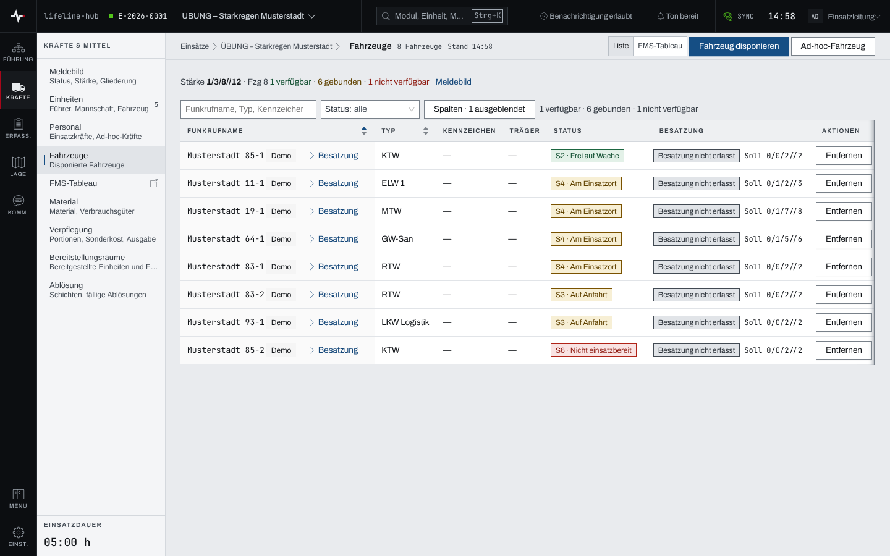
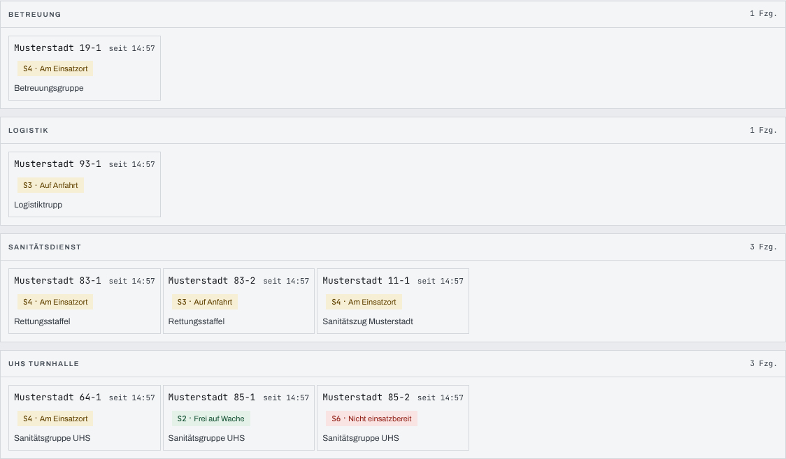
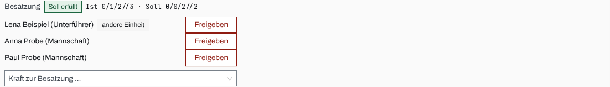

## Überblick

Das Modul **Fahrzeuge** führt alle Fahrzeuge, die im Einsatz disponiert sind, aus dem Fahrzeugstamm
der Organisation oder ad hoc erfasst. Je Fahrzeug stehen Funkrufname, Typ, Kennzeichen, Träger,
FMS-Status und Besatzung.

Zwei Ansichten zeigen dieselben Fahrzeuge: die **Liste** zum Pflegen und Vergleichen und das
**FMS-Tableau** als Überblick über die ganze Flotte, in dem sich der Status mit einem Klick oder
einer Ziffer setzen lässt. Disponieren, Status setzen und Besatzung zuordnen dürfen Einsatzleitung
und Führungspersonal.

## Abläufe

### Die Fahrzeugliste lesen

1. Unter „Kräfte & Mittel“ „Fahrzeuge“ öffnen; oben rechts steht die Ansicht „Liste“.
2. Je Fahrzeug „Status“ und „Besatzung“ lesen. Die Besatzung steht als Urteil, etwa „Besatzung nicht
   erfasst“ oder „Soll erfüllt“, daneben Ist- und Soll-Stärke.

   

3. In „Funkrufname, Typ, Kennzeichen“ suchen oder unter „Status“ eine Kategorie wählen.

### Ein Fahrzeug disponieren

Für Einsatzleitung und Führungspersonal:

1. „Fahrzeug disponieren“ wählen.
2. Unter „Fahrzeug“ ein Fahrzeug aus dem Stamm wählen.
3. „Disponieren“ wählen, oder „Speichern und nächste“ für das nächste Fahrzeug.

Steht ein Fahrzeug nicht im Stamm, etwa ein Fahrzeug einer Nachbarwehr:

1. „Ad-hoc-Fahrzeug“ wählen.
2. „Funkrufname“ eingeben, bei Bedarf „Fahrzeugtyp“, „Trägerorganisation“, „Kennzeichen“ und unter
   „Weitere Angaben“ die „OPTA“.
3. „Disponieren“ wählen. Mit „Speichern und nächste“ und „Werte behalten“ bleiben Trägerorganisation
   und Fahrzeugtyp für das nächste Fahrzeug stehen.

### Den FMS-Status im Tableau setzen

Für Einsatzleitung und Führungspersonal:

1. In „Fahrzeuge“ die Ansicht „FMS-Tableau“ wählen, oder in der Seitenleiste „FMS-Tableau“.
2. Die Kacheln stehen nach Abschnitt und Einheit geordnet, nie nach Status. Jede nennt Funkrufname,
   Status, „seit“ wann er gilt und die Einheit.

   

3. Den Status einer Kachel anklicken und den neuen Status wählen. Schneller mit der Tastatur: mit
   der Tabulatortaste auf die Kachel gehen und die FMS-Ziffer tippen, etwa „4“ für „S4 · Am
   Einsatzort“.

In der Liste setzt die Spalte „Status“ den Status auf dieselbe Weise.

### Die Besatzung eines Fahrzeugs zuordnen

Für Einsatzleitung und Führungspersonal:

1. In der Liste beim Fahrzeug „Besatzung“ aufklappen.
2. Unter „Kraft zur Besatzung …“ eine Person wählen. Sie steht sofort in der Besatzung.

   

3. Mit „Freigeben“ eine Person wieder von der Besatzung lösen.

### Ein Fahrzeug aus dem Einsatz entfernen

Für Einsatzleitung und Führungspersonal:

1. In der Zeile des Fahrzeugs „Entfernen“ wählen.
2. Die Rückfrage „Aus Einsatz entfernen?“ mit „Aus Einsatz entfernen“ bestätigen.

## Hintergrund

### Wer zur Auswahl steht

„Fahrzeug disponieren“ bietet die Fahrzeuge des Fahrzeugstamms an, die in Dienst stehen und noch
nicht im Einsatz sind. Ad-hoc-Fahrzeuge gibt es nur im Einsatz.

### FMS-Status und Ziffern

Die Statuswerte pflegt die Organisation im Statuskatalog der Stammdaten. Ein Wert mit „FMS-Anker“
trägt seine Ziffer als Code („S3 · Auf Anfahrt“); nur er lässt sich im Tableau per Ziffer setzen.
Ist eine Ziffer keinem oder mehreren Statuswerten zugeordnet, meldet das Tableau das und ändert
nichts. Mit Strg, ⌘ oder Alt ist eine Ziffer kein Statuswechsel.

### Besatzung und Einheit

Die Besatzung ist unabhängig von der Einheit: eine Person kann auf einem Fahrzeug sitzen, das zu
einer anderen Einheit gehört; die Marke „andere Einheit“ zeigt das an. Eine Person sitzt höchstens
auf einem Fahrzeug; „Kraft zur Besatzung …“ bietet nur Personen an, die noch auf keinem Fahrzeug
sitzen. Das Soll der Besatzung kommt aus der Stärke im Fahrzeugstamm; ein Ad-hoc-Fahrzeug hat
keines. „Besatzung nicht erfasst“ heißt: keine Person zugeordnet, das Personal läuft dann oft nur
über die Einheit. Einer Einheit wird ein Fahrzeug im Modul [Einheiten](einheiten.md) zugeordnet.

### Status der Einheit und Zeitachse

Aus dem Status ihrer Fahrzeuge leitet sich der Status der Einheit im Meldebild ab. Trägt ein
Statuswert im Katalog eine Zeitachsen-Marke, schreibt der Wechsel auch die Kräfte-Zeitachse der
Einheit (Kapitel [Meldebild und Kräfte-Zeitachse](meldebild.md)).

### Entfernen

Ein entferntes Fahrzeug verlässt den Einsatz; seine Besatzung bleibt als Personal im Einsatz, nur
ohne Fahrzeug.

### Einsatztagebuch

Disponieren, jeder Statuswechsel, das Zuordnen und Freigeben der Besatzung und das Entfernen stehen
im Einsatztagebuch.

### Rechte und ohne Netz

Lesen darf, wer das Modul Fahrzeuge sieht; beide Ansichten stehen auch ohne Schreibrecht offen.
Disponieren, Status setzen, Besatzung zuordnen und entfernen dürfen Einsatzleitung und
Führungspersonal, solange der Einsatz läuft (Kapitel [Rechte im Einsatz](rechte-im-einsatz.md)).
Ohne Netz bleibt die Liste mit dem zuletzt geladenen Stand lesbar; ändern lässt sich nichts (Kapitel
[Ohne Netz](ohne-netz.md)).
