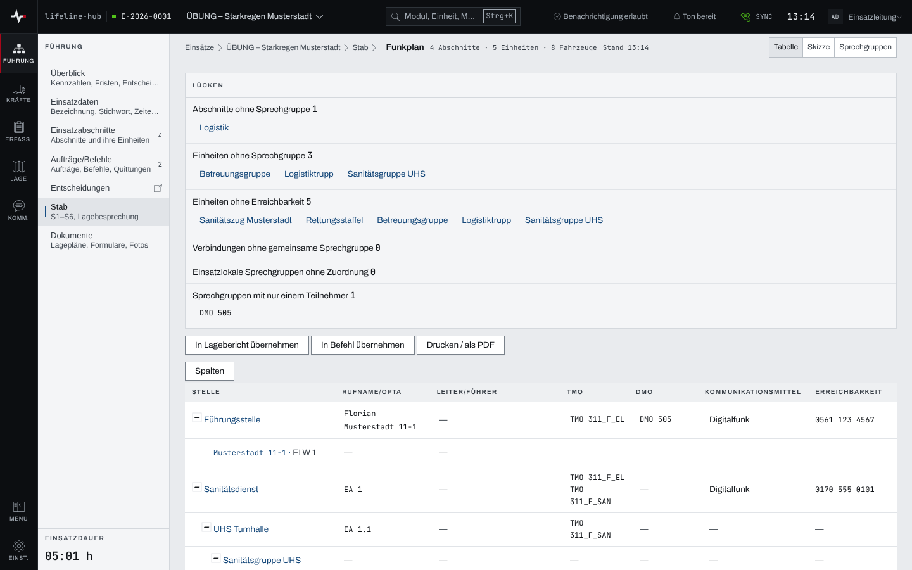
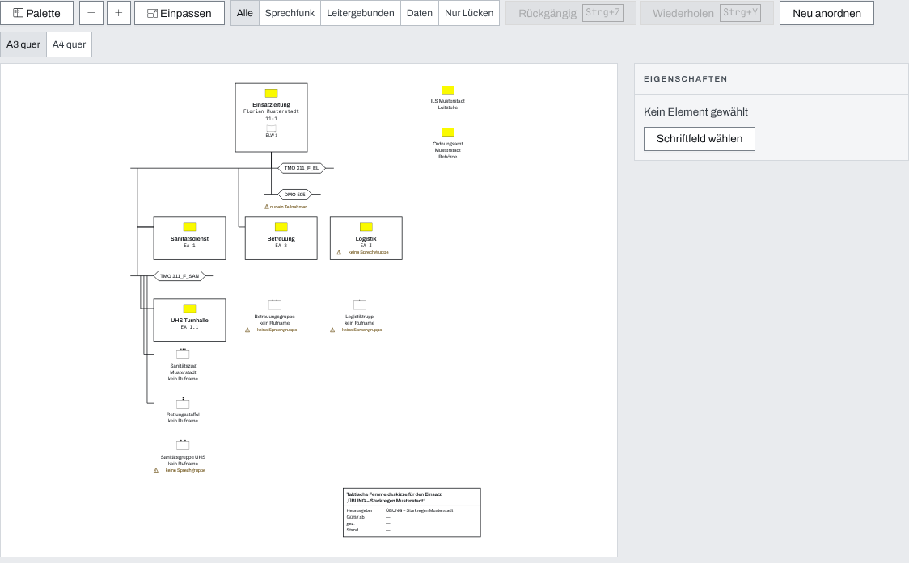
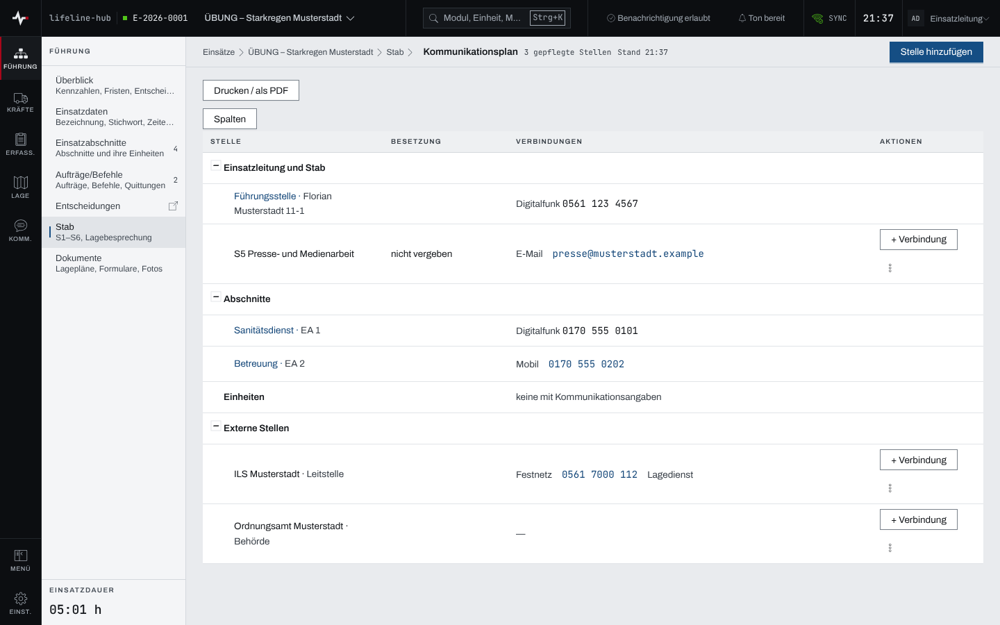
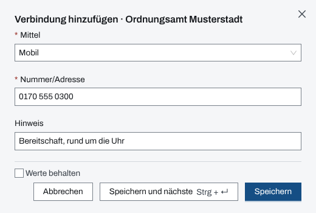

## Überblick

Für das Sachgebiet S6 gibt es zwei Seiten unter „Stab“. Der **Funkplan** zeigt, wer im Einsatz
über welche Sprechgruppen und Wege erreichbar ist, als Tabelle, als taktische
**Fernmeldeskizze** oder als Liste der Sprechgruppen, und nennt die Lücken. Der
**Kommunikationsplan** sammelt die Verbindungen zu Stellen außerhalb der Gliederung, etwa zur
Leitstelle oder zu Behörden. Lesen können alle Mitglieder des Einsatzes, pflegen dürfen
Einsatzleitung und Führungspersonal.

## Abläufe

### Den Funkplan lesen und Lücken schließen

1. „Stab“ öffnen und in der Zeile S6 „Funkplan“ wählen.
2. In der Leiste „Darstellung“ „Tabelle“ wählen. Oben stehen die „Lücken“, darunter der Plan von
   der Führungsstelle über die Abschnitte bis zu Einheiten und Fahrzeugen.

   

3. Einen Namen in den Lücken oder im Plan wählen. Er führt zum Datensatz, an dem die Angabe
   fehlt: Abschnitt, Einheit oder, bei der eigenen Führungsstelle, „auf Einsatzdaten erfassen“.
4. Dort Sprechgruppen, Kommunikationsmittel und Erreichbarkeit eintragen. Der Funkplan zeigt die
   Änderung sofort.

### Den Funkplan weitergeben

1. Im Funkplan „Drucken / als PDF“ wählen, um ihn zu drucken.
2. „In Lagebericht übernehmen“ legt einen Lagebericht „Funkplan …“ mit dem heutigen Stand an.
3. „In Befehl übernehmen“ legt einen Befehl an, in dem der Funkplan unter „Führung und
   Kommunikation“ steht.

### Die Fernmeldeskizze bearbeiten

1. Im Funkplan in der Leiste „Darstellung“ „Skizze“ wählen.

   

2. Ein Element wählen. Rechts unter „Eigenschaften“ stehen seine Angaben; über das Menü des
   Elements stehen „Verbinden mit …“, „zum Datensatz ↗“, „Lösen“ und „Entfernen“ bereit.
3. Über „Palette“ eine „Externe Stelle“, eine „Komponente“ oder einen „Bereich“ anlegen oder eine
   Sprechgruppe auf die Fläche ziehen.
4. Mit „Ebenen“ nur Sprechfunk, leitergebundene Wege, Daten oder nur Lücken zeigen; „Einpassen“
   holt die ganze Skizze ins Bild.
5. Mit „Rückgängig“ (Strg+Z) und „Wiederholen“ (Strg+Y) Schritte zurücknehmen; „Neu anordnen“
   verwirft alle verschobenen Lagen.
6. Zum Drucken „Papierformat“ wählen („A3 quer“ oder „A4 quer“) und „Drucken / als PDF“.

### Eine Stelle in den Kommunikationsplan aufnehmen

1. „Stab“ öffnen und in der Zeile S6 „Kommunikationsplan“ wählen.

   

2. „Stelle hinzufügen“ wählen.
3. Unter „Art“ „Führungsfunktion“, „Leitstelle“, „Behörde“, „Verbindungsperson“ oder „Sonstige
   Stelle“ wählen, bei einer Führungsfunktion die „Funktion“, sonst die „Bezeichnung“.
4. „Anlegen“ wählen.

### Eine Verbindung erfassen

1. Im Kommunikationsplan bei der Stelle „+ Verbindung“ wählen.
2. Unter „Mittel“ Festnetz, Mobil, Fax, E-Mail, Messenger, Melder oder Sonstiges wählen,
   „Nummer/Adresse“ und bei Bedarf einen „Hinweis“ eintragen.

   

3. „Speichern“ wählen; „Speichern und nächste“ hält den Dialog für die nächste Verbindung offen.

Über das Menü der Zeile lassen sich Verbindungen bearbeiten oder entfernen, die Bezeichnung
ändern und die Stelle entfernen.

## Hintergrund

### Wer was darf

Kommunikationsplan und Fernmeldeskizze pflegen Einsatzleitung und Führungspersonal, solange der
Einsatz läuft. „In Lagebericht übernehmen“ braucht zusätzlich das Modul Lageberichte, „In Befehl
übernehmen“ das Modul Aufträge. Auf schmalen Bildschirmen und ohne Netz ist die Skizze nur
lesbar. Einzelheiten stehen in [Rechte im Einsatz](rechte-im-einsatz.md).

### Eine Wahrheit

Der Funkplan wird nicht eigens gepflegt. Er entsteht aus Abschnitten, Einheiten, Fahrzeugen,
Personal, Sprechgruppen und der eigenen Führungsstelle (siehe
[Einsatzdaten und Führungsstelle](einsatzdaten.md)). Ordnet die Skizze einer Stelle eine
Sprechgruppe zu, schreibt sie das in den Datensatz der Stelle; Funkplan und Skizze zeigen danach
dasselbe. Die Skizze speichert selbst nur Lage, Komponenten, Verbindungen, Bereiche und das
Schriftfeld. Externe Stellen der Skizze sind die des Kommunikationsplans.

Auch im Kommunikationsplan stehen Abschnitte, Einheiten und die eigene Führungsstelle nur
abgeleitet; ihre Angaben pflegt man an ihrem Datensatz, die der Führungsstelle in „Einsatzdaten“
(siehe [Einsatzdaten und Führungsstelle](einsatzdaten.md)). Die Führungsstelle steht dort als
erste Zeile unter „Einsatzleitung und Stab“, sobald sie erfasst ist. Gepflegt werden im
Kommunikationsplan nur Stellen ohne eigenen Datensatz. Jede Führungsfunktion kommt je Einsatz
einmal vor.

### Lücken

Das Paneel „Lücken“ nennt Abschnitte und Einheiten ohne Sprechgruppe, Einheiten ohne
Erreichbarkeit, Verbindungen ohne gemeinsame Sprechgruppe, einsatzlokale Sprechgruppen ohne
Zuordnung, Sprechgruppen mit nur einem Teilnehmer, eine fehlende Verbindung zur Leitstelle und
eine nicht erfasste eigene Führungsstelle. Fehlt eine Quelle, steht „—“ mit Grund statt einer 0.

### Was nicht vorkommt

- Die „Erreichbarkeit“ zeigt die Tabelle am Bildschirm erst bei großer Fensterbreite, im Druck
  immer, im Lagebericht nie.
- Kontaktangaben des Personals stehen nie im Kommunikationsplan; die Besetzung einer Funktion
  steht dort nur als Nebentext.
- Die Skizze zeigt keine Rufnummern und keine Personennamen.
- Weder Funkplan noch Skizze noch Kommunikationsplan schreiben ins Einsatztagebuch. Der
  Kommunikationsplan geht nicht in den Lagebericht; er wird gedruckt.

### Skizze als Anlage

Lagebericht und Befehl können die Fernmeldeskizze mit „Fernmeldeskizze anfügen“ als Bild
mitnehmen. Gedruckt wird die Skizze mit dem Funkplan als Anlage.

### Ohne Netz

Der Kommunikationsplan bleibt ohne Netz lesbar, seine Bedienung ist dann gesperrt. Die eigene
Führungsstelle steht dort ohne Netz als „nicht geladen“. Die Daten der Skizze werden nicht
vorgehalten; der Funkplan nennt sie ohne Netz „nicht geladen“ (siehe
[Arbeiten ohne Netz](ohne-netz.md)).

## Grundlagen und Quellen

- FwDV 100, Anlage 5: Funkplan.
- BBK, „Taktische Zeichen im Bevölkerungsschutz“, Anhang J.5: Fernmeldeskizze.
- DV 800, Nr. 1.5.1.1: Kommunikationsunterlagen im Befehl.
