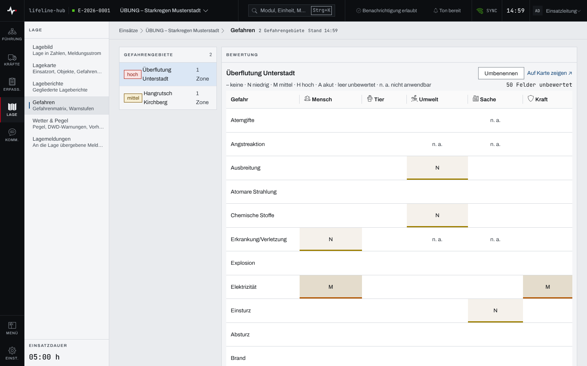
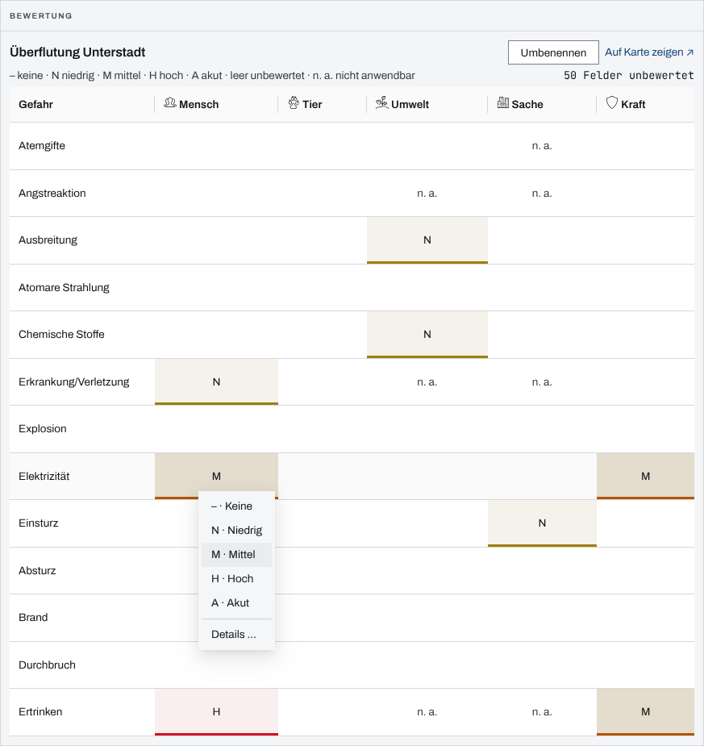
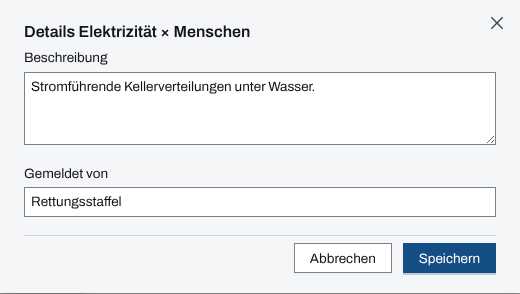

## Überblick

Das Modul „Gefahren“ bewertet je Gefahrengebiet, welche Gefahr welches Schutzobjekt wie stark
bedroht. Die Bewertung ist eine Matrix aus 13 Gefahrentypen und fünf Schutzobjekten. Aus ihr
ergibt sich die Warnstufe des Gebiets, die Lagekarte, Lagebild und Überblick zeigen. Die Gebiete
selbst entstehen auf der Lagekarte; bewertet und benannt werden sie hier.

## Abläufe

### Gefahrengebiete ansehen

1. Im Bereich „Lage“ „Gefahren“ öffnen. Links stehen unter „Gefahrengebiete“ alle Gebiete mit
   ihrer höchsten Warnstufe und der Zahl ihrer Zonen.
2. Ein Gebiet in der Liste wählen. Rechts unter „Bewertung“ steht seine Matrix: je Zeile ein
   Gefahrentyp, je Spalte ein Schutzobjekt, in der Zelle das Kürzel der Warnstufe.

   

3. Um das Gebiet auf der Karte zu sehen, „Auf Karte zeigen ↗“ wählen. Die Lagekarte öffnet sich
   und zeigt das Gebiet.

### Eine Gefahr bewerten

1. Das Gebiet wählen.
2. In der Matrix die Zelle der Gefahr und des Schutzobjekts wählen, etwa „Elektrizität“ in der
   Spalte „Mensch“.

   

3. Im Menü die Stufe wählen: „N · Niedrig“, „M · Mittel“, „H · Hoch“ oder „A · Akut“. Die Zelle
   zeigt sofort das Kürzel.

### Eine Bewertung beschreiben

1. Eine bewertete Zelle wählen und im Menü „Details …“ wählen.
2. Unter „Beschreibung“ festhalten, worin die Gefahr besteht, und unter „Gemeldet von“, wer sie
   gemeldet hat.

   

3. „Speichern“ wählen.

### Ein Gefahrengebiet umbenennen

1. Das Gebiet in der Liste wählen.
2. „Umbenennen“ wählen.
3. Unter „Bezeichnung“ den neuen Namen eingeben und „Speichern“ wählen. Ohne Namen speichert die
   App nichts.

## Hintergrund

### Matrix und Warnstufe

- Die Zeilen sind die 13 Gefahrentypen von „Atemgifte“ bis „Ertrinken“, die Spalten die
  Schutzobjekte Menschen, Tiere, Umwelt, Sachwerte und Einsatzkräfte („Mensch“, „Tier“,
  „Umwelt“, „Sache“, „Kraft“).
- Eine leere Zelle ist unbewertet. Über der Matrix steht, wie viele Felder noch unbewertet sind,
  oder „Alle Felder bewertet“.
- „n. a.“ steht in Zellen, deren Paar nicht anwendbar ist; sie lassen sich nicht bewerten.
- Die höchste Stufe aller Zellen ist die Warnstufe des Gebiets. Sie steht in der Liste, als Text
  an der Fläche auf der Lagekarte und, über alle Gebiete, im Überblick und im Lagebild.
- „– · Keine“ ist eine Bewertung: Die Zelle zeigt „–“ und zählt als bewertet. Eine bewertete
  Zelle wird nicht wieder leer.

### Einsatztagebuch

Jede geänderte Warnstufe schreibt einen Systemeintrag ins Einsatztagebuch, etwa „Gefahr «Elektrizität» für
«Menschen» in «Überflutung Unterstadt» auf Warnstufe «hoch» gesetzt.“; eine auf „Keine“
gesenkte endet mit „… aufgehoben.“ Eine unbewertete Zelle auf „Keine“ zu setzen, schreibt keinen
Eintrag.

### Ein Gebiet anlegen

Ein Gefahrengebiet entsteht durch Zeichnen auf der Lagekarte, mit „Gefahrengebiet zeichnen“
(Kapitel [Lagekarte, Zeichnen und Messen](lagekarte.md)). Gibt es noch keines, zeigt die Seite
„Noch keine Gefahrengebiete“ und, mit Schreibrecht, den Knopf „Gefahrengebiet zeichnen“: Er
öffnet die Lagekarte gleich im Zeichenmodus. Ein Gebiet ohne Bezeichnung heißt
„Gefahrengebiet #…“, bis es umbenannt wird.

### Rechte und ohne Netz

Lesen kann jede Person im Einsatz. Bewerten, beschreiben und umbenennen brauchen das Schreibrecht:
Einsatzleitung oder Führungspersonal in einem laufenden Einsatz (Kapitel
[Rechte im Einsatz](rechte-im-einsatz.md)). Ohne Schreibrecht steht über der Matrix der Grund,
„Umbenennen“ fehlt, und die Zellen lassen sich nicht wählen.

Die Gefahrengebiete hält die App für die Arbeit ohne Netz vor, die Matrix nicht (Kapitel
[Arbeiten ohne Netz](ohne-netz.md)).
