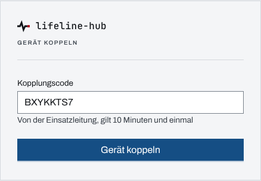
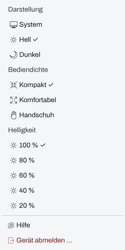
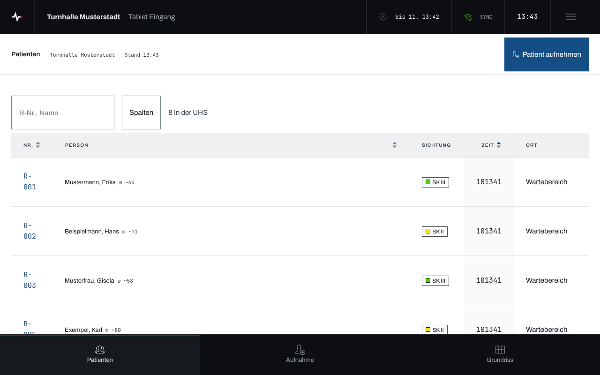
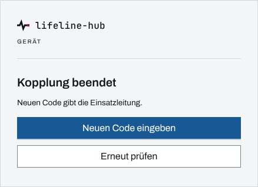

## Überblick

Ein gekoppeltes Gerät arbeitet ohne persönliche Anmeldung für eine Stelle des Einsatzes. Es
zeigt nur seine **Ansicht**: keine Modulleiste, kein Benutzermenü, keine Sprungpalette. Oben steht
die Kopfzeile mit Stelle, Gerät, Ende der Kopplung, Verbindung und Uhr, rechts daneben das
**Gerätemenü**. Unten liegt die Navigation der Ansicht in Daumenreichweite.

Den Code zum Koppeln stellt die Einsatzleitung aus (siehe [Geräte koppeln](geraete-koppeln.md)).
Was die einzelnen Ansichten können, steht in [UHS-Tablet und UHS-Laptop](geraet-uhs.md),
[Betreuungsstelle](geraet-betreuungsstelle.md),
[Bereitstellungsraum](geraet-bereitstellungsraum.md),
[Einsatzabschnitt](geraet-einsatzabschnitt.md), [Verpflegung](geraet-verpflegung.md) und
[Lagemonitor](lagemonitor.md).

## Abläufe

### Gerät mit dem Code koppeln

1. Den QR-Code der Einsatzleitung mit der Kamera des Geräts scannen. Die Seite „Gerät koppeln“
   öffnet sich mit dem Code im Feld „Kopplungscode“. Ohne Kamera die Seite selbst öffnen und den
   Code eintippen.

   

2. „Gerät koppeln“ wählen. Das Gerät öffnet die Startseite seiner Ansicht.

Ist im Browser noch eine Person angemeldet, steht statt des Felds „Abmelden zum Koppeln“. Ist das
Gerät schon gekoppelt, nennt die Seite „Gekoppelt als …. Ein neuer Code ersetzt die Kopplung.“
Ein verbrauchter oder abgelaufener Code endet mit „Dieser Code gilt nicht (mehr). Lass dir bei
der Einsatzleitung einen neuen geben.“

### Kopfzeile lesen

1. Links stehen die Stelle (bei Ansichten ohne Stelle die Ansicht) und die Gerätebezeichnung.
2. Rechts folgen das Ende der Kopplung („bis …“), die Verbindung, die Uhr und das Gerätemenü.

   

In der letzten Stunde vor dem Ende steht „endet …“ hervorgehoben; verlängern kann nur die
Einsatzleitung. Ohne Netz zeigt die Kopfzeile zusätzlich, von wann die angezeigten Daten sind
(„Stand …“).

### Darstellung, Bediendichte und Helligkeit einstellen

1. Oben rechts das „Gerätemenü“ öffnen.

   

2. Unter „Darstellung“ System, Hell oder Dunkel wählen, unter „Bediendichte“ Kompakt,
   Komfortabel oder Handschuh, unter „Helligkeit“ eine Stufe von 100 % bis 20 %. Die aktive Wahl
   trägt ein „✓“.

Ein Tablet mit Touchbildschirm beginnt mit der Bediendichte „Komfortabel“.

### Mit Handschuhen arbeiten

1. Im Gerätemenü unter „Bediendichte“ „Handschuh“ wählen. Zeilen und Bedienziele werden größer.

   

2. Zurück geht es im selben Menü mit „Komfortabel“ oder „Kompakt“.

### Hilfe öffnen

1. Im Gerätemenü „Hilfe“ wählen.
2. „Zum Gerät“ führt zurück auf die Startseite der Ansicht.

### Gerät abmelden

1. Im Gerätemenü „Gerät abmelden …“ wählen.
2. Die Rückfrage „Gerät abmelden?“ („Das Gerät verlässt den Einsatz. Erneut koppeln nur mit
   neuem Code.“) mit „Abmelden“ bestätigen. Das Gerät zeigt wieder die Seite „Gerät koppeln“.

### Nach dem Ende der Kopplung

1. Widerruft die Einsatzleitung die Kopplung oder läuft sie ab, zeigt das Gerät „Kopplung
   beendet“ mit dem Hinweis „Neuen Code gibt die Einsatzleitung.“

   

2. Mit dem neuen Code der Einsatzleitung „Neuen Code eingeben“ wählen und wie oben koppeln.
   „Erneut prüfen“ fragt beim Server nach, ob die Kopplung doch noch besteht.

## Hintergrund

### Was ein gekoppeltes Gerät darf

Ein Gerät ist keine Person. Es arbeitet nur in seinem Einsatz, nur mit seiner Ansicht und, wo
die Ansicht an eine Stelle gebunden ist, nur für diese Stelle. Der Server prüft das bei jeder
Anfrage; eine Adresse außerhalb der Ansicht führt auf deren Startseite. Was das Gerät erfasst,
trägt Stelle und Gerätebezeichnung als Absender.

Ein Widerruf wirkt sofort: Der Server schließt die Verbindung, und das Gerät wechselt ohne
Neuladen auf „Kopplung beendet“.

### Abmelden ist kein Widerruf

„Gerät abmelden …“ beendet nur die Anmeldung dieses Geräts. Die Kopplung selbst bleibt in der
Liste der Einsatzleitung stehen, bis sie abläuft oder widerrufen wird. Hinein kommt das Gerät
nur mit einem neuen Code; den stellt die Einsatzleitung über „Neuen Code ausstellen“ aus.

### Einstellungen am Gerät

Darstellung, Bediendichte und Helligkeit speichert das Gerät selbst. Sie bleiben nach dem Neuladen
und nach dem Abmelden erhalten.

### Ohne Netz

Bricht das Netz ab, zeigt die Kopfzeile den Stand der Daten, und „Kopplung beendet“ heißt dann
„Keine Verbindung“; das Gerät prüft selbst, sobald das Netz zurück ist. Erfassungen merkt das
Gerät vor und sendet sie nach, wie in [Arbeiten ohne Netz](ohne-netz.md) beschrieben. Ein
Lagebild für die Arbeit ohne Netz legt ein gekoppeltes Gerät nicht ab.
