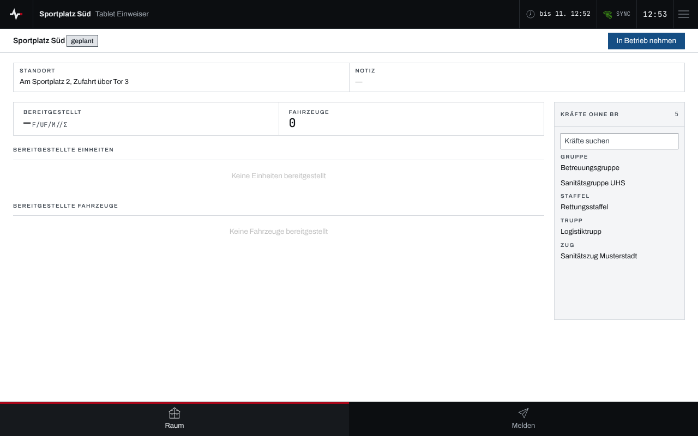
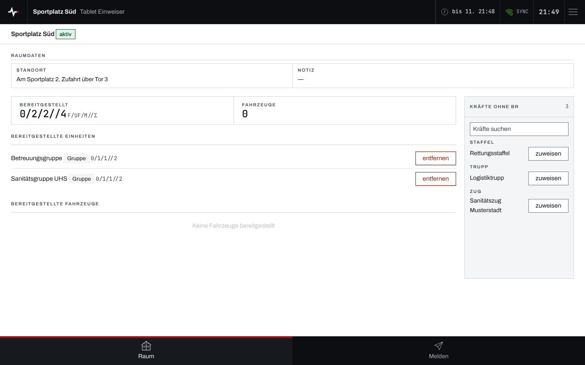
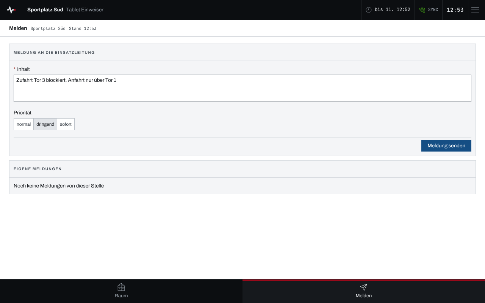

## Überblick

Ein Tablet am **Bereitstellungsraum** führt die Kräfte, die dort bereitstehen: Es meldet
Einheiten und Fahrzeuge an und ab, nimmt einen geplanten Raum in Betrieb und schickt Meldungen an
die Einsatzleitung. Es ist an genau einen Bereitstellungsraum gekoppelt (siehe
[Geräte koppeln](geraete-koppeln.md)) und zeigt nur diesen.

Die Navigation unten führt zu „Raum“ und „Melden“. Die Bedienung des Geräts selbst steht in
[Gerät bedienen](geraet-bedienen.md).

## Abläufe

### Raum in Betrieb nehmen

1. „Raum“ öffnen. Ein Raum, den die Einsatzleitung erst geplant hat, trägt „geplant“.

   

2. Sobald der Raum besetzt ist, „In Betrieb nehmen“ wählen. Der Raum trägt danach „aktiv“.

Im Zustand „geplant“ nimmt der Raum noch keine Kräfte an; die Knöpfe zum Zuweisen fehlen.

### Kräfte anmelden

1. „Raum“ öffnen. Rechts stehen unter „Kräfte ohne BR“ die Einheiten und die Fahrzeuge ohne
   Einheit, die keinem Bereitstellungsraum zugeordnet sind.
2. Bei Bedarf unter „Kräfte suchen“ den Namen eingeben.
3. Bei der eintreffenden Kraft „zuweisen“ wählen. Sie erscheint unter „Bereitgestellte
   Einheiten“ oder „Bereitgestellte Fahrzeuge“; die Kennzahl „Bereitgestellt“ zählt die Stärke
   mit.

   

### Kräfte abmelden

1. „Raum“ öffnen.
2. Bei der Kraft, die den Raum verlässt, „entfernen“ wählen. Sie steht danach wieder unter „Kräfte
   ohne BR“.

### Meldung an die Einsatzleitung

1. Unten „Melden“ wählen.
2. Den „Inhalt“ eingeben und die „Priorität“ (normal, dringend, sofort) wählen.

   

3. „Meldung senden“ wählen. Die Bestätigung lautet „Meldung #… gesendet“; die Meldung steht danach
   unter „Eigene Meldungen“.

## Hintergrund

### Was das Tablet nicht tut

Das Tablet führt nur seinen eigenen Raum. Es legt keinen Raum an, wechselt nicht in einen anderen,
ändert keine Stammdaten, löst den Raum nicht auf und storniert ihn nicht; das bleibt der
Einsatzleitung. Auch an den Einheiten und Fahrzeugen selbst ändert es nichts.

### Absender der Meldungen

Meldungen tragen den Raum und die Gerätebezeichnung als Absender, etwa „Sportplatz Süd · Tablet
Einweiser“.
