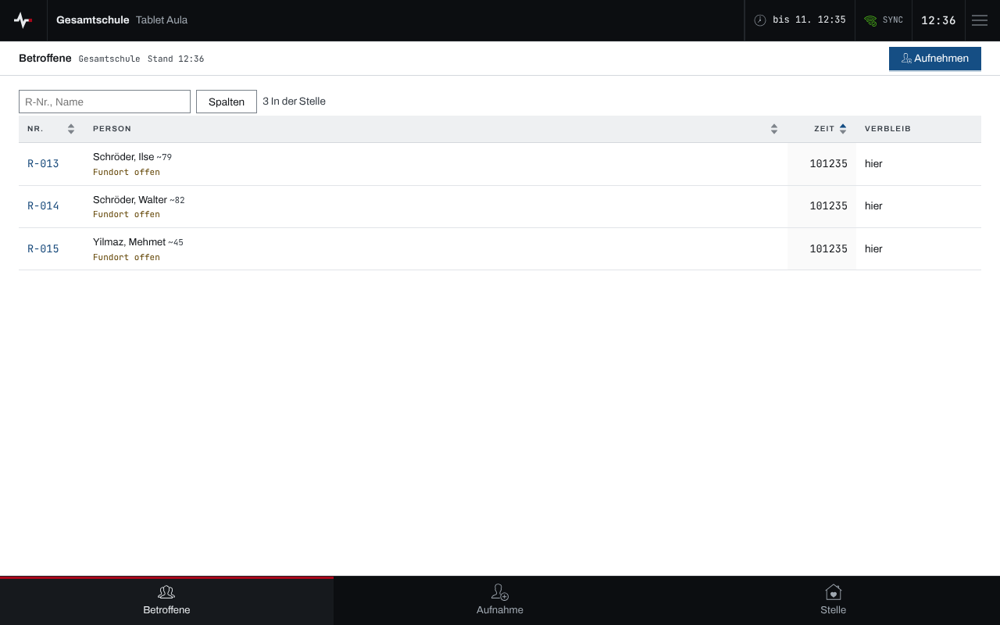
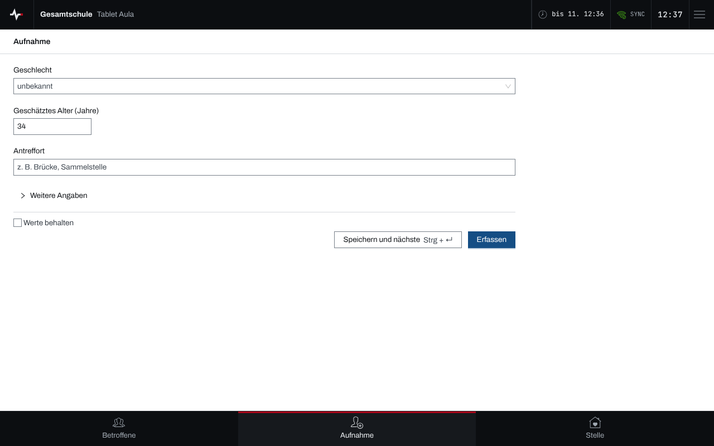
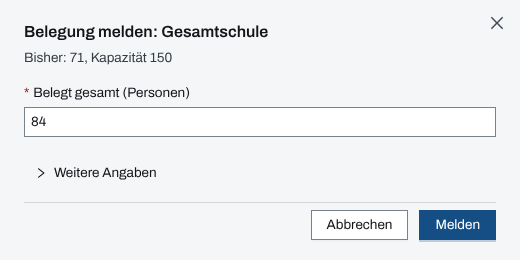

## Überblick

Ein Tablet an einer **Betreuungsstelle** (Notunterkunft, Sammelstelle) nimmt Betroffene auf,
zeigt, wer in der Stelle untergebracht ist, meldet die Belegung und schickt Meldungen an die
Einsatzleitung. Es ist an genau eine Betreuungsstelle gekoppelt (siehe
[Geräte koppeln](geraete-koppeln.md)).

Die Navigation unten führt zu „Betroffene“, „Aufnahme“ und „Stelle“. Die Bedienung des Geräts
selbst steht in [Gerät bedienen](geraet-bedienen.md).

## Abläufe

### Betroffene der Stelle im Blick behalten

1. „Betroffene“ öffnen. Die Liste zeigt je Person Registriernummer, Name, Zeit und Verbleib; wer
   hier untergebracht ist, trägt „hier“.

   

2. Eine Zeile antippen, um die Person zu öffnen.

Wer die Stelle verlassen hat, steht in der Gruppe „Weitergezogen“ mit seinem neuen Verbleib.

### Betroffene aufnehmen

1. „Aufnehmen“ oder unten „Aufnahme“ wählen.
2. Soweit bekannt Geschlecht, geschätztes Alter und Antreffort angeben; Name, Vorname und weitere
   Angaben stehen unter „Weitere Angaben“.

   

3. „Erfassen“ wählen oder „Speichern und nächste“, um gleich die nächste Person aufzunehmen.

Die Bestätigung lautet etwa „Erfasst als R-016 · untergebracht“: Die Person ist in dieser
Betreuungsstelle untergebracht.

### Belegung melden

1. Unten „Stelle“ öffnen. Der Bereich „Belegung“ zeigt „Belegt“, „Kapazität“, „Frei“ und „Davon
   namentlich“, darunter den Meldeverlauf.
2. „Belegung melden“ wählen.
3. Unter „Belegt gesamt (Personen)“ die Zahl aller Personen in der Stelle eintragen. Die Zeile
   darüber nennt die letzte Meldung und die Kapazität; unter „Weitere Angaben“ lässt sich ein
   abweichender Zeitpunkt angeben.

   

4. „Melden“ wählen. Die Bestätigung lautet „Belegung gemeldet: …“.

Eine falsche Meldung lässt sich im Meldeverlauf zurücknehmen.

### Meldung an die Einsatzleitung

1. Unten „Stelle“ öffnen und oben „Meldungen“ wählen.
2. Den „Inhalt“ eingeben und die „Priorität“ (normal, dringend, sofort) wählen.
3. „Meldung senden“ wählen. Die Bestätigung lautet „Meldung #… gesendet“; darunter stehen die
   „Eigenen Meldungen“.

## Hintergrund

### Belegt gesamt und namentlich

„Belegt“ ist die zuletzt gemeldete Gesamtzahl, auch für Personen, die nicht einzeln erfasst sind.
„Davon namentlich“ zählt die Personen, die mit Namen in dieser Stelle untergebracht sind. Beides
kann auseinanderliegen; die Meldung der Gesamtzahl ersetzt nicht die Aufnahme einzelner Personen.

### Was das Tablet nicht tut

Das Tablet sichtet nicht: An der Betreuungsstelle gibt es keine Sichtungskategorie, weder bei der
Aufnahme noch an der Person. Stellen anlegen, ändern oder schließen bleibt der Einsatzleitung.
Ist die Stelle geschlossen, fehlt „Belegung melden“, und der Meldeverlauf zeigt „Stelle
geschlossen: Zurücknehmen gesperrt“.

### Ohne Netz

Aufnahmen, Belegungsmeldungen und Meldungen merkt das Gerät ohne Netz vor und sendet sie nach
(siehe [Arbeiten ohne Netz](ohne-netz.md)).
