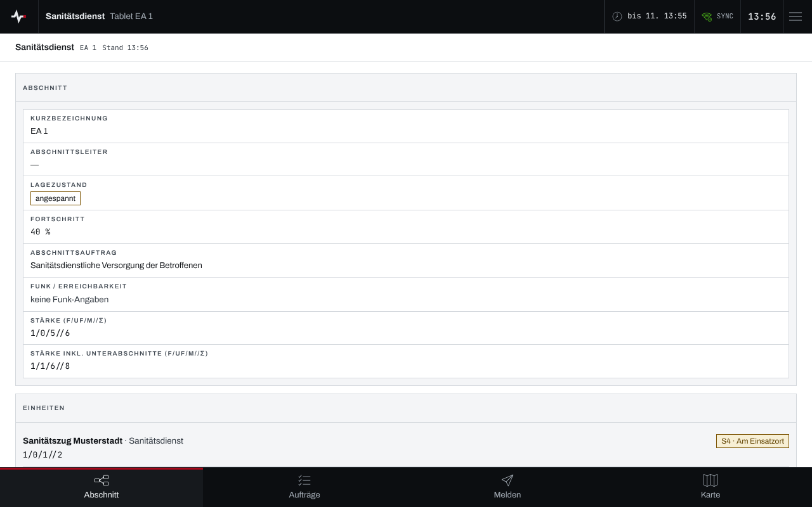
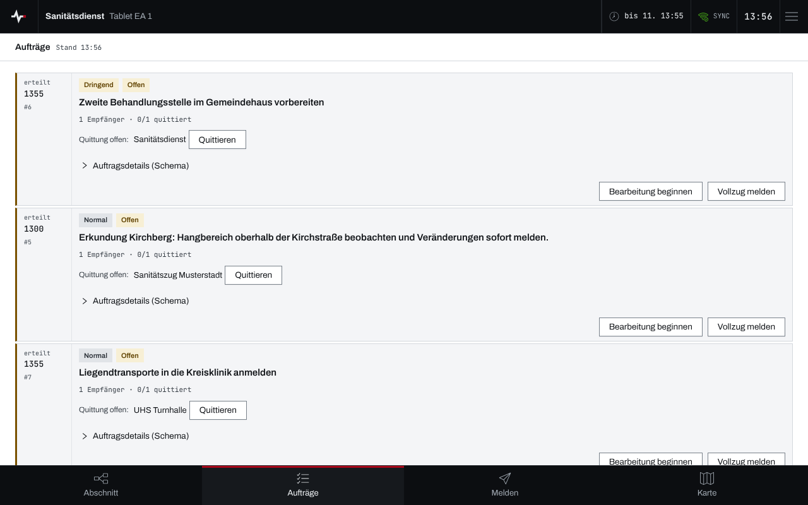
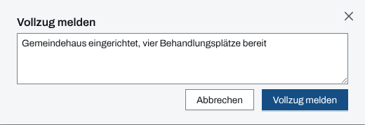

## Überblick

Ein Tablet im **Einsatzabschnitt** begleitet die Abschnittsleitung: Es zeigt den eigenen
Abschnitt mit seinen Unterabschnitten und Einheiten, nimmt Aufträge an den Abschnitt entgegen,
meldet ihren Vollzug und schickt Meldungen an die Einsatzleitung. Es ist an genau einen
Abschnitt gekoppelt (siehe [Geräte koppeln](geraete-koppeln.md)) und sieht dessen **Teilbaum**:
den Abschnitt selbst und alle Abschnitte darunter.

Die Navigation unten führt zu „Abschnitt“, „Aufträge“, „Melden“ und „Karte“. Die Bedienung des
Geräts selbst steht in [Gerät bedienen](geraet-bedienen.md).

## Abläufe

### Abschnitt und Einheiten im Blick behalten

1. „Abschnitt“ öffnen. Oben stehen „Kurzbezeichnung“, „Abschnittsleiter“, „Lagezustand“,
   „Fortschritt“, „Abschnittsauftrag“, „Funk / Erreichbarkeit“ und die Stärke, einmal für den
   Abschnitt und einmal einschließlich der Unterabschnitte.
2. Darunter listet „Einheiten“ alle Einheiten des Teilbaums mit Abschnitt, Stärke und Status.

   

### Auftrag quittieren und bearbeiten

1. „Aufträge“ öffnen. Die Liste zeigt die offenen Aufträge an den Teilbaum und seine Einheiten,
   dringende zuerst.

   

2. Bei „Quittung offen:“ neben dem eigenen Empfänger „Quittieren“ wählen und die Rückfrage mit
   „Empfang quittieren“ bestätigen.
3. „Bearbeitung beginnen“ wählen, sobald der Auftrag in Arbeit ist.

### Vollzug melden

1. Beim Auftrag „Vollzug melden“ wählen.
2. Im Dialog „Vollzug melden“ die Rückmeldung zur Erledigung eintragen.

   

3. „Vollzug melden“ wählen. Der Auftrag verlässt die Liste; die Abnahme liegt bei der
   Einsatzleitung.

### Meldung an die Einsatzleitung

1. Unten „Melden“ wählen.
2. Den „Inhalt“ eingeben und die „Priorität“ (normal, dringend, sofort) wählen.
3. „Meldung senden“ wählen. Die Bestätigung lautet „Meldung #… gesendet“; die Meldung steht
   danach unter „Eigene Meldungen“.

### Karte ansehen

1. Unten „Karte“ wählen. Sie zeigt die Flächen des Teilbaums, die eigenen Einheiten, den
   Einsatzort und die Gefahrenzonen des Einsatzes.

Die Karte ist nur zum Lesen: Zeichnen und Messen gibt es am Gerät nicht.

## Hintergrund

### Was das Tablet sieht und darf

Das Tablet sieht nur seinen Teilbaum: die Einheiten und Aufträge benachbarter Abschnitte
erscheinen nicht. Quittieren kann es nur Empfängerzeilen aus dem eigenen Teilbaum. Aufträge
erteilen oder abnehmen, Abschnitte oder Einheiten ändern, das Einsatztagebuch lesen und Personen
erfassen gehen am Gerät nicht.

Ein Ziel unten erscheint nur, wenn das Modul dahinter im Einsatz freigegeben ist: Ohne Aufträge,
Meldungen oder Lagekarte fehlen „Aufträge“, „Melden“ oder „Karte“.

### Absender der Meldungen

Als Absender einer Meldung setzt der Server den gekoppelten Abschnitt; der Text nennt Abschnitt
und Gerät. Einen anderen Abschnitt als Absender nimmt der Server nicht an.

### Wenn der Abschnitt aufgelöst wird

Löst die Einsatzleitung den Abschnitt auf, endet die Kopplung des Tablets; es zeigt dann
„Kopplung beendet“ (siehe [Gerät bedienen](geraet-bedienen.md)).
