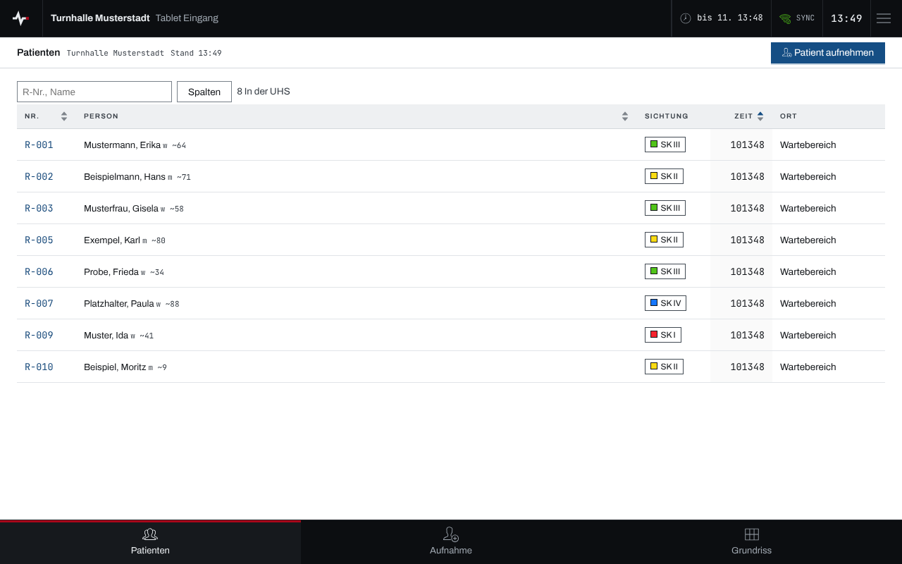
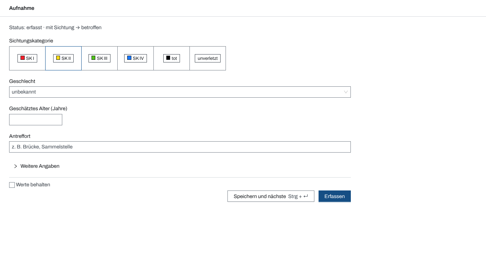
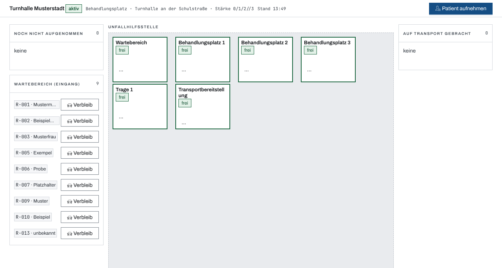
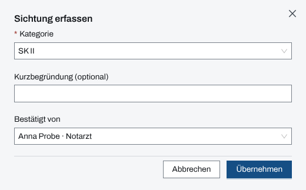
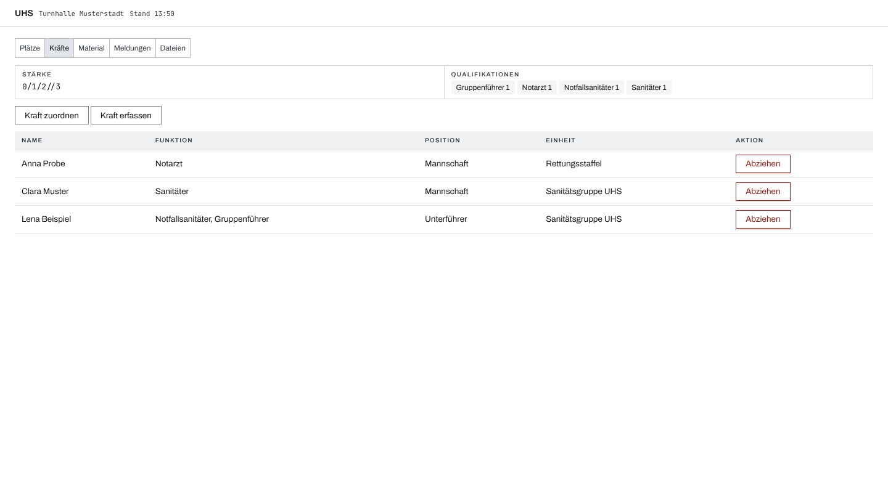

## Überblick

Das **UHS-Tablet** begleitet die Arbeit in einer Unfallhilfsstelle: Patienten aufnehmen, sichten,
auf Plätze legen und im Blick behalten. Der **UHS-Laptop** am Tisch der UHS-Leitung kann dasselbe
und pflegt dazu Plätze, Kräfte und Dateien der UHS und schickt Meldungen an die Einsatzleitung.

Beide sind an genau eine Unfallhilfsstelle gekoppelt (siehe [Geräte koppeln](geraete-koppeln.md))
und zeigen nur deren Patienten. Die Navigation unten führt zu „Patienten“, „Aufnahme“ und
„Grundriss“, am Laptop zusätzlich zu „UHS“. Die Bedienung des Geräts selbst steht in
[Gerät bedienen](geraet-bedienen.md).

## Abläufe

### Patienten im Blick behalten

1. „Patienten“ öffnen. Die Liste zeigt je Person Registriernummer, Name, Sichtungskategorie, Zeit
   und Ort in der UHS (Wartebereich oder Platz).

   

2. Eine Zeile antippen, um die Person zu öffnen.

Wer die UHS verlassen hat, steht in der Gruppe „Ausgetreten“ mit seinem Verbleib.

### Patient aufnehmen

1. „Patient aufnehmen“ oder unten „Aufnahme“ wählen.
2. Die Sichtungskategorie wählen und, soweit bekannt, Geschlecht, geschätztes Alter und
   Antreffort angeben. Name und weitere Angaben stehen unter „Weitere Angaben“.

   

3. „Erfassen“ wählen oder „Speichern und nächste“, um gleich die nächste Person aufzunehmen.

Die Bestätigung nennt die neue Registriernummer, die Kategorie und den Ort, etwa „Erfasst als
R-013 · SK II · im Wartebereich“. Die Aufnahme geht immer in die eigene UHS.

### Patient einem Platz zuweisen

1. „Grundriss“ öffnen. Er zeigt Wartebereich und Plätze der UHS mit ihrer Belegung.

   

2. Einen freien Platz antippen. Der Dialog „Patient zuweisen — …“ öffnet sich.
3. Unter „Patient“ die Person wählen und „Erfassen“ wählen.

Alternativ lässt sich die Karte einer wartenden Person auf den Platz ziehen. Über das Menü eines
Platzes lässt er sich als frei, defekt, in Aufbereitung oder gesperrt markieren.

### Sichten mit „Bestätigt von“

1. Die Person öffnen und „Sichten“ wählen; bei einer schon gesichteten Person steht
   „Re-Sichten“ im Menü „Weitere Aktionen“.
2. Im Dialog „Sichtung erfassen“ die „Kategorie“ wählen und, wenn nötig, eine
   „Kurzbegründung (optional)“ angeben.
3. Unter „Bestätigt von“ die Person wählen, die die Sichtung verantwortet, etwa die Notärztin.

   

4. „Übernehmen“ wählen. Die Sichtung trägt danach „bestätigt: …“ mit dem Namen.

### Plätze, Kräfte und Meldungen am Laptop

Für den UHS-Laptop:

1. Unten „UHS“ wählen. Die Leiste oben wechselt zwischen „Plätze“, „Kräfte“, „Material“,
   „Meldungen“ und „Dateien“.
2. „Plätze“ zählt Plätze, belegte, freie und nicht verfügbare; „Grundriss bearbeiten“ führt in
   den Grundriss, wo „Plätze bearbeiten“ Plätze anlegt und ändert.
3. „Kräfte“ zeigt die Stärke der UHS und ihre Kräfte. „Kraft zuordnen“ holt eine Person des
   Einsatzes an die UHS, „Kraft erfassen“ legt eine neue an, „Abziehen“ nimmt sie wieder heraus.

   

4. Unter „Meldungen“ den „Inhalt“ eingeben, die „Priorität“ (normal, dringend, sofort) wählen und
   „Meldung senden“ wählen. Die Bestätigung lautet „Meldung #… gesendet“; darunter stehen die
   „Eigenen Meldungen“.

## Hintergrund

### Tablet und Laptop im Vergleich

|                                                           | UHS-Tablet | UHS-Laptop |
| --------------------------------------------------------- | ---------- | ---------- |
| Patientenliste, Aufnahme, Sichtung                        | ja         | ja         |
| Grundriss belegen, Verfügbarkeit setzen                   | ja         | ja         |
| Plätze anlegen und ändern                                 | nein       | ja         |
| Bereich „UHS“: Kräfte, Material lesen, Meldungen, Dateien | nein       | ja         |

Keines der beiden Geräte legt eine UHS an, löst sie auf oder ordnet ganze Einheiten zu; das bleibt
der Einsatzleitung. Wechsel in andere Module (Lagekarte, Einsatzübersicht) gibt es am Gerät nicht.

### Wer gesichtet hat

Das Tablet ist keine Person. Damit nachvollziehbar bleibt, wer eine Sichtung verantwortet, nennt
„Bestätigt von“ eine Person aus dem Personal des Einsatzes. Das Feld ist freiwillig und ohne
Vorauswahl, bei der ersten Sichtung wie bei jeder weiteren.

### Ohne Netz

Aufnahmen und Meldungen merkt das Gerät ohne Netz vor und sendet sie nach (siehe
[Arbeiten ohne Netz](ohne-netz.md)). Bis dahin trägt eine aufgenommene Person „R-…“ statt ihrer
Registriernummer.
