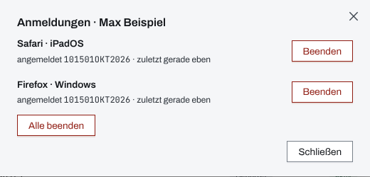

## Überblick

Wer ein Gerät verliert, auf dem Lifeline Hub angemeldet war, meldet das **sofort** der
Einsatzleitung oder der Administration der Organisation, auch wenn das Gerät gesperrt war. Die
Person selbst, die Administration und die Einsatzleitung können die Anmeldung auf dem verlorenen
Gerät beenden, jede auf ihrem Weg.

## Abläufe

### Eigene Anmeldungen beenden

Für Personen, die an einem anderen Gerät noch angemeldet sind:

1. Im „Benutzermenü“ „Profil“ öffnen.
2. Unter „Anmeldungen“ beim verlorenen Gerät „Beenden“ wählen. Ist unklar, welche Zeile es ist,
   beendet „Alle anderen beenden“ alle Anmeldungen außer der eigenen.

Ein neues Passwort („Passwort ändern“ unter „Sicherheit“) beendet ebenfalls alle anderen
Anmeldungen des Kontos (siehe [Profil und Sicherheit](profil-sicherheit.md)).

### Anmeldungen einer Person beenden

Für die Administration:

1. In der Verwaltung „Benutzer“ öffnen und die Person über „Name oder Benutzername“ suchen.
2. In ihrer Zeile „Anmeldungen“ wählen. Auf schmalen Bildschirmen steht der Punkt im
   Aktionsmenü der Zeile.
3. Im Dialog „Anmeldungen · …“ beim verlorenen Gerät „Beenden“ wählen. „Alle beenden“ beendet
   jede Anmeldung der Person.

   

### Person deaktivieren

Für die Administration:

1. In der Verwaltung „Benutzer“ öffnen.
2. In der Zeile der Person „Deaktivieren“ wählen; eine Rückfrage gibt es nicht. Auf schmalen
   Bildschirmen steht der Punkt im Aktionsmenü der Zeile.
3. Sobald die Person wieder ein sicheres Gerät hat, an derselben Stelle „Reaktivieren“ wählen.

### Gekoppeltes Gerät widerrufen

Für die Einsatzleitung:

1. In den Einstellungen des Einsatzes „Geräte“ öffnen.
2. Beim Gerät das Aktionsmenü öffnen und „Widerrufen …“ wählen.
3. Die Rückfrage „… widerrufen?“ mit „Widerrufen“ bestätigen.

## Hintergrund

### Warum sofort

Eine Anmeldung gilt sieben Tage. Wer ein entsperrtes Gerät mit laufender Anmeldung findet,
arbeitet bis dahin mit allen Rechten der Person weiter, sieht die aktuelle Lage und kann
schreiben. Das ist das größere Risiko; die vorgehaltenen Daten auf dem Gerät kommen hinzu.

### Was die einzelnen Wege bewirken

- **Anmeldung beenden** (im Profil oder in der Verwaltung) wirkt sofort und nur auf diese
  Anmeldung. Konto, Passwort und zweiter Faktor bleiben unverändert; die Person meldet sich auf
  einem sicheren Gerät normal wieder an.
- **Passwort ändern** beendet alle anderen Anmeldungen des Kontos; das Gerät, an dem geändert
  wurde, bleibt angemeldet.
- **Person deaktivieren** beendet sofort jede Anmeldung der Person auf allen Geräten.
  „Reaktivieren“ lässt Passwort und zweiten Faktor unverändert.
- **Gekoppeltes Gerät widerrufen**: Das Gerät verliert sofort jeden Zugriff, seine Einträge
  bleiben. Das Einsatztagebuch hält den Widerruf fest.

### Was danach auf dem verlorenen Gerät passiert

Sobald das Gerät das nächste Mal den Server erreicht, ist die Anmeldung ungültig. Das Gerät meldet
sich dann selbst ab und löscht das vorgehaltene Lagebild sowie zwischengespeicherte Orte und
Erfassungshilfen.

Zwei Grenzen bleiben:

- **Ohne Netz merkt das Gerät nichts.** Bis 24 Stunden nach seiner letzten Verbindung bleibt der
  vorgehaltene Stand dort lesbar (siehe [Arbeiten ohne Netz](ohne-netz.md)).
- **Vorgemerkte Einträge bleiben** auf dem Gerät, bis sie gesendet oder verworfen sind.

### Vorbeugen

- Jedes Gerät mit Lifeline Hub hat eine **Bildschirmsperre**, die sich nach kurzer Zeit von selbst
  einschaltet, und eine eingeschaltete **Geräteverschlüsselung**. Bei Telefonen und Tablets mit
  Code ist sie ab Werk an, bei Windows-Rechnern ohne BitLocker oft nicht.
- An gemeinsam genutzten Geräten nach jeder Schicht abmelden (siehe
  [Anmelden und Abmelden](anmelden-abmelden.md)).
