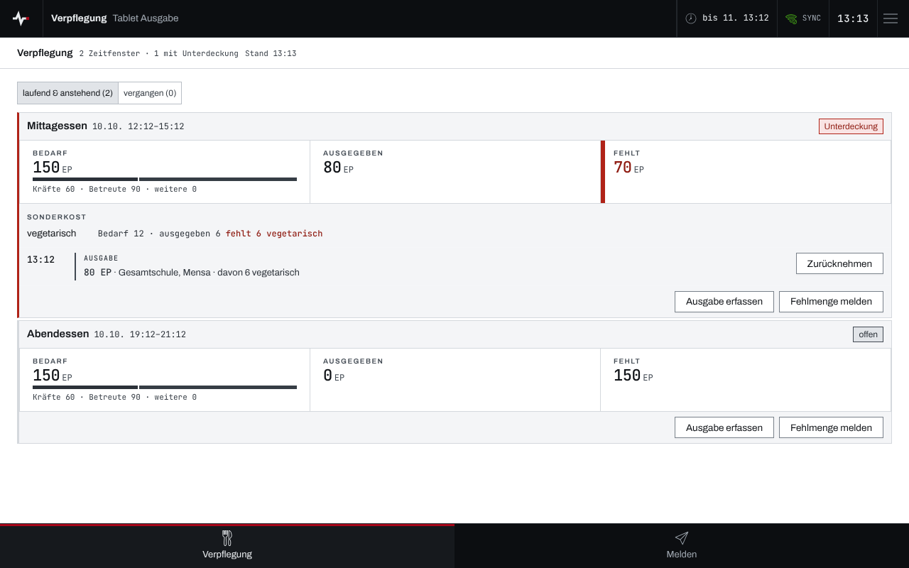
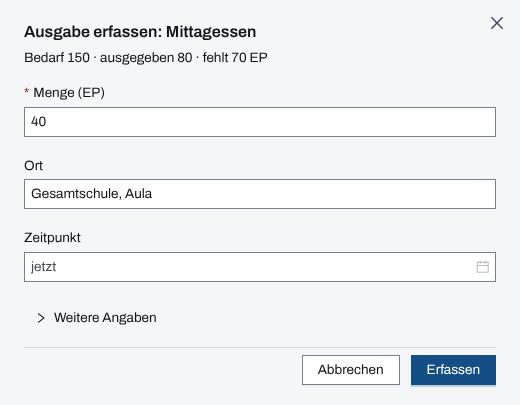
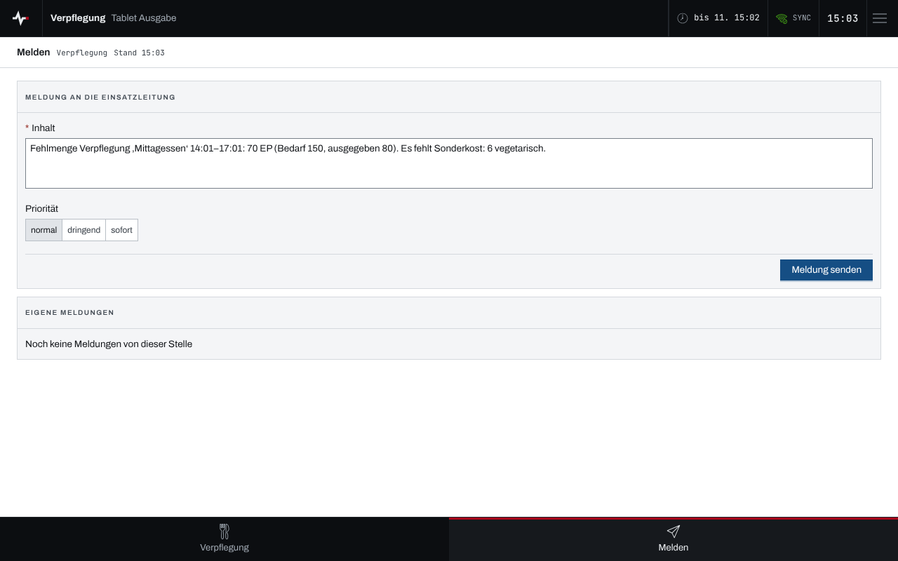

## Überblick

Ein Tablet an der **Essensausgabe** erfasst, wie viele Essensportionen (EP) je Zeitfenster
ausgegeben sind, und meldet eine Fehlmenge an die Einsatzleitung. Die Zeitfenster mit ihrem
Bedarf plant die Einsatzleitung; das Tablet arbeitet mit ihnen, plant aber selbst nicht.

Die Verpflegungsansicht ist an keine Stelle gebunden und sieht alle Zeitfenster des Einsatzes
(siehe [Geräte koppeln](geraete-koppeln.md)). Die Navigation unten führt zu „Verpflegung“ und
„Melden“. Die Bedienung des Geräts selbst steht in [Gerät bedienen](geraet-bedienen.md).

## Abläufe

### Zeitfenster im Blick behalten

1. „Verpflegung“ öffnen. Oben wechselt die Leiste zwischen „laufend & anstehend“ und „vergangen“.
2. Jede Karte zeigt Bezeichnung und Zeitraum, „Bedarf“ (Kräfte, Betreute, weitere),
   „Ausgegeben“ und „Fehlt“, darunter Sonderkost und die einzelnen Ausgaben.

   

Rechts oben steht die Deckung: „gedeckt“, „offen“ (Fehlmenge, Zeitfenster noch nicht begonnen)
oder „Unterdeckung“ (Fehlmenge, Zeitfenster hat begonnen).

### Ausgabe erfassen

1. Beim Zeitfenster „Ausgabe erfassen“ wählen. Der Dialog „Ausgabe erfassen: …“ nennt Bedarf,
   bisher Ausgegebenes und die Fehlmenge.
2. Unter „Menge (EP)“ die ausgegebenen Portionen eintragen, bei Bedarf „Ort“ und „Zeitpunkt“
   (leer heißt jetzt). Sonderkost und eine Bemerkung stehen unter „Weitere Angaben“.

   

3. „Erfassen“ wählen. Die Ausgabe steht danach in der Karte, „Ausgegeben“ und „Fehlt“ rechnen sie
   mit.

### Ausgabe zurücknehmen

1. In der Karte bei der Ausgabe „Zurücknehmen“ wählen.
2. Die Rückfrage „Ausgabe zurücknehmen?“ mit „Zurücknehmen“ bestätigen.

Die Rücknahme ist endgültig. Eine falsch erfasste Ausgabe wird zurückgenommen und neu erfasst.

### Fehlmenge melden

1. Beim Zeitfenster „Fehlmenge melden“ wählen. Der Knopf steht nur da, solange etwas fehlt.
2. Die Seite „Melden“ öffnet sich mit vorbereitetem Text, etwa „Fehlmenge Verpflegung ‚Mittagessen‘
   …: 70 EP (Bedarf 150, ausgegeben 80).“ samt fehlender Sonderkost.

   

3. Bei Bedarf Text und „Priorität“ anpassen und „Meldung senden“ wählen.

## Hintergrund

### Was das Tablet nicht tut

Zeitfenster anlegen, den Bedarf ändern und Zeitfenster löschen bleiben der Einsatzleitung; am
Tablet fehlen diese Knöpfe. Eine Ausgabe auf eine Nachforderung zu buchen, lehnt der Server für
ein Gerät ab. Statt nachzufordern meldet das Tablet die Fehlmenge an die Einsatzleitung.

### Ohne Netz

Ausgaben merkt das Gerät ohne Netz vor und sendet sie nach (siehe
[Arbeiten ohne Netz](ohne-netz.md)). Bis dahin stehen sie in der Karte als „ausstehend“ und
zählen noch nicht in „Ausgegeben“ und „Fehlt“.

### Absender der Meldungen

Meldungen tragen „Verpflegung“ und die Gerätebezeichnung als Absender, etwa „Verpflegung ·
Tablet Ausgabe“.
