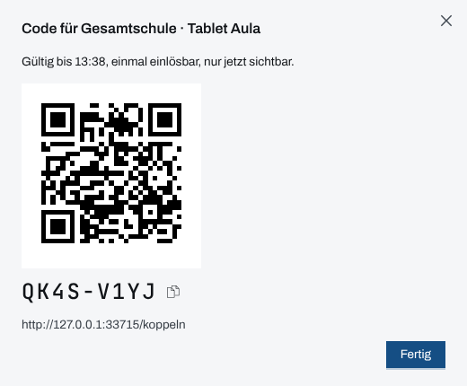
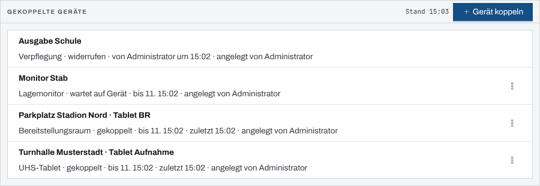
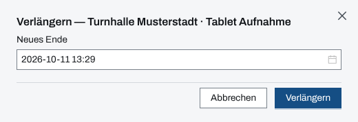
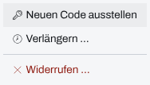

## Überblick

Tablets, Laptops und Monitore an einer Stelle arbeiten ohne persönliches Konto: Die
Einsatzleitung **koppelt** sie mit dem Einsatz. Ein gekoppeltes Gerät zeigt nur eine
**Ansicht**, etwa die Patientenliste einer Unfallhilfsstelle oder das Großbild für den Stab, und
nur in diesem einen Einsatz.

Die Einsatzleitung verwaltet alle Kopplungen in den Einstellungen des Einsatzes unter „Geräte“:
koppeln, einen neuen Code ausstellen, verlängern und widerrufen. Was die einzelnen Ansichten am
Gerät zeigen, steht in den Kapiteln [Gerät bedienen](geraet-bedienen.md),
[UHS-Tablet und UHS-Laptop](geraet-uhs.md), [Betreuungsstelle](geraet-betreuungsstelle.md),
[Bereitstellungsraum](geraet-bereitstellungsraum.md),
[Einsatzabschnitt](geraet-einsatzabschnitt.md), [Verpflegung](geraet-verpflegung.md) und
[Lagemonitor](lagemonitor.md).

## Abläufe

### Gerät koppeln

Für die Einsatzleitung:

1. In den Einstellungen des Einsatzes „Geräte“ öffnen und „Gerät koppeln“ wählen.
2. „Ansicht“, bei Bedarf die Stelle und die „Gerätebezeichnung“ angeben und „Koppeln“ wählen. Die
   Maske im Einzelnen zeigt [Anmelden und Abmelden](anmelden-abmelden.md), Ablauf „Ein Gerät
   koppeln“.
3. Der Dialog „Code für …“ zeigt den Code als QR-Code und als Text, darunter die Adresse der Seite
   „Gerät koppeln“.

   

4. Am Gerät den QR-Code scannen oder den Code eingeben (siehe
   [Gerät bedienen](geraet-bedienen.md)), dann hier „Fertig“ wählen.

Bis das Gerät den Code eingelöst hat, steht es in der Liste als „wartet auf Gerät“, danach als
„gekoppelt“.

### Kopplungen im Blick behalten

Für die Einsatzleitung:

1. In den Einstellungen des Einsatzes „Geräte“ öffnen.
2. Die Liste „Gekoppelte Geräte“ nennt je Gerät Stelle und Gerätebezeichnung, darunter Ansicht,
   Zustand, das Ende der Kopplung („bis …“), den letzten Zugriff („zuletzt …“) und wer die
   Kopplung angelegt hat. Bei einer widerrufenen steht, wer sie wann widerrufen hat.

   

### Kopplung verlängern

Für die Einsatzleitung:

1. In der Liste beim Gerät das Aktionsmenü öffnen und „Verlängern …“ wählen.
2. Unter „Neues Ende“ den Zeitpunkt eintragen. Vorbelegt sind 24 Stunden ab jetzt; höchstens
   72 Stunden ab jetzt sind möglich.

   

3. „Verlängern“ wählen.

Am Gerät steht das Ende der Kopplung in der Kopfzeile; in der letzten Stunde davor ist es
hervorgehoben.

### Neuen Code ausstellen

Wenn ein Gerät getauscht wird oder der erste Code verfallen ist, für die Einsatzleitung:

1. In der Liste beim Gerät das Aktionsmenü öffnen.

   

2. „Neuen Code ausstellen“ wählen. Der Dialog „Code für …“ zeigt den neuen Code.
3. Den Code am neuen Gerät einlösen.

Der neue Code ersetzt den alten. Sobald er eingelöst ist, endet jede bisherige Anmeldung dieser
Kopplung; das alte Gerät ist dann draußen.

### Kopplung widerrufen

Für die Einsatzleitung:

1. In der Liste beim Gerät das Aktionsmenü öffnen und „Widerrufen …“ wählen.
2. Die Rückfrage „… widerrufen?“ mit „Widerrufen“ bestätigen.

Das Gerät verliert sofort jeden Zugriff und zeigt ohne Neuladen „Kopplung beendet“. Seine
Einträge bleiben. Eine widerrufene Kopplung hat kein Aktionsmenü mehr; für dasselbe Gerät gibt es
eine neue Kopplung. Bei einem verlorenen Gerät steht das Vorgehen in
[Gerät verloren](geraet-verloren.md).

## Hintergrund

### Wer koppeln darf

Geräte koppelt nur die **Einsatzleitung eines laufenden Einsatzes**; ein Administratorkonto nur
dann, wenn es dort Einsatzleitung ist. Andere sehen unter „Geräte“ den Satz „Nur die
Einsatzleitung koppelt Geräte“. Nach dem Abschluss des Einsatzes bleibt die Liste lesbar, ohne
Knopf „Gerät koppeln“ und ohne Aktionsmenü. Die Rollen erklärt
[Rechte im Einsatz](rechte-im-einsatz.md).

### Ansichten und Stellen

| Ansicht             | gebunden an         | Zweck laut Auswahl                                     |
| ------------------- | ------------------- | ------------------------------------------------------ |
| UHS-Tablet          | Unfallhilfsstelle   | Aufnahme, Patienten, Grundriss einer UHS               |
| UHS-Laptop          | Unfallhilfsstelle   | Wie Tablet, dazu Plätze, Material, Meldungen           |
| Lagemonitor         | –                   | Verdichtetes Lagebild, ohne Personendaten              |
| Betreuungsstelle    | Betreuungsstelle    | Belegung, Betroffene, Meldungen einer Betreuungsstelle |
| Bereitstellungsraum | Bereitstellungsraum | Kräfte an- und abmelden in einem Bereitstellungsraum   |
| Einsatzabschnitt    | Einsatzabschnitt    | Kräfte, Aufträge, Meldungen eines Abschnitts           |
| Verpflegung         | –                   | Portionen je Zeitfenster ausgeben, Fehlmenge melden    |

Zur Wahl stehen nur Stellen, die noch arbeiten: keine stornierte oder aufgelöste
Unfallhilfsstelle, kein aufgelöster Bereitstellungsraum. Eine geschlossene Betreuungsstelle
bleibt wählbar.

Ist ein Modul, das die Ansicht braucht, im Einsatz auf eine Rolle beschränkt, warnt die Maske:
„… für gekoppelte Geräte gesperrt – fehlt auf dem …“. Das Gerät arbeitet dann ohne dieses Modul.
Ein Gerät zählt dabei weder als Führungskraft der Organisation noch als Führung im Einsatz.

### Fristen

- Ein **Kopplungscode** hat acht Zeichen, gilt **10 Minuten und nur einmal** und ist nur im
  Dialog „Code für …“ sichtbar. Gespeichert wird er nur unkenntlich.
- Eine **Kopplung** gilt 24 Stunden ab dem Anlegen. Verlängern geht bis höchstens 72 Stunden ab
  dem Zeitpunkt des Verlängerns, beliebig oft, solange die Kopplung läuft.
- Eine **abgelaufene** Kopplung lässt sich nicht mehr verlängern und bekommt keinen neuen Code;
  wie eine widerrufene hat sie kein Aktionsmenü mehr. Für das Gerät dann eine neue Kopplung
  anlegen.

### Wann eine Kopplung endet

- mit dem Widerruf durch die Einsatzleitung,
- mit ihrem Ablauf,
- mit dem Abschluss des Einsatzes: alle Geräte verlieren den Zugriff,
- wenn der Einsatzabschnitt aufgelöst wird, an den sie gebunden ist.

Am Gerät steht dann „Kopplung beendet“; zurück kommt es nur über eine neue Kopplung.

### Was das Einsatztagebuch festhält

Anlegen, Einlösen und Widerruf einer Kopplung stehen als Systemeinträge im Einsatztagebuch, mit
Gerätebezeichnung und Ansicht. Ein gekoppeltes Gerät ist keine Person: Was es erfasst, trägt
Stelle und Gerätebezeichnung als Absender, nicht den Namen eines Menschen.
