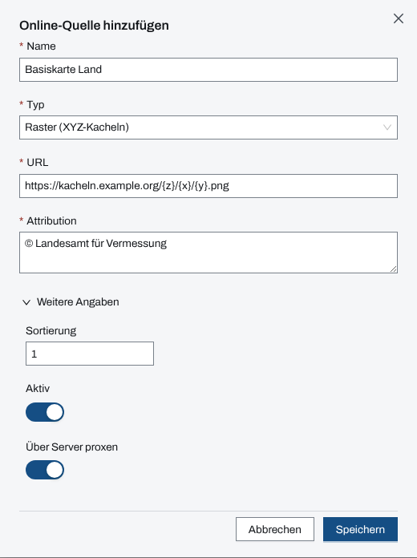
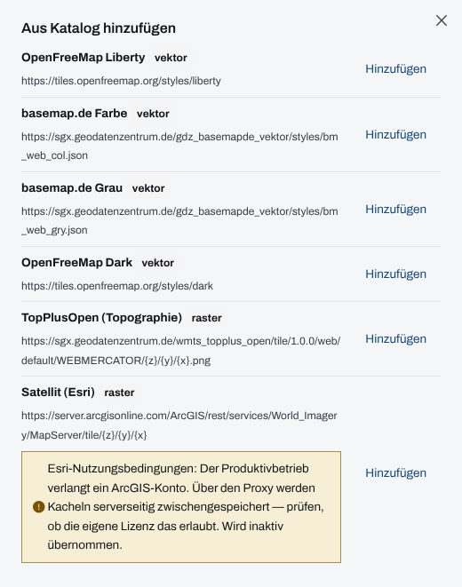
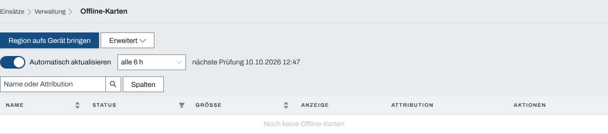

## Überblick

Die Lagekarte zeichnet das Lagebild auf eine Kartengrundlage. Woher diese Grundlagen kommen,
legt die Verwaltung unter „Karten“ fest: **Online-Quellen** sind Kartendienste im Internet,
**Offline-Karten** sind Kartenregionen, die der Server selbst vorhält und die deshalb auch ohne
Internet zur Verfügung stehen.

Einrichten dürfen nur System-Admins. Führungskräfte der Organisation sehen die Listen zum
Nachschlagen.

## Abläufe

### Eine Online-Quelle hinzufügen

1. Oben „Verwaltung“ öffnen und unter „Karten“ „Online-Quellen“ wählen.
2. „Quelle hinzufügen“ wählen.
3. „Name“ eintragen, unter „Typ“ „Vektor (Style-JSON)“ oder „Raster (XYZ-Kacheln)“ wählen und
   „URL“ und „Attribution“ eintragen.
4. Bei Bedarf „Weitere Angaben“ aufklappen und „Sortierung“, „Aktiv“ und „Über Server proxen“
   einstellen.

   

5. „Speichern“ wählen.

Zum Ändern einer Quelle in ihrer Zeile „Bearbeiten“ wählen, zum Entfernen „Löschen“ und die
Rückfrage „Quelle löschen?“ mit „Löschen“ bestätigen.

### Eine Online-Quelle aus dem Katalog übernehmen

1. Unter „Karten“ „Online-Quellen“ öffnen.
2. „Aus Katalog hinzufügen“ wählen.
3. Bei der gewünschten Karte „Hinzufügen“ wählen.

   

Die App meldet „Quelle übernommen“. Eine schon übernommene Karte zeigt „Vorhanden“.

### Eine Offline-Karte auf den Server bringen

1. Unter „Karten“ „Offline-Karten“ öffnen.
2. „Region aufs Gerät bringen“ wählen.
3. Bei der gewünschten Region „Laden“ wählen, oder „Bauen & laden“, wenn sie erst gebaut werden
   muss.

Die Karte erscheint in der Tabelle und lädt im Hintergrund. Unter „Erweitert“ stehen zwei
Sonderwege: „Per URL herunterladen“ für eine Karte von einer eigenen Adresse und „Gebaute Region
übernehmen“ für eine Datei, die schon auf dem Server liegt.

### Offline-Karten aktuell halten

1. Unter „Karten“ „Offline-Karten“ öffnen.
2. „Automatisch aktualisieren“ einschalten und daneben den Prüfabstand wählen.

   

3. Um eine einzelne Karte sofort zu aktualisieren, in ihrer Zeile „Jetzt aktualisieren“ wählen.

Jede Änderung an der Automatik gilt sofort. Daneben steht, wann zuletzt geprüft wurde und wann
die nächste Prüfung ansteht.

## Hintergrund

### Online-Quellen

- Jede aktive Quelle steht in der Grundlage-Wahl der Lagekarte; die „Sortierung“ bestimmt ihre
  Reihenfolge. Eine inaktive Quelle bleibt eingetragen, erscheint dort aber nicht.
- **„Über Server proxen“** holt die Kacheln über den Server statt direkt im Browser. Ein
  Zugangsschlüssel in der URL bleibt so auf dem Server; ist der Schalter aus, warnt der Dialog:
  „Schlüssel in der URL ist im Browser sichtbar.“ Über den Proxy speichert der Server Kacheln
  zwischen.
- Katalogquellen werden mit Proxy übernommen. Trägt ein Katalogeintrag einen Hinweis, etwa zu
  Nutzungsbedingungen, kommt die Quelle inaktiv an („Quelle übernommen — inaktiv, bitte Hinweis
  prüfen“); erst nach dem Prüfen „Aktiv“ einschalten.
- Die „Attribution“ ist Pflicht; sie nennt die Herkunft der Karte.

### Offline-Karten

- Offline-Karten liegen auf dem Server. Die Lagekarte weicht auf sie aus, wenn eine
  Online-Grundlage nicht lädt, etwa ohne Internet; wie das am einzelnen Gerät aussieht,
  beschreibt [Arbeiten ohne Netz](ohne-netz.md).
- Alle bereiten Vektorkarten werden gemeinsam angezeigt; die Spalte „Anzeige“ zeigt dann „wird
  angezeigt“. Rasterkarten stehen dort als „bereit“.
- Die Automatik prüft im gewählten Abstand (1 Stunde bis 7 Tage), ob der Katalog einen neueren
  Stand einer Karte führt, und tauscht ihn ein. Bis zum Tausch bleibt die alte Karte in Betrieb.
- „Jetzt aktualisieren“ lädt einen vorhandenen neueren Stand sofort („Update lädt“) oder stößt
  einen Neubau an („Neubau gestartet“). Ist nichts Neueres da, meldet die App „Die Karte ist
  aktuell“.
- „Bauen & laden“ und „Jetzt aktualisieren“ mit Neubau brauchen den Kartenbau-Dienst. Ist er
  nicht eingerichtet, stehen nicht gebaute Regionen als „Nicht gebaut“ da.
- „Löschen“ fragt mit „Offline-Karte löschen?“ nach. Offline-Karten brauchen viel Platz auf dem
  Server, oft mehrere Gigabyte.

### Wer was darf

Die Karten-Seiten erreichen System-Admins und Führungskräfte der Organisation. Ändern dürfen nur
System-Admins; alle anderen sehen „Nur Ansicht · nur System-Admin“.
