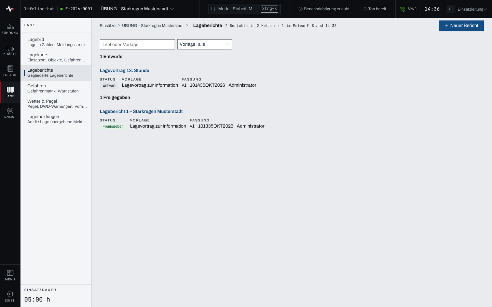
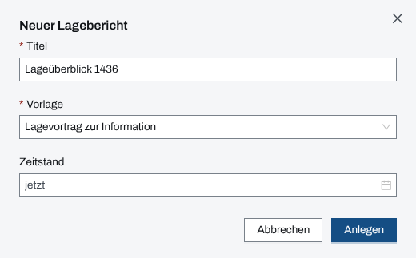
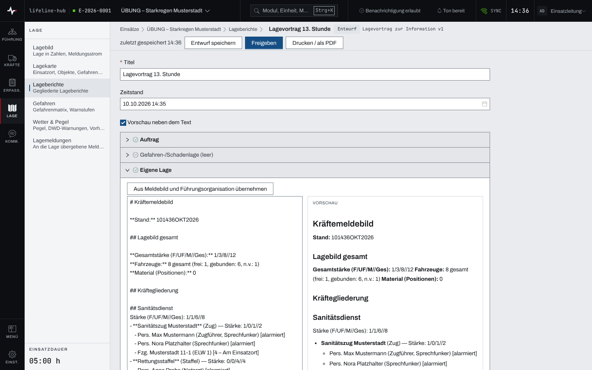
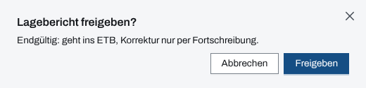
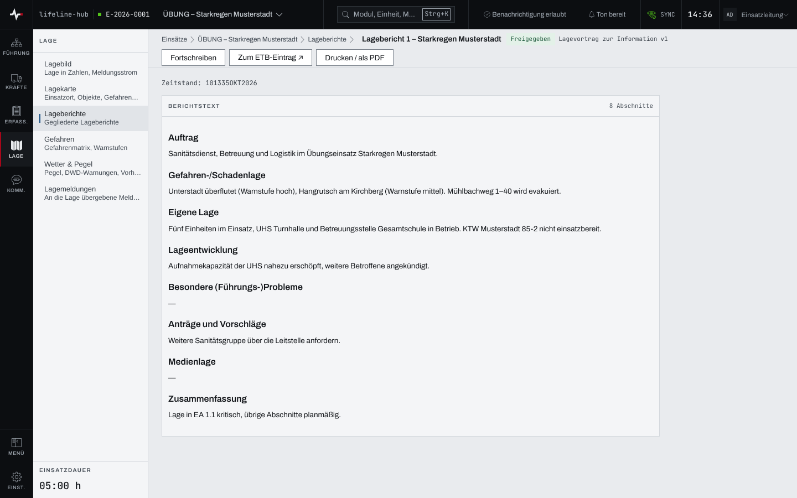

## Überblick

Ein Lagebericht hält die Lage zu einem Zeitstand in gegliederter Form fest, etwa als Lagevortrag.
Er entsteht als Entwurf, wird gemeinsam geschrieben und mit der Freigabe endgültig: Dann steht er
im Einsatztagebuch. Eine spätere Fassung entsteht durch Fortschreiben. Im Lagevortrag zur
Information übernimmt die App auf Knopfdruck Zahlen und Stände aus den Modulen.

## Abläufe

### Lageberichte finden

1. Im Bereich „Lage“ „Lageberichte“ öffnen. Die Berichte stehen in den Gruppen „Entwürfe“ und
   „Freigegeben“, je mit Status, Vorlage und Fassung.

   

2. Zum Eingrenzen im Suchfeld nach Titel oder Vorlage suchen.
3. Den Titel eines Berichts wählen, um ihn zu öffnen.

### Einen Lagebericht anlegen

1. In den Lageberichten „Neuer Bericht“ wählen.
2. Den vorgeschlagenen „Titel“ übernehmen oder ändern; er nennt die Uhrzeit, etwa
   „Lageüberblick 1410“.
3. Die „Vorlage“ prüfen: Vorgewählt ist „Lagevortrag zur Information“; zur Wahl stehen außerdem
   „Lagevortrag zur Entscheidung“ und „Freier Bericht“.
4. Den „Zeitstand“ leer lassen, dann gilt „jetzt“, oder einen Zeitpunkt wählen.

   

5. „Anlegen“ wählen. Der neue Entwurf steht in der Liste unter „Entwürfe“.

### Einen Entwurf schreiben

1. Den Entwurf öffnen. Die Abschnitte der Vorlage stehen untereinander; ein leerer trägt „(leer)“.
2. Einen Abschnitt öffnen und den Text schreiben. Mit „Vorschau neben dem Text“ steht die
   gesetzte Fassung daneben.
3. Im Lagevortrag zur Information den Knopf über dem Abschnitt wählen, um Inhalte zu übernehmen,
   etwa „Aus Meldebild und Führungsorganisation übernehmen“ in „Eigene Lage“.

   

4. „Entwurf speichern“ wählen. Oben steht danach „zuletzt gespeichert …“ mit der Uhrzeit.

### Einen Lagebericht freigeben

1. Im Entwurf „Freigeben“ wählen.
2. Die Rückfrage „Lagebericht freigeben?“ lesen.

   

3. „Freigeben“ wählen. Der Bericht ist nun freigegeben und steht im Einsatztagebuch.

### Einen Lagebericht fortschreiben

1. Einen freigegebenen Bericht öffnen. Er zeigt den „Berichtstext“ zum Lesen, dazu
   „Fortschreiben“, „Zum ETB-Eintrag ↗“ und „Drucken / als PDF“.

   

2. „Fortschreiben“ wählen. Es öffnet sich eine neue Fassung als Entwurf mit dem Text und den
   Anlagen der freigegebenen; sie wird wie jeder Entwurf geschrieben und freigegeben.

## Hintergrund

### Übernahmen im Lagevortrag zur Information

| Abschnitt | Knopf | Was übernommen wird |
| --- | --- | --- |
| Gefahren-/Schadenlage | „Aus dem Lagebild übernehmen“ | Betroffene, Vermisste, Sichtung, offene Schäden, höchste Warnstufe, Wetterwarnungen, Bedingungen am Einsatzort, Stand und Trend der Pegel |
| Eigene Lage | „Aus Meldebild und Führungsorganisation übernehmen“ | Kräftemeldebild und Führungsorganisation des ganzen Einsatzes |
| Lageentwicklung | „Aus dem ETB übernehmen“ | neue Einträge seit der letzten Lagebesprechung je Typ, neue Entscheidungen mit Nummer und Zeit |
| Besondere (Führungs-)Probleme | „Aus dem Führungsstand übernehmen“ | überfällige Aufträge, Meldungen mit überfälliger Bestätigung, ungesichtete Meldungen, Lücken im Funkplan |
| Medienlage | „Aus S5 übernehmen“ | Presse-Log, Pressemitteilungen, Infotelefon, ohne Personenbezug |

- Jeder übernommene Text nennt seinen Stand als Datum-Zeit-Gruppe.
- Die Abschnitte „Auftrag“, „Anträge und Vorschläge“ und „Zusammenfassung“ und der ganze
  Lagevortrag zur Entscheidung bleiben von Hand.
- Gefahren-/Schadenlage, Lageentwicklung und Besondere (Führungs-)Probleme übernehmen nur Zahlen,
  Nummern, Arten und Zeiten, keinen Freitext aus Aufträgen, Meldungen, Einsatztagebuch,
  Betroffenen oder Schäden.
- Eine gesperrte oder nicht geladene Quelle steht als „—“ mit Grund, nie als 0.
- Gab es noch keine Lagebesprechung, zählt die Lageentwicklung seit Einsatzbeginn.
- Steht im Abschnitt schon Text, fragt die App vor der Übernahme „… ersetzen?“; „Ersetzen“
  überschreibt ihn.

### Speichern

Ein Entwurf speichert sich alle 30 Sekunden und beim Verlassen eines Feldes von selbst. Oben steht,
ob „ungespeicherte Änderungen“ vorliegen oder wann „zuletzt gespeichert“ wurde.

### Freigabe und Fassungen

Die Freigabe ist endgültig: Der Text geht ins Einsatztagebuch, eine Korrektur gibt es nur als
Fortschreibung. Die Fortschreibung ist eine neue Fassung mit demselben Titel; die Vorgänger
bleiben freigegeben. Die Liste zeigt je Bericht die jüngste Fassung, die früheren sind über die
Fassungszeile erreichbar.

### Anlagen

Im Entwurf lässt sich mit „Fernmeldeskizze anfügen“ die Fernmeldeskizze des Stabs als Anlage
anhängen; das geht nur mit Verbindung und für Personen, die den Stab sehen. Im Druck steht jede
Anlage auf einem eigenen Blatt.

### Rechte und ohne Netz

Lesen kann jede Person im Einsatz, auch ein Beobachter. Anlegen, schreiben, freigeben und
fortschreiben brauchen das Schreibrecht: Einsatzleitung oder Führungspersonal in einem laufenden
Einsatz (Kapitel [Rechte im Einsatz](rechte-im-einsatz.md)). Die Lageberichte hält die App für
die Arbeit ohne Netz nicht vor (Kapitel [Arbeiten ohne Netz](ohne-netz.md)).
