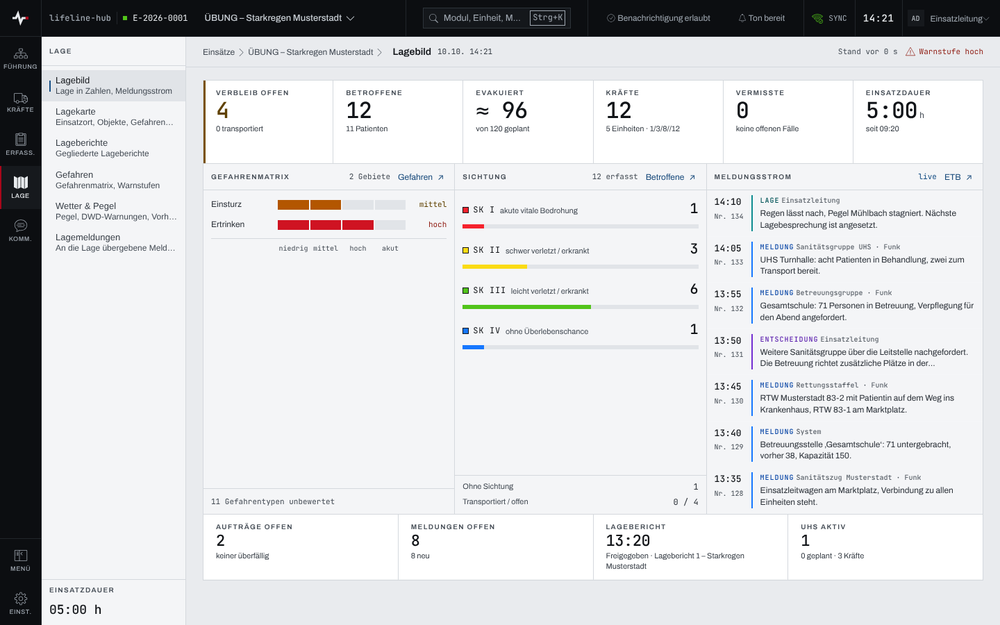
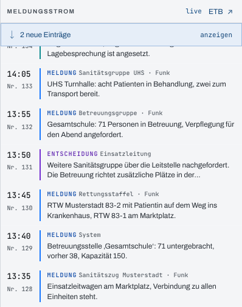

## Überblick

Das Lagebild zeigt die ganze Lage auf einem Schirm: sechs Kennzahlen, die Gefahren je Gefahrentyp,
die Sichtung der Betroffenen, den Strom der jüngsten Einträge aus dem Einsatztagebuch und darunter
den Führungsstand. Es ist eine reine Leseansicht für alle, die den Einsatz sehen; jede Zahl kommt
aus dem Modul, in dem sie erfasst wird.

## Abläufe

### Das Lagebild lesen

1. Im Bereich „Lage“ „Lagebild“ öffnen. Im Seitenkopf stehen Datum und Uhrzeit, rechts das Alter
   des Datenstands („Stand vor … s“) und, sobald eine erhöhte Warnstufe gilt, der Hinweis
   „Warnstufe …“.
2. Das Kennzahlenband lesen. Fest stehen „Betroffene“, „Kräfte“, „Vermisste“ und „Einsatzdauer“;
   die Plätze ganz links und in der Mitte richten sich nach der Lage (siehe Hintergrund).
3. Die drei Paneele darunter lesen: „Gefahrenmatrix“, „Sichtung“ und „Meldungsstrom“.

   

4. Am Fuß den Führungsstand lesen: „Aufträge offen“, „Meldungen offen“, der jüngste
   „Lagebericht“ und „UHS aktiv“.
5. Um ins Modul zu wechseln, den Verweis eines Paneels wählen, etwa „Gefahren ↗“ in der
   Gefahrenmatrix.

### Neue Einträge im Meldungsstrom anzeigen

1. Im Lagebild bleiben, während neue Einträge eingehen. Der Meldungsstrom schiebt sie nicht
   zwischen die gelesenen Zeilen, sondern kündigt sie oben an („… neue Einträge“).

   

2. „anzeigen“ wählen: Die neuen Einträge stehen oben im Strom, der Hinweis verschwindet.

## Hintergrund

### Die wechselnden Kennzahlen

- **Ganz links** steht der Leitpegel, sobald ein maßgeblicher Pegel festgelegt ist (Kapitel
  [Wetter und Pegel](wetter-pegel.md)); sonst „Verbleib offen“.
- **In der Mitte** steht „Evakuiert“, sobald eine Evakuierung angeordnet ist; sonst „Schäden
  offen“.

Wer die Plätze belegt, steht am Einsatz. Ändert sich das, während das Lagebild offen ist, tauscht
die Reihe nicht unter dem Blick: Ein Hinweis „Kennzahlreihe geändert: …“ bietet den neuen
Zuschnitt an, „übernehmen“ setzt ihn. „Vermisste“ nennt dazu, wie viele Fälle seit über vier
Stunden offen sind.

### Was die Paneele verdichten

- **Gefahrenmatrix:** je Gefahrentyp die höchste Warnstufe über alle Gefahrengebiete und
  Schutzobjekte; darunter, wie viele Gefahrentypen noch unbewertet sind. Bewertet wird im
  Kapitel [Gefahren](gefahren.md).
- **Sichtung:** die Betroffenen je Sichtungskategorie, dazu „Ohne Sichtung“ und „Transportiert /
  offen“.
- **Meldungsstrom:** die jüngsten Einträge des Einsatztagebuchs. Rechts im Kopf steht der Zustand
  der Leitung: „live“, „Verbindung wird aufgebaut“ oder „Verbindung unterbrochen“.
- **Führungsstand:** „Aufträge offen“ und „Meldungen offen“ zählen wie die Module selbst; ein
  überfälliger Auftrag oder eine überfällige Meldung steht hier hervorgehoben.

### Gesperrte Module und ohne Netz

Ist ein Modul für die Person nicht freigegeben, steht seine Kennzahl als „—“ mit Grund, nie als 0;
fällt eine Quelle aus, bleibt der Rest lesbar. Ohne Netz zeigt das Lagebild den zuletzt geladenen
Stand der vorgehaltenen Daten; die Gefahrenmatrix und die Pegel gehören nicht dazu (Kapitel
[Arbeiten ohne Netz](ohne-netz.md)).
