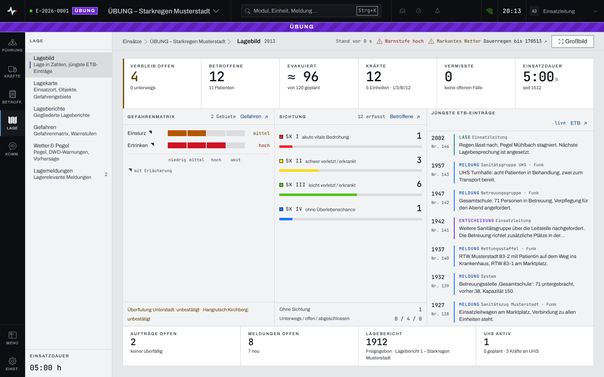
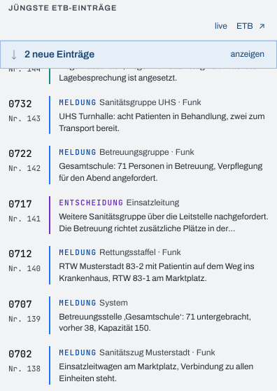

## Überblick

Das Lagebild zeigt, was los ist, auf einem Schirm: ganz oben, was gerade brennt, darunter sechs
Kennzahlen, die Gefahren je Gefahrentyp, die Sichtung der Betroffenen, den Strom der jüngsten
Einträge aus dem Einsatztagebuch und am Fuß den Stand von Lagebericht und Unfallhilfsstellen. Was
zu tun ist (Aufträge, Meldungen, offene Vorgänge), zeigt der [Überblick](ueberblick.md). Das
Lagebild ist eine reine Leseansicht für alle, die den Einsatz sehen; jede Zahl kommt aus dem
Modul, in dem sie erfasst wird.

## Abläufe

### Das Lagebild lesen

1. Im Bereich „Lage“ „Lagebild“ öffnen. Neben dem Titel steht der Datenstand („Stand 1430“, ab
   einer Minute mit Alter „Stand 1430 · vor 2 min“); rechts steht, sobald eine erhöhte Warnstufe gilt, der Hinweis
   „Warnstufe …“ und, sobald für den Einsatzort eine Wetterwarnung gilt oder angekündigt ist, ihre
   Marke, etwa „Markantes Wetter Dauerregen bis 21:00 ↗“. Die Marke öffnet „Wetter & Pegel“.
2. Die Zeile „Was brennt“ lesen: dieselbe wie im Überblick, mit offenen Sofortmeldungen ab
   Eingang, Vermissten, kritischen Abschnitten, überfälligen Rückmeldungen und Fristen (Kapitel
   [Überblick](ueberblick.md)). Ein Eintrag führt in sein Modul.
3. Das Kennzahlenband lesen. Fest stehen „Betroffene“, „Kräfte“, „Vermisste“ und „Einsatzdauer“;
   die Plätze ganz links und in der Mitte richten sich nach der Lage (siehe Hintergrund).
4. Die drei Paneele darunter lesen: „Gefahrenmatrix“, „Sichtung“ und „Jüngste ETB-Einträge“.

   

5. Am Fuß den Stand lesen: der jüngste „Lagebericht“ und „UHS aktiv“ mit den geplanten UHS und
   den Kräften an aktiven UHS, etwa „1 geplant · 3 Kräfte an UHS“.
6. Um ins Modul zu wechseln, den Verweis eines Paneels wählen, etwa „Gefahren ↗“ in der
   Gefahrenmatrix.

### Neue ETB-Einträge im Lagebild anzeigen

1. Im Lagebild bleiben, während neue Einträge eingehen. Das Paneel „Jüngste ETB-Einträge“ schiebt
   sie nicht zwischen die gelesenen Zeilen, sondern kündigt sie im Paneelkopf an („2 neu“, an der
   Stelle von „live“).

   

2. „2 neu“ wählen: Die neuen Einträge stehen oben im Paneel, der Knopf verschwindet, und im Kopf
   steht wieder „live“.

### Das Lagebild im Großbild zeigen

Für einen Beamer oder Wandbildschirm im Führungsraum, ab Tablet-Breite:

1. Im Seitenkopf des Lagebilds „Großbild“ wählen. Das Lagebild füllt den Bildschirm ohne Kopfleiste
   und Navigation: ganz oben die Zeile „Was brennt“, darunter die sechs Kennzahlen groß, dann die
   Gefahren je Typ (in der Reihe Sanitätsdienst der Verlauf), die Sichtung und der Stand mit
   Lagebericht und UHS.
2. Hat der Browser das Vollbild abgelehnt, steht oben „Vollbild“; es holt das Vollbild nach.
3. Zum Verlassen „Großbild verlassen“ wählen oder Esc drücken. Das Lagebild steht wieder an
   derselben Stelle.

## Hintergrund

### Großbild

Das Großbild ist nur zum Ansehen: Nichts darin führt in ein Modul oder ändert etwas. Die Zahlen
kommen aus derselben Zusammenstellung wie die Seite und laufen live mit. Bei 1920 × 1080 sind die
Zahlen so groß wie am Lagemonitor, auf einem kleineren oder größeren Bildschirm wächst alles im
selben Verhältnis mit, ohne Bildlauf. Die Zeile „Was brennt“ zeigt dieselben Einträge wie auf der
Seite, nur ohne Sprünge; was nicht in die Breite passt, steht als „+2“ ohne Liste. Die jüngsten
ETB-Einträge stehen nicht im Großbild. Gehen Alarme oder Hinweise ein, nennt das Großbild nur ihre Zahl („1 Alarm offen“), ohne Titel;
bearbeitet werden sie nach dem Verlassen in der Alarmzone. Ist das Netz weg oder die Live-Verbindung
getrennt, steht das oben („Ohne Netz“, „Verbindung getrennt“), und Uhr und Stand mit Alter zeigen, wie alt die Zahlen sind.
Tastenkürzel der App, etwa die Suche, wirken im Großbild nicht. Bei einer Übung trägt es die
Übungsmarke. Nach einem Neuladen steht die normale Seite da, das Großbild wird nicht gemerkt.

### Die wechselnden Kennzahlen

- **Ganz links** steht der Leitpegel, sobald ein maßgeblicher Pegel festgelegt ist (Kapitel
  [Wetter und Pegel](wetter-pegel.md)); sonst „Verbleib offen“.
- **In der Mitte** steht „Evakuiert“, sobald eine Evakuierung angeordnet ist. Ist in den
  Einstellungen des Einsatzes unter „Kennzahlen“ „Nachforderungen offen auf Platz 3“ gewählt,
  steht dort ohne Evakuierung „Nachforderungen offen“ (Kapitel
  [Einstellungen des Einsatzes und Module](einsatz-einstellungen.md)); sonst „Schäden offen“.
  „Nachforderungen offen“ zählt wie das Modulmenü und die Seite „Nachforderungen“: angefordert,
  zugesagt und unterwegs, darunter, wie viele unterwegs sind.

Im Sanitätsdienst lautet die Reihe anders, wenn sie in den Einstellungen des Einsatzes unter
„Kennzahlen“ als „Reihe Sanitätsdienst“ gewählt ist; ein Einsatz mit der Einsatzart
Sanitätsdienst beginnt mit ihr. Dann stehen dort „Kontakte“ (alle Hilfeleistungen außer
Vermissten, auch abgeschlossene, darunter der häufigste Anlass oder wie viele noch keinen haben),
„Letzte Stunde“ (darunter die Stunde davor), „In Versorgung“ (darunter in einer UHS und
unterwegs), „Transporte“ (wie im Einsatzbericht; ein nur angemeldeter Transport zählt nicht),
„Einheiten verfügbar“ (Einheiten mit einem verfügbaren Status, darunter der Bestand und die
Einheit mit den meisten Kontakten) und „Vermisste“. Statt der Gefahrenmatrix steht das Paneel
„Verlauf“; Pegel, Evakuierung und „Nachforderungen offen“ wirken in dieser Reihe nicht.

Wer die Plätze belegt, steht am Einsatz. Ändert sich das, während das Lagebild offen ist, tauscht
die Reihe nicht unter dem Blick: Ein Hinweis „Kennzahlreihe geändert: …“ bietet den neuen
Zuschnitt an, „übernehmen“ setzt ihn. „Vermisste“ nennt dazu, wie viele Fälle seit über vier
Stunden offen sind.

### Wetter im Seitenkopf

Die Wettermarke nennt die Warnung des Deutschen Wetterdienstes mit der höchsten Stufe, bei
gleicher Stufe die geltende vor der angekündigten, und zählt die übrigen („(+ 1 weitere)“). Sie
steht bei jeder amtlichen Stufe, ohne Ton und ohne Hinweis; eine neue Unwetterwarnung meldet der
Unwetterhinweis (Kapitel [Wetter und Pegel](wetter-pegel.md)). Ist „Wetter & Pegel“ für die Person
nicht freigegeben oder der Stand der Warnungen unbekannt, fehlt die Marke. Das Wetter steht nie im
Kennzahlenband: dessen Plätze folgen nur Festlegungen am Einsatz, nie einem Messwert.

### Was die Paneele verdichten

- **Gefahrenmatrix:** je Gefahrentyp mit einer Stufe über „keine“ oder einer Erläuterung die
  höchste Warnstufe über alle Gefahrengebiete und Schutzobjekte; ohne beides steht „Keine Gefahr
  über Stufe „keine“.“ Trägt irgendeine Zelle des Gefahrentyps eine Erläuterung, steht hinter
  seinem Namen dasselbe Dreieck wie in der Matrix, und unter der Legende „mit Erläuterung“; ein
  Screenreader liest „… · mit Erläuterung“. Eine Gefahr, zu der nur eine Erläuterung bei „keine“
  vorliegt, steht mit leerem Balken und „keine“ da. Den Text der Erläuterung zeigt das Paneel
  nicht; er steht auf der Seite „Gefahren“ unter der Matrix. Darunter stehen die
  Gebiete, deren Beurteilung noch nicht bestätigt ist, etwa „Hangrutsch Kirchberg: unbestätigt“,
  bei mehr als zwei nur ihre Zahl. Bewertet und beurteilt wird im Kapitel
  [Gefahren](gefahren.md).
- **Verlauf** (nur in der Reihe „Sanitätsdienst“): die Kontakte je Stunde der letzten zwölf
  Stunden bis zur laufenden, nach der Uhrzeit der Erfassung. Die Säulen sind nach dem Anlass der
  Hilfeleistung geteilt: Verletzung, Internistisch, Intoxikation und Hitze / Kälte in eigenen
  Farben, alle übrigen Anlässe und Kontakte ohne Anlass grau als „Übrige“. Über der höchsten
  Säule steht ihre Zahl, am Fuß „Spitze“ mit Stunde und Zahl. Wer auf eine Säule zeigt oder sie
  mit der Tastatur ansteuert, liest jeden Anlass einzeln. Namen stehen nirgends.
- **Sichtung:** die Betroffenen in Versorgung je Sichtungskategorie, dazu „Ohne Sichtung“ und
  „Unterwegs / offen / abgeschlossen“: unterwegs im Eigentransport, ohne Verbleib, abgeschlossen
  (übergeben, entlassen, Notunterkunft, Verbleib des Leichnams). Abgeschlossene zählen in keiner
  Sichtungskategorie; die Kennzahl „Betroffene“ nennt sie hinter den Patienten („3 Patienten · 2
  abgeschlossen“), „Verbleib offen“ zählt die Angetroffenen, bei denen noch nicht erfasst ist, wohin sie gegangen
  sind („wohin nicht erfasst“), und nennt, wie viele unterwegs sind.
- **Jüngste ETB-Einträge:** die jüngsten Einträge des Einsatztagebuchs aller Typen, nicht nur
  Meldungen. Rechts im Kopf steht der Zustand der Leitung: „live“, „Verbindung wird aufgebaut“
  oder „Verbindung unterbrochen“, ohne Netz oder Server „offline“. Ein berichtigter Eintrag trägt wie im Einsatztagebuch die Marke
  „berichtigt“ und den Sprung „→ Nr. …“ auf die jüngste Berichtigung.
- **Aufträge und Meldungen** stehen nicht im Lagebild, sondern im Überblick; was davon überfällig
  ist, nennt die Zeile „Was brennt“.

### Gesperrte Module und ohne Netz

Ist ein Modul für die Person nicht freigegeben, steht seine Kennzahl als „—“ mit Grund, nie als 0;
fällt eine Quelle aus, bleibt der Rest lesbar. Ohne Netz zeigt das Lagebild den zuletzt geladenen
Stand der vorgehaltenen Daten; die Gefahrenmatrix und die Pegel gehören nicht dazu (Kapitel
[Arbeiten ohne Netz](ohne-netz.md)).
