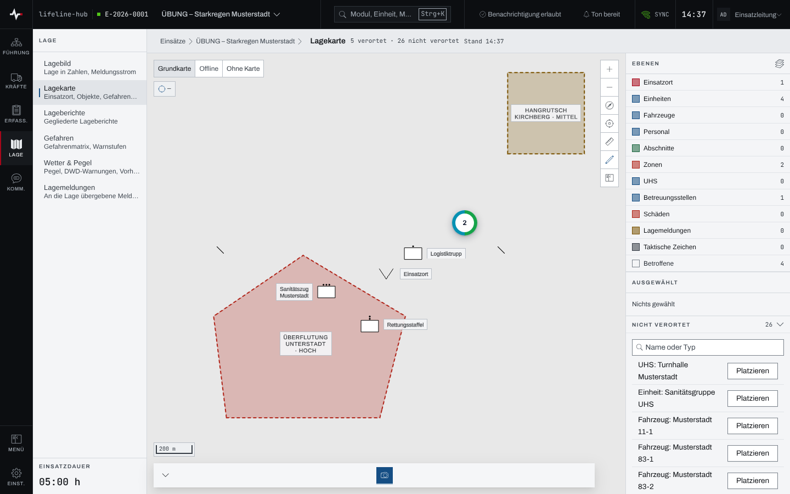
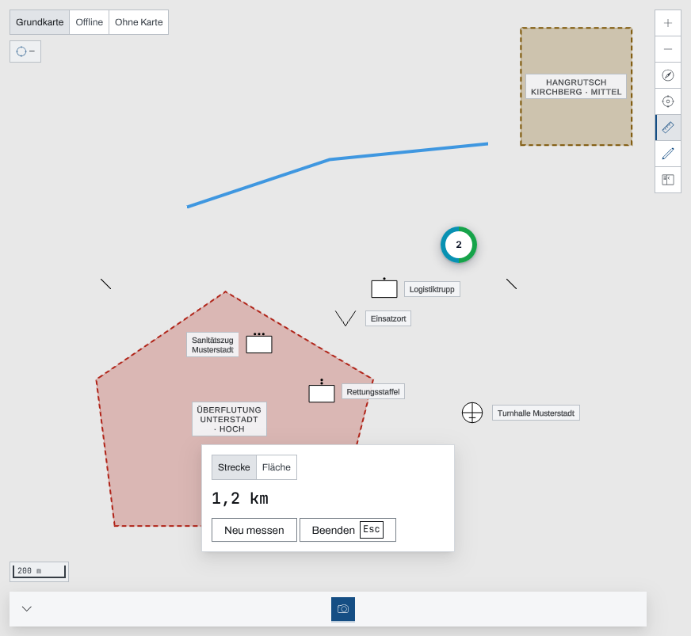
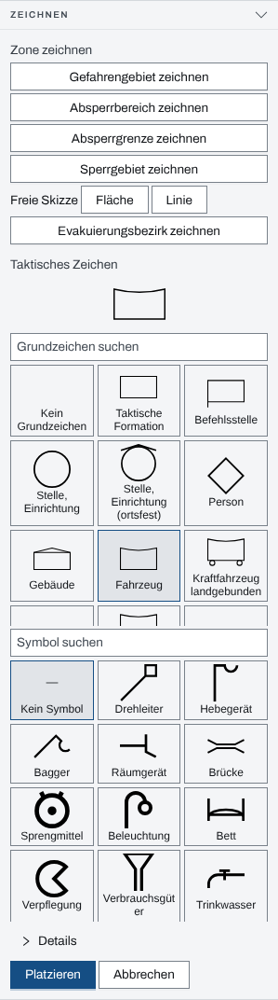
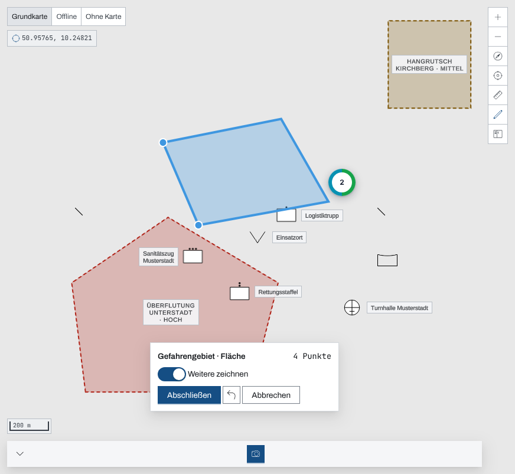

## Überblick

Die Lagekarte zeigt, wo was ist: Einsatzort, Einheiten, Zonen, Gefahrengebiete, Stellen,
Lagemeldungen und taktische Zeichen. Rechts steht die Leiste mit den Ebenen, dem gewählten Objekt,
den noch nicht verorteten Objekten und dem Zeichnen. Auf der Karte wird gelesen, verortet,
gezeichnet und gemessen. Lesen und Messen kann jede Person im Einsatz, Verorten und Zeichnen nur,
wer im Einsatz schreiben darf.

## Abläufe

### Die Karte lesen und ein Objekt verorten

1. Im Bereich „Lage“ „Lagekarte“ öffnen. Oben links die Kartengrundlage wählen: eine Online-Karte
   (Name nach Einrichtung), „Offline“ oder „Ohne Karte“.
2. In der Leiste unter „Ebenen“ eine Ebene über ihren Schalter aus- oder einblenden; die Zahl
   daneben nennt ihre Objekte.

   

3. Für ein Objekt ohne Ort unter „Nicht verortet“ „Platzieren“ wählen.
4. Auf die Stelle der Karte tippen, an die das Objekt gehört. Die App meldet „Objekt verortet“.

### Eine Strecke oder Fläche messen

1. Rechts an der Karte „Messen“ wählen.
2. Im Band unten „Strecke“ oder „Fläche“ wählen.
3. Die Punkte nacheinander auf die Karte tippen; der Wert wächst mit.
4. „Abschließen“ wählen. Der Wert bleibt stehen, „Neu messen“ beginnt eine neue Messung.

   

5. „Beenden“ wählen oder Esc drücken.

### Ein taktisches Zeichen setzen

1. In der Leiste im Paneel „Zeichnen“ „Taktisches Zeichen platzieren“ wählen.
2. Ein Grundzeichen wählen, bei Bedarf ein Symbol; beide Listen lassen sich durchsuchen. Unter
   „Details“ stehen die weiteren Angaben des Zeichens.

   

3. „Platzieren“ wählen und auf die Stelle der Karte tippen. Die App meldet „Taktisches Zeichen
   angelegt“.
4. Solange „Weitere platzieren“ an ist, setzt jeder weitere Tipp dasselbe Zeichen noch einmal.
   „Fertig“ beendet das Setzen.

### Eine Zone zeichnen

1. Im Paneel „Zeichnen“ unter „Zone zeichnen“ die Art wählen, etwa „Gefahrengebiet zeichnen“.
   Für eine freie Skizze „Fläche“ oder „Linie“ wählen.
2. Die Eckpunkte nacheinander auf die Karte tippen. Das Band unten zählt die Punkte;
   „Letzten Punkt zurück“ nimmt den letzten wieder weg.

   

3. Soll nur diese eine Zone entstehen, den Schalter „Weitere zeichnen“ ausschalten.
4. „Abschließen“ und danach „Speichern“ wählen. Die App meldet „Zone angelegt“.

## Hintergrund

### Tippen auf der Karte

Ein Tipp gehört genau einem Ziel: Ein Tipp auf ein Zeichen oder einen Marker wählt dieses Objekt;
liegen mehrere Flächen an der Stelle, fragt ein Menü, welche gemeint ist. Beim Messen setzt ein
Tipp auf einen Marker oder ein Bündel keinen Messpunkt, die Punkte gehören auf die freie Karte. Ein Rechtsklick oder ein langer Druck auf eine freie Stelle öffnet ein Menü
mit „Koordinate kopieren“, „Messen ab hier“ und, mit Schreibrecht, „Hier Zeichen setzen“.

### Verwerfen und Esc beim Zeichnen

Nach „Abschließen“ wirft „Verwerfen“ die Figur weg und beendet das Zeichnen. Esc geht dagegen
schrittweise zurück: Eine abgeschlossene, noch nicht gespeicherte Figur wird verworfen, und es geht
zurück zum Zeichnen; eine angefangene Figur wird verworfen; ohne Figur endet das Zeichnen. Schon
gespeicherte Zonen bleiben, der Knopf heißt dann „Fertig“ statt „Abbrechen“.

### Gefahrengebiete

Ein gezeichnetes Gefahrengebiet erscheint im Kapitel [Gefahren](gefahren.md) und wird dort
bewertet und benannt. Auf der Karte trägt es seinen Namen und die höchste Warnstufe als Text.

### Rechte

Lesen, Ebenen schalten und Messen gehen mit jeder Rolle. Verorten, Zeichnen und Zeichen setzen
brauchen das Schreibrecht im Einsatz: Einsatzleitung oder Führungspersonal in einem laufenden
Einsatz (Kapitel [Rechte im Einsatz](rechte-im-einsatz.md)). Ohne Schreibrecht fehlt das Paneel
„Zeichnen“.

### Ohne Netz

Zonen, Zeichen, Gefahrengebiete, Schäden, Lagemeldungen, Kartenbilder und die übrigen Objekte der
Karte hält die App für die Arbeit ohne Netz vor (Kapitel [Arbeiten ohne Netz](ohne-netz.md)).

Die Kartengrundlage ist davon getrennt: Eine Online-Karte holt der Server aus dem Internet,
„Offline“ zeigt eine Karte, die auf dem Server selbst liegt, und kommt ohne Internet aus. Ist eine
der beiden nicht eingerichtet, ist sie gesperrt und nennt den Grund. „Ohne Karte“ zeigt die
Objekte ohne Kartengrund.

## Grundlagen und Quellen

- Die taktischen Zeichen der Lagekarte folgen der DV 102.
