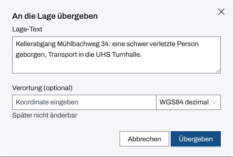
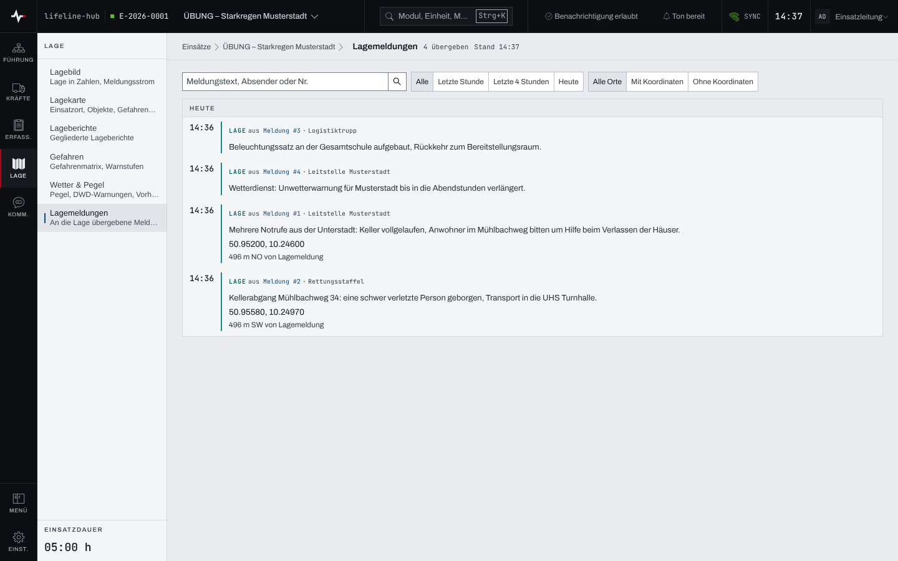

## Überblick

Nicht jede eingehende Meldung betrifft die Lage. Was die Lage betrifft, übergibt die Führung aus
dem Modul „Meldungen (eingehend)“ an die Lage, auf Wunsch mit eigenem Lage-Text und Ort. Das Modul
„Lagemeldungen“ zeigt diese übergebenen Meldungen als Zeitachse; verortete erscheinen zusätzlich
als Marker auf der Lagekarte.

## Abläufe

### Eine Meldung an die Lage übergeben

1. Im Bereich „Kommunikation“ „Meldungen (eingehend)“ öffnen.
2. An der Meldung „An Lage übergeben“ wählen. Hat die Meldung mehrere Aktionen, liegt es im Menü
   „Aktionen zu Meldung …“.
3. Den vorbelegten „Lage-Text“ prüfen und bei Bedarf kürzen oder umformulieren.
4. Ist der Ort bekannt, unter „Verortung (optional)“ die Koordinate eingeben.

   

5. „Übergeben“ wählen. Die App meldet „An die Lage übergeben“; die Meldung trägt danach
   „Lagerelevant ✓“.

### Lagemeldungen lesen und filtern

1. Im Bereich „Lage“ „Lagemeldungen“ öffnen. Je Tag, der jüngste zuerst, stehen die übergebenen
   Meldungen mit Zeit, Herkunft („aus Meldung #…“ und Absender), Lage-Text und, falls verortet,
   der Koordinate.

   

2. Zum Eingrenzen im Suchfeld nach Meldungstext, Absender oder Nummer suchen oder ein Zeitfenster
   wählen: „Letzte Stunde“, „Letzte 4 Stunden“ oder „Heute“.
3. Nach dem Ort filtern: „Mit Koordinaten“ oder „Ohne Koordinaten“. Der Kopf nennt dann „… von …
   übergeben“.
4. Um zur ursprünglichen Meldung zu springen, „Meldung #…“ in der Zeile wählen.

## Hintergrund

### Was die Übergabe bewirkt

- Eine Meldung wird genau einmal übergeben; danach fehlt „An Lage übergeben“ in ihrem Menü.
- Ohne eigenen Lage-Text gilt der Inhalt der Meldung.
- Die Verortung lässt sich später nicht mehr ändern („Später nicht änderbar“). Ohne Koordinate
  steht die Lagemeldung nur in der Zeitachse, mit Koordinate auch auf der Lagekarte in der Ebene
  „Lagemeldungen“ (Kapitel [Lagekarte, Zeichnen und Messen](lagekarte.md)).
- Die Meldung selbst bleibt im Modul „Meldungen (eingehend)“ und wird dort weiter bearbeitet.

### Leere Ansicht

Ist noch nichts übergeben, steht „Noch keine Lagemeldungen“ mit dem Knopf „Zu den Meldungen“.
Passt nichts zum Filter, steht „Keine Lagemeldung passt zum Filter“ mit „Filter zurücksetzen“.

### Rechte und ohne Netz

Übergeben dürfen alle, die im Modul „Meldungen (eingehend)“ schreiben dürfen: Einsatzleitung und
Führungspersonal eines laufenden Einsatzes (Kapitel [Rechte im Einsatz](rechte-im-einsatz.md)).
Die Lagemeldungen hält die App für die Arbeit ohne Netz vor (Kapitel
[Arbeiten ohne Netz](ohne-netz.md)).
