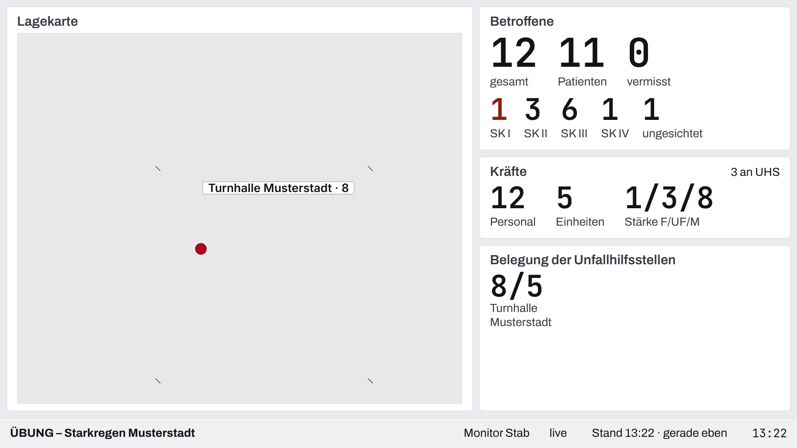
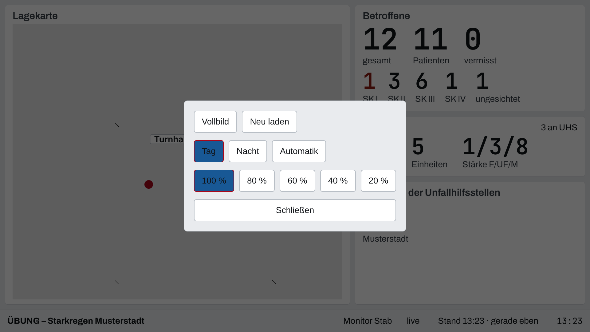

## Überblick

Der **Lagemonitor** ist ein Großbildschirm im Stabsraum oder Führungsfahrzeug. Er zeigt das
Lagebild des Einsatzes verdichtet in festen Kacheln: Lagekarte, Betroffene, Kräfte und die
Belegung der Unfallhilfsstellen, unten eine Statusleiste. Er zeigt **keine Namen** und wird
nicht bedient: Antippen und Ziehen auf den Kacheln bleiben ohne Wirkung.

Den Monitor koppelt die Einsatzleitung mit der Ansicht „Lagemonitor“ (siehe
[Geräte koppeln](geraete-koppeln.md)). Gekoppelt wird wie bei jedem Gerät (siehe
[Gerät bedienen](geraet-bedienen.md)).

## Abläufe

### Anzeige starten

1. Den Monitor koppeln. Er öffnet das Großbild mit dem Knopf „Anzeige starten“.
2. „Anzeige starten“ wählen. Der Monitor wechselt in den Vollbildmodus und hält den Bildschirm
   wach.

   

Kann der Browser den Bildschirm nicht wach halten, steht über der Statusleiste: „Dieser Browser
kann den Bildschirm nicht wach halten: bitte den Bildschirmschoner am Gerät abschalten.“

### Lagebild lesen

1. „Betroffene“ zählt gesamt, Patienten und vermisst, darunter die Sichtungskategorien SK I bis
   SK IV und „ungesichtet“.
2. „Kräfte“ zählt Personal, Einheiten und die Stärke F/UF/M; oben rechts steht, wie viele Kräfte an
   Unfallhilfsstellen arbeiten.
3. „Belegung der Unfallhilfsstellen“ nennt je UHS Belegte und Plätze, die vollsten zuerst, bis zu
   sechs; der Rest steht als „+… weitere“.
4. Die Lagekarte zeigt den Einsatzort und jede verortete UHS mit ihrer Belegung.
5. Die Statusleiste nennt Einsatz, Gerät, Verbindung („live“, „verbinde …“, „getrennt“), den
   Stand der Daten mit Alter und die Uhr.

### Gerätemenü öffnen

1. Drei Sekunden lang auf die Statusleiste drücken. Das Gerätemenü öffnet sich.

   

2. „Vollbild“ oder „Neu laden“ wählen, die Darstellung („Tag“, „Nacht“, „Automatik“) oder eine
   Helligkeit von 100 % bis 20 % einstellen.
3. „Schließen“ wählen. Ohne Bedienung schließt das Menü nach 30 Sekunden von selbst.

## Hintergrund

### Aktualität

Der Monitor holt das Lagebild alle 30 Sekunden neu. Ist der Stand älter als zwei Minuten, steht
in der Statusleiste hervorgehoben „Veraltet · Stand …“. Dann zuerst die Verbindung prüfen; „Neu
laden“ im Gerätemenü baut die Seite neu auf.

### Was der Monitor zeigt und was nicht

Der Monitor zeigt nur Zahlen und die Karte, keine Personendaten und keine Namen. Er schreibt
nichts: Er ist ein reiner Beobachter des Einsatzes. Hat der Einsatz keinen verorteten Einsatzort
und keine verortete UHS, zeigt die Kartenkachel „Kein Einsatzort verortet“.

### Ende der Kopplung

Wie jedes gekoppelte Gerät verliert der Monitor seinen Zugriff mit dem Widerruf, dem Ablauf der
Kopplung oder dem Abschluss des Einsatzes und zeigt dann „Kopplung beendet“. Für einen
Dauerbetrieb über 24 Stunden verlängert die Einsatzleitung die Kopplung rechtzeitig (siehe
[Geräte koppeln](geraete-koppeln.md)).
