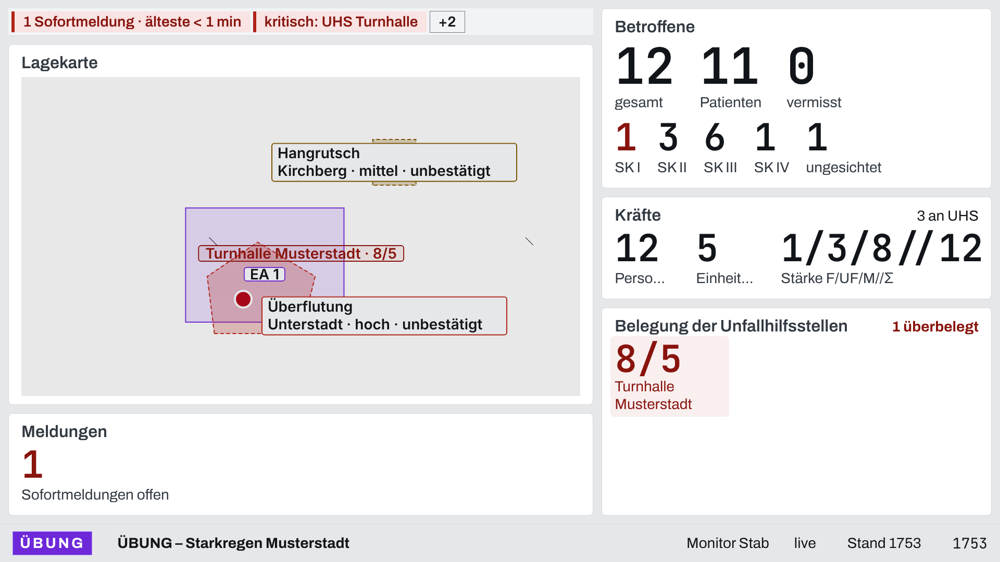

## Überblick

Der **Lagemonitor** ist ein Großbildschirm im Stabsraum oder Führungsfahrzeug. Er zeigt das
Lagebild des Einsatzes verdichtet: ganz oben die Zeile „Was brennt“, darunter feste Kacheln mit
der Lagekarte, den offenen Sofortmeldungen, den nächsten Programmpunkten der Veranstaltung, den
Betroffenen, den Kräften und der Belegung der Unfallhilfsstellen, unten eine Statusleiste. Er zeigt
**keine Namen von Personen** und keinen Meldungstext, spielt keinen Ton und wird nicht bedient: Antippen und
Ziehen auf den Kacheln bleiben ohne Wirkung.

Den Monitor koppelt die Einsatzleitung mit der Ansicht „Lagemonitor“ (siehe
[Geräte koppeln](geraete-koppeln.md)). Gekoppelt wird wie bei jedem Gerät (siehe
[Gerät bedienen](geraet-bedienen.md)).
Eine eigene Anzeige außerhalb der App liest das Lagebild als Anbindung, ohne Kopplung (siehe
[Externe Lagemonitore](externe-lagemonitore.md)).

## Abläufe

### Anzeige starten

1. Den Monitor koppeln. Er öffnet das Großbild mit dem Knopf „Anzeige starten“.
2. „Anzeige starten“ wählen. Der Monitor wechselt in den Vollbildmodus und hält den Bildschirm
   wach.

   

Kann der Browser den Bildschirm nicht wach halten, steht über der Statusleiste: „Dieser Browser
kann den Bildschirm nicht wach halten: bitte den Bildschirmschoner am Gerät abschalten.“

### Lagebild lesen

1. Die Zeile „Was brennt“ über den Kacheln nennt dasselbe wie im Überblick und im Lagebild,
   in derselben Folge (Kapitel [Überblick](ueberblick.md)): offene Sofortmeldungen,
   überfällige Bestätigungen, Vermisste, kritische Abschnitte mit Namen, Einheiten mit
   überfälliger Rückmeldung mit Namen und überfällige Aufträge in Rot, dringende Meldungen,
   fällige Erinnerungen und überfällige Nachforderungen in Gelb. Den Ausfall nennt der Monitor
   nicht. Was nicht in die Zeile passt, steht als „+…“.
2. „Betroffene“ zählt gesamt, Patienten und vermisst, darunter die Sichtungskategorien SK I bis
   SK IV und „ungesichtet“. Patienten und Sichtungskategorien zählen nur, wer noch in Versorgung
   oder unterwegs ist; übergebene, entlassene und abgeschlossene Patienten zählen nur in
   „gesamt“. Ist am Einsatz die Reihe „Sanitätsdienst“ gewählt (Kapitel [Lagebild](lagebild.md)),
   steht dort „Hilfeleistungen“: Kontakte, letzte Stunde und vermisst, darunter in Versorgung,
   Transporte und SK I.
3. „Kräfte“ zählt Personal, Einheiten und die Stärke F/UF/M; oben rechts steht, wie viele Kräfte an
   Unfallhilfsstellen arbeiten.
4. „Belegung der Unfallhilfsstellen“ nennt je UHS Belegte und Plätze, die vollsten zuerst, bis zu
   sechs; der Rest steht als „+… weitere“.
5. Die Lagekarte zeigt den Einsatzort, jede verortete UHS mit ihrer Belegung, die Gefahrenzonen
   (Gefahrengebiete, Absperrungen, Sperrgebiete) und die gezeichneten Flächen der
   Einsatzabschnitte mit ihrer Kurzbezeichnung, ohne Kurzbezeichnung mit ihrem Namen.
6. „Meldungen“ unter der Karte zählt die „Sofortmeldungen offen“, die noch niemand bestätigt
   hat.
7. „Ablauf“ neben „Meldungen“ nennt die nächsten drei Programmpunkte aus den
   [Einsatzdaten](einsatzdaten.md): oben Uhrzeit und Abstand, etwa „in 1 h 30 min“, darunter
   die Bezeichnung über die ganze Breite der Kachel.
   Ein Punkt fällt mit seiner Uhrzeit heraus; steht keiner mehr an, fehlt die Kachel.
8. Steigt die Zahl der offenen Sofortmeldungen oder die Zahl in SK I, ist sie eine Minute lang
   farbig hinterlegt, und oben in der Kachel steht „Neue Sofortmeldung“ bzw. „Neu in SK I“.
9. Die Statusleiste nennt Einsatz, Gerät, Verbindung („live“, „verbinde …“, „getrennt“), den
   Stand der Daten mit Alter und die Uhr. Bei einer Übung steht vor dem Einsatz die violette
   Marke „ÜBUNG“; „Einsatzart nicht geladen“ heißt, dass der Einsatz gerade nicht abrufbar ist.

### Gerätemenü öffnen

1. Drei Sekunden lang auf die Statusleiste drücken. Das Gerätemenü öffnet sich.

   

2. „Vollbild“ oder „Neu laden“ wählen, die Darstellung („Tag“, „Nacht“, „Automatik“) oder eine
   Helligkeit von 100 % bis 20 % einstellen.
3. „Schließen“ wählen. Ohne Bedienung schließt das Menü nach 30 Sekunden von selbst.

## Hintergrund

### Aktualität

Der Monitor holt das Lagebild alle 30 Sekunden neu; eine neue Sofortmeldung meldet der Server ihm
sofort, ohne Inhalt, und er holt das Lagebild dann gleich. Ist der Stand älter als zwei Minuten, steht
in der Statusleiste hervorgehoben „Veraltet · Stand …“. Dann zuerst die Verbindung prüfen; „Neu
laden“ im Gerätemenü baut die Seite neu auf.

### Offene Sofortmeldungen und neue Dringlichkeit

Als Sofortmeldung zählt eine Meldung der Art „Sofortmeldung“ oder mit der Priorität „Sofort“.
Offen bleibt sie, bis sie bestätigt oder erledigt ist (siehe [Meldungen](meldungen.md)). Der
Monitor erhält nur die Zahl, weder Text noch Absender oder Empfänger.

Ob eine Zahl gestiegen ist, vergleicht der Monitor mit seinem letzten Stand. Eine neue
Sofortmeldung erscheint nach wenigen Sekunden, ohne Verbindung spätestens mit dem nächsten Abruf. Der
erste Stand nach dem Start oder nach „Neu laden“ wird nicht hervorgehoben, eine sinkende oder
gleichbleibende Zahl nie. Die Hervorhebung blinkt nicht und klingt nicht; fällt die Zahl auf
null, endet sie vorzeitig.

### Was der Monitor zeigt und was nicht

Der Monitor zeigt nur Zahlen, die Karte, die Bezeichnungen der nächsten Programmpunkte und in der
Zeile „Was brennt“ die Namen von Einheiten und Abschnitten, keine Personendaten und keine Namen von
Personen, keine Texte von Meldungen, Aufträgen oder Erinnerungen. Ein Programmpunkt löst am Monitor keinen Alarm aus und wird nicht
hervorgehoben. Er schreibt
nichts: Er ist ein reiner Beobachter des Einsatzes. Hat der Einsatz keinen verorteten Einsatzort,
keine verortete UHS und keine Fläche, zeigt die Kartenkachel „Kein Einsatzort verortet“.
Kann der Browser des Monitors keine Karte zeichnen (Voraussetzung wie bei der
[Lagekarte](lagekarte.md)), steht in der Kartenkachel „Karte auf diesem Gerät nicht darstellbar“;
alle übrigen Kacheln und die Statusleiste laufen weiter.

Auf der Karte fehlen Evakuierungsbezirke und freie Skizzen, außerdem Beschriftung und Notiz der
Gefahrenzonen sowie Leitung und Bemerkung der Abschnitte: Freitexte können Personen nennen.
Gefahrenzonen erscheinen unabhängig von der Kartenansicht, in der sie gezeichnet wurden.

### Ende der Kopplung

Wie jedes gekoppelte Gerät verliert der Monitor seinen Zugriff mit dem Widerruf, dem Ablauf der
Kopplung oder dem Abschluss des Einsatzes und zeigt dann „Kopplung beendet“. Für einen
Dauerbetrieb über 24 Stunden verlängert die Einsatzleitung die Kopplung rechtzeitig (siehe
[Geräte koppeln](geraete-koppeln.md)).
