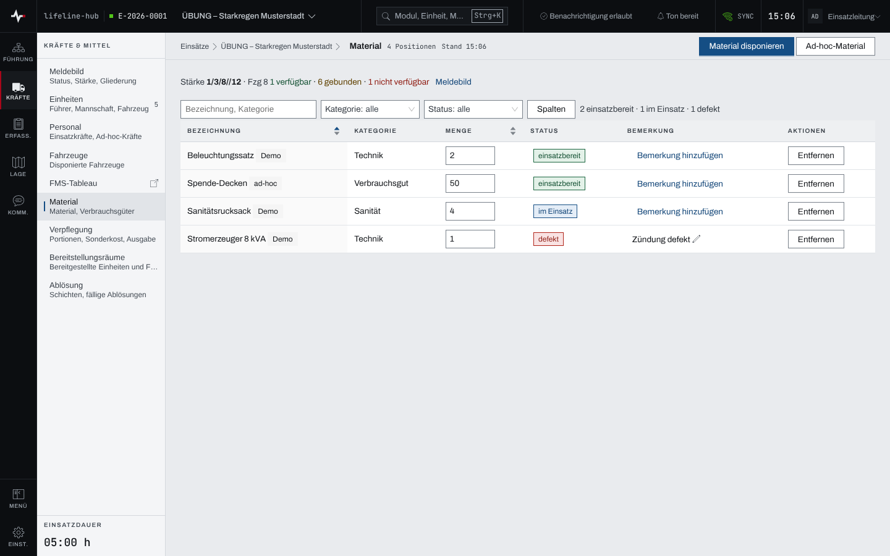
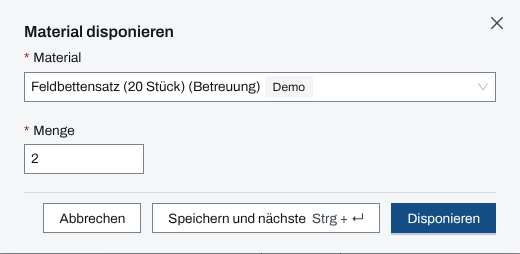
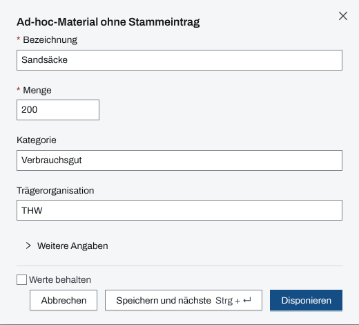

## Überblick

Das Modul **Material** führt Geräte und Verbrauchsgüter, die im Einsatz sind: Posten aus dem
Materialstamm der Organisation und Ad-hoc-Material ohne Stammeintrag, etwa Spenden oder Material
einer fremden Organisation. Je Posten stehen Bezeichnung, Kategorie, Menge, Status und Bemerkung.

Die Führung liest hier, was einsatzbereit, im Einsatz, defekt oder verbraucht ist. Disponieren und
ändern dürfen Einsatzleitung und Führungspersonal.

## Abläufe

### Die Materialliste lesen

1. Unter „Kräfte & Mittel“ „Material“ öffnen.
2. Die Liste ist nach Status gruppiert; die Zeile über der Tabelle zählt die Posten je Status. In
   „Bezeichnung, Kategorie“ suchen oder nach „Kategorie“ und „Status“ filtern.

   

### Material aus dem Stamm disponieren

Für Einsatzleitung und Führungspersonal:

1. „Material disponieren“ wählen.
2. Unter „Material“ einen Posten wählen und die „Menge“ eingeben.

   

3. „Disponieren“ wählen, oder „Speichern und nächste“ für den nächsten Posten.

### Ad-hoc-Material erfassen

Für Einsatzleitung und Führungspersonal, wenn ein Posten nicht im Materialstamm steht:

1. „Ad-hoc-Material“ wählen.
2. „Bezeichnung“ und „Menge“ eingeben, bei Bedarf „Kategorie“, „Trägerorganisation“ und unter
   „Weitere Angaben“ die „Bestandsnummer“.

   

3. „Disponieren“ wählen. Mit „Speichern und nächste“ und „Werte behalten“ bleiben Kategorie und
   Trägerorganisation für den nächsten Posten stehen.

Ad-hoc-Posten tragen in der Liste die Marke „ad-hoc“.

### Menge, Status und Bemerkung ändern

Für Einsatzleitung und Führungspersonal:

1. In der Spalte „Menge“ die neue Menge eintippen und mit Enter bestätigen oder das Feld verlassen.
   Die Menge ist mindestens 1.
2. In der Spalte „Status“ einen Status wählen: einsatzbereit, im Einsatz, defekt, verbraucht oder
   Desinfektion nötig.
3. In der Spalte „Bemerkung“ „Bemerkung hinzufügen“ wählen und den Text eintragen.

### Material aus dem Einsatz entfernen

Für Einsatzleitung und Führungspersonal:

1. In der Zeile des Postens „Entfernen“ wählen.
2. Die Rückfrage „Aus Einsatz entfernen?“ mit „Aus Einsatz entfernen“ bestätigen.

## Hintergrund

### Mehrere Posten derselben Art

Derselbe Stammposten lässt sich mehrmals disponieren, jeweils als eigene Zeile mit eigener Menge und
eigenem Status. So lässt sich eine Menge auf mehrere Einheiten aufteilen. Die Auswahl bietet den
Materialstamm an, soweit er in Dienst steht; Demo-Posten stehen in einer eigenen Gruppe am Ende.

### Status

Ein disponierter Posten beginnt mit „einsatzbereit“. Die fünf Statuswerte sind fest und gelten für
jede Organisation.

### Einheiten und Meldebild

Einer Einheit wird Material im Modul [Einheiten](einheiten.md) zugeordnet. Im Meldebild steht
Material unter der aufgeklappten Einheit und im übernommenen Lagebericht; die Zahl der Kräfte im
Meldebild zählt nur Personal und Fahrzeuge (Kapitel [Meldebild und Kräfte-Zeitachse](meldebild.md)).

### Einsatztagebuch

Disponieren, jede Mengen- und Statusänderung und das Entfernen stehen im Einsatztagebuch, mit alter
und neuer Menge bzw. altem und neuem Status. Eine Bemerkung ändert es nicht.

### Rechte und ohne Netz

Lesen darf, wer das Modul Material sieht. Disponieren, ändern und entfernen dürfen Einsatzleitung
und Führungspersonal, solange der Einsatz läuft (Kapitel [Rechte im Einsatz](rechte-im-einsatz.md)).
Ohne Netz bleibt die Liste mit dem zuletzt geladenen Stand lesbar; ändern lässt sich nichts (Kapitel
[Ohne Netz](ohne-netz.md)).
