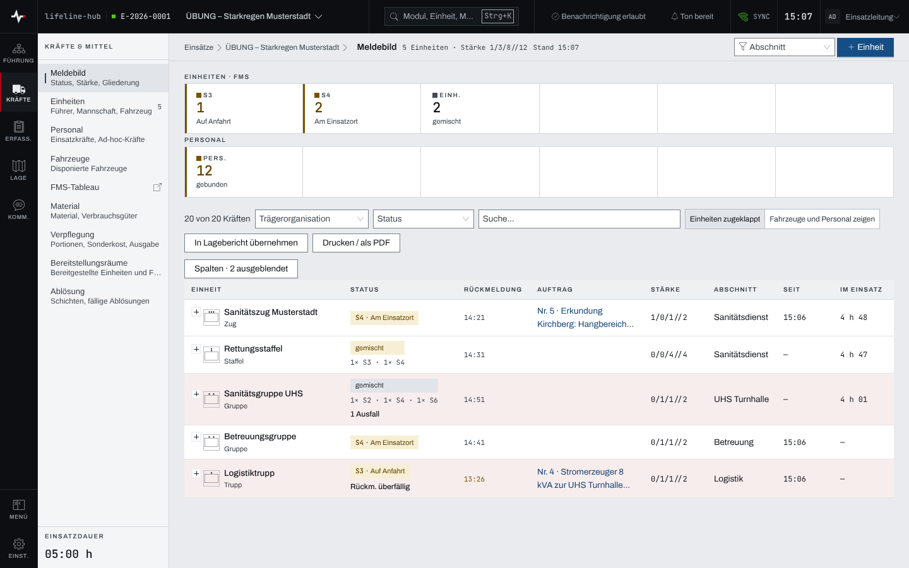
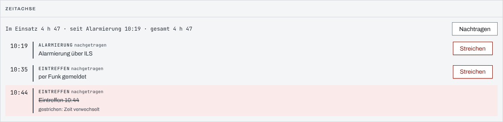
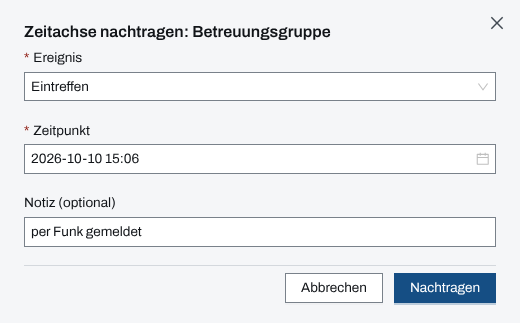

## Überblick

Das **Meldebild** zeigt auf einer Seite, was an Kräften im Einsatz ist: je Einheit Status, letzte
Rückmeldung, laufenden Auftrag, Stärke, Abschnitt und Einsatzdauer. Darüber zählt ein Statusband die
Einheiten je FMS-Status und das Personal je Statuskategorie. Es ist die Seite für den Lagevortrag
und für die Frage, wo etwas fehlt.

Die **Kräfte-Zeitachse** hält je Einheit und Person fest, wann sie alarmiert wurde, eingetroffen
ist, abgelöst oder entlassen wurde. Aus ihr rechnet die App Einsatzdauer und Ruhezeit.

Beides liest, wer die Module Einheiten und Personal sieht; Einsatzleitung und Führungspersonal
setzen Status, tragen nach und streichen.

## Abläufe

### Das Meldebild lesen

1. Unter „Kräfte & Mittel“ das „Meldebild“ öffnen. Der Kopf nennt die Zahl der Einheiten und die
   Stärke (Führer/Unterführer/Mannschaft//Gesamt).
2. Im Statusband ablesen, wie viele Einheiten in welchem FMS-Status stehen und wie viel Personal in
   welcher Kategorie. Eine eigene Kachel „keine Rückmeldung“ zählt Einheiten, die sich noch nie
   zurückgemeldet haben.

   

3. Im Raster je Einheit „Status“, „Rückmeldung“ (Uhrzeit der letzten), „Auftrag“ (der jüngste
   offene, als Verweis), „Stärke“, „Abschnitt“, „Seit“ und „Im Einsatz“ lesen. Eine getönte Zeile
   nennt ihren Grund als Wort, etwa „1 Ausfall“ oder „Rückm. überfällig“.
4. Mit „+“ vor einer Einheit ihre Fahrzeuge, ihr Personal und ihr Material aufklappen, mit
   „Fahrzeuge und Personal zeigen“ alle Einheiten auf einmal.
5. Zum Eingrenzen oben rechts unter „Abschnitt“ einen Einsatzabschnitt wählen, in der Werkzeugzeile
   nach „Trägerorganisation“ oder „Status“ (verfügbar, gebunden, nicht verfügbar) filtern oder in
   „Suche...“ einen Namen eingeben. Die Zahl links, etwa „20 von 20 Kräften“, nennt, wie viele
   Kräfte die Auswahl zeigt; „Filter zurücksetzen“ hebt alle Filter auf.

Die Zeile „Ohne Einheit“ sammelt Fahrzeuge, Personal und Material, die keiner Einheit zugeordnet
sind. Unter „Spalten“ lassen sich Spalten aus- und einblenden; „Funkrufname“ und „Fahrzeuge und
Personal (bereit · gebunden · Ausfall)“ erscheinen nur auf breiten Bildschirmen und nicht im Druck.

### Das Meldebild in den Lagebericht übernehmen oder drucken

1. Das Meldebild wie gewünscht eingrenzen.
2. „In Lagebericht übernehmen“ wählen. Die App legt aus der Auswahl einen Lagebericht
   „Kräftemeldebild“ mit Datum-Zeit-Gruppe an, gegliedert nach Abschnitten, und öffnet ihn.
3. Für Papier „Drucken / als PDF“ wählen. Der Druck klappt alle Einheiten auf und nennt im Kopf
   Stand, Umfang und die gewählte Auswahl.

„In Lagebericht übernehmen“ steht nur Einsatzleitung und Führungspersonal zur Verfügung.

### Die Zeitachse einer Kraft ansehen

1. Unter „Einheiten“ eine Einheit öffnen und zum Paneel „Zeitachse“ gehen. Für eine Person unter
   „Personal“ ihre Zeile aufklappen.
2. Die Dauerzeile lesen, etwa „Im Einsatz 4 h 47 · seit Alarmierung 07:24 · gesamt 4 h 47“. Nach
   einer Entlassung oder Ablösung steht dort die Ruhezeit.

   

3. Darunter die Ereignisse nach Zeit lesen, jedes mit seiner Herkunft: „aus Status“, „über Einheit
   «…»“, „aus Ablösung“ oder „nachgetragen“. Gestrichene bleiben durchgestrichen mit Grund stehen.

### Ein Ereignis nachtragen

Für Einsatzleitung und Führungspersonal:

1. Im Paneel „Zeitachse“ „Nachtragen“ wählen.
2. Unter „Ereignis“ Alarmierung, Eintreffen oder Entlassung wählen.
3. Den „Zeitpunkt“ prüfen; er steht auf jetzt und darf nicht in der Zukunft liegen. Bei Bedarf eine
   „Notiz (optional)“ eingeben.

   

4. „Nachtragen“ wählen.

### Ein Ereignis streichen

Für Einsatzleitung und Führungspersonal:

1. Am falschen Ereignis „Streichen“ wählen.
2. Im Dialog „Ereignis streichen“ einen „Grund“ eingeben; ohne Grund lässt sich nicht streichen.
3. „Streichen“ wählen. Das Ereignis bleibt durchgestrichen mit Grund sichtbar.

## Hintergrund

### Woher der Status einer Einheit kommt

Hat eine Einheit Fahrzeuge, folgt ihr Status deren FMS-Status. Stehen die Fahrzeuge verschieden,
zeigt die Zelle „gemischt“ und darunter die Verteilung, etwa „1× S3 · 1× S4“. Nur eine Einheit ohne
Fahrzeug bekommt einen Status von Hand: Einsatzleitung und Führungspersonal öffnen dafür in ihrer
Spalte „Status“ das Statusmenü und wählen einen Wert aus dem FMS-Katalog, „kein Status“ entfernt
ihn. Jeder Wechsel steht im Einsatztagebuch, und „Seit“ zeigt, seit wann er gilt.

### Rückmeldung und Frist

Als Rückmeldung zählt jede Meldung, die an die Einheit gebunden ist, gleich welcher Art. Ist die
letzte älter als die Frist, steht ihre Uhrzeit hervorgehoben und die Zeile trägt „Rückm.
überfällig“; ohne jede Rückmeldung steht „—“ und die Zeile trägt „keine Rückm.“. Die Frist beträgt
60 Minuten, solange nichts anderes eingestellt ist. Einsatzleitung und Führungspersonal ändern sie
in den Einstellungen des Einsatzes unter „Verhalten & Automatik“, Feld „Rückmeldefrist Einheiten
(Minuten)“. In der Verwaltung unter „Einsatz-Vorgaben“ steht dasselbe Feld als Vorgabe der
Organisation; sie gilt für jeden Einsatz ohne eigene Frist.

### Wie die Zeitachse entsteht

- **Aus dem Status:** ein Statuswert im FMS- oder Personalkatalog kann ein Ereignis auslösen. Eine
  neue Organisation bringt das für Personal mit: „alarmiert“ (Alarmierung), „im Einsatz“
  (Eintreffen) und „abgemeldet“ (Entlassung). Bei einer Einheit zählt das erste Fahrzeug, das einen
  solchen Status meldet; die Entlassung erst, wenn alle Fahrzeuge entlassen sind.
- **Über die Einheit:** ein Ereignis der Einheit gilt auch für die Personen, die ihr in diesem
  Augenblick zugeordnet sind. Eine Streichung an der Einheit streicht diese Einträge mit.
- **Aus der Ablösung:** der Vollzug einer Ablösung beendet den Einsatzabschnitt der abgelösten
  Einheit. Dieses Ereignis lässt sich nicht streichen, nur mit der Rücknahme des Vollzugs aufheben
  (Kapitel [Ablösung](abloesung.md)).
- **Nachgetragen:** von Hand, mit Eintrag im Einsatztagebuch. Ein Nachtrag an einer Einheit gilt
  ebenfalls für ihre jetzt zugeordneten Personen.

Ereignisse werden nie geändert oder gelöscht, nur gestrichen. Die Streichung ist endgültig.

### Einsatzdauer und Ruhezeit

Die Einsatzdauer zählt ab der Alarmierung, fehlt sie, ab dem Eintreffen. „gesamt“ addiert alle
Einsatzabschnitte der Kraft, „Ruhe“ zählt seit dem Ende des letzten. Ohne Ereignis steht keine Zahl,
sondern „—“. Grenzwerte und Warnungen gibt es nicht; die Zahl steht neutral da. Die Dauer erscheint
im Meldebild unter „Im Einsatz“, bei Einheiten im Paneel „Zeitachse“ und im Personal in den Spalten
„Einsatzdauer“ und „Ruhe“. Der Stab zeigt sie nicht.

### Rechte

Lesen darf, wer die Module Einheiten und Personal sieht. Status setzen, nachtragen, streichen und in
den Lagebericht übernehmen dürfen Einsatzleitung und Führungspersonal, solange der Einsatz läuft
(Kapitel [Rechte im Einsatz](rechte-im-einsatz.md)).

### Ohne Netz

Meldebild und Zeitachse bleiben mit dem zuletzt geladenen Stand lesbar. Status setzen, Nachtragen
und Streichen brauchen das Netz (Kapitel [Ohne Netz](ohne-netz.md)).
