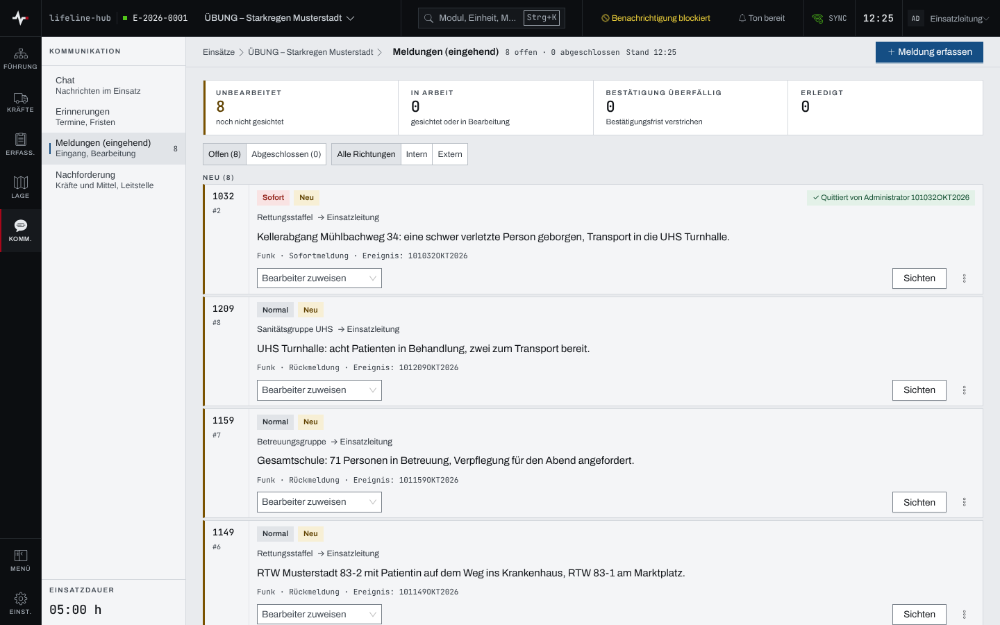
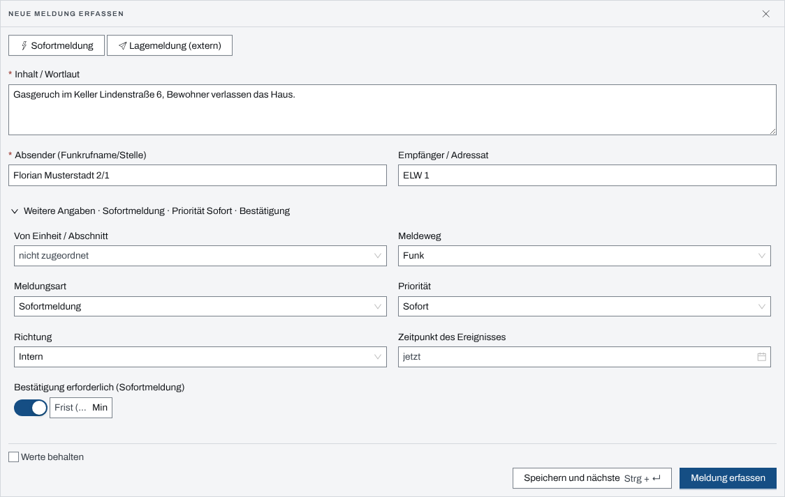

## Überblick

Das Modul „Meldungen (eingehend)“ sammelt, was von außen oder aus den eigenen Einheiten an die
Führung kommt: Funksprüche, Anrufe, persönliche Meldungen. Jede Meldung hat einen Wortlaut, einen
Absender, auf Wunsch einen Empfänger, eine Meldungsart und eine Priorität. Sie durchläuft die
Stufen **Neu**, **Gesichtet**, **In Bearbeitung** und **Erledigt**.

Eine **Sofortmeldung** verlangt eine Bestätigung. Bleibt sie über die Frist hinaus unbestätigt,
schlägt die App Alarm.

Lesen dürfen alle mit Zugang zum Einsatz. Erfassen und Bearbeiten dürfen Einsatzleitung und
Führungspersonal, solange der Einsatz läuft (siehe [Rechte im Einsatz](rechte-im-einsatz.md)).

## Abläufe

### Meldungen sichten und abarbeiten

1. Im Einsatz das Modul „Meldungen (eingehend)“ öffnen. Oben stehen die Kennzahlen
   „Unbearbeitet“, „In Arbeit“, „Bestätigung überfällig“ und „Erledigt“.

   

2. Mit „Offen“ und „Abgeschlossen“ die Ansicht wählen, mit „Alle Richtungen“, „Intern“ und
   „Extern“ die Richtung.
3. An einer Karte die nächste Stufe wählen: „Sichten“, dann „Bearbeitung beginnen“, dann „Als
   erledigt melden“. Die Rückfrage „Meldung auf „Erledigt“ setzen?“ schließt die Meldung ab.
4. Bei Bedarf unter „Bearbeiter zuweisen“ eine Person aus dem Einsatz eintragen.

Nach einem Stufenwechsel bietet ein Hinweis sechs Sekunden lang „Rückgängig“. Die Liste ordnet
nach Priorität, dann eskalierte Meldungen zuerst, dann die neueste Ereigniszeit oben.

### Eine Meldung erfassen

Für Einsatzleitung und Führungspersonal:

1. „Meldung erfassen“ wählen. Das Formular „Neue Meldung erfassen“ öffnet sich über der Liste.
2. Für eine eilige Meldung „Sofortmeldung“ wählen; das setzt Meldungsart und Priorität auf
   „Sofort“ und schaltet die Bestätigung ein. „Lagemeldung (extern)“ belegt die Meldungsart
   „Lagemeldung“ und die Richtung „Extern“ vor.

   

3. „Inhalt / Wortlaut“ und „Absender (Funkrufname/Stelle)“ ausfüllen, bei Bedarf „Empfänger /
   Adressat“.
4. Unter „Weitere Angaben“ bei Bedarf „Von Einheit / Abschnitt“ (belegt den Absender vor),
   „Meldeweg“, „Meldungsart“, „Priorität“, „Richtung“, „Zeitpunkt des Ereignisses“ und die Frist
   der Bestätigung setzen.
5. „Meldung erfassen“ wählen.

Für mehrere Meldungen hintereinander speichert „Speichern und nächste“ (Strg+Enter, am Mac
⌘+Enter) und leert das Formular. Mit dem Häkchen „Werte behalten“ bleiben dabei „Von Einheit /
Abschnitt“, Absender, Meldeweg und Empfänger stehen.

### Eine Sofortmeldung bestätigen

Für Einsatzleitung und Führungspersonal:

1. Beim Eingang einer Sofortmeldung erscheint der Hinweis „Sofortmeldung eingegangen“ mit
   „Bestätigung ausstehend“; „Öffnen“ führt zu den Meldungen.
2. Die Karte der Sofortmeldung trägt „Bestätigung offen bis …“. An ihr „Bestätigen“ wählen und
   die Rückfrage „Sofortmeldung bestätigen?“ mit „Bestätigen“ beantworten.

Die Karte zeigt danach, wer wann quittiert hat.

### Eine Meldung an die Lage übergeben

Für Einsatzleitung und Führungspersonal:

1. An der Karte „An Lage übergeben“ wählen. Hat die Karte viele Aktionen, steht der Punkt in
   ihrem Menü.
2. Im Dialog „An die Lage übergeben“ den „Lage-Text“ prüfen; leer bleibt der Wortlaut der
   Meldung.
3. Bei Bedarf unter „Verortung (optional)“ einen Ort setzen. Er ist später nicht änderbar.
4. „Übergeben“ wählen.

Die Meldung trägt danach „Lagerelevant ✓“ und erscheint in den Lagemeldungen (Kapitel
„Lagemeldungen“); verortet auch auf der Lagekarte.

### Aus einer Meldung einen Auftrag erteilen

Für Einsatzleitung und Führungspersonal:

1. An der Karte „Auftrag erteilen“ wählen, bei vielen Aktionen im Menü der Karte.
2. Den Auftrag wie im Kapitel [Aufträge und Befehle](auftraege-befehle.md) beschrieben ausfüllen
   und erteilen.

Die Meldung geht dabei in Bearbeitung. Ist das Modul Aufträge im Einsatz nicht freigegeben, steht
der Punkt gesperrt als „Auftrag erteilen (keine Berechtigung)“ da.

## Hintergrund

### Bestätigungspflicht und Frist

Eine Meldung mit Meldungsart „Sofortmeldung“ oder Priorität „Sofort“ verlangt eine Bestätigung;
der Schalter „Bestätigung erforderlich (Sofortmeldung)“ lässt sich auch von Hand setzen. Die
Frist steht im Feld daneben in Minuten. Ohne Angabe gilt die Vorgabe aus den Einstellungen des
Einsatzes unter „Verhalten & Automatik“, Feld „Bestätigungsfrist Meldungen (Minuten)“, sonst fünf
Minuten.

Mit der Sofortmeldung legt die App eine automatische Erinnerung „Sofortmeldung #… unbestätigt“
an. Läuft die Frist ab, ohne dass jemand bestätigt, wird die Meldung eskaliert: Sie rückt
innerhalb ihrer Priorität nach oben und zählt unter „Bestätigung überfällig“, und die Erinnerung
meldet sich mit dem Hinweis „Erinnerung fällig“ (Kapitel [Erinnerungen](erinnerungen.md)). Mit
der Bestätigung schließt die Erinnerung.

### Meldungen im Einsatztagebuch

Jede erfasste Meldung schreibt einen ETB-Eintrag vom Typ „Meldung“ mit Absender und Empfänger,
solange „Automatische ETB-Einträge“ nicht ausgeschaltet ist (siehe
[Einsatztagebuch](einsatztagebuch.md)).

### Ohne Netz

Meldungen lassen sich auch ohne Verbindung erfassen; sie gehen raus, sobald das Netz zurück ist
(siehe [Arbeiten ohne Netz](ohne-netz.md)).
