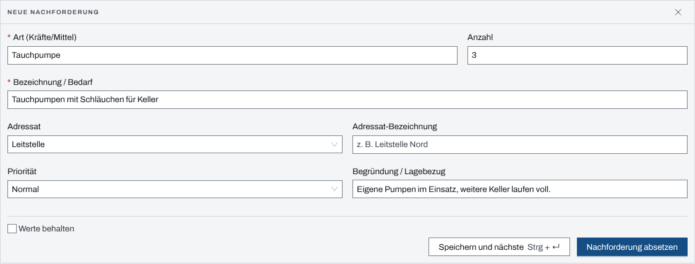
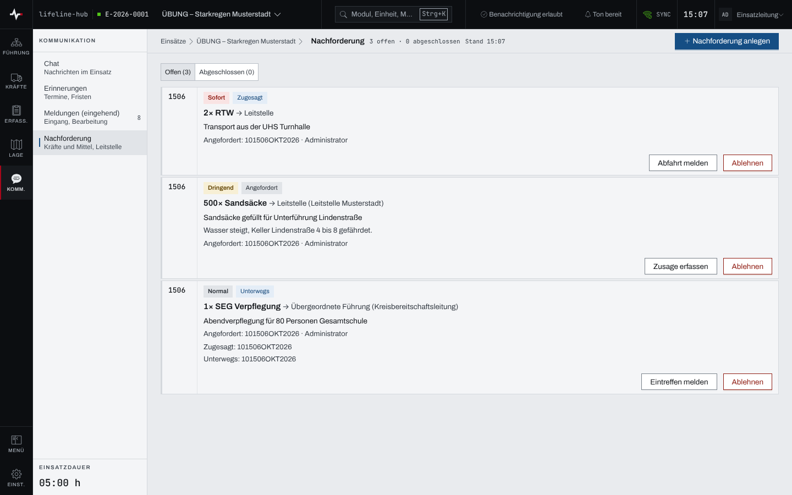
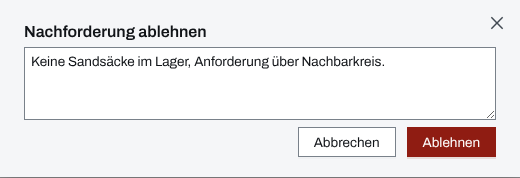

## Überblick

Reichen die eigenen Kräfte und Mittel nicht, fordert die Führung nach: Rettungswagen, eine
Einsatzeinheit, Sandsäcke. Das Modul „Nachforderung“ hält jede Anforderung fest und verfolgt sie
über die Stufen **Angefordert**, **Zugesagt**, **Unterwegs** und **Eingetroffen**. Eine
Anforderung kann auch abgelehnt werden.

Lesen dürfen alle mit Zugang zum Einsatz. Nachfordern und den Stand fortschreiben dürfen
Einsatzleitung und Führungspersonal, solange der Einsatz läuft (siehe
[Rechte im Einsatz](rechte-im-einsatz.md)).

## Abläufe

### Eine Nachforderung absetzen

Für Einsatzleitung und Führungspersonal:

1. Im Einsatz „Nachforderung“ öffnen und „Nachforderung anlegen“ wählen.
2. Im Formular „Neue Nachforderung“ unter „Art (Kräfte/Mittel)“ angeben, was gebraucht wird, und
   unter „Anzahl“, wie viel.

   

3. Unter „Bezeichnung / Bedarf“ den Bedarf genauer beschreiben.
4. Den „Adressat“ wählen: „Leitstelle“ (vorbelegt), „Nachbar-Einsatzabschnitt“, „Übergeordnete
   Führung“ oder „Andere BOS“. Bei Bedarf unter „Adressat-Bezeichnung“ die Stelle genauer nennen.
5. „Priorität“ setzen und unter „Begründung / Lagebezug“ den Grund eintragen.
6. „Nachforderung absetzen“ wählen.

„Speichern und nächste“ (Strg+Enter, am Mac ⌘+Enter) setzt ab und leert das Formular. Mit dem
Häkchen „Werte behalten“ bleiben Adressat, Adressat-Bezeichnung und Priorität stehen.

### Den Stand fortschreiben

Für Einsatzleitung und Führungspersonal:

1. In der Ansicht „Offen“ die Karte der Nachforderung suchen. Sie zeigt Priorität, Stufe, Menge,
   Art, Adressat und die bisherigen Zeitpunkte.

   

2. Den nächsten Schritt wählen: „Zusage erfassen“, sobald die Stelle zusagt, „Abfahrt melden“,
   sobald die Kräfte unterwegs sind, „Eintreffen melden“, sobald sie da sind.

Ein Hinweis bietet nach jedem Schritt sechs Sekunden lang „Rückgängig“. Eine eingetroffene
Nachforderung steht in der Ansicht „Abgeschlossen“.

### Eine Nachforderung ablehnen

Für Einsatzleitung und Führungspersonal:

1. An der Karte „Ablehnen“ wählen.
2. Im Dialog „Nachforderung ablehnen“ bei Bedarf den Grund eintragen.

   

3. „Ablehnen“ wählen.

Eine abgelehnte Nachforderung ist abgeschlossen und lässt sich nicht wieder öffnen.

## Hintergrund

### Nachforderungen im Einsatztagebuch

Jede abgesetzte Nachforderung schreibt einen ETB-Eintrag vom Typ „Meldung“ mit dem Inhalt
„Nachforderung: … × Art — Bezeichnung“, die Begründung als Veranlassung. Dieser Eintrag entsteht
immer, unabhängig von „Automatische ETB-Einträge“ (siehe [Einsatztagebuch](einsatztagebuch.md)).

### Aus der Verpflegung nachfordern

Fehlt in einem Zeitfenster der Verpflegung etwas, öffnet „Nachfordern“ an dessen Karte dieses
Formular mit vorbelegten Feldern ([Verpflegung](verpflegung.md)). Die Felder bleiben vor dem Absetzen
änderbar.

### Ablauf der Stufen

Die Stufen laufen vorwärts, jeweils um eine: Angefordert, Zugesagt, Unterwegs, Eingetroffen.
„Rückgängig“ nimmt den letzten Schritt um genau eine Stufe zurück, solange der Hinweis steht.
Ablehnen geht aus jeder Stufe vor „Eingetroffen“; was eingetroffen ist, wird nicht mehr
abgelehnt.
