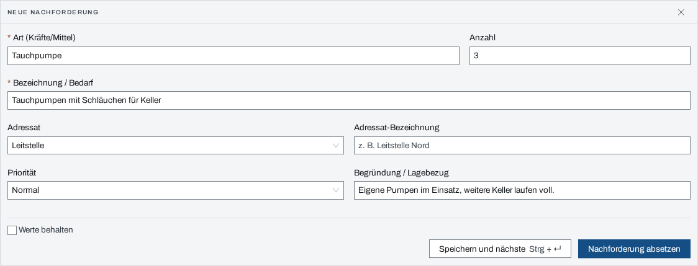
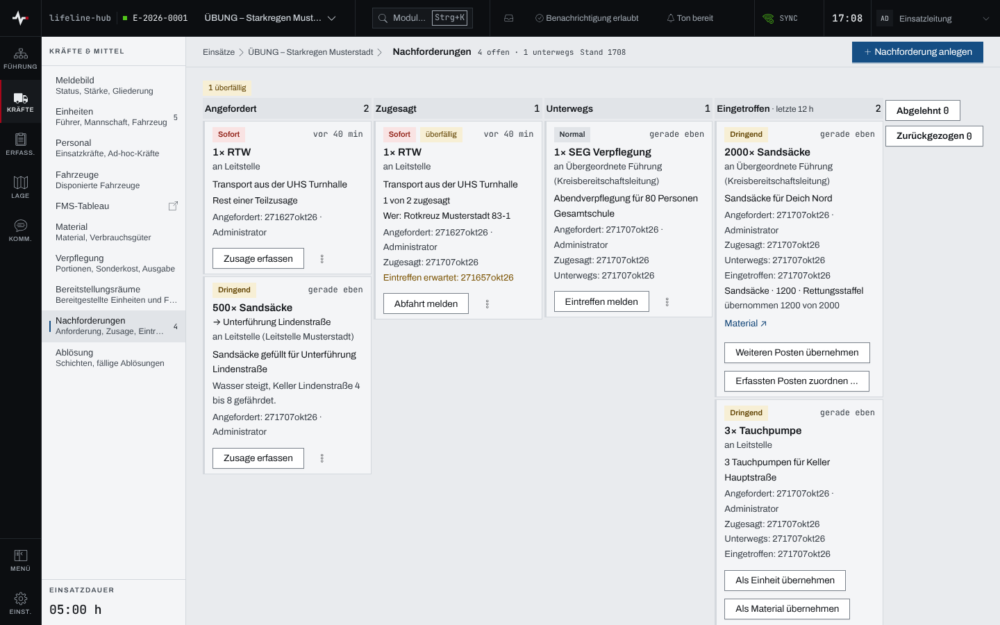
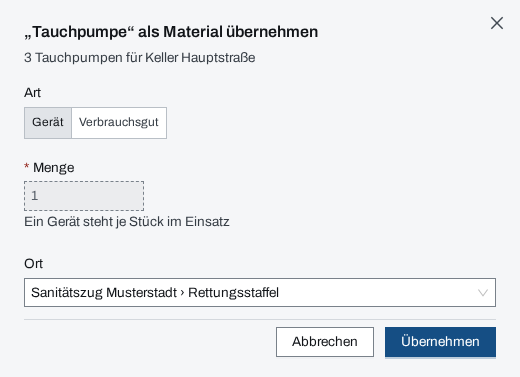
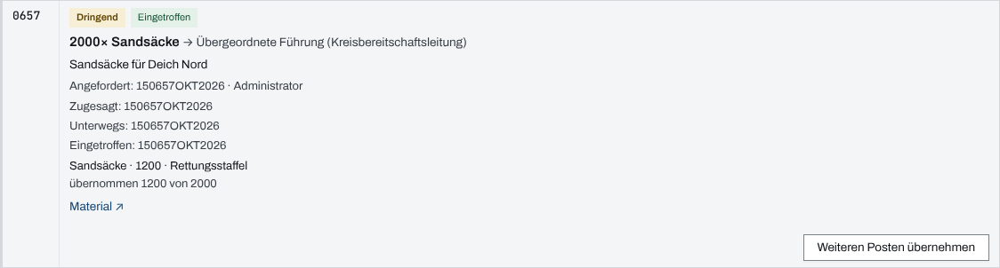
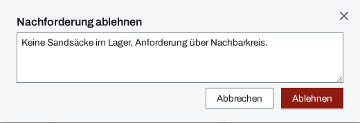

## Überblick

Reichen die eigenen Kräfte und Mittel nicht, fordert die Führung nach: Rettungswagen, eine
Einsatzeinheit, Sandsäcke. Das Modul „Nachforderungen“ unter „Kräfte & Mittel“ hält jede
Anforderung fest und verfolgt sie über die Stufen **Angefordert**, **Zugesagt**, **Unterwegs** und
**Eingetroffen**. Eine Anforderung kann auch abgelehnt werden. Die Seite zeigt die Nachforderungen
als Board: je Stufe eine Spalte, oben die Zahl der offenen und davon unterwegs, etwa „5 offen · 2
unterwegs“. In der Sprungpalette findet „Anforderung“ das Modul ebenso.

Lesen dürfen alle mit Zugang zum Einsatz. Nachfordern und den Stand fortschreiben dürfen
Einsatzleitung und Führungspersonal, solange der Einsatz läuft (siehe
[Rechte im Einsatz](rechte-im-einsatz.md)).

## Abläufe

### Eine Nachforderung absetzen

Für Einsatzleitung und Führungspersonal:

1. Im Einsatz „Nachforderungen“ öffnen und „Nachforderung anlegen“ wählen.
2. Unter „Was“ angeben, was gebraucht wird. Die Knöpfe der Schnellwahl darüber setzen die
   häufigsten Arten dieses Einsatzes mit einem Klick, in einem neuen Einsatz RTW, KTW, NEF, LF 10,
   HLF 20 und DLK 23-12. Beim Tippen schlägt die App frühere Arten dieses Einsatzes, die
   Einheitstypen der Organisation und gängige Kräfte und Mittel vor.
3. Unter „Anzahl“ angeben, wie viel (vorbelegt 1). Nach einem Klick in der Schnellwahl steht der
   Cursor dort, die Ziffer ersetzt die 1.
4. Unter „Wohin“ den Meldeort angeben: einen Bereitstellungsraum, einen Einsatzabschnitt oder einen
   freien Ort. Gibt es genau einen aktiven Bereitstellungsraum, steht er schon da.

   

5. Enter drücken oder „Nachforderung absetzen“ wählen.

Alles Weitere steht eingeklappt unter „Weitere Angaben“, mit Vorgaben; der Kopf nennt, was davon
abweicht:

- „Details / Zweck“: den Bedarf genauer beschreiben, etwa „Transport aus UHS Turnhalle“.
- „Adressat“: „Leitstelle“ (vorbelegt), „Nachbar-Einsatzabschnitt“, „Übergeordnete Führung“ oder
  „Andere BOS“. Unter „Adressat-Bezeichnung“ die Stelle genauer nennen; beim Tippen schlägt die App
  die externen Stellen aus den Stammdaten vor.
- „Priorität“: „Normal“ (vorbelegt), „Dringend“ oder „Sofort“.
- „Benötigt bis“: bis wann es da sein muss. Leer heißt sofort.
- „Begründung / Lagebezug“: den Grund.

Ist ein eingeklappter Wert ungültig, etwa eine zu lange Begründung, klappt der Teil beim Absetzen
auf.

„Speichern und nächste“ (Strg+Enter, am Mac ⌘+Enter) setzt ab und leert das Formular. Mit dem
Häkchen „Werte behalten“ bleiben Wohin, Adressat, Adressat-Bezeichnung und Priorität stehen.

Die Karte zeigt das Ziel als „→ BR Nord“ und die Bedarfszeit als „Benötigt bis: …“. Ohne Zugang zum
Modul „Bereitstellungsräume“ bzw. „Einsatzabschnitte“ steht nur „→ Bereitstellungsraum“ bzw.
„→ Einsatzabschnitt“; ohne dieses Recht lässt sich ein Raum oder Abschnitt auch nicht als Ziel
wählen, ein freier Ort schon. Ein aufgelöster Bereitstellungsraum ist kein Ziel mehr.

### Den Stand fortschreiben

Für Einsatzleitung und Führungspersonal:

1. Im Board die Karte der Nachforderung in der Spalte ihrer Stufe suchen. Sie zeigt Priorität,
   Menge, Art, Adressat, wie lange die Anforderung schon steht, und die bisherigen Zeitpunkte.

   

2. Den nächsten Schritt wählen: „Zusage erfassen“, sobald die Stelle zusagt, „Abfahrt melden“,
   sobald die Kräfte unterwegs sind, „Eintreffen melden“, sobald sie da sind.

Die Karte wandert in die Spalte der neuen Stufe, die übrigen Karten bleiben stehen. Ein Hinweis
bietet nach jedem Schritt sechs Sekunden lang „Rückgängig“.

### Abgeschlossene und ältere ansehen

Für alle mit Zugang zum Einsatz:

1. „Eingetroffen“ zeigt die Nachforderungen der letzten 12 Stunden. Ältere stehen gesammelt unter
   „Ältere eingetroffen“; ein Klick klappt sie auf.
2. „Abgelehnt“ steht eingeklappt neben den Spalten, mit der Zahl der abgelehnten. Ein Klick klappt
   die Spalte auf.

Am Handy steht statt der Spalten eine Leiste der fünf Stufen mit ihrer Zahl, darunter die Karten
der gewählten Stufe. Vorgewählt ist die erste offene Stufe, in der etwas steht.

### Eingetroffenes Material übernehmen

Für Einsatzleitung und Führungspersonal, wenn das Modul Material freigegeben ist:

1. In der Spalte „Eingetroffen“ an der Karte der Nachforderung „Als Material übernehmen“ wählen.
2. Der Dialog nennt im Titel die Art der Nachforderung, etwa „„Tauchpumpe“ als Material
   übernehmen“, darunter den Bedarf. Unter „Art“ „Gerät“ oder „Verbrauchsgut“ wählen.

   

3. Unter „Menge“ die Menge prüfen. Bei einem Gerät steht sie fest auf 1.
4. Unter „Ort“ eine Einheit, ein Fahrzeug, eine UHS oder einen Bereitstellungsraum wählen, oder
   „ohne Ort“ stehen lassen.
5. „Übernehmen“ wählen.

Die Karte zeigt danach je übernommenem Posten Bezeichnung, Menge und Ort, bei einer
Nachforderung mit Anzahl etwa „übernommen 1 von 3“, und „Material ↗“ führt in die
[Materialliste](material.md).

### Weiteren Posten übernehmen

Für Einsatzleitung und Führungspersonal, etwa für die zweite von drei Tauchpumpen oder die
nächste Fuhre Sandsäcke:

1. An der Karte „Weiteren Posten übernehmen“ wählen.

   

2. Art, Menge und Ort wie beim ersten Posten setzen. Die Menge ist mit dem Rest der Anzahl
   vorbelegt.
3. „Weiteren Posten übernehmen“ wählen.

### Eine Nachforderung ablehnen

Für Einsatzleitung und Führungspersonal:

1. An der Karte „Ablehnen“ wählen.
2. Im Dialog „Nachforderung ablehnen“ bei Bedarf den Grund eintragen.

   

3. „Ablehnen“ wählen.

Eine abgelehnte Nachforderung ist abgeschlossen und lässt sich nicht wieder öffnen.

## Hintergrund

### Benachrichtigungen zum Stand

Wechselt eine Nachforderung auf „Zugesagt“, „Unterwegs“, „Eingetroffen“ oder „Abgelehnt“, erhalten
die Person, die sie angelegt hat, und die Personen, die S4 besetzen (laut Stab-Besetzung, sonst
laut Funktion in der Mitgliedschaft), einen Hinweis mit der neuen Stufe, etwa „Nachforderung
eingetroffen“ mit „2× an Leitstelle“. Art, Details, Ziel, Adressat-Bezeichnung und Ablehnungsgrund
stehen nie im Hinweis; er führt in das Modul „Nachforderungen“. Auch ein „Rückgängig“ zurück auf
„Zugesagt“ oder „Unterwegs“ meldet die neue Stufe, eines zurück auf „Angefordert“ meldet nichts.
Das Absetzen selbst meldet nichts.

Eigene Aktionen bleiben still: Wer den Stand selbst fortschreibt oder ablehnt, bekommt dazu
nichts. Wer die Nachforderung angelegt hat und zugleich S4 besetzt, erhält den Hinweis einmal.
Wer das Modul „Nachforderungen“ nicht sehen darf, bekommt keinen Hinweis.

### Nachforderungen im Einsatztagebuch

Jede abgesetzte Nachforderung schreibt einen ETB-Eintrag vom Typ „Meldung“ mit dem Inhalt
„Nachforderung: 2× RTW → BR Nord, benötigt bis 21.10. 15:30 — Transport aus UHS Turnhalle“;
Ziel, Bedarfszeit (in der Zeitzone des Einsatzes) und Details stehen nur, wenn angegeben. Die
Begründung steht als Veranlassung. Absender ist die eigene
Führungsstelle des Einsatzes mit ihrem Rufnamen, sonst ihrer Bezeichnung; ist keine gepflegt,
die Führungsstelle oder das erste Sachgebiet der Person, die anfordert. Empfänger ist der
Adressat, etwa „Leitstelle (ILS Nord)“.

Auch jede weitere Stufe steht als Systemeintrag im ETB, etwa „Nachforderung 2× RTW: zugesagt“,
„…: unterwegs“, „…: eingetroffen“ oder „…: abgelehnt (keine Reserven)“. Ein „Rückgängig“ löscht
nichts, sondern schreibt einen weiteren Eintrag, etwa „Nachforderung 2× RTW: zurückgesetzt auf
angefordert“. Alle diese Einträge entstehen immer, unabhängig von „Automatische ETB-Einträge“
(siehe [Einsatztagebuch](einsatztagebuch.md)). Jeder trägt den Verweis „Nachforderung ↗“; er
öffnet die Nachforderungen mit der Karte hervorgehoben.

### Zuständige Leitstelle als Vorgabe

Ist in den [Stammdaten](stammdaten.md) eine externe Stelle als „Zuständige Leitstelle“
markiert, steht sie bei „Adressat“ „Leitstelle“ schon in der „Adressat-Bezeichnung“, auch nach
dem Absetzen. Ein selbst eingetragener Wert wird dabei nie überschrieben. Gespeichert wird nur
der Text.

### Aus der Verpflegung und von einer Unfallhilfsstelle nachfordern

Fehlt in einem Zeitfenster der Verpflegung etwas, öffnet „Nachfordern“ an dessen Karte dieses
Formular mit vorbelegten Feldern ([Verpflegung](verpflegung.md)). An einer Unfallhilfsstelle öffnet
„Fehlmenge melden“ im Bereich „Material“ das Formular mit der Art „Material“ und der Stelle in der
Begründung ([Unfallhilfsstellen](unfallhilfsstellen.md)); Details und Anzahl bleiben dort leer.
Die Felder bleiben vor dem Absetzen änderbar.

### Nachforderungen für eine Betreuungsstelle

„Bedarf anfordern“ auf der Seite einer Betreuungsstelle öffnet dieses Formular mit
„Für Betreuungsstelle …“ und der Stelle in der Begründung ([Betreuung](betreuung.md)). Die
Nachforderung gehört dann zu dieser Stelle: ihre Karte nennt die Stelle, ein Klick auf den Namen
öffnet sie. Mit „Für Stelle“ über dem Board stehen nur die Nachforderungen einer Stelle da;
„Filter zurücksetzen“ zeigt wieder alle. Ohne Zugriff auf „Betreuung“ steht an der Karte nur
„Für eine Betreuungsstelle“.

Wird die Stelle storniert, bleibt die Nachforderung mit ihrem Stand bestehen und verweist auf
keine Stelle mehr; die Begründung bleibt, wie sie ist.

### Zahlen der offenen Nachforderungen

Offen ist eine Nachforderung, solange sie angefordert, zugesagt oder unterwegs ist. Die Zahl der
offenen zählt der Server; dieselbe Zahl steht im Seitenkopf, am Modul im Menü (etwa „5 offene
Nachforderungen, davon 2 unterwegs“), im Paneel „Nachforderungen“ des
[Führungsüberblicks](ueberblick.md), an den Werkzeugen S1 und S4 der [Stab-Seite](stab.md) und in
der Vorbereitung der [Lagebesprechung](lagebesprechung.md). Eingetroffene und abgelehnte zählen
nicht. Die Zahlen in den Spaltenköpfen zählen die Karten, die das Board gerade zeigt, also auch
innerhalb eines Filters „Für Stelle“.

### Das Board hält still

Solange der Mauszeiger oder der Fokus im Board liegt oder ein Dialog offen ist, rückt keine Karte:
Was ein anderer Arbeitsplatz anlegt oder fortschreibt, nennt ein Hinweis über dem Board, etwa
„1 neue Nachforderung · 1 in anderer Stufe“. „anzeigen“ zeigt den neuen Stand. Eine Karte, die
inzwischen weiter ist, trägt bis dahin ihre neue Stufe an sich.

### Ablauf der Stufen

Die Stufen laufen vorwärts, jeweils um eine: Angefordert, Zugesagt, Unterwegs, Eingetroffen.
„Rückgängig“ nimmt den letzten Schritt um genau eine Stufe zurück, solange der Hinweis steht, auch
die Zusage zurück auf „Angefordert“. Der Zeitpunkt der zurückgenommenen Stufe entfällt; wer sie
erneut meldet, setzt einen neuen.
Ablehnen geht aus jeder Stufe vor „Eingetroffen“; was eingetroffen ist, wird nicht mehr
abgelehnt. Ist aus einer Nachforderung Material übernommen, lässt sich „Eingetroffen“ nicht mehr
zurücknehmen; die App nennt den Grund an der Karte. Wer versehentlich übernommen hat, storniert
zuerst den Posten in der [Materialliste](material.md) und nimmt dann zurück.

### Übernommenes Material

Jede Übernahme legt genau einen Ad-hoc-Posten in der Materialliste an, der auf die Nachforderung
verweist. Seine Bezeichnung ist die Art der Nachforderung, etwa „Tauchpumpe“; Kategorie,
Trägerorganisation und Bestandsnummer bleiben leer und lassen sich an der Materialzeile über
„Angaben ändern …“ nachtragen. Vorbelegt sind als Menge die Anzahl der Nachforderung abzüglich
dessen, was schon übernommen ist (mindestens 1, ohne Anzahl 1), als Art „Verbrauchsgut“ bei einer
Menge über 1, sonst „Gerät“, und als Ort „ohne Ort“; die Nachforderung selbst kennt keinen Ort.

Ein Gerät steht je Stück im Einsatz: Drei Tauchpumpen sind drei Übernahmen. Auch Verbrauchsgut,
das in mehreren Fuhren kommt, wird je Fuhre übernommen. Einen weiteren Posten legt die App nur
ausdrücklich über „Weiteren Posten übernehmen“ an. Hat ein anderer Platz inzwischen übernommen,
lehnt sie „Übernehmen“ ab und nennt den Grund im Dialog; der Dialog bleibt offen und bietet dann
„Weiteren Posten übernehmen“ mit der neu gerechneten Menge an. So steht dieselbe Lieferung nicht
versehentlich zweimal im Bestand.

Ein stornierter Posten zählt nicht als übernommen, ein aus dem Einsatz genommener schon; die
Karte nennt ihn dann mit „aus dem Einsatz genommen“. Wird ein übernommener Posten aufgeteilt,
verweisen beide Teile auf die Nachforderung. Die Nachforderung selbst ändert sich durch die
Übernahme nicht.

Übernehmen dürfen Einsatzleitung und Führungspersonal, wenn das Modul Material für sie
freigegeben ist. Ist es gesperrt, steht der Knopf gesperrt mit „Keine Berechtigung“, und die
Karte zeigt statt der Posten nur ihre Zahl, etwa „2 Posten übernommen“.

Jede Übernahme schreibt einen Eintrag ins Einsatztagebuch, etwa „Material «Tauchpumpe» (×1)
disponiert, Ort Einheit «Rettungsstaffel», aus Nachforderung «3 Tauchpumpen für Keller
Hauptstraße»“, ohne Ort ohne den Ort-Teil. Die Nachforderung schreibt dafür keinen eigenen
Eintrag.
