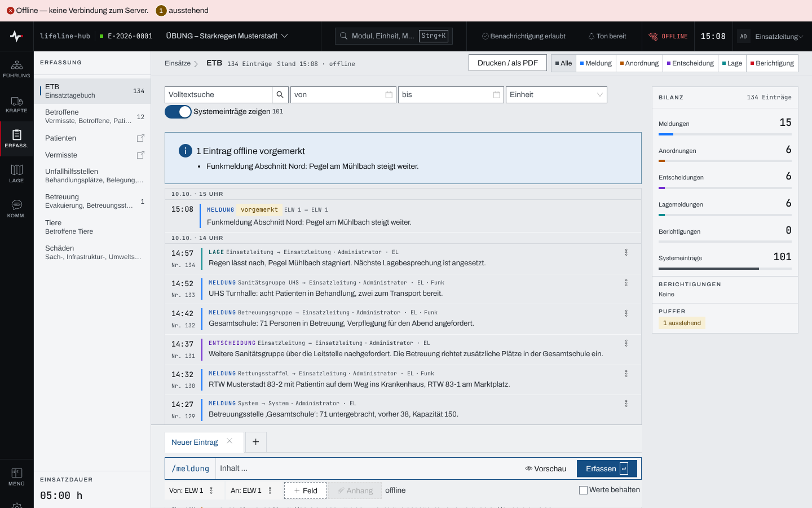

## Überblick

Fällt das Netz aus, bleibt die Lage lesbar und das Erfassen möglich. Das gilt nur auf einem
Gerät, auf dem die App **vorher mit Netz geöffnet** war und auf dem eine Person angemeldet ist.
Die App selbst liegt dann auf dem Gerät, die Daten des Einsatzes hält sie für die Arbeit ohne Netz
vor. Was ohne Netz angezeigt wird, ist der Stand der letzten Verbindung, nicht die aktuelle Lage.

## Abläufe

### Erkennen, ob Netz da ist

1. Auf die Kopfzeile achten: Ohne Netz steht rechts „OFFLINE“ statt „SYNC“.
2. Auf den Seitenkopf achten: Dort steht „Stand HH:MM · offline“, die Uhrzeit der letzten
   Verbindung.
3. Auf die Betriebszeile ganz oben achten: Sie meldet „Offline — keine Verbindung zum Server.“
   und die Zahl der Einträge, die noch „ausstehend“ sind.

### Ohne Netz erfassen

1. Wie mit Netz erfassen und speichern, etwa eine Meldung oder einen Eintrag im
   Einsatztagebuch.
2. Die App merkt den Eintrag vor. Im Einsatztagebuch steht er oben mit „vorgemerkt“, darüber
   „1 Eintrag offline vorgemerkt“; andere Erfassungen melden „Offline vorgemerkt …“, etwa
   „Offline vorgemerkt: Meldung von …“. Die Betriebszeile zählt den Eintrag als „ausstehend“.

   

3. Nichts weiter tun: Sobald wieder Netz da ist, geht der Eintrag von selbst hinaus.

### Abgelehnte Einträge prüfen

1. In der Betriebszeile „abgelehnt – prüfen“ wählen. Es öffnet sich „Offline-Aktionen
   wiederherstellen“.
2. Je Eintrag wählen:
   - „Erneut versuchen“, wenn der Grund behoben ist;
   - „Ohne Anhänge senden“, wenn die Anhänge fehlen, und mit „Nur den Text senden“ bestätigen;
   - „Verwerfen“, wenn der Eintrag nicht mehr gebraucht wird, und mit „Endgültig verwerfen“
     bestätigen.

## Hintergrund

### Was ohne Netz lesbar bleibt

- Einsatzliste, Einsatzkopf und Einstellungen des Einsatzes
- Einsatztagebuch in seinen festen Ansichten; die Ergebnisse einer Suche (Volltext, Zeitraum,
  Einheit) nicht
- Meldebild mit Einheiten, Personal, Fahrzeugen, Material, Abschnitten und Fahrzeugstatus
- Aufträge und Befehle
- Betroffene, Unfallhilfsstellen, Betreuung
- Lagekarte mit Zonen, Zeichen, Gefahrengebieten und Schäden
- Rückmeldungen und Kommunikationsplan

Nicht vorgehalten werden unter anderem die übrigen Meldungen sowie Besetzung und
Lagebesprechungen des Stabs.

**Grenze: 24 Stunden.** Ein vorgehaltener Stand gilt höchstens 24 Stunden nach der letzten
Verbindung zum Server. Startet die App ohne Netz mit einem älteren Stand, verwirft sie ihn. Nach
einem Update der App gilt der alte Stand ebenfalls nicht mehr; die App lädt ihn neu, sobald Netz da
ist.

### Was sich ohne Netz erfassen lässt

- Personen (Betroffene, Patienten), auch über die Aufnahme
- Meldungen
- Stand- und Belegungsmeldungen der Betreuung
- Ausgaben der Verpflegung
- Einträge im Einsatztagebuch

Anhänge brauchen Netz: Im Einsatztagebuch ist „Anhang“ ohne Netz gesperrt und trägt „offline“.

Ein vorgemerkter Eintrag liegt auf dem Gerät und geht hinaus, sobald wieder Netz da ist, ohne
weiteres Zutun und in der Reihenfolge der Erfassung. Eine erfasste Person trägt bis dahin „R-…“
statt ihrer Registriernummer; die Nummer vergibt der Server.

Als Zeitpunkt zählt der Moment der **Erfassung**, nicht der des Sendens. Die App gleicht dafür die
Uhr des Geräts mit der des Servers ab, solange Netz da ist.

### Abgelehnte Einträge

Der Server lehnt einen vorgemerkten Eintrag etwa ab, weil der Einsatz inzwischen abgeschlossen ist
oder ein Pflichtfeld fehlt. Im Einsatztagebuch steht der Grund direkt am Eintrag.

Abgelehnte Einträge löscht die App erst **30 Tage nach der Ablehnung** von selbst: Sie können das
einzige Zeugnis einer Erfassung sein. Wer sie vorher nicht mehr braucht, verwirft sie. Ausstehende
Einträge haben keine Frist.

Liegen auf dem Gerät vorgemerkte Einträge aus einer älteren Version der App, die keiner Person
zugeordnet sind, zeigt die Betriebszeile „Alte Offline-Daten ansehen“. Ihr Inhalt ist nicht
einsehbar und nicht übernehmbar; unter „Alte Offline-Daten ohne Zuordnung“ verwirft „Alle alten
Offline-Daten verwerfen“ sie nach einer Rückfrage. Zugeordnete Einträge bleiben dabei erhalten.

### Was dabei auf dem Gerät liegt

Für die Arbeit ohne Netz liegen Daten des Einsatzes auf dem Gerät, bei Betroffenen auch
Gesundheitsdaten. Geschützt sind sie durch die Bildschirmsperre und die Verschlüsselung des
Geräts, nicht durch die App. Was bei Verlust zu tun ist, steht in
[Gerät verloren](geraet-verloren.md); was das Abmelden löscht, in
[Anmelden und Abmelden](anmelden-abmelden.md).

Gekoppelte Geräte legen kein Lagebild ab. Erfassen ohne Netz geht dort wie oben.
