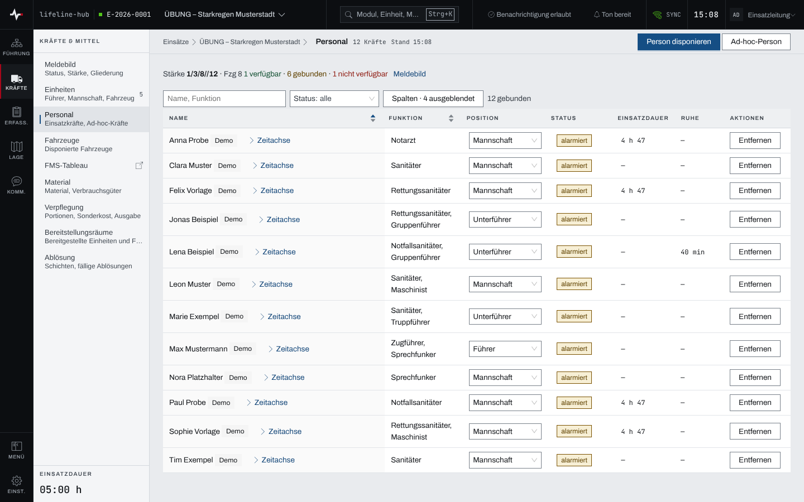
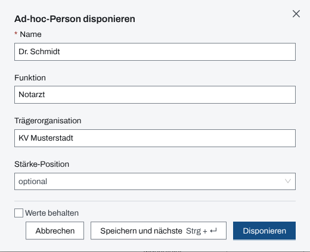
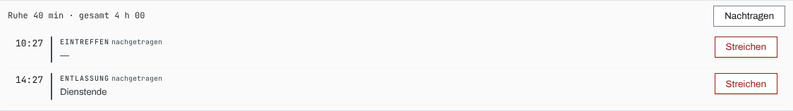

## Überblick

Das Modul **Personal** führt alle Einsatzkräfte, die im Einsatz disponiert sind: Personen aus dem
Personalstamm der Organisation und Ad-hoc-Kräfte, die nur in diesem Einsatz vorkommen. Je Person
stehen Funktion, Träger, Fahrzeug, Einheit, Stärke-Position, Status, Einsatzdauer und Ruhezeit.

Die Führung liest hier, wer verfügbar oder gebunden ist und wer wie lange im Einsatz steht.
Disponieren, Status setzen und entfernen dürfen Einsatzleitung und Führungspersonal.

## Abläufe

### Die Personalliste lesen

1. Unter „Kräfte & Mittel“ „Personal“ öffnen. Über der Liste steht die Stärke mit der Verteilung der
   Kräfte, daneben der Sprung ins „Meldebild“.
2. Die Liste ist nach Statuskategorie gruppiert: verfügbar, gebunden, nicht verfügbar, ohne Status.
   In „Name, Funktion“ suchen oder unter „Status“ eine Kategorie wählen.

   

3. Unter „Spalten“ ausgeblendete Spalten wie „Träger“, „Fahrzeug“, „Einheit“ oder „Bemerkung“
   einblenden.

### Eine Person disponieren

Für Einsatzleitung und Führungspersonal:

1. „Person disponieren“ wählen.
2. Unter „Person“ eine Person aus dem Personalstamm wählen.
3. „Disponieren“ wählen, oder „Speichern und nächste“, um gleich die nächste Person aufzunehmen.

Steht eine Kraft nicht im Personalstamm:

1. „Ad-hoc-Person“ wählen.
2. „Name“ eingeben, bei Bedarf „Funktion“, „Trägerorganisation“ und „Stärke-Position“.

   

3. „Disponieren“ wählen. Für eine ganze Gruppe „Speichern und nächste“ (Strg + Enter) wählen; mit
   „Werte behalten“ bleiben Trägerorganisation und Stärke-Position für die nächste Person stehen.

Ad-hoc-Kräfte tragen in der Liste die Marke „ad-hoc“.

### Status, Position und Bemerkung ändern

Für Einsatzleitung und Führungspersonal:

1. In der Spalte „Status“ den Status der Person wählen.
2. In der Spalte „Position“ Führer, Unterführer oder Mannschaft wählen; sie zählt in die Stärke.
3. Eine Bemerkung in der Spalte „Bemerkung“ eintragen (unter „Spalten“ einblenden).

### Einsatzdauer und Ruhezeit einer Person ablesen

1. In der Liste „Einsatzdauer“ und „Ruhe“ lesen.
2. Für die Einzelheiten „Zeitachse“ neben dem Namen aufklappen.

   

3. Fehlt ein Ereignis, mit „Nachtragen“ ergänzen (Kapitel [Meldebild und
   Kräfte-Zeitachse](meldebild.md)).

### Eine Person aus dem Einsatz entfernen

Für Einsatzleitung und Führungspersonal:

1. In der Zeile der Person „Entfernen“ wählen.
2. Die Rückfrage „Aus Einsatz entfernen?“ mit „Aus Einsatz entfernen“ bestätigen.

## Hintergrund

### Wer zur Auswahl steht

„Person disponieren“ bietet die Personen des Personalstamms an, die in Dienst stehen und noch nicht
im Einsatz sind. Ad-hoc-Kräfte gibt es nur im Einsatz; im Personalstamm erscheinen sie nicht.

### Status

Die Statuswerte pflegt die Organisation selbst; jeder gehört zu einer Kategorie (verfügbar,
gebunden, nicht verfügbar). Eine neue Organisation beginnt mit „verfügbar“, „alarmiert“, „auf
Anfahrt“, „im Einsatz“, „Pause“ und „abgemeldet“. „alarmiert“, „im Einsatz“ und „abgemeldet“
schreiben dabei Alarmierung, Eintreffen und Entlassung in die Kräfte-Zeitachse.

### Einheit, Fahrzeug und Position

Einer Einheit wird eine Person im Modul [Einheiten](einheiten.md) zugeordnet, einem Fahrzeug als
Besatzung im Modul [Fahrzeuge und FMS](fahrzeuge.md). Die Stärke-Position bestimmt, ob die Person
als Führer, Unterführer oder Mannschaft zählt; Einheitsführer ist ein eigenes Merkmal der Einheit.

### Entfernen

Eine entfernte Person verlässt den Einsatz ganz, mit Einheit und Fahrzeug. War sie Einheitsführer
oder Leiter eines Einsatzabschnitts, ist diese Stelle danach leer.

### Einsatztagebuch

Disponieren, jeder Statuswechsel und das Entfernen stehen im Einsatztagebuch. Position und Bemerkung
ändern es nicht.

### Rechte und ohne Netz

Lesen darf, wer das Modul Personal sieht. Disponieren, ändern und entfernen dürfen Einsatzleitung
und Führungspersonal, solange der Einsatz läuft (Kapitel [Rechte im Einsatz](rechte-im-einsatz.md)).
Ohne Netz bleibt die Liste mit dem zuletzt geladenen Stand lesbar; ändern lässt sich nichts (Kapitel
[Ohne Netz](ohne-netz.md)).
