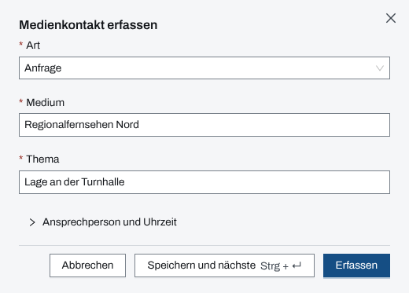
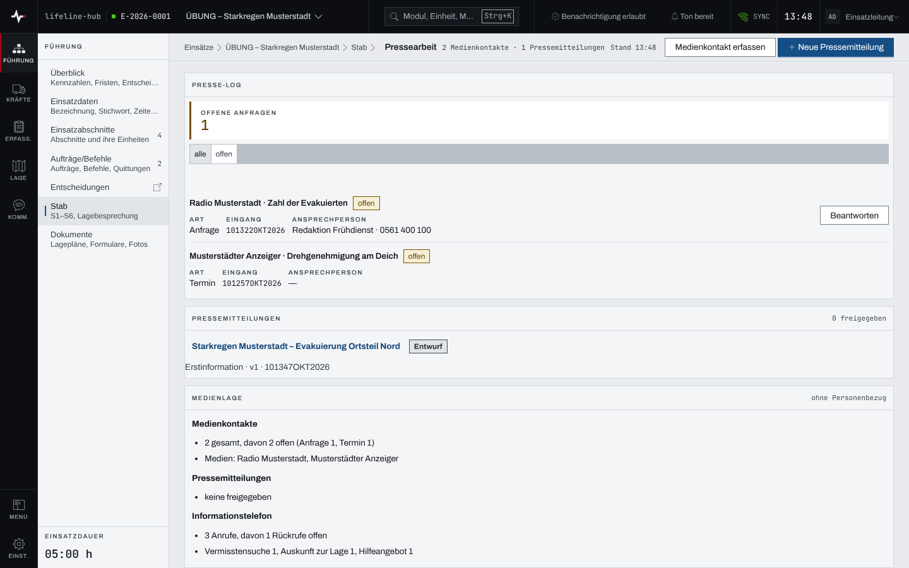
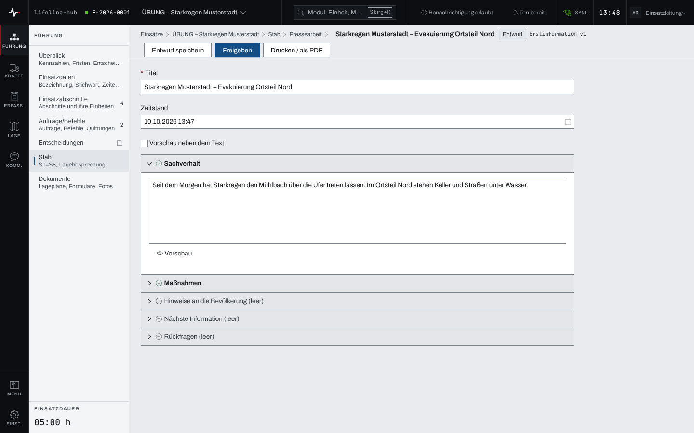
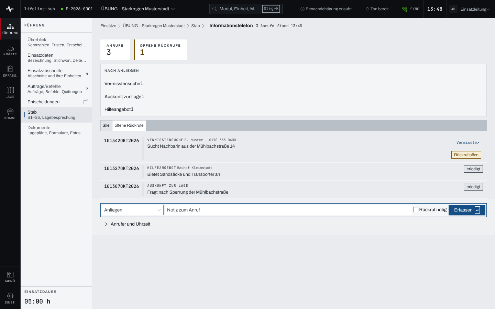

## Überblick

Für das Sachgebiet S5 gibt es zwei Seiten unter „Stab“. Die **Pressearbeit** führt das Presse-Log
der Medienkontakte, die Pressemitteilungen mit Freigabe und eine Medienlage ohne Personenbezug.
Das **Informationstelefon** protokolliert Anrufe aus der Bevölkerung und hält offene Rückrufe
nach. Lesen können alle Mitglieder des Einsatzes, erfassen dürfen Einsatzleitung und
Führungspersonal. Eine Pressemitteilung gibt nur die Einsatzleitung frei.

## Abläufe

### Einen Medienkontakt erfassen

1. „Stab“ öffnen und in der Zeile S5 „Pressearbeit“ wählen.
2. „Medienkontakt erfassen“ wählen.
3. „Art“ (Anfrage, Abstimmung oder Termin), „Medium“ und „Thema“ eintragen. Unter „Ansprechperson
   und Uhrzeit“ stehen „Ansprechperson“, „Erreichbarkeit“ und „Eingang“ (leer gilt jetzt).

   

4. „Erfassen“ wählen; „Speichern und nächste“ hält den Dialog für den nächsten Kontakt offen.

### Eine Anfrage beantworten oder einen Kontakt abschließen

1. In der „Pressearbeit“ im „Presse-Log“ den Kontakt suchen; „offen“ zeigt nur die offenen.

   

2. Bei einer Anfrage „Beantworten“ wählen, „Gegebene Antwort“ eintragen, bei Bedarf „Freigegeben
   durch“ und „Verweis auf Pressemitteilung“, dann „Als beantwortet speichern“.
3. Eine Anfrage lässt sich stattdessen an der Statusanzeige auf „abgelehnt“ setzen, eine
   Abstimmung oder ein Termin auf „erledigt“.

Zurück auf „offen“ geht jeder Kontakt an derselben Stelle; die App bietet danach „Rückgängig“ an.

### Eine Pressemitteilung schreiben und freigeben

1. In der „Pressearbeit“ „Neue Pressemitteilung“ wählen.
2. „Titel“ eintragen und die „Vorlage“ wählen: Erstinformation, Folgeinformation, Hinweis an die
   Bevölkerung oder Freie Mitteilung. „Anlegen“ öffnet den Entwurf.
3. Die Abschnitte der Vorlage nacheinander aufklappen und ausfüllen; „Vorschau neben dem Text“
   zeigt das Ergebnis daneben.

   

4. „Entwurf speichern“ wählen.
5. Für die Einsatzleitung: „Freigeben“ wählen und die Rückfrage „Pressemitteilung freigeben?“
   bestätigen.

Eine freigegebene Mitteilung lässt sich nicht mehr ändern. „Folgemeldung schreiben“ legt einen
neuen Entwurf an, der auf ihr aufbaut.

### Einen Anruf am Informationstelefon erfassen

1. „Stab“ öffnen und in der Zeile S5 „Informationstelefon“ wählen.
2. In der Leiste unten das „Anliegen“ wählen und eine „Notiz zum Anruf“ eintragen.

   

3. Muss zurückgerufen werden, „Rückruf nötig“ anhaken und die „Rückrufnummer“ eintragen. Unter
   „Anrufer und Uhrzeit“ stehen „Name“, „Rückrufnummer“ und „Uhrzeit“ (leer gilt jetzt).
4. „Erfassen“ wählen oder Enter drücken.

### Einen Rückruf erledigen

1. Im Informationstelefon mit „offene Rückrufe“ nur die offenen zeigen.
2. Beim Anruf die Statusanzeige „Rückruf offen“ auf „erledigt“ setzen.

## Hintergrund

### Wer was darf

Medienkontakte, Entwürfe und Anrufe erfassen Einsatzleitung und Führungspersonal, solange der
Einsatz läuft. **Freigeben darf nur die Einsatzleitung**; das Führungspersonal sieht „Freigeben“
gesperrt mit dem Hinweis „nur Einsatzleitung“. Einzelheiten stehen in
[Rechte im Einsatz](rechte-im-einsatz.md). Ist das Modul Stab nicht freigegeben, sind beide Seiten
gesperrt.

### Freigabe und Einsatztagebuch

Die Freigabe ist endgültig: Die Mitteilung geht als Meldung ins Einsatztagebuch und lässt sich
danach nur durch eine Folgemeldung berichtigen. Die Liste „Pressemitteilungen“ zeigt je
Mitteilung die aktuelle Fassung und die Zahl der früheren Fassungen.

Medienkontakte und Anrufe schreiben nichts ins Einsatztagebuch; Presse-Log und Anrufprotokoll sind
selbst der Nachweis.

### Medienlage

Die „Medienlage“ fasst Presse-Log, Pressemitteilungen und Informationstelefon in Zahlen zusammen,
ohne Namen, Nummern oder Themen. Im Entwurf eines Lagevortrags übernimmt „Aus S5 übernehmen“
diesen Stand in den Abschnitt „Medienlage“.

### Personenbezug

Ansprechperson, Erreichbarkeit, Anrufer, Rückrufnummer, Notizen und die Freitexte des Presse-Logs
sind personenbezogen. Die App schwärzt sie, wenn die Aufbewahrungsfrist des Einsatzes abläuft.

### Vermisstensuche

Ein Anruf mit dem Anliegen „Vermisstensuche“ trägt im Protokoll den Verweis „Vermisste ↗“, wenn
das Modul Personen freigegeben ist. Er führt zur Liste der Vermissten; der Anruf selbst legt dort
niemanden an.

### Ohne Netz

Pressearbeit und Informationstelefon werden ohne Netz nicht vorgehalten (siehe
[Arbeiten ohne Netz](ohne-netz.md)).
