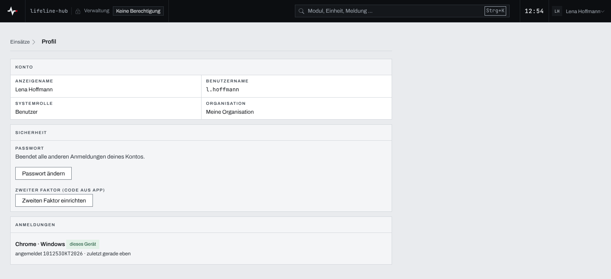
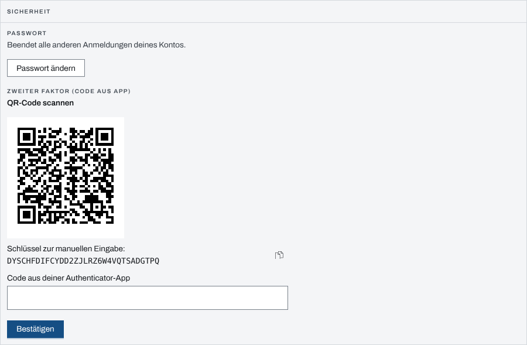
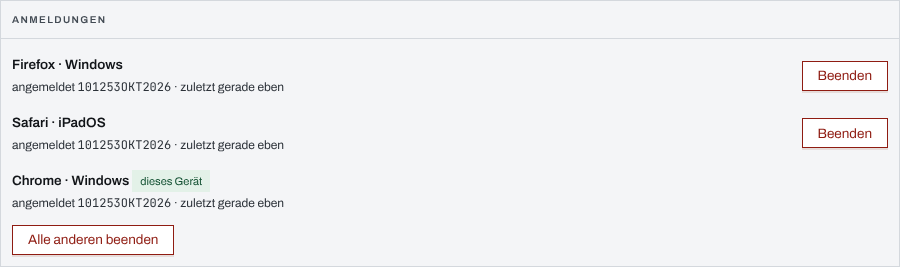

## Überblick

Im **Profil** sieht jede Person ihr Konto und schützt es selbst: Sie ändert ihr Passwort,
richtet einen zweiten Faktor oder einen Passkey ein und beendet Anmeldungen auf anderen Geräten.
Welche dieser Abschnitte erscheinen, hängt davon ab, wie sich die Person anmeldet und was der
Betrieb der Instanz anbietet.

## Abläufe

### Das Profil öffnen

1. Oben rechts das „Benutzermenü“ öffnen und „Profil“ wählen. In der Sprungpalette führt
   „Profil“ ebenfalls dorthin.
2. Unter „Konto“ stehen Anzeigename, Benutzername, Systemrolle und Organisation.

   

### Das Passwort ändern

1. Im Profil unter „Sicherheit“ „Passwort ändern“ wählen.
2. „Bisheriges Passwort“ eingeben, dann zweimal das neue Passwort („Neues Passwort“, „Neues
   Passwort wiederholen“), mindestens 8 Zeichen.
3. „Passwort ändern“ wählen. Die App meldet „Passwort geändert. Andere Anmeldungen dieses Kontos
   sind beendet.“

### Den zweiten Faktor einrichten

Vorher eine Authenticator-App auf dem Telefon bereitlegen.

1. Im Profil unter „Zweiter Faktor (Code aus App)“ „Zweiten Faktor einrichten“ wählen.
2. Das „Aktuelle Passwort“ eingeben und „Weiter“ wählen.
3. Den QR-Code mit der Authenticator-App scannen. Ohne Kamera den „Schlüssel zur manuellen
   Eingabe“ in die App übernehmen.

   

4. Den sechsstelligen Code aus der App eingeben. Mit der sechsten Ziffer bestätigt die Seite
   selbst; sonst „Bestätigen“ wählen.
5. Unter „Wiederherstellungscodes jetzt sichern“ die zehn Codes sichern, etwa mit „Codes
   kopieren“, und an einem sicheren Ort außerhalb des Telefons ablegen.

Danach steht dort „Zweiter Faktor aktiv“, und jede Anmeldung mit Passwort fragt nach dem Code
(siehe [Anmelden und Abmelden](anmelden-abmelden.md)).

### Anmeldungen auf anderen Geräten beenden

1. Im Profil den Abschnitt „Anmeldungen“ ansehen. Jede Zeile nennt das Gerät (Browser und
   Betriebssystem), wann dort angemeldet wurde und wann es zuletzt aktiv war. Das Gerät, an dem
   gerade gearbeitet wird, trägt „dieses Gerät“.

   

2. Bei einem fremden oder verlorenen Gerät „Beenden“ wählen. Sind es mehrere, beendet „Alle
   anderen beenden“ alle außer dem eigenen.

Es gibt keine Rückfrage: Wer eine Anmeldung versehentlich beendet hat, meldet sich auf jenem Gerät
neu an.

## Hintergrund

### Welche Abschnitte erscheinen

- **Passwort** und **zweiter Faktor** erscheinen nur, wenn die Instanz die Anmeldung mit Passwort
  anbietet und das Konto ein eigenes Passwort hat. Wer sich nur über die Organisation (SSO)
  anmeldet, hat beides nicht.
- **Passkey** erscheint nur, wenn der Betrieb Passkeys freigeschaltet hat und die Verbindung
  verschlüsselt ist (`https`). „Passkey registrieren“ legt dann einen Passkey des Geräts an, den
  das Gerät etwa mit Fingerabdruck, Gesichtserkennung oder seiner PIN bestätigt; die App meldet
  „Passkey registriert“. Danach meldet „Mit Passkey anmelden“ auf der Anmeldeseite ohne Passwort
  an. In der Mac-App lässt sich kein Passkey einrichten; dort steht „Nur im Browser einrichtbar;
  Anmeldung über „Im Browser anmelden““.
- **Anmeldungen** sieht jede Person.

Anzeigename und Rollen ändert nur die Administration; Benutzername und Organisation bleiben
fest.

### Passwort

Ein neues Passwort beendet sofort alle **anderen** Anmeldungen des Kontos; das Gerät, an dem es
geändert wurde, bleibt angemeldet. Das Passwort ändert nur die Person selbst, mit dem bisherigen
Passwort; auch die Administration setzt in der App kein Passwort neu.

### Zweiter Faktor

Der zweite Faktor schützt die Anmeldung **mit Passwort**: Ohne den Code aus der App kommt
niemand hinein, auch mit dem richtigen Passwort nicht. Anmeldungen mit Passkey oder über die
Organisation fragen ihn nicht ab.

- Jeder Code gilt nur einmal; ein mitgelesener Code öffnet keine zweite Anmeldung.
- Nach **fünf falschen Codes** in Folge ist der zweite Faktor des Kontos **15 Minuten** gesperrt.
  Wiederherstellungscodes gehen auch während der Sperre.
- Die **Wiederherstellungscodes** zeigt die App nur einmal, direkt nach der Einrichtung. Jeder
  gilt für eine Anmeldung. Sie sind der einzige eigene Weg hinein, wenn das Telefon mit der App
  fehlt.
- Abschalten oder auf ein neues Telefon umziehen kann die Person den zweiten Faktor nicht selbst:
  Ist er aktiv, lehnt die App eine neue Einrichtung ab. Zurücksetzen kann ihn nur ein
  System-Admin in der Benutzerverwaltung (siehe [Gerät verloren](geraet-verloren.md)); dabei
  enden alle Anmeldungen der Person, und die alten Wiederherstellungscodes verfallen. Danach
  richtet die Person ihn hier neu ein.

### Anmeldungen

Eine Anmeldung gilt sieben Tage ab dem Anmelden (siehe
[Anmelden und Abmelden](anmelden-abmelden.md)). Die Liste zeigt alle laufenden Anmeldungen des
Kontos. Die Gerätebezeichnung ist grob, etwa „Firefox · Windows“; mehr speichert der Server über
das Gerät nicht. „Zuletzt“ schreibt er nur alle fünf Minuten fort, darunter steht „gerade eben“.

- **Beenden** wirkt sofort: Das Gerät verliert jeden Zugriff, offene Live-Verbindungen brechen
  ab. Sobald das Gerät den Server erreicht, meldet es sich ab und räumt das vorgehaltene Lagebild.
  Konto, Passwort und zweiter Faktor bleiben unverändert.
- Die eigene, laufende Anmeldung steht ohne „Beenden“ da: Sie endet über „Abmelden“.
- Gekoppelte Geräte erscheinen nicht in der Liste; sie widerruft die Einsatzleitung (siehe
  [Gerät verloren](geraet-verloren.md)).

Dieselbe Liste für jede Person ihrer Organisation öffnet ein System-Admin in der Verwaltung unter
„Benutzer“ mit „Anmeldungen“. Jede beendete Anmeldung wird protokolliert, beim Admin mit seinem
Namen.
