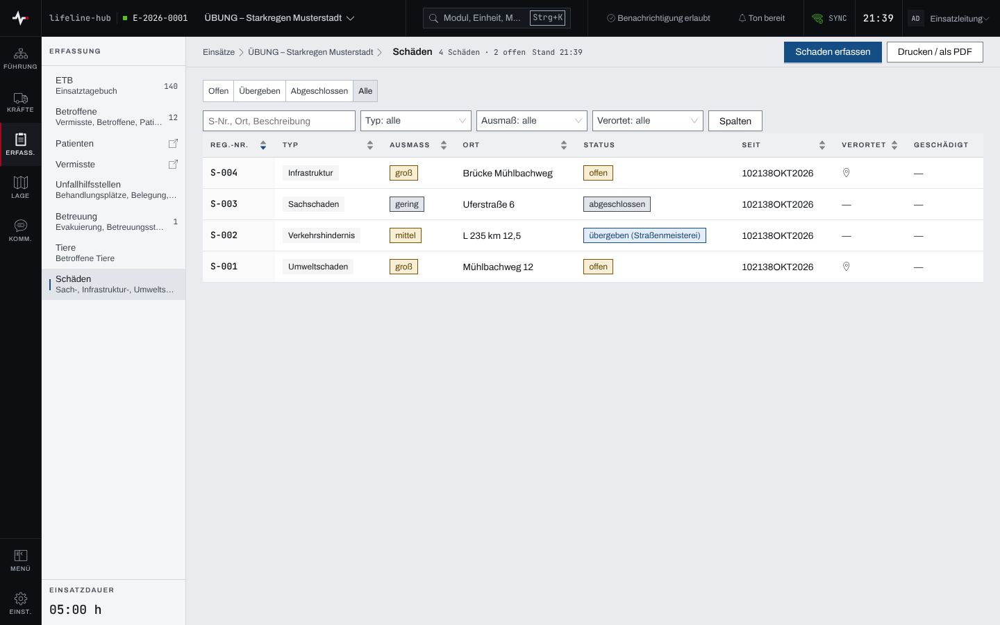
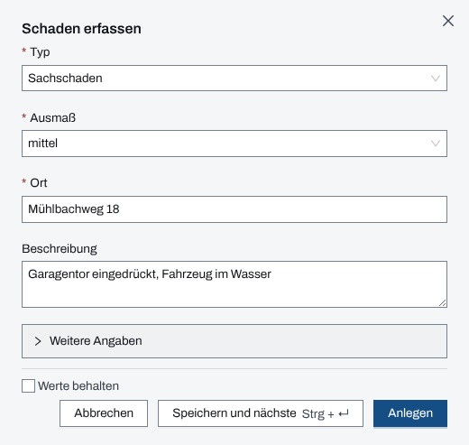
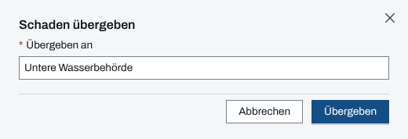

## Überblick

Das Modul „Schäden“ sammelt, was im Einsatz beschädigt oder im Weg ist und nicht gleich behoben
wird: Sachschäden, Verkehrshindernisse, Schäden an der Infrastruktur, Umweltschäden, Tierkadaver
und Sonstiges. Jeder Schaden bekommt eine Registriernummer (S-001, S-002 …), einen Typ, ein Ausmaß
und einen Ort. Er ist „offen“, bis er an eine zuständige Stelle „übergeben“ oder
„abgeschlossen“ wird. Verortete Schäden erscheinen als Zeichen auf der Lagekarte.

## Abläufe

### Die Schäden ablesen

1. Im Modulpanel „Schäden“ öffnen. Der Kopf zählt alle und die offenen Schäden.

   

2. Die Leiste „Offen“, „Übergeben“, „Abgeschlossen“, „Alle“ wählt die Sicht. Die Filter „Typ“,
   „Ausmaß“ und „Verortet“ und die Suche nach S-Nr., Ort und Beschreibung engen die Liste ein.
3. Der Status nennt bei übergebenen Schäden, an wen sie gingen. „Verortet“ zeigt, ob der Schaden
   auf der Karte steht.
4. Ein Klick auf eine Zeile öffnet die Seite des Schadens. Stehen mehr Schäden an, lädt „Ältere
   laden“ den nächsten Teil.

### Einen Schaden erfassen

1. „Schaden erfassen“ wählen. Es öffnet sich der gleichnamige Dialog.
2. „Typ“, „Ausmaß“ („gering“, „mittel“, „groß“, „katastrophal“) und „Ort“ angeben; die drei
   Felder sind Pflicht. Dazu eine „Beschreibung“.

   

3. Unter „Weitere Angaben“ bei Bedarf „Geschädigt“ (eine betroffene Person, eine Einsatzkraft,
   die eigene Organisation oder ein freier Kontakt) und die „Koordinate“ eintragen.
4. „Anlegen“ wählen. Der Schaden steht als „offen“ in der Liste.

Mehrere Schäden am selben Ort: „Speichern und nächste“ hält den Dialog offen, mit „Werte
behalten“ bleibt der Ort stehen.

### Einen Schaden übergeben

1. Die Seite des Schadens öffnen und „Übergeben“ wählen.
2. Unter „Übergeben an“ die zuständige Stelle eintragen, etwa Stadtwerke, Bauhof oder Umweltamt.

   

3. „Übergeben“ wählen. Der Schaden steht auf „übergeben“.

Übergeben lässt sich nur ein offener Schaden.

### Einen Schaden abschließen

1. Die Seite des Schadens öffnen und „Abschließen“ wählen.
2. Den „Abschlussgrund“ wählen: „behoben“, „kein Handlungsbedarf“ oder „abgewiesen“; bei Bedarf
   eine „Notiz (optional)“.
3. „Abschließen“ wählen.

„abgeschlossen“ ist endgültig.

### Einen Schaden auf der Karte verorten

1. Die Seite des Schadens öffnen. Unter „Verortung“ steht „nicht verortet“.
2. „Auf Karte verorten“ wählen. Die Lagekarte öffnet sich und nimmt die Stelle des Schadens auf
   ([Lagekarte, Zeichnen und Messen](lagekarte.md)).

Wer die Koordinate schon beim Erfassen kennt, trägt sie unter „Weitere Angaben“ ein.

## Hintergrund

### Status

Ein Schaden geht von „offen“ nach „übergeben“ oder direkt nach „abgeschlossen“, von „übergeben“
nach „abgeschlossen“. „Bearbeiten“ auf der Seite des Schadens ändert Typ, Ausmaß, Ort,
Beschreibung und Geschädigt. „Stornieren“ nimmt eine Fehlerfassung aus der Liste. Fotos und
Dateien zum Schaden liegen auf seiner Seite.

Wer geschädigt ist, lässt sich auch von der Seite einer betroffenen Person aus zuordnen („Schaden
zuweisen“, [Betroffene und Sichtung](betroffene.md)).

### Einsatztagebuch

Das Einsatztagebuch vermerkt Anlegen (mit Typ und Ausmaß, ohne Ort), Übergabe (ohne Empfänger),
Abschluss (mit Grund) und Stornieren, jeweils mit der Registriernummer.

### Druck

„Drucken / als PDF“ druckt die Liste in der gewählten Sicht.

### Rechte

Erfassen, übergeben, abschließen und ändern dürfen Einsatzleitung und Führungspersonal eines
laufenden Einsatzes ([Rechte im Einsatz](rechte-im-einsatz.md)).

### Ohne Netz

Die Liste der Schäden und ihre Zeichen auf der Lagekarte bleiben ohne Netz lesbar. Erfassen und
ändern gehen nur mit Netz ([Arbeiten ohne Netz](ohne-netz.md)).
