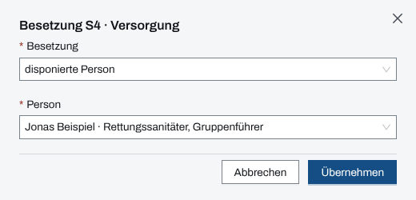
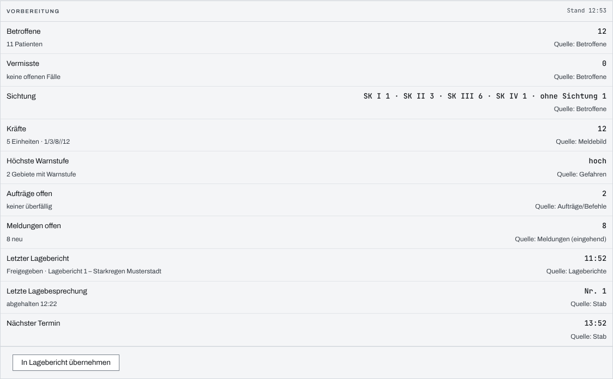
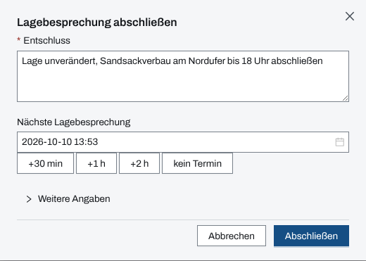
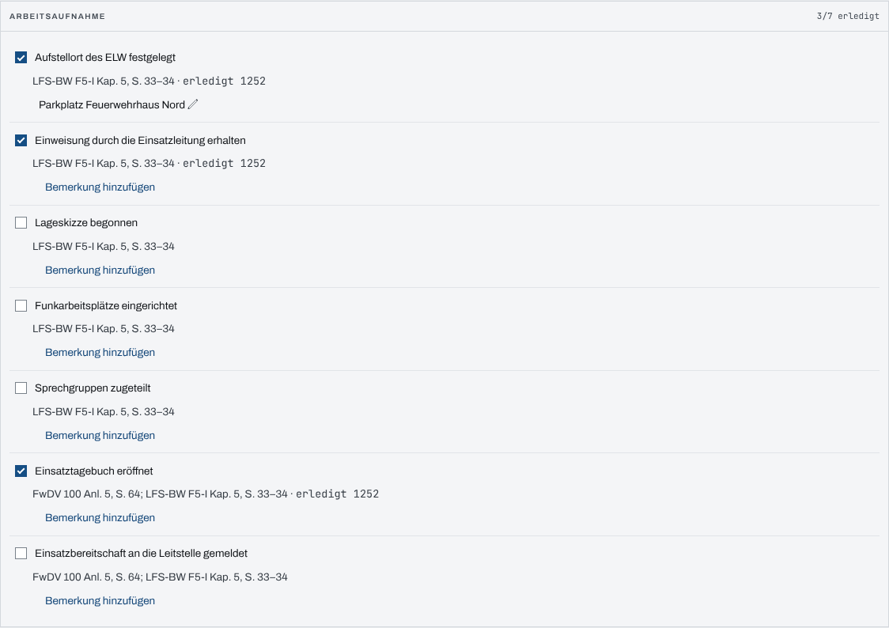

## Überblick

Die Seite „Stab“ unterstützt die Führungsgruppe oder den Stab der Einsatzleitung. Sie zeigt, wer
die Sachgebiete S1 bis S6 besetzt, und führt von jedem Sachgebiet zu seinen Werkzeugen. Sie
bereitet die Lagebesprechung vor, hält ihren Entschluss fest und plant die nächste. Die Checkliste
„Arbeitsaufnahme“ begleitet den Aufbau der Führungsstelle. Lesen können alle Mitglieder des
Einsatzes, bedienen Einsatzleitung und Führungspersonal.

## Abläufe

### Ein Sachgebiet besetzen

1. „Stab“ öffnen. Im Paneel „Besetzung S1–S6“ beim Sachgebiet „Besetzung ändern“ wählen.
2. Unter „Besetzung“ wählen, wer das Sachgebiet führt: „nicht vergeben“, „bei der
   Einsatzleitung“, „disponierte Person“, „extern (nicht disponiert)“ oder „rückwärtig
   (Leitstelle/FEZ)“.
3. Bei „disponierte Person“ unter „Person“ die Person wählen; fehlt sie, öffnet „Ad-hoc-Person
   anlegen …“ einen Dialog, der sie anlegt. Bei „extern“ und „rückwärtig“ die „Bezeichnung“ eintragen.

   

4. „Übernehmen“ wählen.

### Die Lagebesprechung vorbereiten

1. Auf der Seite „Stab“ das Paneel „Vorbereitung“ lesen. Es stellt die Kennzahlen für die
   Besprechung zusammen: Betroffene, Vermisste, Sichtung, Kräfte, höchste Warnstufe, offene
   Aufträge und Meldungen, letzter Lagebericht, letzte Lagebesprechung und nächster Termin, jede
   Zeile mit ihrer Quelle.

   

2. Soll der Stand festgehalten werden, „In Lagebericht übernehmen“ wählen. Das legt einen
   Lagebericht „Vorbereitung Lagebesprechung …“ an.

### Die Lagebesprechung abschließen

1. Im Seitenkopf „Lagebesprechung abschließen“ wählen.
2. Den „Entschluss“ eintragen.
3. Unter „Nächste Lagebesprechung“ den Termin setzen, mit „+30 min“, „+1 h“, „+2 h“ oder
   direkt; „kein Termin“ leert ihn.

   

4. Lag die Besprechung früher, unter „Weitere Angaben“ den „Zeitpunkt der Besprechung“ setzen;
   leer gilt jetzt.
5. „Abschließen“ wählen.

Das Paneel „Lagebesprechung“ zeigt danach die Nummer der letzten Besprechung, den nächsten
Termin und unter „Frühere Lagebesprechungen“ die Liste davor.

### Die Arbeitsaufnahme abhaken

1. Auf der Seite „Stab“ zum Paneel „Arbeitsaufnahme“ gehen.
2. Einen erledigten Punkt anhaken. Die Zeile zeigt danach „erledigt“ mit Uhrzeit; ein zweiter
   Klick nimmt den Haken zurück.

   

3. Für eine Ergänzung „Bemerkung hinzufügen“ wählen, den Text eingeben und speichern.

## Hintergrund

### Wer was darf

Besetzung, Lagebesprechung und Checkliste bedienen Einsatzleitung und Führungspersonal, solange der
Einsatz läuft. Wer das nicht darf, sieht „Lagebesprechung abschließen“ gesperrt mit dem Grund
darunter. „In Lagebericht übernehmen“ erscheint nur für sie und nur, wenn das Modul Lageberichte
freigegeben ist. Einzelheiten stehen in [Rechte im Einsatz](rechte-im-einsatz.md).

Ist das Modul Stab für den Einsatz nicht freigegeben, sind auch seine Unterseiten (Funkplan,
Kommunikationsplan, Pressearbeit, Informationstelefon) gesperrt: „… nicht verfügbar“, „Modul Stab
nicht freigegeben“.

### Die Zeilen der Besetzung

Jede Zeile nennt das Sachgebiet mit der Bezeichnung der Organisation, seine Aufgaben mit der
Fundstelle in der FwDV 100 und die Werkzeuge des Sachgebiets als Verweise, etwa „Personal“ und
„Einheiten“ bei S1, „Lagekarte“ und „ETB“ bei S2, „Pressearbeit“ und
„Informationstelefon“ bei S5, „Funkplan“ und „Kommunikationsplan“ bei S6. Ein Verweis auf ein
gesperrtes Modul fehlt. Eine Besetzung wird überschrieben; die App führt keine Historie, der
Verlauf steht im Einsatztagebuch.

### Was ins Einsatztagebuch geht

- **Besetzung:** jeder wirksame Wechsel, etwa „S2 Lage: Besetzung → … (vorher: …)“. Dieselbe Wahl
  ein zweites Mal schreibt nichts.
- **Lagebesprechung:** ein Eintrag vom Typ Entscheidung mit der Veranlassung „Lagebesprechung“,
  der Nummer, dem Zeitpunkt, dem Entschluss und dem nächsten Termin. Die Nummer zählt je Einsatz
  fortlaufend. Der Termin gilt zugleich als „Nächste Lagebesprechung“ des Einsatzes. Eintrag,
  Nummer und Termin entstehen gemeinsam oder gar nicht.
- **Arbeitsaufnahme:** nur der Punkt „Einsatzbereitschaft an die Leitstelle gemeldet“, beim Haken
  wie bei der Rücknahme. Die anderen Punkte, ihre Bemerkungen und die Vorbereitung schreiben
  nichts.

### Vorbereitung und Checkliste

- Die „Vorbereitung“ rechnet keine eigenen Zahlen, sie zeigt dieselben wie Überblick und
  Modulzähler. Fehlt einer Person das Recht auf eine Quelle oder ist die Quelle nicht geladen,
  steht „—“ mit Grund, nie eine 0. Sie gibt kein Vortragsschema vor und friert nichts ein; einen
  festen Stand gibt es nur über „In Lagebericht übernehmen“.
- Die sieben Punkte der „Arbeitsaufnahme“ sind fest. Kein Punkt wird aus anderen Modulen
  abgeleitet; abgehakt wird von Hand.

### Fälliger Termin

Erreicht die Uhr den Termin der nächsten Lagebesprechung, zeigt das Paneel „Lagebesprechung“
„jetzt fällig“, danach „seit … min überfällig“, als Hinweis, nicht als Alarm.

### Ohne Netz

Besetzung, Lagebesprechungen und Checkliste werden ohne Netz nicht vorgehalten (siehe
[Arbeiten ohne Netz](ohne-netz.md)).

## Grundlagen und Quellen

- FwDV 100, Anlage 2: Sachgebiete S1 bis S6 und ihre Aufgaben.
- FwDV 100, Abschnitt 3.3.3.2, S. 42: Lagebesprechung bei oder unmittelbar nach Erteilung
  dokumentieren.
- FwDV 100, Anlage 5, S. 64, und LFS-BW F5-I, Kapitel 5, S. 33–34: Punkte der Arbeitsaufnahme.
- EEMUA 191: Ein fälliger Termin ist kein Alarm (Alarmbudget).
